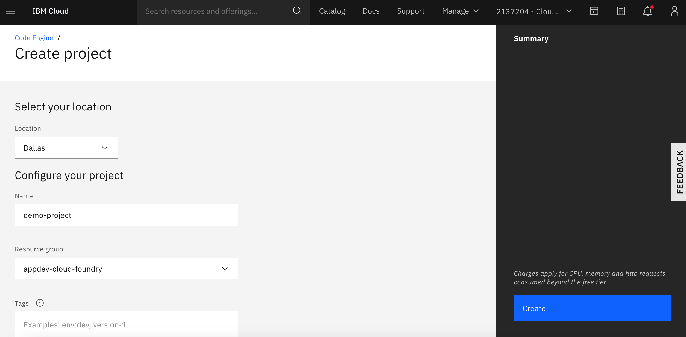
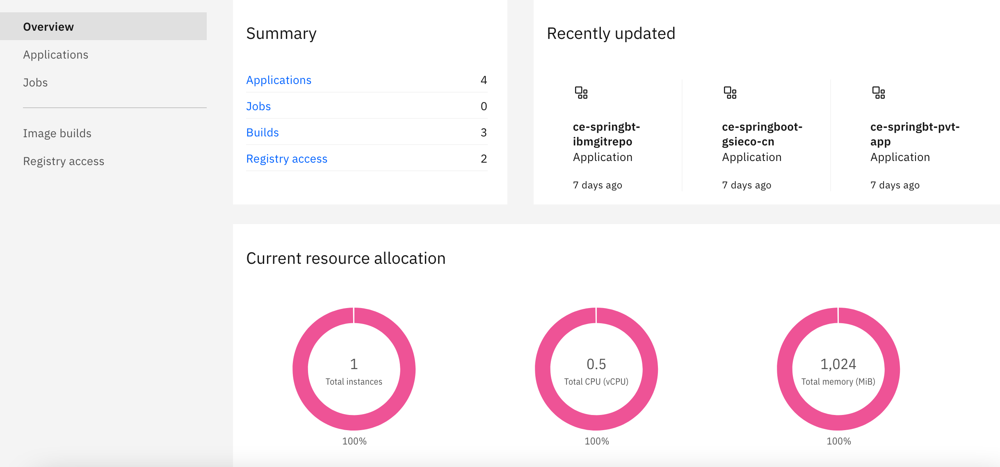
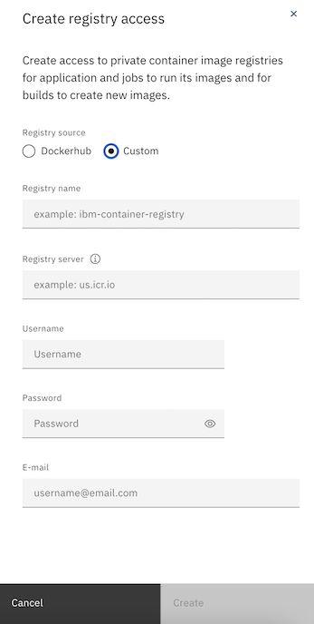
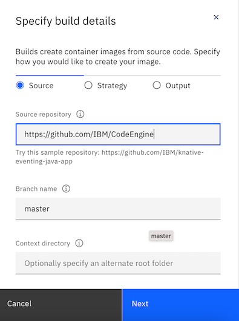
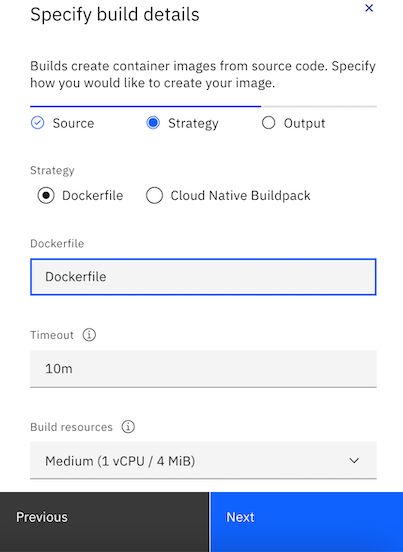
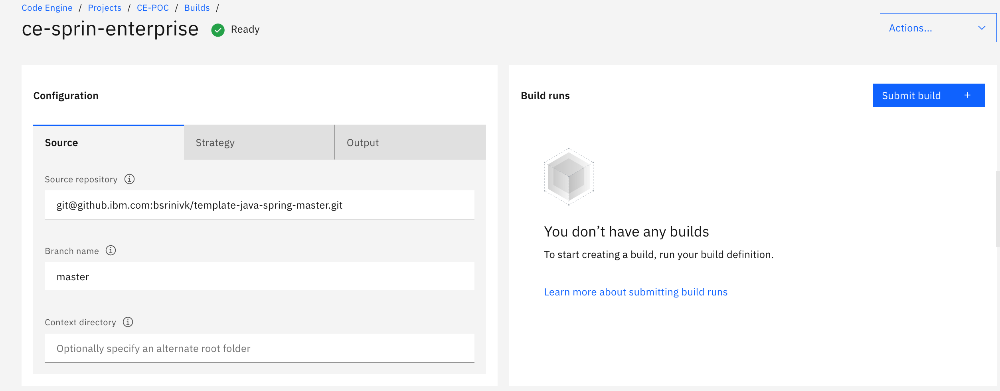
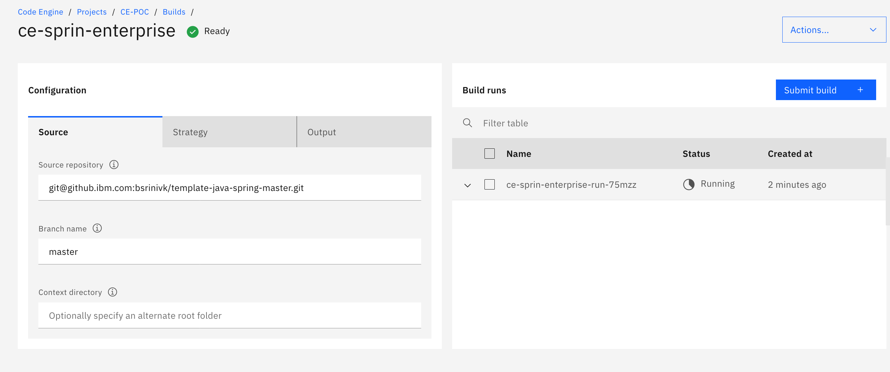

<!--- cSpell:ignore appdeploy springboot appbuild popout appdev sourcecode strategyconfig sourceconfig imgregistry imgreference iamapikey APIKEYS ceproject ceprojects ICPA openshiftconsole Theia userid toolset crwexposeservice gradlew bluemix ocinstall Mico crwopenlink crwopenapp swaggerui gitpat gituser  buildconfig yourproject wireframe devenvsetup viewapp crwopenlink  atemplatized rtifactoryurlsetup Kata Koda configmap Katacoda checksetup cndp katacoda checksetup Linespace igccli regcred REPLACEME Tavis pipelinerun openshiftcluster invokecloudshell cloudnative sampleapp bwoolf hotspots multicloud pipelinerun Sricharan taskrun Vadapalli Rossel REPLACEME cloudnativesampleapp artifactoryuntar untar Hotspot devtoolsservices Piyum Zonooz Farr Kamal Arora Laszewski  Roadmap roadmap Istio Packt buildpacks automatable ksonnet jsonnet targetport podsiks SIGTERM SIGKILL minikube apiserver multitenant kubelet multizone Burstable checksetup handson  stockbffnode codepatterns devenvsetup newwindow preconfigured cloudantcredentials apikey Indexyaml classname  errorcondition tektonpipeline gradlew gitsecret viewapp cloudantgitpodscreen crwopenlink cdply crwopenapp -->
## Introduction
IBM Code Engine is a fully managed, serverless platform that runs the containerized workloads. These workloads includes web apps, microservices, event-driven functions, or batch jobs. Code Engine can also help to build the container images from the source code. Code Engine is designed to focus on the application to solve the business problem with no barrier on the infrastructure.

## Setting up the project in the Code Engine

Project is the namespace under which the Code Engine entities such as applications, jobs, and builds are grouped together.Projects are used to manage resources and provide access to its entities.

Follow the below steps to create a project in the Code Engine.

- As part of the IBM Cloud Catalog, provision the Code Engine
- From the Code Engine console project menu, select Create Project
- Select the Location, the project to be deployed
- Enter the name of the project. The name must be unique for all your Projects
- Choose the resource group under which the project to be deployed. Also specify the tags under which the project be identified
- The click on the **Create** Button to create the project



- After few minutes you will notice the project is created and listed as part of the **Projects** tab in the Code Engine


## Configuring and Deploying Applications in the Code Engine

- Access the Project that is created from the projects listed as part **Projects**  tab.
- The navigation will land on the Overview section of the project.  This will display the details of the project such as Summary Section, Resource Allocation and Recently updated details.
- Summary section will include details of number of applications deployed, number of jobs deployed, number of builds configured and submitted, number of registry access
- Current Resource Allocation section provides details as total instances, total cpu utilization and total memory utilization by all the applications
- Recently updated section provides information about the recently updated applications and jobs
- The section will get refreshed as the applications, jobs get deployed to the project




### Configuring the Registry Access

As a first step to deploy the an application configure the Image Registry access. Registry access is important as it the Repo used by the Code Engine both for creating the Application Image from the Source Repository and Deploying the Application Image on the Containers. By default, Code engine register server is pointed to the Docker repo server. We can use the IBM Registry Server as the Image Registry as well using the APIKEYS.  The below is the steps to configure the Registry access to the Code Engine.

- Navigate to the **Registry access** Section in the left nav.
- Click on the **Create** button on top of the registry access list table
- Now navigate to the create registry access page.
- There are two options for registry source. First is from Dockerhub and second is from Custom.
- Provide a Registry name. This should be unique in the project.  Ex: ibm-registry-us
- Next provide the Registry server details, in case you have selected the Registry source as custom. In case if you want to use the IBM Registry Server, provide the ibm registry server details. For instance, if IBM Registry US is it can be "us.icr.io/"
- If Docker registry is used, the username and password details to be provide. In case of the ibm registry, it can be accessed through the APIKEYS. The apikey is provided as part of the password section, while username is automatically configured as "iamapikey"
- Provide the Email details as part of the E-mail
- Now click on the **Add** button to create the registry access



- Now the registry access is created and listed as part of the **Registry access** tab in the Code Engine


### Deploying Applications in the Code Engine

Deploying on an application in the Code Engine can be done multiple choices.  It can deployed using the 
1. Container images from the Image Repository
1. Source from the public git repo 
1. Source from the private/enterprise git repo. 

The first and second option stated above are simply straight forward, but the deployment from private or enterprise repo will need SSH Keys and Code Engine CLI for Secured Deployment.

#### Deploying Application from the Container images

- Navigate to the **Applications** Section in the left nav.
- Click on the **Create application** button on top of the applications list table
- Now Navigate to the Create Application Page
- Provide Name to you application. This is a unique name within the project. An application name must consist of lower case alphanumeric characters, '-' and must start and end with an alphanumeric character
- select the 'choose the code to run' option either as Container image
- Now Select the **configure Image** option to deploy your application directly from the Image Registry
- Configure the image registry by providing the registry server, registry access, namespace, repository and tag for the image registry from the Application to Deployed. Ensure the registry has already configured as part of the Registry access discussed earlier.
- The above can be configured by clicking the button **Specify image reference**. 

  
  - Here select the Image Registry name already configured as part of the **Registry access**. Alternatively Registry Access can be added here as well by clicking the button **Add registry**
  - Select the namespace where the application image repo exists.
  - Select the repository name if already exist or type a new namespace if to be created one. But ensure the Application image is already available in the repository
  - Select the image tag if a specified image to be deployed. Alternatively, the latest version of the image will be deployed.
  - Click Done to specify the Image for the deployed. The same now will appear as part of the **Image Reference**
  - If the Image reference needs to be changed, Click on the **Edit image details** link

- Now configure the Runtime settings, by expanding the **Runtime settings**


  - Provide Memory configuration for the application as part of Memory (MiB) in the **Instance** section. By default 1024MB is provided
  - Provide CPU cores for the application as part of CPU (vCPU) in the **Instance** section. By default 0.1vCPU core is provided
  - Provide the timeout for request in seconds as part of Timeout (seconds) in the **Requests** section. By default 300 seconds is considered.
  - Provide the maximum number of concurrent requests per instance as part of the Concurrency in the **Requests** section. By default 100 is considered.
  - Provide the minimum and maximum number of instances for the purpose of the autoscaling in the **Scaling** section. By default minimum number of instance is considered as 0 and minimum number of instance as 10.

- Environment Variables can be configured in the **Environment Variables** section. Basically it is a name, value pair that is used in the application.
- Now click on the  **Create** button on the right side to create the application


- After few minutes the application will be deployed and be listed as part of the Application List.

#### Deploying Application from the Source Code (public git repository)

- Navigate to the **Applications** Section in the left nav.
- Click on the **Create application** button on top of the applications list table
- Now Navigate to the Create Application Page
- Provide Name to you application. This is a unique name within the project. An application name must consist of lower case alphanumeric characters, '-' and must start and end with an alphanumeric character
- Now provide the source code repository (public git repo) of the application. Ex: https://github.com/{user}/repo. Alternatively this can be provided on the **Specify build details** 
- Now click the **Specify build details** . There will be a three step process to configure the source build configuration.

- The first step is to configure the *Source* Configuration.
  - Provide the Source Repository of the Application 
  - Provide the Branch name of the application repository
  - Provide the context directory (optional), if the source directory is different from the root directory.
  - Then click on the **Next button** to provide the Strategy configuration



- The second step is to configure the *Strategy* Configuration.
  - If Dockerfile is the strategy, provide the Dockerfile name to be used for the build. Default is 'Dockerfile'
  - Configure the Timeout Setting, in case the build run fails. Default is 10mins
  - Select one of the Build Resources to be used for the build execution
  - Then click on the **Next button** to proceed for the output section


    
- The final step is to Configure the image registry
  - Here select the Image Registry name already configured as part of the **Registry access**. Alternatively Registry Access can be added here as well by clicking the button **Add registry**
  - Select the namespace where the application image repo exists.
  - Select the repository name if already exist or type a new namespace if to be created one. But ensure the Application image is already available in the repository
  - Select the image tag if a specified image to be deployed. Alternatively, the latest version of the image will be deployed.
  - Click Done to specify the Image for the deployed. The same now will appear as part of the **Image Reference**
  - If the Image reference needs to be changed, Click on the **Edit image details** link


- Now configure the Runtime settings, by expanding the **Runtime settings**


  - Provide Memory configuration for the application as part of Memory (MiB) in the **Instance** section. By default 1024MB is provided
  - Provide CPU cores for the application as part of CPU (vCPU) in the **Instance** section. By default 0.1vCPU core is provided
  - Provide the timeout for request in seconds as part of Timeout (seconds) in the **Requests** section. By default 300 seconds is considered.
  - Provide the maximum number of concurrent requests per instance as part of the Concurrency in the **Requests** section. By default 100 is considered.
  - Provide the minimum and maximum number of instances for the purpose of the autoscaling in the **Scaling** section. By default minimum number of instance is considered as 0 and minimum number of instance as 10.

- Environment Variables can be configured in the **Environment Variables** section. Basically it is a name, value pair that is used in the application.
- Now click on the  **Create** button on the right side to create the application


- After few minutes the application will be deployed and be listed as part of the Application List.


#### Deploying Application from the Source Code (private/Enterprise git repository)

Deploying Applications from a private git or enterprise git is not as straight forward as one from the public git repo's. This would require to set the CodeEngine CLI's to create git repo secret access. As a pre-requisite, the git account has to be associated with an SSH Key. An SSH key associated with a user, for example, your own user account or a functional ID that is available in your organization. This SSH key has the repository permissions from the user account. Code Engine requires read access to download the source code. For more information about setting up this type of SSH key refer https://docs.github.com/en/github/authenticating-to-github/adding-a-new-ssh-key-to-your-github-account.

**Note : **  Do not create your SSH key file with a secure passphrase as this action causes your build command to fail.

Deploying Application from a Private/Enterprise git repo is a four step activities

1. Creating a Git repository access secret with the CLI
- Assuming the SSH key is generated without any passphrase and this SSH key is configured as part of the git account
- Install the IBM Cloud Code Engine CLI using the command
 ```bash
    ibmcloud plugin install code-engine
 ```

- Now login to the ibmcloud account using the CLI and then set up the account, region, resource group where the Code Engine is deployed.
- To create a Git repository access secret with the CLI, use the command "repo create". This command requires a name, a key path, and the address of the Git repository host and also allows other optional arguments
 ```bash
    ibmcloud ce repo create 

    --name              maps to the name of the Git repository access secret. Use a name that is unique within the project. This value is required. 
    --key-path          maps to the local path to the unencrypted private SSH key. If you use your personal private SSH key, then this file is usually at $HOME/.ssh/id_rsa.  This value is required.
    --host              maps to the Git repository hostname; for example, github.com. This value is required.
    --known-hosts-path   maps to the path to your known hosts file.  This file is usually located at $HOME/.ssh/known_hosts
 ```
    
 - MacOs or Linux, the command looks similar as below
 ```bash
    ibmcloud ce repo create --name myrepo --key-path $HOME/.ssh/id_rsa --host github.com --known-hosts-path $HOME/.ssh/known_hosts

    Creating Git repository access secret ...
        OK
 ```    
    
- once created, you can list the repo using the below cli command. The created secret access should be listed
 ```bash
    ibmcloud ce repo list 
 ```

2. Create images from the private repo

The build configuration for the Code Engine can be created using code engine (ce) cli. The create the build image from the private repo using the secret access, the below cli to be used
- ```bash
    ibmcloud ce bd create

  --name, -n value                            Required. The name of the build.
  --registry-secret, --rs value               Required. The name of the image registry access secret. The image registry access secret is used to authenticate with a private
                                              registry when you create the container image. Run 'ibmcloud ce registry create' to create a registry secret.
  --source, --src value                       Required. The URL of the Git repository.
  --git-repo-secret, --grs, --repo, -r value  The name of the Git repository access secret to access the private repository containing the source code to build your container
 ```
    
  -- sample reference as below
 ```bash
    ibmcloud ce bd create --name <<Your build name>> --image <<Image Repo Path>> --source <<Private Git Repository>> --registry-secret <<Registry access name created>> --git-repo-secret <<git repo secret created in previous step>>
 ```

3. Submit Build images from the private Source repo 

Once the build is created, the next step is to submit build to create the application image from the source repo. This can be done both in User interface oo CLI. Let see, how this can be done from the User interface.

- Navigate / Access the project created in the Code Engine
- Navigate to the **Image builds** left nav, in the code engine project.
- The Build configuration created using the CLI in the previous step, will be listed as part of the Image builds table.
- Access the image builds that is created.
- Now you will be able to view the configuration as part of the **Source**, **Strategy**, **Output** tabs configured in the previous step.
- The build is configured from the previous step. Now Click on the **Submit build** button to build the application image from the repo. 

- It will take few mins to complete the build and generate-push the application image to the image repository. The status and history of the build will be shown part of the build runs table. 

- Once the build is completed, the status will be shown as "succeeded"


4. Deploying the Application from the Image Registry

Once the build submit is succeeded in the previous step, the application will be available in the Image registry configured earlier. Now the application has be deployed from the Image registry following Deploying Application from the Container images


- Navigate to the **Applications** Section in the left nav.
- Click on the **Create application** button on top of the applications list table
- Now Navigate to the Create Application Page
- Provide Name to you application. This is a unique name within the project. An application name must consist of lower case alphanumeric characters, '-' and must start and end with an alphanumeric character
- Now Select the **Container Image** option to deploy your application directly from the Image Registry
- Provide the image registry from the Application to Deployed. The format is "registry/namespace/repository:tag". The tag is optional, if not specified, the latest would be applied. ex: us.icr.io/appdev-cloud-native/ce-springboot. Ensure the registry has already configured as part of the Registry access discussed earlier.
- The above can be configured by clicking the button **Specify image reference**. 


  - Here select the Image Registry name already configured as part of the **Registry access**. Alternatively Registry Access can be added here as well by clicking the button **Add registry**
  - Select the namespace where the application image repo exists.
  - Select the repository name if already exist or type a new namespace if to be created one. But ensure the Application image is already available in the repository
  - Select the image tag if a specified image to be deployed. Alternatively, the latest version of the image will be deployed.
  - Click Done to specify the Image for the deployed. The same now will appear as part of the **Image Reference**
  - If the Image reference needs to be changed, Click on the **Edit image details** link

- Now configure the Runtime settings, by expanding the **Runtime settings**

  - Provide Memory configuration for the application as part of Memory (MiB) in the **Instance** section. By default 1024MB is provided
  - Provide CPU cores for the application as part of CPU (vCPU) in the **Instance** section. By default 0.1vCPU core is provided
  - Provide the timeout for request in seconds as part of Timeout (seconds) in the **Requests** section. By default 300 seconds is considered.
  - Provide the maximum number of concurrent requests per instance as part of the Concurrency in the **Requests** section. By default 100 is considered.
  - Provide the minimum and maximum number of instances for the purpose of the autoscaling in the **Scaling** section. By default minimum number of instance is considered as 0 and minimum number of instance as 10.

- Environment Variables can be configured in the **Environment Variables** section. Basically it is a name, value pair that is used in the application.
- Now click on the  **Create** button on the right side to create the application


- After few minutes the application will be deployed and be listed as part of the Application List.

Thus by following above four step activities, the application source from the private or enterprise repo can be deployed in the code engine.


## Accessing Code Engine Applications 
Now that the application is build and deployed, the below steps to be followed to navigate the application

- Navigate to the Application List  Page of your project
- All the deployed application will be listed as in rows, in the table list
- identify the application and click on the application link under "URL link" or popout link. Now the application would be opened in a new tab of the browser
