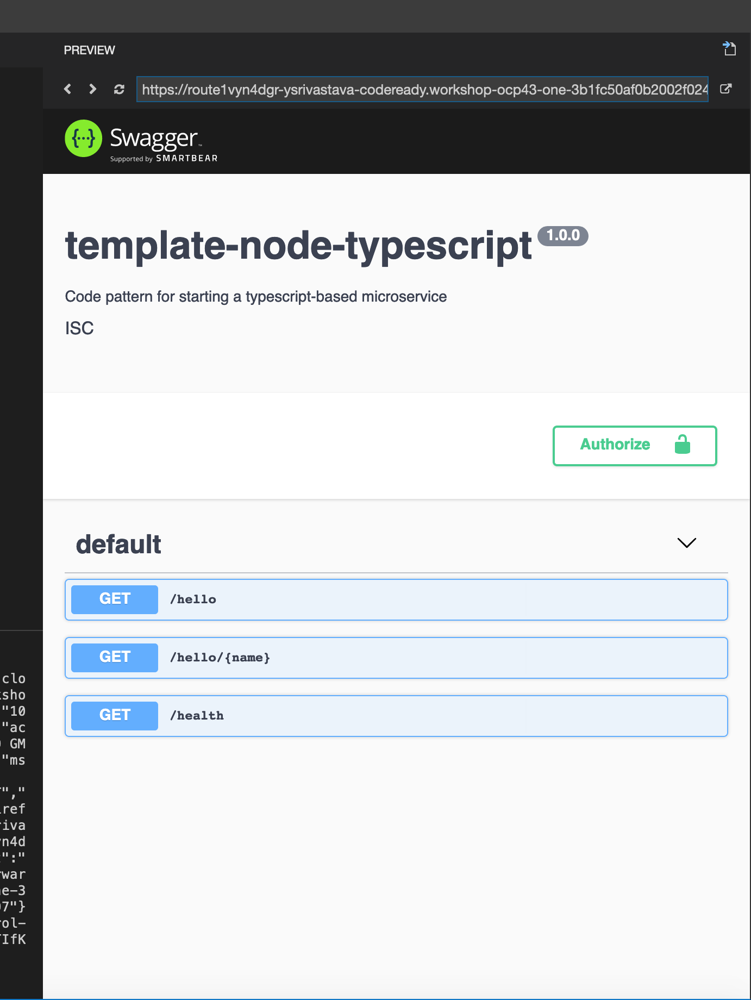

<!--- cSpell:ignore dataload cloudantcredentials apikey classname gradlew viewapp cloudantgitpodscreen crwopenlink crwopenapp -->

**Add a Cloudant integration to your backend service**

- While logged into the IBM Cloud account use the resource list to find your pre installed Cloudant database instance name after your development cluster.

- Open the database instance dashboard.

- Click on the Service Credentials on the left-hand menu.

- You will see the credentials for the database which will be something like this:


- Open a terminal window folder/directory called `data`
    ```bash
    mkdir data
    ```

- To help create test JSON data we are going to supply a template to the JSON Generator tool, this helps when creating dummy data for testing. Navigate to the following link [https://www.json-generator.com/](https://www.json-generator.com/)

- Replace the default template with the following template (using cut and paste). This will enable a 100 records of test data to be created to represent a products database. Click on the *Generate* button.
    ```bash
    {
      docs: [
        '{{repeat(100)}}',
        {
          _id: '{{objectId()}}',
          manufacturer: '{{company().toUpperCase()}}',
          name:  '{{lorem(3, "words")}}',
          price: '{{floating(10, 1000, 2, "0.00")}}',
          stock: '{{integer(1, 100)}}'
        }
      ]
    }
    ```
- Copy the generated contents on the right hand side into a file called `inventory.json` and save it into the same folder.

- Download the `dataload.sh` script from the Iteration Zero repository using the following command:
  ```bash
  curl https://raw.githubusercontent.com/ibm-garage-cloud/ibm-garage-iteration-zero/master/terraform/scripts/dataload.sh >> dataload.sh
  ```
- Add the `username` and `apikey` to `CLOUDANT_USERNAME` and `CLOUDANT_API_KEY` variables in the `dataload.sh` script.
You can get the credentials from the Cloudant credentials view in the IBM Cloud console.
- Add `DATABASE` value to be `inventory-<replace with namespace>` using the dev namespace/project name you have been using.
- Save the script, make it executable, and then run it by passing in the filename
- Before running this script,make sure you have `jq` installed.
    ```bash
    chmod +x ./dataload.sh
    ./dataload.sh inventory.json
    ```
- The data from the `inventory.json` file will then be used to populate the database, to confirm this on the Dashboard click on Manage menu on the left and then Launch button to see the Cloudant dashboard.
- Click on the Left icon that looks like a Database and you will see the `inventory-<namespace>` database created.
- Click on the `inventory` database, then click **Table** view.
- You can see the rows of data
    

- If you click on a row of data, you will see the raw NoSQL form of the data record.
- This completes the setup of the database and populating it with data.

### Enable database in the solution

If you are starting from the solution, use the following steps to enable the Cloudant database

#### Set up local development

- Open the mappings.json file under src/main/resources and add a `DATABASE_NAME` value with the value `inventory-{namespace}` where `namespace` is the namespace where the pipeline is running (e.g. dev-{initials})
    ```json title="src/main/resources/mappings.json"
    {
      "DATABASE_NAME": "inventory-{namespace}"
    }
    ```

- Log into cloud.ibm.com and open the Cloudant service from the resource list

- Click on service credentials Tab.

- In service credentials, click on "New credential" button.

- Select the role "Manager"

  

- Navigate to your namespace where you are running the inventory solution pipeline and create the binding secret for  the Cloudant instance on the cloud account
  ```bash 
     oc project [proj_name]
     ibmcloud oc cluster service bind --cluster workshop-team-one 
     --namespace [YOUR-NAMESPACE] --service workshop-cldn-one
  ```

- The application needs a user with "manager" iam_role whereas the binding secret creates a user with "writer" iam_role resulting in "access denied" issues.

- Hence, the "binding" key in binding secret you just created needs to be replaced with the values of "manager" role user you created in Service Credentials on cloud.ibm.com.


- Copy the json contents from the credentials into `mappings.json` under the `CLOUDANT_CONFIG` object (note that CLOUDANT_CONFIG value must be a string type not a json type, so you must use escaping characters for this value). You could a JSON to String converting tool.
    ```json title="src/main/resources/mappings.json"
    {
      "DATABASE_NAME": "inventory-{namespace}",
      "CLOUDANT_CONFIG": "{paste json here}"
    }
    ```

#### Activate the Cloudant service implementation

- Create a new file `src/main/java/com/ibm/inventory_management/services/StockItemMockService.java`.

- Copy the contents of `src/main/java/com/ibm/inventory_management/services/StockItemService.java` in this newly created `StockItemMockService.java` file.

- Do the following changes after copying the contents of StockItemService.java to this new file:
    1. Remove the `@Primary` annotation.
    2. Change the classname from StockItemService to StockItemMockService

- Open `src/main/java/com/ibm/inventory_management/services/StockItemApi.java` and add the following code to the file. The file should look like the following
  ```java title="src/main/java/com/ibm/inventory_management/services/StockItemApi.java"
  package com.ibm.inventory_management.services;
  
  import java.util.List;
  
  import com.ibm.inventory_management.models.StockItem;
  
  public interface StockItemApi {
    List<StockItem> listStockItems() throws Exception;
  
    void addStockItem(String name, Double price, Integer stock, String manufacturer) throws Exception;
  
    void updateStockItem(String id, String name, Double price, Integer stock, String manufacturer) throws Exception;
  
    void deleteStockItem(String id) throws Exception;
  }
  ```

#### Update the StockItemService implementation

  ```java title="src/main/java/com/ibm/inventory_management/services/StockItemService.java"
  package com.ibm.inventory_management.services;
  
  import java.io.IOException;
  import java.util.List;
  import javax.annotation.PostConstruct;
  import java.net.URL;
  import java.net.MalformedURLException;
  import java.util.UUID;
  
  import com.cloudant.client.api.CloudantClient;
  import com.cloudant.client.api.ClientBuilder;
  import com.cloudant.client.api.Database;
  import org.springframework.context.annotation.Primary;
  import org.springframework.context.annotation.Bean;
  import org.springframework.context.annotation.Lazy;
  import org.springframework.stereotype.Service;
  import com.ibm.inventory_management.config.CloudantConfig;
  import com.ibm.inventory_management.models.StockItem;
  
  @Service
  @Primary
  public class StockItemService implements StockItemApi {
    @Bean
    public static CloudantClient buildCloudant(CloudantConfig config) throws CloudServicesException {
      System.out.println("Config: " + config);
      URL url = null;
  
      try {
        url = new URL(config.getUrl());
      } catch (MalformedURLException e) {
        throw new CloudServicesException("Invalid service URL specified", e);
      }
  
      return ClientBuilder
          .url(url)
          .iamApiKey(config.getApiKey())
          // .username(config.getUsername())
          // .iamApiKey(config.getPassword())
          .build();
    }
  
    private CloudantConfig config;
    private CloudantClient client;
    private Database db = null;
  
    public StockItemService(CloudantConfig config, @Lazy CloudantClient client) {
      this.config = config;
      this.client = client;
    }
  
    @PostConstruct
    public void init() {
      db = client.database(config.getDatabaseName(), true);
    }
  
    @Override
    public List<StockItem> listStockItems() throws Exception {
  
      try {
        return db.getAllDocsRequestBuilder()
            .includeDocs(true)
            .build()
            .getResponse()
            .getDocsAs(StockItem.class);
  
      } catch (IOException e) {
        throw new Exception("", e);
      }
    }
  
    @Override
    public void addStockItem(String name, Double price, Integer stock, String manufacturer) throws Exception {
      try {
        db.save(new StockItem(UUID.randomUUID().toString())
                .withName(name)
                .withPrice(price)
                .withStock(stock)
                .withManufacturer(manufacturer)
        );
      } catch (Exception e) {
        throw new Exception("",e);
      }
    }
  
    @Override
    public void updateStockItem(String id, String name, Double price, Integer stock, String manufacturer) throws Exception {
      try {
        StockItem itemToUpdate = db.find(StockItem.class,id);
  
        itemToUpdate.setName(name !=null ? name : itemToUpdate.getName());
        itemToUpdate.setManufacturer(manufacturer != null ? manufacturer : itemToUpdate.getManufacturer());
        itemToUpdate.setPrice(price != null ? price : itemToUpdate.getPrice());
        itemToUpdate.setStock(stock != null ? stock : itemToUpdate.getStock());
  
        db.update(itemToUpdate);
      } catch (Exception e ){
        throw new Exception("", e);
      }
    }
  
    @Override
    public void deleteStockItem(String id) throws Exception {
      try {
        db.remove(db.find(StockItem.class,id));
      } catch (Exception e){
        throw new Exception("",e);
      }
    }
  }
  ```

#### Update the StockItem model

  ```java title="src/main/java/com/ibm/inventory_management/models/StockItem.java"
  package com.ibm.inventory_management.models;
  
  import java.io.Serializable;
  
  public class StockItem implements Serializable {
    private String name;
    private String _id = null;
  
    private String _rev = null;
    private int stock = 0;
    private double price = 0.0;
    private String manufacturer = "";
  
    public StockItem() {
      super();
    }
  
    public StockItem(String id) {
      this._id = id;
    }
  
    public String getName() {
      return name;
    }
  
    public void setName(String name) {
      this.name = name;
    }
  
    public StockItem withName(String name) {
      this.setName(name);
      return this;
    }
  
    public String getId() {
      return _id;
    }
  
    public void setId(String id) {
      this._id = id;
    }
  
    public StockItem withId(String id) {
      this.setId(id);
      return this;
    }
  
  
    public int getStock() {
      return stock;
    }
  
    public void setStock(int stock) {
      this.stock = stock;
    }
  
    public StockItem withStock(int stock) {
      this.setStock(stock);
      return this;
    }
  
    public double getPrice() {
      return price;
    }
  
    public void setPrice(double price) {
      this.price = price;
    }
  
    public StockItem withPrice(double price) {
      this.setPrice(price);
      return this;
    }
  
    public String getManufacturer() {
      return manufacturer;
    }
  
    public void setManufacturer(String manufacturer) {
      this.manufacturer = manufacturer;
    }
  
    public StockItem withManufacturer(String manufacturer) {
      this.setManufacturer(manufacturer);
      return this;
    }
  }
  ```


#### Update the StockItem controller

  ```java title="src/main/java/com/ibm/inventory_management/controllers/StockItemController.java"
  package com.ibm.inventory_management.controllers;
  
  import java.util.List;
  
  import org.springframework.web.bind.annotation.*;
  
  import com.ibm.inventory_management.models.StockItem;
  import com.ibm.inventory_management.services.StockItemApi;
  
  @RestController
  public class StockItemController {
  
    private final StockItemApi service;
  
    public StockItemController(StockItemApi service) {
      this.service = service;
    }
  
    @GetMapping(path = "/stock-items", produces = "application/json")
    public List<StockItem> listStockItems() throws Exception{
      return this.service.listStockItems();
    }
  
    @PostMapping(path = "/stock-item")
    public void addStockItem(@RequestParam String name, @RequestParam String manufacturer, @RequestParam Double price, @RequestParam Integer stock) throws Exception{
      this.service.addStockItem(name,price,stock,manufacturer);
    }
  
    @PutMapping(path = "/stock-item/{id}")
    public void updateStockItem(@PathVariable("id") String id, @RequestParam(required=false) String name, @RequestParam(required=false) String manufacturer, @RequestParam(required=false) Double price, @RequestParam(required=false) Integer stock) throws Exception{
      this.service.updateStockItem(id,name, price, stock, manufacturer);
    }
  
    @DeleteMapping(path = "/stock-item/{id}")
    public void deleteStockItem(@PathVariable("id") String id) throws Exception{
      this.service.deleteStockItem(id);
    }
  }
  ```

#### Update the configuration values in the `values.yaml` helm chart

- Open the `values.yaml` file and add the values `cloudantBinding` and `databaseName`
    ```yaml title="chart/base/values.yaml"
    cloudantBinding="{binding name}"
    databaseName="inventory-{namespace}"
    ```

!!! note
    The `cloudantBinding` value should match the name of the cloudant binding secret

### Add a Cloudant integration to your backend service

If you are following the instructions from MicroApp part 1 and want to enable the Cloudant database
yourself, use the following directions.

#### Update the gradle config to include cloudant dependencies

- Add `build-cloudant.gradle` to the gradle folder
  ```groovy
    dependencies {
    compile group: 'com.cloudant', name: 'cloudant-client', version: '2.17.0'
    compile group: 'com.jayway.jsonpath', name: 'json-path', version: '2.4.0'
    compile group: 'javax.xml.bind', name: 'jaxb-api', version: '2.1'
    compile group: 'joda-time', name: 'joda-time', version: '2.10.3'
    }
  ```

- Enable the cloudant libraries by applying the `build-cloudant.gradle` to the end of the
build.gradle file

   ```groovy title="build.gradle"
   apply from:   'gradle/build-cloudant.gradle'
   ```

- Run `./gradlew init` to validate the changes and load the libraries 

#### Configuration values

- Add CloudantConfig to hold the `url`, `username`, `password`, `apikey` and `databaseName` values:

  ```java title="src/main/java/com/ibm/inventory_management/config/CloudantConfig.java"
  package com.ibm.inventory_management.config;
  import com.fasterxml.jackson.annotation.JsonIgnoreProperties;
  @JsonIgnoreProperties(ignoreUnknown = true)
  public class CloudantConfig {
   private String url;
   private String username;
   private String password;
   private String databaseName;
   private String apikey;
   public String getUrl() {
     return url;
   }
   public String getApikey() {
     return apikey;
   }
   public void setApikey(String url) {
      this.apikey = apikey;
   }
   public void setUrl(String url) {
     this.url = url;
   }
   public CloudantConfig withUrl(String url) {
     this.setUrl(url);
     return this;
   }
   public String getUsername() {
     return username;
   }
   public void setUsername(String username) {
     this.username = username;
   }
   public CloudantConfig withUsername(String username) {
     this.setUsername(username);
      return this;
   }
   public String getPassword() {
     return password;
   }
   public void setPassword(String password) {
     this.password = password;
   }
   public CloudantConfig withPassword(String password) {
     this.setPassword(password);
     return this;
   }
   public String getDatabaseName() {
     return databaseName;
   }
   public void setDatabaseName(String databaseName) {
     this.databaseName = databaseName;
   }
   public CloudantConfig withDatabaseName(String databaseName) {
     this.setDatabaseName(databaseName);
     return this;
   }
   public String toString() {
    return "[CloudantConfig: url=" + this.url + ", username=" + this.username + ", name=" + this.databaseName + "]";
   }
  }
  ```

- Implement logic to load the configuration from the secret binding or local file

- Add CloudantMapping and CloudantConfigFactory files to the config directory:

  ```java title="src/main/java/com/ibm/inventory_management/config/CloudantMapping.java"
  package com.ibm.inventory_management.config;
  import java.io.Serializable;
  import com.fasterxml.jackson.annotation.JsonProperty;
  public class CloudantMapping implements Serializable {
  @JsonProperty(value = "CLOUDANT_CONFIG")
  private String cloudantConfig;
  @JsonProperty(value = "DATABASE_NAME")
  private String databaseName;
  public String getCloudantConfig() {
     return cloudantConfig;
  }
  public void setCloudantConfig(String cloudantConfig) {
     this.cloudantConfig = cloudantConfig;
  }
  public String getDatabaseName() {
     return databaseName;
  }
  public void setDatabaseName(String databaseName) {
     this.databaseName = databaseName;
  }
  }
  ```

  ```java title="src/main/java/com/ibm/inventory_management/config/CloudantConfigFactory.java"
  package com.ibm.inventory_management.config;
  import java.io.IOException;
  import com.fasterxml.jackson.databind.ObjectMapper;
  import org.springframework.context.annotation.Bean;
  import org.springframework.stereotype.Component;
  @Component
  public class CloudantConfigFactory {
  @Bean
  public CloudantConfig buildCloudantConfig() throws IOException {
     return buildConfigFromBinding(
             loadCloudantConfig(),
             loadDatabaseName()
     );
  }
  protected String loadCloudantConfig() throws IOException {
      return System.getProperty("CLOUDANT_CONFIG") != null
              ? System.getProperty("CLOUDANT_CONFIG")
              : loadCloudantMappingFromLocalDev().getCloudantConfig();
  }
  protected CloudantMapping loadCloudantMappingFromLocalDev() throws IOException {
      final ObjectMapper mapper = new ObjectMapper();

      return mapper.readValue(
              this.getClass().getClassLoader().getResourceAsStream("mappings.json"),
              CloudantMapping.class
      );
  }
  protected String loadDatabaseName() throws IOException {
      return System.getProperty("DATABASE_NAME") != null
              ? System.getProperty("DATABASE_NAME")
              : loadCloudantMappingFromLocalDev().getDatabaseName();
  }
  protected CloudantConfig buildConfigFromBinding(String binding, String databaseName) throws IOException {
      final ObjectMapper mapper = new ObjectMapper();
      if (binding == null) {
          return new CloudantConfig();
      }
      final CloudantConfig baseConfig = mapper.readValue(binding, CloudantConfig.class);

      if (baseConfig == null) {
          return new CloudantConfig();
      }
      return baseConfig.withDatabaseName(databaseName);
  }
  }
  ```

#### Service Implementation

- Add a CloudantApi component to create the CloudantClient instance from the configuration.

  ```java title="src/main/java/com/ibm/inventory_management/services/CloudServicesException.java"
  package com.ibm.inventory_management.services;
  public class CloudServicesException extends Exception {
  public CloudServicesException() {
  }
  public CloudServicesException(String message) {
     super(message);
  }
  public CloudServicesException(String message, Throwable cause) {
     super(message, cause);
  }
  public CloudServicesException(Throwable cause) {
     super(cause);
  }
  public CloudServicesException(
         String message,
         Throwable cause,
         boolean enableSuppression,
         boolean writableStackTrace
  ) {
     super(message, cause, enableSuppression, writableStackTrace);
  }
  }
  ```

 ```java title="src/main/java/com/ibm/inventory_management/services/CloudantApi.java"
 package com.ibm.inventory_management.services;
 import java.net.MalformedURLException;
 import java.net.URL;
 import com.cloudant.client.api.ClientBuilder;
 import com.cloudant.client.api.CloudantClient;
 import org.springframework.context.annotation.Bean;
 import org.springframework.context.annotation.Profile;
 import org.springframework.stereotype.Component;
 import com.ibm.inventory_management.config.CloudantConfig;
 @Component
 @Profile("!mock")
 public class CloudantApi {
   @Bean
   public CloudantClient buildCloudant(CloudantConfig config) throws CloudServicesException {
      System.out.println("Config: " + config);
      URL url = null;
      try {
          url = new URL(config.getUrl());
      } catch (MalformedURLException e) {
          throw new CloudServicesException("Invalid service URL specified", e);
      }

      return ClientBuilder
              .url(url)
              .iamApiKey(config.getApikey())
              //.username(config.getUsername())
              //.password(config.getPassword())
              .build();
  }
 }
 ```


- Open the `deployment.yaml` file and add environment variables that use those values to the top of the
existing `env` block

    ```yaml title="chart/template-java-spring/templates/deployment.yaml"
    env:
      - name: CLOUDANT_CONFIG
        valueFrom:
          secretKeyRef:
            name: {{ .Values.cloudantBinding | quote }}
            key: binding
      - name: DATABASE_NAME
        value: {{ .Values.databaseName | quote }}
    ```
### Running the application locally

- Start the application.
  ```bash
  ./gradlew build
  ./gradlew bootrun
  ```

=== "Cloud Shell" 
    - To view the running app click on the **Eye Icon** on the top right and select the port `9080` this will open a browser tab and display the running app on that port.

      
=== "Gitpod" 
    - Once you run the application,gitpod gives the option to make the port "Public".Once you make the port Public, it gives you the option to "Open Preview" or "Open Browser".

      

    - Selecting "Open Preview" opens a window inside gitpod workspace tab.

      

    - Selecting "Open Browser" opens a new browser tab for accessing the URL.
=== "Cloud Ready Workspaces"
    - Click on open link 
      

    - To view this application in new tab click top right corner arrow icon
      
=== "Desktop/Laptop" 
    - Open a browser to [`http://localhost:9080/swagger-ui.html`](http://localhost:9080:swagger-ui.html)
---

- Once the application is up, go the Swagger UI and execute get `stock-items`.

-  You should be able to see all the data you pushed to the database
   through ./dataload.sh

   

Prebuilt solution for this can be found here: [Inventory Management Service Cloudant solution template](https://github.com/ibm-ecosystem-lab/inventory-management-svc-cloudant)
!!! note
    You will need to setup your own Cloudant database, create your `mappings.json` file and update your `values.yaml` Helm file as mentioned before
