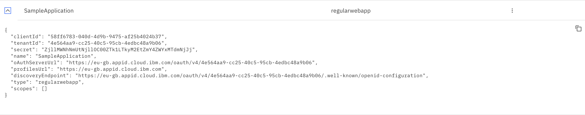
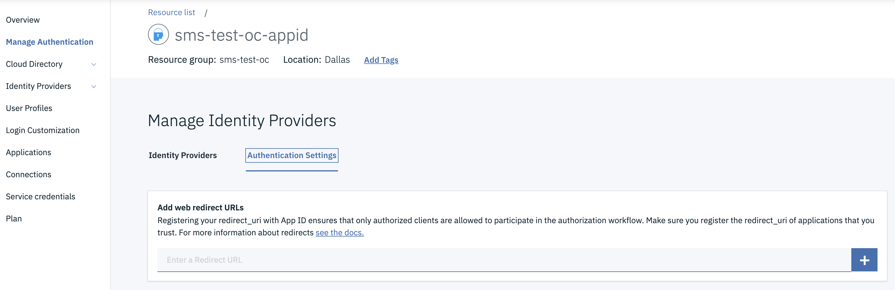
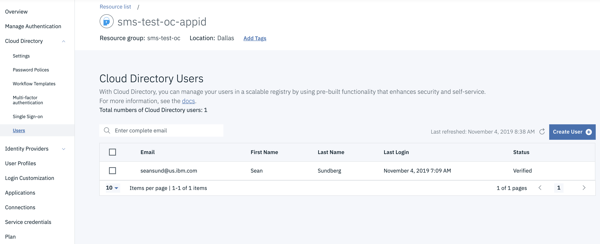
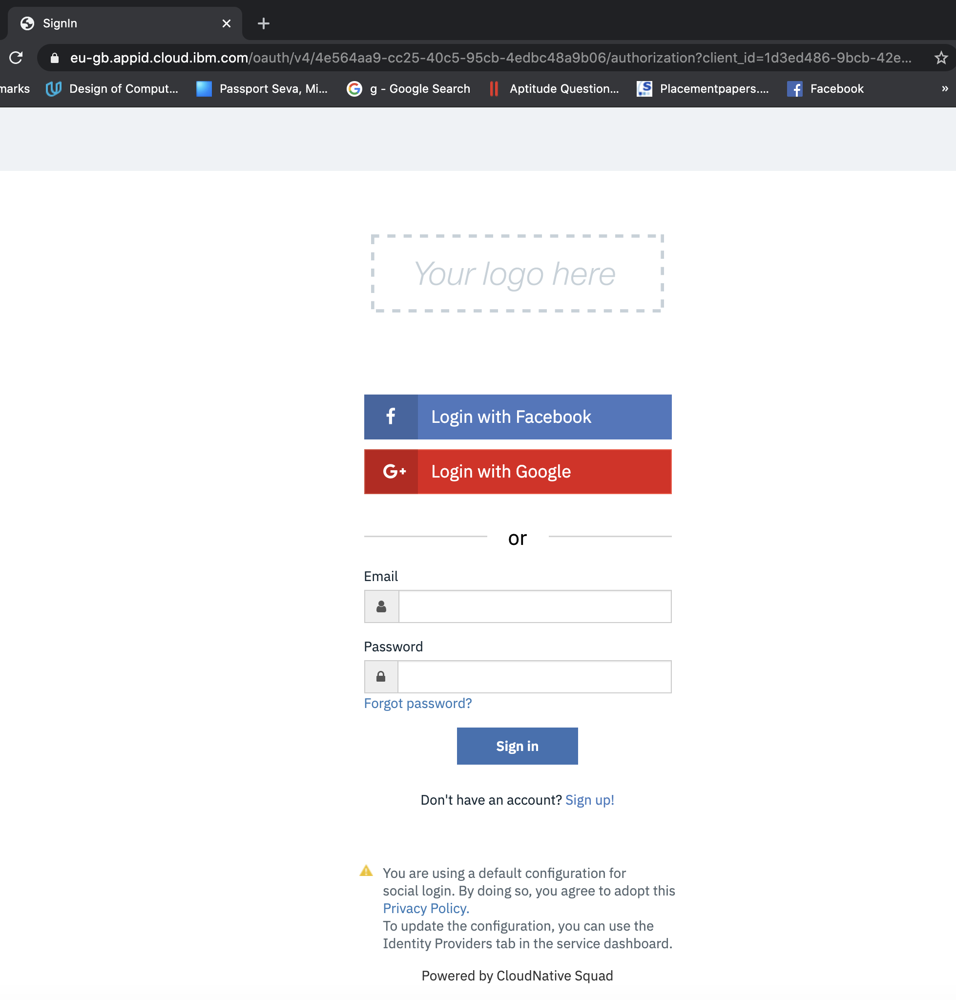

<!--- cSpell:ignore ICPA openshiftconsole Theia userid toolset crwexposeservice gradlew bluemix ocinstall Mico crwopenlink crwopenapp swaggerui gitpat gituser  buildconfig yourproject wireframe devenvsetup viewapp crwopenlink  atemplatized rtifactoryurlsetup Kata Koda configmap Katacoda checksetup cndp katacoda checksetup Linespace igccli regcred REPLACEME Tavis pipelinerun openshiftcluster invokecloudshell cloudnative sampleapp bwoolf hotspots multicloud pipelinerun Sricharan taskrun Vadapalli Rossel REPLACEME cloudnativesampleapp artifactoryuntar untar Hotspot devtoolsservices Piyum Zonooz Farr Kamal Arora Laszewski  Roadmap roadmap Istio Packt buildpacks automatable ksonnet jsonnet targetport podsiks SIGTERM SIGKILL minikube apiserver multitenant kubelet multizone Burstable checksetup handson  stockbffnode codepatterns devenvsetup newwindow preconfigured cloudantcredentials apikey Indexyaml classname  errorcondition tektonpipeline gradlew gitsecret viewapp cloudantgitpodscreen crwopenlink cdply crwopenapp -->

**Securing Inventory App with App ID**

To secure the application we are using the capabilities available within the IBM Cloud platform to enable integration with AppID.  
With Openshift 3.11, a simple annotation was used on the ingress to enable Appid. In Openshift 4.x, Red Hat OpenShift on IBM Cloud annotations (ingress.bluemix.net/[annotation]) and NGINX annotations (nginx.ingress.kubernetes.io/[annotation_name]) are not supported for the router or the Ingress resource.  
With Openshift 4.x, AppID integration is enabled with SDKs.

## Prerequisites

The following prerequisites are required for AppID integration:  

- An instance of the App ID service:
  In IBM Cloud Dashboard, go to "Services" and select the AppID instance.
  
  

- A set of service credentials:
    - In AppID instance, go to "Application". 
    - Click on "Add application".
    - Enter your application name 
    - Select the type as Regular web application.
    - Click on Save to create the service credentials for your application.
   
    

    - After saving, your application credentials will get created.Click on the down Arrow at 
    the left end of your application name and get the credentials.
    
    
    

- `yarn` version 1.22.19 or higher.
- `node` version 16.16.0 or higher (it is recommended that you use an LTS version).

!!! note
    To install `yarn` run the command `npm install -g yarn`


## Enable Appid in the solution

### Installation
-   By using the command line, change to the directory that contains your Node.js app.
-   Install the AppID service and other dependencies.

    ```bash
    yarn add ibmcloud-appid passport@0.5.2 express-session
    ```

-  Obtain your credentials by navigating to the **Applications** tab of the AppID dashboard as mentioned in [Prerequisites](#prerequisites).

-  Obtain the application as mentioned in [AppID Redirect Url Config](#appid-redirect-url-config).

### Create binding secret for appid in your namespace
- Login to the IBM Cloud cluster where your workshop-team-one ocp cluster resides.
  ```bash
  ibmcloud login -u [username] -p [password]
  ```
- Login to your ocp cluster using the oc cli.

    

  - Click on "Copy Login Command". It will redirect to a new page.  

  - Click the display token link. Copy the "Log in with this token" command & login to `oc` cli, it should look like this :

    ```bash
    oc login --token=sha256~bfGcq7l6H3JHd9GwbNRaSsJ7cDAiLK5EPF4tbPQ-WfY --server=https://c108-e.eu-gb.containers.cloud.ibm.com:31718
    ```

- Navigate to your namespace where you are running the inventory solution pipeline and create the binding secret for He the Appid instance on the cloud account
  ```bash
  oc project <PROJECT_NAME>
  ibmcloud oc cluster service bind --cluster workshop-team-one --namespace <PROJECT_NAME> --service workshop-team-one-appid
  ```
!!! note
    Save the binding name, you will use it later


### Update the configuration values in the configuration files
- Put these credentials in *server/config/mappings.json* to be referred by application:
   ```json title="server/config/mappings.json"
   {
    "APPID_CONFIG": ""{\"tenantId\":\"<tenantId_value>\",\"oauthServerUrl\":\"<oauthServer_URL>\",\"clientId\": \"<ClientID_value>\", \"secret\": \"<secret_value>\"}",
    "application_url":"<openshift_appln_route_url>"
   }
   ```

- Add the following parameter in `values.yaml` along with its value:
   ```yaml title="chart/base/values.yaml"
   appidBinding: <BINDING_NAME>
   ```

### Adding the dependencies
- Add the following *require* definitions to your `server/server.js`:
    ```bash title="server/server.js"
    const express = require('express');
    const session = require('express-session')
    const passport = require('passport');
    const WebAppStrategy = require("ibmcloud-appid").WebAppStrategy;
    const CALLBACK_URL = "/ibm/cloud/appid/callback";
    const appidConfig = require("./config/mappings.json");
    ```

### Activate the appid integration
- In *server.js*, set up your express app to use express-session middleware.
   ```javascript title="server/server.js"
   const app = express();

   const appidcfg = appidConfig.APPID_CONFIG;

   app.use(
     session({
           secret: appidcfg.secret,
           resave: true,
           saveUninitialized: true
     })
   );
   app.use(passport.initialize());
   app.use(passport.session());
   ```

- In the same file, initialize the SDK using the information obtained in the previous steps.
   ```javascript title="server/server.js"

   passport.use(
     new WebAppStrategy({
       tenantId: appidcfg.tenantId,
       clientId: appidcfg.clientId,
       secret: appidcfg.secret,
       oauthServerUrl: appidcfg.oAuthServerUrl,
       redirectUri: appidConfig.application_url + CALLBACK_URL
     })
   );
   ```

-   In the same file, configure passport with serialization and deserialization. This configuration step is required for authenticated session persistence across HTTP requests. For more information, see the [passport docs](http://www.passportjs.org/docs/)
    ```javascript title="server/server.js"
    passport.serializeUser(function(user, cb) {
      cb(null, user);
    });
    passport.deserializeUser(function(obj, cb) {
      cb(null, obj);
    });
    ```

-   Add the following code to your *server.js* to issue the service redirects.
    ```javascript title="server/server.js" 
    app.get(CALLBACK_URL, passport.authenticate(WebAppStrategy.STRATEGY_NAME));
    app.use(passport.authenticate(WebAppStrategy.STRATEGY_NAME ));
    ```

### Adding environment variables to `deployment.yaml`
- Open the `deployment.yaml` file and add environment variables that use those values to the top of the existing `env` block:
  ```yaml title="chart/base/templates/deployment.yaml"
  - name: APPID_CONFIG
    valueFrom:
       secretKeyRef:
          name: {{ .Values.appidBinding | quote }}
          key: binding
  ```

### AppID redirect url config

- Get the ingress for the UI component by running `igc ingress -n dev-{initials}`.

- Open the IBM Cloud resource list - `https://cloud.ibm.com/resources`

- Open the AppID instance to the `Manage Authentication` -> `Authentication Settings` view

    

- Add the redirect url for the application to the web redirect URLs. The redirect url will have
the following form:

    `{ingress url}/ibm/cloud/appid/callback`
    
    e.g. `https://inventory-manangement-ui-dev.sms-test-oc-cluster.us-east.containers.appdomain.cloud/ibm/cloud/appid/callback`

### Add users to AppID

- Open the AppID instance to `Cloud Directory` -> `Users`

    

- Add yourself as a user with an email address, name, and password#

### Commit and push the changes
- Commit your local changes and push them to your remote repository
  ```bash
  git add .
  git commit -m "Added appid"
  git push
  ```
- Your previously defined pipeline should be launched and the new app should be deployed afterwards

### Access the UI

- Open a browser to the UI Application URL

- You should be met with the AppID login screen. (This screen can be customized from the AppID service console but for now we are showing the default screen.)

     

- Provide the email address and password you configured in the previous steps. You should be granted access to the UI.
