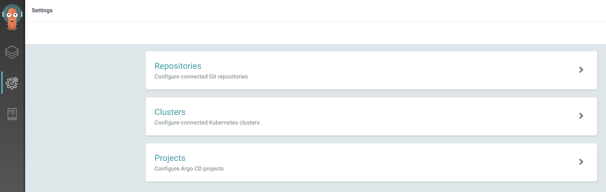

<!--- cSpell:ignore artifactoryurlsetup ICPA openshiftconsole Theia userid toolset crwexposeservice gradlew bluemix ocinstall Mico crwopenlink crwopenapp swaggerui gitpat gituser  buildconfig yourproject wireframe devenvsetup viewapp crwopenlink  atemplatized rtifactoryurlsetup Kata Koda configmap Katacoda checksetup cndp katacoda checksetup Linespace igccli regcred REPLACEME Tavis pipelinerun openshiftcluster invokecloudshell cloudnative sampleapp bwoolf hotspots multicloud pipelinerun Sricharan taskrun Vadapalli Rossel REPLACEME cloudnativesampleapp artifactoryuntar untar Hotspot devtoolsservices Piyum Zonooz Farr Kamal Arora Laszewski  Roadmap roadmap Istio Packt buildpacks automatable ksonnet jsonnet targetport podsiks SIGTERM SIGKILL minikube apiserver multitenant kubelet multizone Burstable checksetup handson  stockbffnode codepatterns devenvsetup newwindow preconfigured cloudantcredentials apikey Indexyaml classname  errorcondition tektonpipeline gradlew gitsecret viewapp cloudantgitpodscreen crwopenlink cdply crwopenapp -->

**Extending the Inventory Micro  app to include Continuous Delivery to Test.**


## Guide

This Micro App guidance continues to build upon the micro-services that were built in the Inventory Micro App guide. Make sure you have complete [Inventory Application](/developer-intermediate/inventory-application) or deployed the working [Inventory Solution](/developer-intermediate/inventory-prebuilt-solution/#deploy-the-inventory-app-solution).

- We implemented the three tiers in the Inventory Mico App and deployed the app to the `dev` namespace/project.
- We will take that app and make these additions.

- Deploy the app to the `test` namespace/project using CD techniques and ArgoCD


## Using CD to deploy to Test

ArgoCD is a tool that provides continuous delivery for projects and applications. For this exercise, we are going to use ArgoCD to push the Inventory app from `dev` to `test`. If you have already completed the Inventory Micro App, then it can be used for the ArgoCD process. If you haven't completed the exercise, you can start from the [solution repositories](/developer-intermediate/inventory-prebuilt-solution/) to perform the ArgoCD steps.


### Set up the GitOps repo

Let's get started with using Argo CD.

- Create a new repo from the [ArgoCD Code Pattern](https://github.com/IBM/template-argocd-gitops/generate), name it something like `inv-app-gitops-{your initials}`.

- On the Web Terminal, clone the repository you have just created:
    ```bash
    git clone https://github.com/{organization}/inv-app-gitops-{your initials}
    cd inv-app-gitops-{your initials}
    ```

- Create a branch named `test`:
    ```bash
    git checkout -b test
    ```

- Push the branch to the remote
    ```bash
    git push -u origin test
    ```

- Hook the CI pipeline to the CD pipeline, using the `test` branch of the current gitops repository:
    ```bash
    igc gitops
    ```

    !!! note
        **What just happened?**: The `igc gitops` command creates a secret `git-credentials` and a configmap named `gitops-repo` in the OpenShift project. These contain the url, username, password, and branch information for the GitOps repository. You can verify the secret was created by running:
            ```bash
            oc get configmap/gitops-repo -n dev-{initials} -o yaml
            oc get secret/git-credentials -n dev-{initials} -o yaml
            ``` 

- Manually trigger the pipeline for the Inventory Management service by going to the last pipeline run and click **Action**, then **Rerun**. When the pipeline has finished you will see a new folder on the `test` branch of the GitOps repo.

- Create the test namespace with the CLI by running `oc sync test-{initials}`

### Grant required access to the service account of the  test namespace

Openshift Image registry is being used for storing docker images.Hence,permission needs to be given to the service account of the test namespace to be able to pull images from dev namespace where the docker image of application is stored.

```shell
oc policy add-role-to-group system:image-puller system:serviceaccounts:${TEST_NAMESPACE} -n {DEV_NAMESPACE}
```

### Register the GitOps repo in ArgoCD

Now that the repository has been created, we need to tell ArgoCD where it is.

- Log into ArgoCD using the `Cluster Argo CD` console link on the top menu of the OpenShift console.

- Click on the gear icon on the left menu to access the Settings options

    

- Select the `Repositories` option

- Click either the `Connect Repo using HTTPS` or `Connect Repo using SSH` button at the top and provide the information
for the GitOps repo you just created.

### Create a project in ArgoCD (Optional)

In ArgoCD terms, each deployable component is an `Application` and applications are grouped into `Projects`. Projects are not
required for ArgoCD to be able to deploy applications but it helps to organize applications and provide some restrictions
on what can be done for applications that make up a project.

To create a project, do the following:

- Log into ArgoCD using the `Cluster Argo CD` console link on the top menu of the OpenShift console.

- Click on the gear icon on the left menu to access the Settings options

    

- Select the `Projects` option

- Click the `New Project` button at the top of the page.

- Provide the following values then press `Create`:

    - `name` - the name for the project (provide `inventory-management)
    - `description` - a brief description of the project
    - `sources` - click `add source` and pick the Git repository from the list that was added previously
    - `destinations`
        - Add `https://kubernetes.default.svc` for the cluster url and `test-{initials}` for the namespace

    **Note:** Initially, the only cluster that is available is the one in which ArgoCD is -
    `https://kubernetes.default.svc`. By adding the two destinations we have allowed the project to be deployed
    to both the `test-{initials}` namespaces within the current cluster.

### Add an application in ArgoCD for the Inventory Management service

The last step in the process is to define the application(s) within ArgoCD that should be managed. This consists of
connecting the config within the Git repo to the cluster and namespace.

- Log into ArgoCD

- Click `New Application` and provide the following values:

    - `application name` - `test-inv-svc`
    - `project` - `inventory-management`
    - `sync-policy` - `Automatic`
    - `repository url` - The url of the GitOps repository you created earlier
    - `revision` - `test`
    - `path` - `inv-svc-{initials}`
    - `destination cluster` - The cluster url for the deployment
    - `destination namespace` - `test-{initials}`
    - `values file` - `values.yaml`

- Click `Create`

- Click on the newly created application. The app should be synchronizing and a graph of kubernetes resources should be shown if everything is configured correctly.

### Repeat for BFF and UI components

Manually trigger rerun of BFF and UI pipelines and when it's finished repeat this last step to create applications for BFF and UI.
