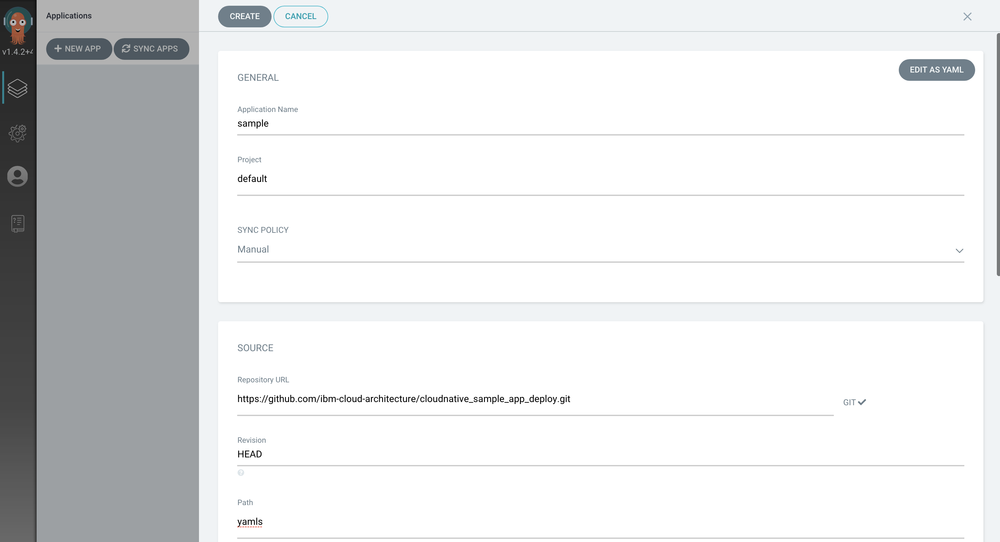
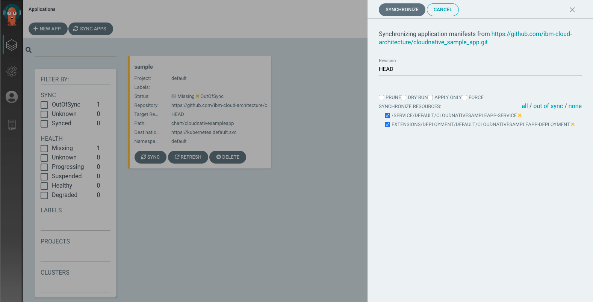

<!--- cSpell:ignore ICPA openshiftconsole Theia userid toolset crwexposeservice gradlew bluemix ocinstall Mico crwopenlink crwopenapp swaggerui gitpat gituser  buildconfig yourproject wireframe devenvsetup viewapp crwopenlink  atemplatized rtifactoryurlsetup Kata Koda configmap Katacoda checksetup cndp katacoda checksetup Linespace igccli regcred REPLACEME Tavis pipelinerun openshiftcluster invokecloudshell cloudnative sampleapp bwoolf hotspots multicloud pipelinerun Sricharan taskrun Vadapalli Rossel REPLACEME cloudnativesampleapp artifactoryuntar untar Hotspot devtoolsservices Piyum Zonooz Farr Kamal Arora Laszewski  Roadmap roadmap Istio Packt buildpacks automatable ksonnet jsonnet targetport podsiks SIGTERM SIGKILL minikube apiserver multitenant kubelet multizone Burstable checksetup handson  stockbffnode codepatterns devenvsetup newwindow preconfigured cloudantcredentials apikey Indexyaml classname  errorcondition tektonpipeline gradlew gitsecret viewapp cloudantgitpodscreen crwopenlink cdply crwopenapp -->

## Pre-requisites

Make sure your environment is setup properly for the lab.

Check the [Environment Setup](../../getting-started/devenvsetup/) page for your setup.

## Deploying the app

- Open the application menu at the top of the OpenShift console to find the ArgoCD url
- Click on "Log in via OpenShift" 

- Now go back to the ArgoCD home and click on `NEW APP`.
- Add the below details:
- Application Name: `sample`
- Project - `default`
- SYNC POLICY: `Manual`
- REPO URL: `https://github.com/ibm-cloud-architecture/cloudnative_sample_app_deploy`
- Revision: `HEAD`
- Path: `openshift`



- Cluster - Select the default one `https://kubernetes.default.svc` to deploy in-cluster
- Namespace - `default`
- Click Create to finish


- You will now see the available apps.


- Initially, the app will be out of sync. It is yet to be deployed. You need to sync it for deploying.

To sync the application, click `SYNC` and then `SYNCHRONIZE`.



- Wait till the app is deployed.


- Once the app is deployed, click on it to see the details.


## Verifying the deployment

- Access the app to verify if it is correctly deployed.
- List the cloudnativesampleapp-service route
```
oc get route
```
It should have an IP under `EXTERNAL-IP` column
```
NAME                 HOST/PORT                                     PATH   SERVICES                       PORT   TERMINATION   WILDCARD
cloudnative-sample   cloudnative-sample-default.apps-crc.testing          cloudnativesampleapp-service   9080                 None
```
- Set an environment variable `APP_URL` using the `EXTERNAL-IP`
```
export APP_URL="http://$(oc get route cloudnative-sample -o jsonpath='{.status.ingress[0].host}')"
echo ARGOCD_SERVER=$APP_URL
```
- Access the url using `curl`
```
curl "$APP_URL/greeting?name=Carlos"
```
```
{"id":2,"content":"Welcome to Cloudnative bootcamp !!! Hello, Carlos :)"}
```

## Using the ArgoCD CLI

- Login using the cli.
- Login as the `admin` user.
- The initial password is autogenerated to be the pod name of the Argo CD API server. This can be retrieved with the following command.
```bash
oc get pods -n argocd -l app.kubernetes.io/name=argocd-server -o name | cut -d'/' -f 2
```
- Now login as follows.
```bash
argocd login $ARGOCD_SERVER
```

```
WARNING: server certificate had error: x509: cannot validate certificate for 10.97.240.99 because it doesn't contain 
any IP SANs. Proceed insecurely (y/n)? y
Username: admin
Password: 
'admin' logged in successfully
Context '10.97.240.99' updated
```
- List the applications
```bash
argocd app list
```
```
NAME    CLUSTER                         NAMESPACE  PROJECT  STATUS  HEALTH   SYNCPOLICY  CONDITIONS  REPO                                                                     PATH   TARGET
sample  https://kubernetes.default.svc  default    default  Synced  Healthy  <none>      <none>      https://github.com/ibm-cloud-architecture/cloudnative_sample_app_deploy  openshift  HEAD
```
- Get application details
```bash
argocd app get sample
```
```
Name:               sample
Project:            default
Server:             https://kubernetes.default.svc
Namespace:          default
URL:                https://10.97.240.99/applications/sample
Repo:               https://github.com/ibm-cloud-architecture/cloudnative_sample_app_deploy
Target:             HEAD
Path:               openshift
SyncWindow:         Sync Allowed
Sync Policy:        <none>
Sync Status:        Synced to HEAD (9684037)
Health Status:      Healthy

GROUP  KIND        NAMESPACE  NAME                             STATUS  HEALTH   HOOK  MESSAGE
    Service     default    cloudnativesampleapp-service     Synced  Healthy        service/cloudnativesampleapp-service created
apps   Deployment  default    cloudnativesampleapp-deployment  Synced  Healthy        deployment.apps/cloudnativesampleapp-deployment created
```
- Show application deployment history
```bash
argocd app history sample
```
```
ID  DATE                           REVISION
0   2020-02-12 21:10:32 -0500 EST  HEAD (9684037)
```
## References

- [ArgoCD](https://argoproj.github.io/argo-cd/)

