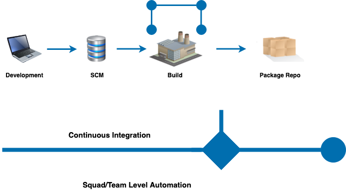
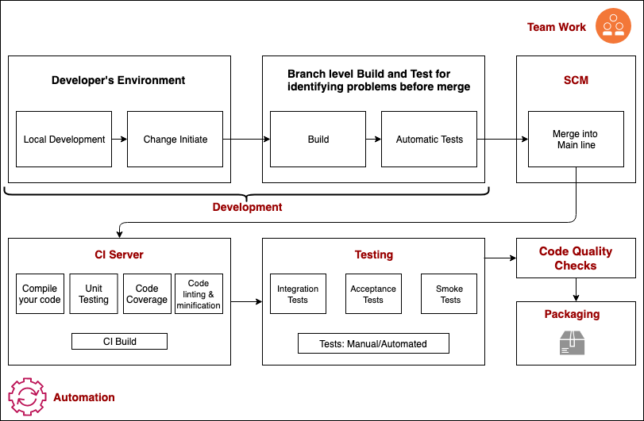

<!--- cSpell:ignore ICPA openshiftconsole Theia userid toolset crwexposeservice gradlew bluemix ocinstall Mico crwopenlink crwopenapp swaggerui gitpat gituser  buildconfig yourproject wireframe devenvsetup viewapp crwopenlink  atemplatized rtifactoryurlsetup Kata Koda configmap Katacoda checksetup cndp katacoda checksetup Linespace igccli regcred REPLACEME Tavis pipelinerun openshiftcluster invokecloudshell cloudnative sampleapp bwoolf hotspots multicloud pipelinerun Sricharan taskrun Vadapalli Rossel REPLACEME cloudnativesampleapp artifactoryuntar untar Hotspot devtoolsservices Piyum Zonooz Farr Kamal Arora Laszewski  Roadmap roadmap Istio Packt buildpacks automatable ksonnet jsonnet targetport podsiks SIGTERM SIGKILL minikube apiserver multitenant kubelet multizone Burstable checksetup handson  stockbffnode codepatterns devenvsetup newwindow preconfigured cloudantcredentials apikey Indexyaml classname  errorcondition tektonpipeline gradlew gitsecret viewapp cloudantgitpodscreen crwopenlink cdply crwopenapp -->

## Introduction

Continuous Integration, Delivery, and Deployment are important devOps practices and we often hear a lot about them. These processes are valuable and ensures that the software is up to date timely.

- **Continuous Integration** is an automation process which allows developers to integrate their work into a repository. When a developer pushes his work into the source code repository, it ensures that the software continues to work properly. It helps to enable collaborative development across the teams and also helps to identify the integration bugs sooner.
- **Continuous Delivery** comes after Continuous Integration. It prepares the code for release. It automates the steps that are needed to deploy a build.
- **Continuous Deployment** is the final step which succeeds Continuous Delivery. It automatically deploys the code whenever a code change is done. Entire process of deployment is automated.

## What is continuous integration ?

Continuous integration is a software development technique where software is built regularly by a team in an automated fashion.
This quote helps explain it:

> Continuous Integration is a software development practice where members of a team integrate their work frequently,
> usually each person integrates at least daily - leading to multiple integrations per day.
> Each integration is verified by an automated build (including test) to
> detect integration errors as quickly as possible. Many teams find that this approach leads to significantly
> reduced integration problems and allows a team to develop cohesive software more rapidly
> <cite>– Martin Fowler</cite>

<iframe width="640" height="480" src="https://www.youtube.com/embed/1er2cjUq1UI" frameborder="0" allow="accelerometer; autoplay; encrypted-media; gyroscope; picture-in-picture" allowfullscreen></iframe>

## Continuous Integration

Continuous Integration is the first step to deliver high quality and efficient software. It is all about making sure that the software is working all the time and it is deployable at all times.

It initially begins with the **development**. Developers implement the new features or changes to the existing ones in small, tested batches and commit this code to a **Source Code Management (SCM)** system such as Github, SVN, bitbucket etc. The next step will be the **build**. This is done by the CI server like Tekton, Jenkins, Travis CI, Circle CI etc. The CI server is linked up with the GitHub repository to trigger the build either using web hook or by polling the repository for changes. When it gets the access to the latest code changes in the SCM system, it executes the build script generating new deployment artifacts. In case of build failures, it generates feedback and send the information to the corresponding members. Once this is completed, developers **package** the build using Docker, Cloud Foundry etc. The builds along with their runtimes are packaged as immutable images. These images are later used for deployment in the further stages.

Let us go through these steps in detail.

###Development

During the development, developers initially work in their local environments. They define code for new features or make changes to the existing feature. They make all this changes or additions in their local workspaces which are integrated with an Integrated Development Environment runtime. They may use build tools installed physically in their own workstation or they may use the ones existing on cloud (Web IDEs) based on their convenience. Once the code is defined, they do unit testing. Along with it they also do performance checks, data validations etc. They also test the software locally and validate the code changes using tests. If everything is fine, they push the changes to the source code management. Then a code review will be performed and if everything seems correct, then these changes will be merged into the main stream of the SCM system.

###Source Control

Continuous Integration starts with source control system. Source Control systems helps us to store all the code in a single place. This source code can be accessed by multiple developers. It is easy to pull the changes, change them and push them back into the source control system. These can be viewed by other developers too.

If you consider Git, in this source control system, you can have multiple branches of the same software and you can work on different things without conflicting with other parts of the software. For instance, let us say you have three different branches for dev, test and prod. Initially when the code is defined, it goes into dev branch. When the testing is completed, it is moved to test branch. And finally when we get the approval, it goes into prod branch. Or you may have a single main branch and create new branches for every release. These are few examples just for your understanding.

This gives developers the capability to work on same project. They can work on different things. Even though if they work on the same thing, they need not worry about the overwriting.

Source Control system is the place where you can store pretty much everything related to the software. Not only code, it is good to store all other things that are required to run your software like build scripts, test scripts, configurations etc in it.

Whenever a code push is made by the developer to the source control system, it should be validated by the automated build server. It is always a good practice to keep the check-ins small. If you do large check-ins, it is hard to identify any error or bugs if they occur.

###CI Server

CI Server is used to automate the builds. There are many CI server software available today like Jenkins, Tavis CI, Bamboo etc.

The source control repository is monitored by the CI server. The CI server is integrated to the repository and it starts the build whenever a change is pushed into the repository. The build has several steps like compiling the code, running unit tests, checking the code coverage, code linting, validating style guidelines, code minification etc. If the build is passed, it creates the build artifact. Otherwise, it will notify the failure. For instance, if the developer made a syntactical error like may be missing a semi colon and pushed in the code, then the unit tests fail. CI server will report this failure to the team by sending an email or however you configured it to send the information. Also, defining the failure conditions is up to the developer. If it is a compilation error, it obviously fails. You can also add conditions like there must be a code coverage of 80 % for your code etc.

CI server builds the software. They also inform about the failures and successes. They build artifacts which will be later used to deploy the application.

###Testing

Whenever a build is done on the CI server, it undergoes many tests to make sure the quality of the software is high. Various tests are performed as part of this process. Some of the important ones are as follows.

- Unit tests - Unit tests are defined to test small isolated parts of code. It is simple piece of code which calls a method to be tested. It passes the required input and verifies if the output obtained is correct.
- Integration tests - Integration tests tests the system as a whole. It validates if the entire system is working as expected. For example, if you want to know if your application properly interacts with the backend or to validate if the frontend properly interacts with the backend these tests will help to resolve them.
- Acceptance tests - An acceptance test tests whether a specific functionality works as described in the specification. These tests are written in the perspective of the user and it validates if the created feature is same as the requested one.
- Smoke tests - Smoke tests test if your software is working in a production environment. It tests the basic functionality and makes sure the most important parts of your software work properly.

###Automation

Automation is a very important. When doing CI, the build process is all automated. It also uses automated tests to make sure that software is properly working after new code changes.

###Teamwork

All the code changes are compiled. To reduce the bugs, we use automation testing as part of CI. Also, if the executable is tested on an environment which resembles your production environment, it makes your life easier.

All this process cannot be just done by a single person. For suppose, if you develop a code and define unit tests to make sure everything works and other person from your team pushes large pieces of code without any unit tests, then it will be of no use. So, every member of the team should make efforts to successfully define the Continuous Integration for your software.

You can do some practical exercises and get a better understanding of [continuous integration](/developer-intermediate/continuous-integration-handson/)

## References

- [Sricharan Vadapalli (2018). DevOps: Continuous Delivery, Integration, and Deployment with DevOps. Publisher: Packt Publishing](https://learning.oreilly.com/library/view/devops-continuous-delivery/9781789132991/)
- [Sander Rossel (2017). Continuous Integration, Delivery, and Deployment. Publisher: Packt Publishing](https://learning.oreilly.com/library/view/continuous-integration-delivery/9781787286610/)
