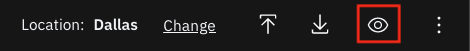
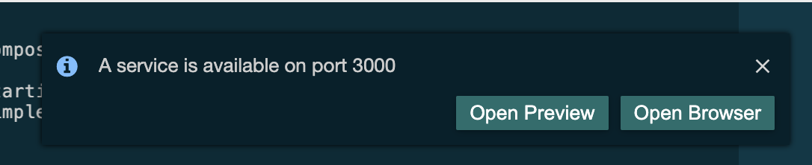

<!--- cSpell:ignore ICPA openshiftconsole Theia userid toolset crwexposeservice gradlew bluemix ocinstall Mico crwopenlink crwopenapp swaggerui gitpat gituser  buildconfig yourproject wireframe devenvsetup viewapp crwopenlink  atemplatized rtifactoryurlsetup Kata Koda configmap Katacoda checksetup cndp katacoda checksetup Linespace igccli regcred REPLACEME Tavis pipelinerun openshiftcluster invokecloudshell cloudnative sampleapp bwoolf hotspots multicloud pipelinerun Sricharan taskrun Vadapalli Rossel REPLACEME cloudnativesampleapp artifactoryuntar untar Hotspot devtoolsservices Piyum Zonooz Farr Kamal Arora Laszewski  Roadmap roadmap Istio Packt buildpacks automatable ksonnet jsonnet targetport podsiks SIGTERM SIGKILL minikube apiserver multitenant kubelet multizone Burstable checksetup handson  stockbffnode codepatterns devenvsetup newwindow preconfigured cloudantcredentials apikey Indexyaml classname  errorcondition tektonpipeline gradlew gitsecret viewapp cloudantgitpodscreen crwopenlink cdply crwopenapp -->


## Overview

The <Globals name="env" /> supports end-to-end development and deployment of an application. The instructions below
will show you how to do it.

You can create a new app using one of the [Starter Kits](/resources/codepatterns-overview). These have been
created to include all the key components, configuration, and frameworks to get you started on creating the code you
need for your solutions. The approach for getting started is exactly the same for an environment based on
**Kubernetes** or **Red Hat OpenShift**.

**Note:** The instructions provided below lean heavily on the use of the <Globals name="igccli"/> to both show how the
CLI works in context and to streamline the process (the reason for creating the CLI in the first place). However, the
use of the CLI is in no way required to use the <Globals name="shortName"/>. If you would prefer to work through these
instructions without the use of the CLI, we have provided the equivalent manual steps for each command on
the [Cloud-Native Toolkit CLI](https://cloudnativetoolkit.dev/getting-started/cli) page.

This video demonstrates how to work through the steps to create an application and use a deployment pipeline to install
it into your development cluster.

<iframe width="100%" height="500" src="https://www.youtube-nocookie.com/embed/GOPWObjFTsI" type="video/m4v" frameborder="0" allow="accelerometer; autoplay; clipboard-write; encrypted-media; gyroscope; picture-in-picture" allowfullscreen></iframe>
## Create an application


### 0. Setup your web terminal for development

- Open the openshift console in your browser and log in if needed.

- Invoke Web terminal by clicking on the button at the top, right-hand corner which comes before the question mark icon of the browser window.

   

We have provided a simplified installer that will install tools and configure the shell environment. The
installer will first check if the required tool is available in the path. If not, the missing tool(s) will be
installed into the `bin/` folder of the current user's home directory and the `PATH` variable will be updated in the
`.bashrc` or `.zshrc` file to include that directory.

The following tools are included in the shell installer:

- IBM Cloud cli (ibmcloud)
- ArgoCD cli (argocd)
- Tekton cli (tkn)
- IBM Cloud fast switching (icc)
- kube-ps1 prompt
- OpenShift cli (oc)
- Kubernetes cli (kubectl)
- JSON cli (jq)
- IBM Garage Cloud CLI (igc)

a. Set up the shell environment by running:
    ```shell
    mkdir bin
    curl -sL https://raw.githubusercontent.com/cloud-native-toolkit/ibm-garage-cloud-cli/main/install.sh | DEST_DIR=~/bin sh
    export PATH=“$HOME/bin:$PATH”
    ```

b. If successful, you should see something like the following:
    ```shell
    Installing version v1.37.5 of Cloud-Native Toolkit cli for linux into /home/user/bin
    ######################################################################## 100.0%
    Installing igc cli as plugins to kubectl/oc clis
    Installed plugins in /home/user/bin:
    kubectl-igc
    kubectl-console
    kubectl-credentials
    kubectl-dashboard
    kubectl-enable
    kubectl-endpoints
    kubectl-git
    kubectl-gitops
    kubectl-gitsecret
    kubectl-pipeline
    kubectl-sync
    kubectl-toolconfig
    ```

c. You can check the shell was installed correctly by checking the `oc` version:
    ```shell
    oc sync --version
    ```

### 1. Log into your Development Cluster from the command line

=== "IBM Cloud"
    - Make sure you have done your cloud shell setup before proceeding to next steps.


    - Log in to OpenShift Cluster from the openshift console.Go to Resource List and click on the cluster:
    

    - Access the OpenShift console from within that console by clicking on the button.
    

    - In OpenShift Console, click on email address top right, Click on Copy Login Command and get the OpenShift login command, which includes a token.
    

    - click on Display Token, copy the Login with the token. oc login command  will log you in. Run the login command in the cloud shell terminal:
    ```bash
    $ oc login --token=qvARHflZDlOYfjJZRJUEs53Yfy4F8aa6_L3ezoagQFM --server=https://c103-e.us-south.containers.cloud.ibm.com:30979
    Logged into "https://c103-e.us-south.containers.cloud.ibm.com:30979" as "IAM#email@company" using the token provided.

    You have access to 71 projects, the list has been suppressed. You can list all projects with 'oc projects'

    Using project "dev-ab".
    ```
!!! Tekton

    === "Github Auth"
     
  

You can also access OpenShift console using above command:

```shell
oc console
```
 
!!! info

    NOTE: If your workshop is on Code Ready Workspaces, follow the steps in [Code Ready Workspaces Setup](/getting-started/devenvsetup#codeready-workspace) before logging in to the cluster.
     The remaining steps assume this step has already been performed. If you stop and then come back later it is a good idea to re-run this step again before proceeding


### 2. Create the development namespace

Before getting started, the development namespace/project needs to be created and prepared for the DevOps pipelines. 
This is something that would typically happen once at the beginning of a project when a development team is formed and 
assigned to the cluster. 

This step copies the common `secrets` and `configMaps` that contain the CI/CD configuration from the `tools` 
namespace into the development namespace/project. This enables the pipelines to reference the values easily for your 
project.

```shell
oc sync ${DEV_NAMESPACE} 
```

### 3. Grant required access to the service account of the namespace

Openshift Image registry is being used for storing docker images.Hence,permission needs to be given to the service account of the namespace to be able to pull images from registry.

```shell
oc policy add-role-to-group system:image-puller system:serviceaccounts:${DEV_NAMESPACE} 
```

### 4. Open the Developer Dashboard

The Developer Dashboard makes it easy for you to navigate to the tools, including a
section that allows you to select a set of preconfigured [Starter Kits](/resources/codepatterns-overview) that make seeding your development project very easy.

- If you are logged into the OpenShift console, you can select the tools menu and select **Developer Dashboard**

- If you are on a laptop/desktop, open a browser and make sure you are logged into [Github](https://github.com)

- Open the dashboard by running the following command:
  ```
  oc dashboard
  ```

### 5. Create your app in Git

- From the Developer Dashboard, click on **<Globals name="templates" />** tab

   
    !!! warning

        -  If you are developing on a shared education cluster, you need to make it easy to identify
        your app. Please suffix the app name with your initials `{app name}-{your initials}` (e.g.
        `stockbffnode-mjp`) and use the **Git Organization** for the shared environment.

        - Your browser needs to be logged in to your GitHub account for a template to work. If the link from the
        tile displays the GitHub 404 page, log in and reload the page.

    

- Pick one of the templates that is a good architectural fit for your application and the language and framework that you prefer to work with. For your first application, select the **Typescript Microservice**. This also works well in the Cloud Shell.

  Click on a <Globals name="template" /> **Tile** to create your app github repository from the
    template repository selected. You can also click on the **Git Icon** to browse the source template
    repository and click on the **Template** to create the template.

- Complete the [GitHub create repository from template](https://help.github.com/en/github/creating-cloning-and-archiving-repositories/creating-a-repository-from-a-template)
process.

  **Owner**: Select a valid GitHub organization that you are authorized to create repositories within or the one you were given for the shared cluster (See warning above)

  **Repository name**: Enter a name for your repo. GitHub will help with showing a green tick if it is valid (See warning above)

  **Description**: Describe your app

  Press **Create repository from template**

  

- The new repository will be created in your selected organization.

### 6. Register the application in a DevOps Pipeline


!!! info

    We will be using the `pipeline` command of the IBM Garage Cloud cli to register the DevOps pipeline. The pipeline 
    command gives an option for both `Jenkins` and `Tekton`. For more information about working with the different build 
    engines, please see [Continuous Integration with Jenkins Guide](/guides/continuous-integration) and
    [Continuous Integration with Tekton Guide](/guides/continuous-integration)


1. Open a browser to the Git repository created in the previous step.

2. Copy the url to the Git repository. For GitHub this is done by pressing the `Code` button and copying the url provided in the `Clone` section.

3. Start the process to create a pipeline.

    ```shell
    oc pipeline ${GIT_URL} --tekton
    ```
   
    For example:
    ```shell
    oc pipeline https://github.com/gct-showcase/inventory-svc --tekton
    ```

4. For the deployment of your first app with OpenShift select **Tekton** as the CI engine.

5. The first time a pipeline is registered in the namespace, the CLI will ask for a username and **Password**/**Personal Access Token** for the Git repository that will be stored in a secret named `git-credentials`.

    **Username**: Enter your GitHub user id

    **Personal Access Token**: Paste your GitHub personal access token

6. When registering a `Tekton` pipeline, the CLI will attempt to determine the runtime used by the repository that was provided and filter the available pipelines. If only one matches then it will be automatically selected. If it cannot find a match or there is more than one match then you will be prompted to select the pipeline.

7. When registering a `Tekton` pipeline, the CLI also reads the available parameters from the pipeline and generates prompts for input. In this case, the option of scanning the built image for vulnerabilities is the only options. The scan is performed by the Vulnerability Advisor if you are using IBM Image Registry or by [Trivy](https://github.com/aquasecurity/trivy) if another image registry is used. This scan is performed in "scan" stage of pipeline after "img-release" stage.
    ```shell
    ? scan-image: Enable the pipeline to scan the image for vulnerabilities?(Y/n)
    ```

8. The pipeline also prompts for linting the dockerfile
   ```shell
   ? lint-dockerfile: Enable the pipeline to lint the Dockerfile for best practices? (Y/n)
   ```

9. To skip the scan, you have type "n" (No).Otherwise, type "y" (Yes) for performing Vulnerability Scanning on the image.
   Similarly, for skipping the linting of dockerfile,you have type "n" (No).Otherwise, type "y" (Yes) for performing Dockerfile lint.


10. After the pipeline has been created,the command will set up a webhook from the Git host to the pipeline event listener.

    **Note:** if the webhook registration step fails, it is likely because the Git credentials are incorrect or do not have enough permission in the repository. 

11. When the command is completed it will present options for next steps. You can use the Tekton cli commands to inspect the pipeline run that has been created and tail the log and/or navigate to the provided url to see the pipeline running from the OpenShift console.

### 7. View your application pipeline

The steps to view your registered pipeline will vary based on type of pipeline (`Jenkins` or `Tekton`) and container platform version.

!!! Tekton

    === "OpenShift 4.x"

        1. Open the OpenShift Web Console

         ```shell script
            oc console
         ```

         **OR**

         

         2. From menu on the left switch to the **Developer** mode

         3. Select _dev_ project that was used for the application pipeline registration

         4. In the left menu, select *Pipelines*

         You will see your application dev ops pipeline now starting to build and once completed will look like the image below.

         
        

    === "Kubernetes"

        1. Open the Developer Dashboard

        ```shell script
        kubectl dashboard
        ```

        2. Select the `Tekton` tile to launch the Tekton UI

        3. Select your development project


!!! Jenkins

    === "OpenShift 4.x"

        1. Open the OpenShift Web Console

        ```shell script
        oc console
        ```

        **OR**

        

        2. From the left-hand menu, select `Builds` -> `Build Configs`

        3. Select your project from the drop-down menu at the top

        4. The registered pipeline should appear in the list
        
    === "Kubernetes"

        1. Run the command `oc dashboard` in your terminal to open your dashboard.
        2. Select the Jenkins tool to open the Jenkins dashboard
        3. Run the command `kubectl credentials` in your terminal to get the list of logins for the tools
        4. Use the Jenkins userid and password to log into the Jenkins dashboard

        Wait for the pipeline stages to start building. Once the stages have completed, you will see a view similar to the one below.

        


### 8. Access the running app

Once the pipeline has completed successfully, the app will be deployed into the namespace used when
registering the pipeline. To validate the app is running follow these steps:

**Note:** Be sure the namespace context is set correctly by running the following command
```bash
oc project 
```

- Retrieve the app ingress endpoint using commands below in your terminal.

    ```bash
    oc endpoints
    ```

- From the endpoints listed, select the URL for the repo that was just deployed and press **Enter** to
open that URL in a web browser. Validate the application is working as expected.


### 9. Locate the app in the web console

The build pipeline is configured to build the source code from the Git repository into a container image. This
image is stored in the [Image Registry](/developer-intermediate/image-registry). After that, the image is deployed into the
same namespace/project within the development cluster where the pipeline ran and validated for its health. The steps
below will walk through locating the installed application within the Web Console.


=== "OpenShift 4.x"

    - Open the **OpenShift web console**
      ```shell script
       oc console
       ```
    - Change to the **Developer** view
    - Click on **Topology** menu
    - Click on your application deployment in the topology view
    - Click on the **Overview** tab
    - Increase the number of running pods to 2 pods
    - Click on the **Resources** tab to view the list of pods
    - Click on **View Logs** link to view the logs from each pod
    - You can see the running state of your application

    

=== "Kubernetes"

    - Open the **Kubernetes Dashboard**
      ```shell script
       kubectl console
      ```
    - Change to the namespace from `default` to either `dev` or the namespace you used to deploy your app
    - Click on **Deployments**
    - You should see the deployment of your application
    - Click on your application , and the corresponding **Replica Set**
    - Try scaling the application, click on **Scale** in the header, change number of pods to 2 and click **OK**
    - Click on one of the `pod` instances
    - Click on **Logs**
    - You can see the running state of your application
    - Navigate around the console to understand where your deployment, service and pods are running

    


!!! success

    **Success:** You now have your application running inside your development cluster and being delivered using a Tekton based CI pipeline. This is the beginning of the developer journey with IBM Cloud.


Having reached this point, we recommend you repeat the process a few more
 times using different **Code Patterns** templates and explore the **Developer** view in OpenShift to get familiar with it.


### 10. Clone your code to your web-terminal

- Next, clone the Github repo to your cloud shell.
- Click on **Clone or download**
- Copy the clone _HTTPS link_, and use the `git clone` command to clone it to your terminal.
    ```shell script
    git clone https://github.com/gsi-ecosystem-demo/stockbffnode-mjp.git
    ```
- You will be required to enter your **GitHub User ID** and use your **Git Hub Personal Access Token** as your password. This will complete the clone of your git repository.

- Change into the cloned directory
    ```shell script
    cd stockbffnode
    ```
- You must rename the app to match your git repo or to a unique name for your solution. When applications move into a _test_ environment, they need to have unique names.
- Edit `package.json` and edit the `name:` field and change it from its template name to your chosen name.
- In case of a java gradle application(Spring Boot Microservice), edit the `settings.gradle` file. Edit the `rootProject.name` field and change it from its template name to your chosen name.
- Save the edits
- Push the changes back to your repository
    ```bash
    git add .
    git commit -m "Update application name"
    git push
    ```
- You will be required to enter your **GitHub User ID** and use your **Git Hub Personal Access Token** as your password. This will push your changes back to the repository.


### 11. Run the application locally

Most developers like to run the code natively in local development environment. To do so, follow the instructions listed in the **README.md** file to run the code locally.
You may be required to install a specific runtime like **Java**, **Node** or **Go**.

- If you want to quickly access your git repo you can run a helper command to open the git webpage.
    ```
    oc git
    ``` 

- From inside the folder where the code was cloned from GitHub, run the following command to install the Node.js dependencies.
    ```
    npm install
    ```
- Run the following command to start the application.
    ```
    npm run start
    ```


=== "Cloud Shell"

    - To view the running app click on the **Eye Icon** on the top right and select the port `3000` this will open a browser tab and display the running app on that port.

    


=== "Gitpod"

    - Once you run the application,gitpod gives the option to make the port "Public".Once you make the port Public, it gives you the option to "Open Preview" or "Open Browser".

    

    - Selecting "Open Preview" opens a window inside gitpod workspace tab.

     

    - Selecting "Open Browser" opens a new browser tab for accessing the URL.


=== "Code Ready Workspaces"

    


    - Click on open link


    


    - To view this application in new tab click top right corner arrow icon

=== "Desktop/Laptop"
    - Open a browser to `http://localhost:3000/api-docs/`


    - You can try out the sample API that is provided with this **Code Pattern**

    - You can now add new features and function from inside the Cloud Shell and experiment with your code before you push any changes back to git.


### 12. Test the webhook
-  Go to your cloned git project and navigate to <i>chart/base</i> directory.
    ```
      cd stockbffnode
      cd chart/base
    ```
- Open the file `Chart.yaml` in edit mode and change the `description` field's value from "A Helm chart for Kubernetes" to "A Helm chart for [yourprojectName]"
- Save the edits
- Push the changes back to your repository
    ```bash
       git add .
       git commit -m "Updated application name in Chart.yaml"
       git push
    ```
- As soon as you push your code changes successfully, the webhook will trigger a new pipeline run for your project in your namespace in OCP.
  
  **Note:** if the webhook registration step fails, the git push will not trigger the pipeline.
