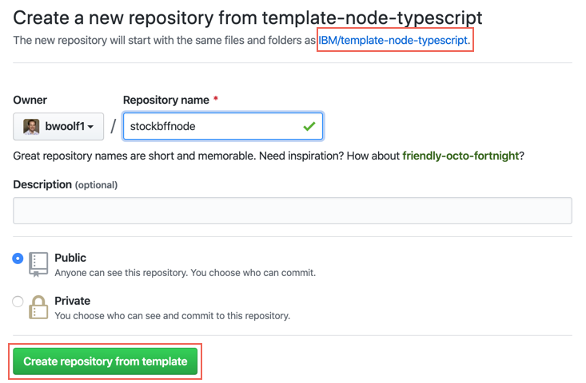

<!--- cSpell:ignore ICPA openshiftconsole Theia userid toolset crwexposeservice gradlew bluemix ocinstall Mico crwopenlink crwopenapp swaggerui gitpat gituser  buildconfig yourproject wireframe devenvsetup viewapp crwopenlink  atemplatized rtifactoryurlsetup Kata Koda configmap Katacoda checksetup cndp katacoda checksetup Linespace igccli regcred REPLACEME Tavis pipelinerun openshiftcluster invokecloudshell cloudnative sampleapp bwoolf hotspots multicloud pipelinerun Sricharan taskrun Vadapalli Rossel REPLACEME cloudnativesampleapp artifactoryuntar untar Hotspot devtoolsservices Piyum Zonooz Farr Kamal Arora Laszewski  Roadmap roadmap Istio Packt buildpacks automatable ksonnet jsonnet targetport podsiks SIGTERM SIGKILL minikube apiserver multitenant kubelet multizone Burstable checksetup handson  stockbffnode codepatterns devenvsetup newwindow preconfigured cloudantcredentials apikey Indexyaml classname  errorcondition tektonpipeline gradlew gitsecret viewapp cloudantgitpodscreen crwopenlink cdply crwopenapp -->

## Overview

The OpenShift development environment  supports end-to-end development and deployment of an application. The instructions below
will show you how to do it.

You can create a new app using one of the [Starter Kits](https://develop.cloudnativetoolkit.dev/reference/starter-kit/starter-kit/). These have been
created to include all the key components, configuration, and frameworks to get you started on creating the code you
need for your solutions. 

This video demonstrates how to work through the steps to create an application and use a deployment pipeline to install
it into your development cluster.

<iframe width="560" height="315" src="https://www.youtube.com/embed/czYQfvPTa7Y" title="YouTube video player" frameborder="0" allow="accelerometer; autoplay; clipboard-write; encrypted-media; gyroscope; picture-in-picture" allowfullscreen></iframe>

## Create an application

The following steps will help you deploy your first application in your own namespace inside your OpenShift development environment. 

### 1. Open the Web Terminal

To be able to run CLI commands to drive common operations on the cluster you will first need to open your  web terminal.
- Click on your web terminal `>_` icon in the header of the OpenShift Console. You should see a terminal open at the bottom of the console screen. With a banner saying `TechZone Automation` 
- Check you can run `oc` commands, run the following command
  ```bash
  oc sync --version
  ```
- You should see the version number printed

!!! Info
    You will now be able to quickly create [**Tekton**](https://mediacenter.ibm.com/id/1_wph9sgmt) pipelines within OpenShift. Watch this short video for more information on how Tekton is replacing Jenkins in the enterprise CI space.

### 2. Create the development namespace

Before getting started, the development namespace/project needs to be created and prepared for the DevOps pipelines. 
This is something that would typically happen once at the beginning of a project when a development team is formed and 
assigned to the cluster. 

This step copies the common `secrets` and `configMaps` that contain the CI/CD configuration from the `tools` 
namespace into the development namespace/project. This enables the pipelines to reference the values easily for your 
project.

```shell
oc sync dev-{your intials} 
```

### 3. Grant required access to the service account of the namespace

Openshift Image registry is being used for storing docker images.Hence,permission needs to be given to the service account of the namespace to be able to pull images from registry.

```shell
oc policy add-role-to-group system:image-puller system:serviceaccounts:${DEV_NAMESPACE} 
```

### 4. Open the Developer Dashboard

The Developer Dashboard makes it easy for you to navigate to the tools, including a
section that allows you to select a set of preconfigured [Starter Kits](https://develop.cloudnativetoolkit.dev/reference/starter-kit/starter-kit/) that make seeding your development project very easy.

- If you are logged into the OpenShift console, you can select the tools menu and select **Developer Dashboard**

- If you are on a laptop/desktop, open a browser and make sure you are logged into [Github](https://github.com)


### 4. Create your app in Git

- From the Developer Dashboard, click on **<Globals name="templates" />** tab

   
    !!! warning

        -  If you are developing on a shared education cluster, you need to make it easy to identify
        your app. Please suffix the app name with your initials `{app name}-{your initials}` (e.g.
        `stockbffnode-mjp`) and use the **Git Organization** for the shared environment.

        - Your browser needs to be logged in to your GitHub account for a template to work. If the link from the
        tile displays the GitHub 404 page, log in and reload the page.


- Pick one of the templates that is a good architectural fit for your application and the language and framework that you prefer to work with. For your first application, select the **Typescript Microservice**. This also works well in the Cloud Shell.

  Click on a <Globals name="template" /> **Tile** to create your app github repository from the
    template repository selected. You can also click on the **Git Icon** to browse the source template
    repository and click on the **Template** to create the template.

- Complete the [GitHub create repository from template](https://help.github.com/en/github/creating-cloning-and-archiving-repositories/creating-a-repository-from-a-template)
process.

  **Owner**: Select a valid GitHub organization that you are authorized to create repositories within or the one you were given for the shared cluster (See warning above)

  **Repository name**: Enter a name for your repo. GitHub will help with showing a green tick if it is valid (See warning above)

  **Description**: Describe your app

  Press **Create repository from template**

  

- The new repository will be created in your selected organization.

### 5. Register the application in a OpenShift Pipeline

!!! info

    We will be using the `pipeline` command and specifically the `tekton` technology to setup the CI pipeline. The pipeline 
    command gives an option for both `Jenkins` and `Tekton` make sure you select `Tekton`. For more information about working with the different build 
    engines, please see [Continuous Integration with Jenkins Guide](../../guides/continuous-integration) and
    [Continuous Integration with Tekton Guide](../../guides/continuous-integration)


1. Open a browser to the Git repository created in the previous step.

2. Copy the url to the Git repository. For GitHub this is done by pressing the `Code` button and copying the url provided in the `Clone` section.

3. Start the process to create a pipeline from your Web Terminal 

    ```shell
    oc pipeline ${GIT_URL} --tekton
    ```
   
    For example:
    ```shell
    oc pipeline https://github.com/gct-showcase/inventory-svc-mjp --tekton
    ```

4. For the deployment of your first app with OpenShift we have selected **Tekton** as the CI engine.

5. The first time a pipeline is registered in the namespace, the CLI will ask for a username and **Password**/**Personal Access Token** for the Git repository that will be stored in a secret named `git-credentials`.

    **Username**: Enter your GitHub user id

    **Personal Access Token**: Paste your GitHub personal access token

6. When registering a `Tekton` pipeline, the CLI will attempt to determine the runtime used by the repository that was provided and filter the available pipelines. If only one matches then it will be automatically selected. If it cannot find a match or there is more than one match then you will be prompted to select the pipeline.

7. When registering a `Tekton` pipeline, the CLI also reads the available parameters from the pipeline and generates prompts for input. In this case, the option of scanning the built image for vulnerabilities is the only options. The scan is performed by the Vulnerability Advisor if you are using IBM Image Registry or by [Trivy](https://github.com/aquasecurity/trivy) if another image registry is used. This scan is performed in "scan" stage of pipeline after "img-release" stage.
    ```shell
    ? scan-image: Enable the pipeline to scan the image for vulnerabilities?(Y/n)
    ```

8. The pipeline also prompts for linting the dockerfile
   ```shell
   ? lint-dockerfile: Enable the pipeline to lint the Dockerfile for best practices? (Y/n)
   ```

9. To skip the scan, you have type "n" (No).Otherwise, type "y" (Yes) for performing Vulnerability Scanning on the image.
   Similarly, for skipping the linting of dockerfile,you have type "n" (No).Otherwise, type "y" (Yes) for performing Dockerfile lint.

10. After the pipeline has been created,the command will set up a webhook from the Git host to the pipeline event listener.

    **Note:** if the webhook registration step fails, it is likely because the Git credentials are incorrect or do not have enough permission in the repository. 

11. When the command is completed it will present options for next steps. You can use the Tekton cli commands to inspect the pipeline run that has been created and tail the log and/or navigate to the provided url to see the pipeline running from the OpenShift console.

### 7. View your application pipeline

The steps to view your registered pipeline will vary based on type of pipeline (`Jenkins` or `Tekton`) and container platform version.


1. From the OpenShift Web Console select the Pipelines menu in the Developer view
2. You will see your microservice now running an OpenShift pipeline using Tekton Tasks
 
 

### 8. Access the running app

Once the pipeline has completed successfully, the app will be deployed into the namespace used when
registering the pipeline. To validate the app is running follow these steps:

**Note:** Be sure the namespace context is set correctly by running the following command
```bash
oc project 
```

- Retrieve the app ingress endpoint using commands below in your terminal.

    ```bash
    oc endpoints
    ```

- From the endpoints listed, select the URL for the repo that was just deployed and press **Enter** to
open that URL in a web browser. Validate the application is working as expected.


### 9. Locate the app in the web console

The build pipeline is configured to build the source code from the Git repository into a container image. This
image is stored in the [Image Registry](../..//developer-intermediate/image-registry). After that, the image is deployed into the
same namespace/project within the development cluster where the pipeline ran and validated for its health. The steps
below will walk through locating the installed application within the Web Console.


- Open the **OpenShift web console**
- Change to the **Developer** view
- Click on **Topology** menu
- Click on your application deployment in the topology view
- Click on the **Overview** tab
- Increase the number of running pods to 2 pods
- Click on the **Resources** tab to view the list of pods
- Click on **View Logs** link to view the logs from each pod
- You can see the running state of your application


!!! success

    **Success:** You now have your application running inside your development cluster and being delivered using a Tekton based CI pipeline. This is the beginning of the developer journey with IBM Cloud.

Having reached this point, we recommend you repeat the process a few more
 times using different **Code Patterns** templates and explore the **Developer** view in OpenShift to get familiar with it.

### 10. Run the application locally

Most developers like to run the code natively in local development environment. To do so, follow the instructions listed in the **README.md** file to run the code locally.
You may be required to install a specific runtime like **Java**, **Node** or **Go**.

- If you want to quickly access your git repo you can run a helper command to open the git webpage.
    ```
    oc git
    ``` 

- From inside the folder where the code was cloned from GitHub, run the following command to install the Node.js dependencies.
    ```
    npm install
    ```
- Run the following command to start the application.
    ```
    npm run start
    ```

### 11. Make a change to your code

Within GitHub it is possible to open a full Visual Studio code web editor and make changes to you code.  

!!! Info
    The limitation is that you cannot do local testing for the learning journey it will be OK to make edits and lets the Tekton pipeline do the validation of the code.  

#### Editing Code in GitHub

To edit your code in GitHub follow the tests below.

1. Open your GitHub repository where your code was created from the template.
2. Using your computer keyboard type the `.` key, this will open the repo into the visual editor.
3. All the Starter Kits have a health API endpoint within them. Navigate to the code for the health endpoint. For Go its in `routes/Health.go` and for Node Typescript it is in `src/controllers/health.controller.ts` file.
4. Edit the code and change the `status:` text to something like below.
```javascript
@GET
async healthCheck(): Promise<{status: string,message: string;}> {
    return {
        status: 'UP',
        message : "App is up and running with TechZone Automation"
    };
}
```
5. Save your changes.
6. Now update the test that validates this API open up `test/controllers/health.controller.spec.ts` and update the `expect` to match the value that is now being returned in the API.
```javascript
 describe('Given /health', () => {
    test('should return 200 status', () => {
      return request(app).get('/health').expect(200);
    });

    test('should return {status: "UP:}', () => {
      return request(app).get('/health').expect({
        status: 'UP',
        message : "App is up and running with TechZone Automation"
      });
    });
  });
```
6. Click on the Source Control icon on the left it will say `21 pending changes`
7. Click on the `+` icon to stage the changes
8. Click on the tick icon at the top to push the changes, remember to add a commit message something like `Update Health API and Test with message value`
9. Navigate back to the OpenShift console and click on **Pipeline** view you will see the tekton pipeline has kicked off again based on your code change. This will make it run through the build and deploy cycle.

#### Local Development

You can update your code locally using `git` command line.

-  Go to your cloned git project and navigate to <i>chart/base</i> directory.
    ```
      cd stockbffnode
      cd chart/base
    ```
- Open the file `Chart.yaml` in edit mode and change the `description` field's value from "A Helm chart for Kubernetes" to "A Helm chart for [yourprojectName]"
- Save the edits
- Push the changes back to your repository
    ```bash
       git add .
       git commit -m "Updated application name in Chart.yaml"
       git push
    ```
- As soon as you push your code changes successfully, the webhook will trigger a new pipeline run for your project in your namespace in OCP.
  
!!! Warning
    **Note:** if the webhook registration step fails, the git push will not trigger the pipeline.
