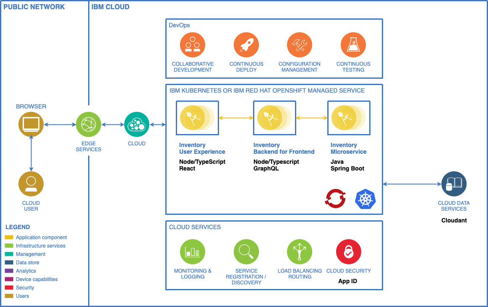
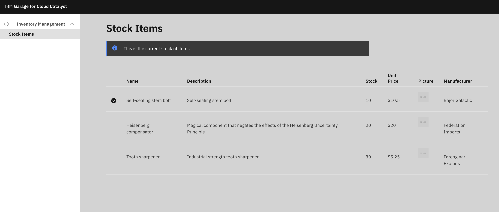

<!--- cSpell:ignore ICPA openshiftconsole Theia userid toolset crwexposeservice gradlew bluemix ocinstall Mico crwopenlink crwopenapp swaggerui gitpat gituser  buildconfig yourproject wireframe devenvsetup viewapp crwopenlink  atemplatized rtifactoryurlsetup Kata Koda configmap Katacoda checksetup cndp katacoda checksetup Linespace igccli regcred REPLACEME Tavis pipelinerun openshiftcluster invokecloudshell cloudnative sampleapp bwoolf hotspots multicloud pipelinerun Sricharan taskrun Vadapalli Rossel REPLACEME cloudnativesampleapp artifactoryuntar untar Hotspot devtoolsservices Piyum Zonooz Farr Kamal Arora Laszewski  Roadmap roadmap Istio Packt buildpacks automatable ksonnet jsonnet targetport podsiks SIGTERM SIGKILL minikube apiserver multitenant kubelet multizone Burstable checksetup handson  stockbffnode codepatterns devenvsetup newwindow preconfigured cloudantcredentials apikey Indexyaml classname  errorcondition tektonpipeline gradlew gitsecret viewapp cloudantgitpodscreen crwopenlink cdply crwopenapp -->

**Develop and deploy an example microservices application within OpenShift**

Develop an example application with a three-tier microservices architecture and deploy it into a Red Hat OpenShift on AWS, Azure or IBM Cloud. This OpenShift development environment has be pre-configured with a sample [SDLC](https://cio-wiki.org/wiki/Software_Development_Life_Cycle_(SDLC))(Software Delivery Life Cycle) using the [Cloud-Native Toolkit](https://develop.cloudnativetoolkit.dev/).

## Business Need

In this guide, imagine you have completed an [Enterprise Design Thinking Workshop](https://www.ibm.com/garage/method/practices/think/enterprise-design-thinking/) and the result is an MVP statement that defines the desired business outcomes. Use the steps below to help deliver this MVP quickly while following [Garage Method best practices](https://www.ibm.com/garage/method/cloud/).

### MVP Statement

An [MVP](https://www.ibm.com/garage/method/practices/think/practice_minimum_viable_product/) is a [first hill](https://www.ibm.com/garage/method/practices/think/practice_hills/). Here's the hill statement for the MVP we're going to build:

- **Who**: Distribution employees in each of the regional warehouses

- **What**: A secure web application that enables easy access to list of product [SKU](https://en.wikipedia.org/wiki/Stock_keeping_unit) inventory levels and inventory locations

- **Wow**: Make the system appealing and easy to use. Develop it quickly as a [minimum viable product](https://www.ibm.com/garage/method/practices/think/practice_minimum_viable_product/). Use the latest managed container runtimes and DevOps best practices to enable post MVP feature improvements. Simulate a release to a _Test_ environment.

## Architecture

We will build an application that is made up of microservices in three-tier architecture. Each tier encapsulates a clean separation of concerns. Each app microservice component will be modelled using _microservices_ and use a number of [polyglot](https://searchsoftwarequality.techtarget.com/definition/polyglot-programming) programming languages and frameworks. Data will be stored in a NoSQL Database.

### User interface

The user experience for the application has been designed by the design team and this drives the requirements for the development team this is a representation of the final user experience [wireframe](https://www.ibm.com/garage/method/practices/think/practice_wireframes/):

### Technical Requirements

The Micro services should adhere to the following technical requirements:

- Microservices
    - Stateless
    - REST APIs
    - Polyglot
- DevOps with CI/CD (continuous integration and continuous delivery) 
    - Use in cluster CI technology to be efficient and secure
    - Use latest GitOps best practices
    - Monitoring and logging
    - Code analysis
    - App security
- Deployed to Red Hat OpenShift cluster which is based on Kubernetes open source technology
- Follow the [Carbon Design System](https://www.carbondesignsystem.com/) user experience

## Guide

You will approach creating the microservices bottom up, meaning you will start by creating the backend microservice that manages integration with the data persistence and then build out the digital channel using a backend for frontend pattern. Finally, you will add a web UI to the solution.
