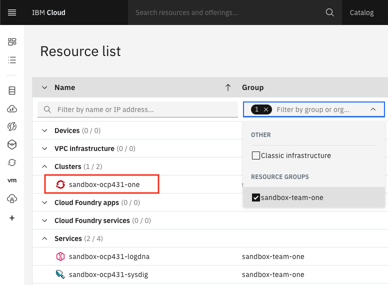

**Develop and deploy the BFF component of the inventory application**

The Inventory BFF's role in the architecture is to act as an orchestrator between the core business services and the specific digital channel it is focused on supporting. This class article will give you more detail about the [Backend For Frontend architectural pattern](https://samnewman.io/patterns/architectural/bff/) and the benefits.

|  |
|:--:|
| *Backend For Frontend pattern Overview - [source](https://samnewman.io/patterns/architectural/bff/)* |

The Inventory solution will use the [LoopBack](https://loopback.io/) framework and [GraphQL](https://graphql.org/) for its BFF layer, which enables the API to be dynamically controlled from the client using API queries. Follow the steps below to get started.

## Setup

### [Optionnal]: Access cloud shell 

If you don't plan to use your workstation to run this lab, you can use IBM Cloud Shell:

- Open the IBM Cloud console (cloud.ibm.com) in your browser and log in if needed.

- Invoke Cloud Shell by clicking on the button at the top, right-hand corner of the browser window.

   

### Setup your shell environment

We have provided a simplified installer that will install tools and configure the shell environment. The
installer will first check if the required tool is available in the path. If not, the missing tool(s) will be
installed into the `bin/` folder of the current user's home directory and the `PATH` variable will be updated in the
`.bashrc` or `.zshrc` file to include that directory.

The following tools are included in the shell installer:

- IBM Cloud cli (ibmcloud)
- ArgoCD cli (argocd)
- Tekton cli (tkn)
- IBM Cloud fast switching (icc)
- kube-ps1 prompt
- OpenShift cli (oc)
- Kubernetes cli (kubectl)
- JSON cli (jq)
- IBM Garage Cloud CLI (igc)

1. Set up the shell environment by running:
  ```shell
  curl -sL shell.cloudnativetoolkit.dev | sh -
  ```
  - **Note**: If successful, you should see something like the following:
   ```shell
   Downloading scripts: https://github.com/cloud-native-toolkit/cloud-shell-commands/releases/download/0.6.1/assets.tar.gz
   ** Installing argocd cli
   ** Installing tkn cli
   ** Installing kube-ps1
   ** Installing icc
   ** Installing Cloud-Native Toolkit cli
   ```
2. The installer updates PATH in the `.zshrc` or `.bashrc` file. You will need to source the file to apply the update to the current shell environment:
  ```shell
  if [[ "${SHELL}" =~ zsh ]]; then
    source ~/.zshrc
  else
    source ~/.bashrc
  fi
  ```
3. You can check the shell was installed correctly by checking the `oc` version:
    ```shell
    oc sync --version
    ```

### Log in to OpenShift Cluster

- Log in to OpenShift Cluster from the cloud console. Go to Resource listStockItems and click on the cluster:

    

- Access the OpenShift console from within that console by clicking on the button.

    

- In OpenShift Console, click on email address top right, Click on Copy Login Command and get the OpenShift login command, which includes a token.

    

- click on **_Display Token_**, copy the Login with the token. `oc login` command  will log you in. Run the login command in the cloud shell terminal:
    ```bash
    $ oc login --token=qvARHflZDlOYfjJZRJUEs53Yfy4F8aa6_L3ezoagQFM --server=https://c103-e.us-south.containers.cloud.ibm.com:30979
    Logged into "https://c103-e.us-south.containers.cloud.ibm.com:30979" as "IAM#email@company" using the token provided.

    You have access to 71 projects, the list has been suppressed. You can list all projects with 'oc projects'

    Using project "dev-ab".
    ```

### Setup code base

To get the initial BFF project created and registered with a pipeline for automated builds follow these steps.

- Create a new repository from the [Typescript LoopBack ](https://github.com/IBM/template-node-loopback/generate)pattern

    !!! warning
        If you are developing on a shared education cluster, place the repository in the **Git Organization** listed in your notification email and remember to add your initials as a suffix to the app name.
        - In order to prevent naming collisions, name the repository `inventory-management-bff-{your initials}` replacing
        `{your initials}` with your actual initials.

- Clone the new repository to your machine

- Run `npm install` to install all the package dependencies

- Go into the repository directory cloned and execute the following

    ```
    oc sync dev-{your initials} --tekton
    ```

- Register the pipeline
    ```
    oc pipeline --tekton
    ```
    - replacing `{your initials}` with your actual initials
    - Give git credentials if prompted, and master as the git branch to use. When prompted for the pipeline, select `igc-nodejs-<VERSION>`.

- Open the pipeline to see it running, using the link provided in the command output.

- When the pipeline is completed, run `oc endpoints -n dev-{your initials}`. You should see an entry
for the app we just pushed. Select the entry and hit `Enter` to launch the browser, if you are working
on your desktop/laptop. Otherwise copy the url and paste it in a new browser tab.

### Setup of the REST interface

The controller provides the REST interface for our BFF. The template uses the [LoopBack CLI](https://loopback.io/doc/en/lb4/Getting-started.html#install-loopback-4-cli)
package to simplify the tasks required to create a controller.

Since we will be developping this microservice following the [Test Driven Development](https://en.wikipedia.org/wiki/Test-driven_development) approach, we are first going to create the test for our `stock-item` controller.

- Start the tests by running
    ```bash
    npm run test
    ```

- Create the acceptance test file for the `stock-item` controller:
    ```typescript title="src/__tests__/acceptance/stock-item.controller.acceptance.ts"
    import {Client} from '@loopback/testlab';
    import {LbApiApplication} from '../..';
    import {setupApplication} from './test-helper';

    describe('Stock Items', () => {
    let app: LbApiApplication;
    let client: Client;

    before('setupApplication', async () => {
        ({app, client} = await setupApplication());
    });

    after(async () => {
        await app.stop();
    });

    it('GET /stock-items', async () => {
        await client
        .get('/stock-items')
        .expect(200)
        .expect('Content-Type', /application\/json/)
        .expect([]);
    });

    });
    ```

- Run the tests again and check that our new test is failing
    ```bash
    npm run test
    ```

- Create the controller component

    ```typescript title="src/controllers/stock-items.controller.ts"
    import {GET, Path} from 'typescript-rest';

    @Path('stock-items')
    export class StockItemsController {

    @GET
    async listStockItems(): Promise<any[]> {
        return [];
    }
    }
    ```

    - Add the controller to the controllers `index.ts`. (Using `index.ts` is a good way to manage which components are exposed
    by a component and provide a good way to load the modules that will be injected into other components)

    ```typescript title="src/controllers/index.ts"
    export * from './health.controller';
    export * from './stock-items.controller';
    ```

- Start the service to see it running

    ```bash
    npm start
    ```
<Tabs>

<Tab label="Cloud Shell">

 - To view the running app click on the **Eye Icon** on the top right and select the port `3000` this will open a browser tab and display the running app on that port.

    

</Tab>

<Tab label="Gitpod">

 - Once you run the application,gitpod gives the option to make the port "Public".Once you make the port Public, it gives you the option to "Open Preview" or "Open Browser".

    

- Selecting "Open Preview" opens a window inside gitpod workspace tab.

    

- Selecting "Open Browser" opens a new browser tab for accessing the URL.

</Tab>

<Tab label="Code Ready Workspaces">


- Click on open link 


- To view this application in new tab click top right corner arrow icon

</Tab>


<Tab label="Desktop/Laptop">
- Open a browser to `http://localhost:3000/api-docs` to see the swagger page
</Tab>

</Tabs>

- Expand our service from the list, click `Try it out`, then click `Execute`

- Push the changes we've made to the repository

```bash
git add .
git commit -m "Adds stock items controller"
git push
```

- Open the [pipeline to see it running](/developer-intermediate/deploy-app#9.-view-your-application-pipeline)

#### Update the controller to call a service

The pattern recommended for the REST controllers is to let it focus on translating REST protocols
into javascript and to put the business logic in a separate service component.

- Add a StockItem model that contains the values needed for the UI

```typescript title="src/models/stock-item.model.ts"
export class StockItemModel {
  id: string;
  name: string;
  description: string;
  stock: number;
  unitPrice: number;
  picture: string;
  manufacturer: string;
}
```

- Register the model with the `index.ts` file in the models directory. Append this to end of the file.

```typescript title="src/models/index.ts"
...
export * from './stock-item.model';
```

- Define an abstract class to provide the interface for our API

```typescript title="src/services/stock-items.api.ts"
import {StockItemModel} from '../models';

export abstract class StockItemsApi {
  async abstract listStockItems(): Promise<StockItemModel[]>;
}
```

<InlineNotification>

**Why an abstract class and not an interface?**

TypeScript introduces both abstract classes and interfaces. When TypeScript gets transpiled into
JavaScript, abstract classes are generated as classes but interfaces disappear since there isn't an equivalent type
in JavaScript. As a result, they cannot be used as a binding type for the `typescript-ioc` framework. Fortunately,
abstract classes can be used and they have the quirky behavior in TypeScript allowing them to either be `extended`
like a class or `implemented` like an interface.

</InlineNotification>

- Add the abstract class to the `index.ts` file in the services directory. Add it to the end of other export statements, do not overwrite the file.

```typescript title="src/services/index.ts"
...

export * from './stock-items.api';

...
```

- Update the controller test to inject the service into the controller and to return the value from the service

```typescript title="test/controllers/stock-items.controller.spec.ts"
import {Application} from 'express';
import * as request from 'supertest';
import {Container} from 'typescript-ioc';

import {buildApiServer} from '../helper';
import Mock = jest.Mock;
import {StockItemsMockService} from '../../src/services';

describe('stock-item.controller', () => {

  let app: Application;
  let service_listStockItems: Mock;

   beforeEach(async () => {
    service_listStockItems = jest.fn();
    Container.bind(StockItemsMockService).factory(
      () => ({
        listStockItems: service_listStockItems
      }),
    );

    const apiServer = buildApiServer();

    app = await apiServer.getApp();
  });


  test('canary verifies test infrastructure', () => {
     expect(true).toEqual(true);
  });

  describe('given GET /stock-items', () => {
    describe('when service is successful', () => {
      const expectedResult = [{value: 'val'}];
      beforeEach(() => {
        service_listStockItems.mockResolvedValue(expectedResult);
      });

      test('then return 200 status', async () => {
        return request(app).get('/stock-items').expect(200);
      });

      test('then should return value from service', async () => {
        return request(app).get('/stock-items').expect(expectedResult);
      });
    });

    describe('when service fails', () => {
      beforeEach(() => {
        service_listStockItems.mockRejectedValue(new Error('service failed'));
      });

      test('then return 502 error', async () => {
        return request(app).get('/stock-items').expect(502);
      });
    });
  });
});
```

- Update the controller to inject the service and use it

```typescript title="src/controllers/stock-items.controller.ts"
import {Inject} from 'typescript-ioc';
import {GET, Path} from 'typescript-rest';
import {HttpError} from 'typescript-rest/dist/server/model/errors';

import {StockItemModel} from '../models';
import {StockItemsMockService} from '../services';

class BadGateway extends HttpError {
  constructor(message?: string) {
    super("BadGateway", message);
    this.statusCode = 502;
  }
}

@Path('stock-items')
export class StockItemsController {
  @Inject
  service: StockItemsMockService;

  @GET
  async listStockItems(): Promise<StockItemModel[]> {
    try {
      return await this.service.listStockItems();
    } catch (err) {
      throw new BadGateway('There was an error');
    }
  }
}
```

#### Create a mock service implementation

Now that we have our Controller using our API to get the data, lets create an implementation that will provide
mock data for now.

- Add a `stock-items-mock.service` to services

```typescript title="src/services/stock-items-mock.service.ts"
import {StockItemsApi} from './stock-items.api';
import {StockItemModel} from '../models';


export class StockItemsMockService implements StockItemsApi {
  async listStockItems(): Promise<StockItemModel[]> {
    return [
      {
        id: "1",
        name: "Self-sealing stem bolt",
        description: "Self-sealing stem bolt",
        stock: 10,
        unitPrice: 10.5,
        picture: "https://via.placeholder.com/32.png",
        manufacturer: "Bajor Galactic"
      },
      {
        id: "2",
        name: "Heisenberg compensator",
        description: "Magical component that negates the effects of the Heisenberg Uncertainty Principle",
        stock: 20,
        unitPrice: 20.0,
        picture: "https://via.placeholder.com/32.png",
        manufacturer: "Federation Imports"
      },
      {
        id: "3",
        name: "Tooth sharpener",
        description: "Industrial strength tooth sharpener",
        stock: 30,
        unitPrice: 5.25,
        picture: "https://via.placeholder.com/32.png",
        manufacturer: "Farenginar Exploits"
      }
    ];
  }
}
```

- Add the mock service to the `index.ts` file in the services directory

```typescript title="src/services/index.ts"
...
export * from './stock-items-mock.service';
...
```

- Start the service

```bash
npm start
```
<Tabs>
<Tab label="Cloud Shell">

 - To view the running app click on the **Eye Icon** on the top right and select the port `3000` this will open a browser tab and display the running app on that port.

    

</Tab>

<Tab label="Gitpod">

 - Once you run the application,gitpod gives the option to make the port "Public".Once you make the port Public, it gives you the option to "Open Preview" or "Open Browser".

    

- Selecting "Open Preview" opens a window inside gitpod workspace tab.

    

- Selecting "Open Browser" opens a new browser tab for accessing the URL.

</Tab>

<Tab label="Code Ready Workspaces">


- Click on open link 


- To view this application in new tab click top right corner arrow icon

</Tab>
<Tab label="Desktop/Laptop">
- Open a browser to `http://localhost:3000/api-docs` and execute the stock items controller. You should see the data from
above returned by the service.
</Tab>
</Tabs>

- Push the changes we've made to the repository

```bash
git add .
git commit -m "Adds a mock service implementation"
git push
```

- Open the [pipeline to see it running](/developer-intermediate/deploy-app#view-your-application-pipeline)

#### Add a GraphQL implementation of Stock Items

The GraphQL <Globals name="template" /> supports both REST and GraphQL APIs for accessing backend services. We created
a REST controller to expose the results from the service and now we will do the same
for GraphQL.

- Create a `stock-items` GraphQL schema in the `schemas` directory

```typescript title="src/schemas/stock-item.schema.ts"
import {Field, Float, Int, ObjectType} from 'type-graphql';
import {StockItemModel} from '../models';

@ObjectType()
export class StockItem implements StockItemModel {
  @Field()
  id: string;
  @Field()
  description: string;
  @Field()
  manufacturer: string;
  @Field()
  name: string;
  @Field({nullable: true})
  picture: string;
  @Field(type => Int)
  stock: number;
  @Field(type => Float)
  unitPrice: number;
}
```

- Add the stock-items schema to the `index.ts` in the schemas directory

```typescript title="src/schemas/index.ts"
export * from './stock-item.schema'
```

- Add a 'stock-item' GraphQL resolver in the `resolvers` directory

```typescript title="src/resolvers/stock-item.resolver.ts"
import {Query, Resolver} from 'type-graphql';
import {Inject} from 'typescript-ioc';

import {resolverManager} from './_resolver-manager';
import {StockItem} from '../schemas';
import {StockItemModel} from '../models';
import {StockItemsMockService} from '../services';

@Resolver(of => StockItem)
export class StockItemResolver {
  @Inject
  service: StockItemsMockService;

  @Query(returns => [StockItem])
  async stockItems(): Promise<StockItemModel[]> {
    return this.service.listStockItems();
  }
}

resolverManager.registerResolver(StockItemResolver);
```

<InlineNotification>

**Note:** The <Globals name="template" /> includes a `resolverManager` component that simplifies the steps to
make the resolver available. All that is required to use the resolver is to register it, preferably
at the bottom of the module where it is defined.

</InlineNotification>

- Add the stock-items resolver to `index.ts` in the resolvers directory

```typescript title="src/resolvers/index.ts"
export * from './stock-item.resolver';
```

- Start the service

```bash
npm start
```
- Verify that the that the resolver is available using the Graph QL browser provided by the <Globals name="template" />
    - Open GraphQL Playground: `http://localhost:3000`
    - Run the query `query { stockItems { name } }`
    
<Tabs>
<Tab label="Cloud Shell">

 - To view the running app click on the **Eye Icon** on the top right and select the port `3000` this will open a browser tab and display the running app on that port.

    

</Tab>

<Tab label="Gitpod">

 - Once you run the application,gitpod gives the option to make the port "Public".Once you make the port Public, it gives you the option to "Open Preview" or "Open Browser".

    

- Selecting "Open Preview" opens a window inside gitpod workspace tab.

    

- Selecting "Open Browser" opens a new browser tab for accessing the URL.

</Tab>

<Tab label="Code Ready Workspaces">


- Click on open link 


- To view this application in new tab click top right corner arrow icon

</Tab>
<Tab label="Desktop/Laptop">
- Open GraphQL Playground: `http://localhost:3000`

</Tab>


</Tabs>


- Push the changes we've made to the repository

```bash
git add .
git commit -m "Adds a graphql interface"
git push
```

- Open the [pipeline to see it running](/developer-intermediate/deploy-app#view-your-application-pipeline)

#### Create a service implementation that calls the microservice

- Create a folder `config` in following path `src/config`

- Add a `stock-item-service.config` file in the config directory

```typescript title="src/config/stock-item-service.config.ts"
export class StockItemServiceConfig {
  baseUrl: string;
}
```
- Add a `stock-item-service.config.provider` file in the config directory

```typescript title="src/config/stock-item-service.config.provider.ts"
import {ObjectFactory} from 'typescript-ioc';

const baseUrl: string = process.env.SERVICE_URL || 'localhost:9080';

export const stockItemConfigFactory: ObjectFactory = () => ({
  baseUrl,
});
```

The config class separates how the config is loaded from how it is used. In this case the config is simply
retrieved from an environment variable but in more complex cases the value(s) can be retrived from external
data sources.

- Add the `stock-item-service.config` to an index.ts of the config directory

```typescript title="src/config/index.ts"
import {StockItemServiceConfig} from './stock-item-service.config';
import {stockItemConfigFactory} from './stock-item-service.config.provider';
import {Container} from 'typescript-ioc';

export * from './stock-item-service.config';

Container.bind(StockItemServiceConfig).factory(stockItemConfigFactory);
```

- Create a `stock-items` service in the services directory that uses the config

```typescript title="src/services/stock-items.service.ts"
import {Inject} from 'typescript-ioc';
import {get, Response} from 'superagent';

import {StockItemsApi} from './stock-items.api';
import {StockItemModel} from '../models';
import {StockItemServiceConfig} from '../config';
import {LoggerApi} from '../logger';

class StockItem {
  'id'?: string;
  'manufacturer'?: string;
  'name'?: string;
  'price'?: number;
  'stock'?: number;
}

export class StockItemsService implements StockItemsApi {
  @Inject
  _logger: LoggerApi;
  @Inject
  config: StockItemServiceConfig;

  get logger(): LoggerApi {
    return this._logger.child('StockItemsService');
  }

  async listStockItems(): Promise<StockItemModel[]> {
    try {
      const response: Response = await get(this.config.baseUrl + '/stock-items')
        .set('Accept', 'application/json');

      return this.mapStockItems(response.body);
    } catch (err) {
      this.logger.error('Error getting data from service', err);
      throw err;
    }
  }

  mapStockItems(data: StockItem[]): StockItemModel[] {
    return data.map(this.mapStockItem);
  }

  mapStockItem(item: StockItem): StockItemModel {
    return {
      id: item.id,
      name: item.name,
      description: item.name,
      stock: item.stock,
      unitPrice: item.price,
      picture: 'https://via.placeholder.com/32.png',
      manufacturer: item.manufacturer,
    };
  }
}
```

- Add `stock-item.service` to `index.ts` in the service directory
- Add `StockItemsService` instead of `StockItemsMockService` in the following files `src/resolvers/stock-item.resolver.ts` ,
  `src/controllers/stock-items.controller.ts` and `test/controllers/stock-items.controller.spec.ts`


- Remove `stock-items-mock.service` from `index.ts`

```typescript title="src/services/index.ts"
export * from './stock-items.service';
```


- Modify `connectsTo` property to the values.yaml file of the Helm chart. The value of the property should match the
Kubernetes service of the microservice. (For <Globals name="template" /> projects, the service name is the same as the name of the
application which is that same as the name of the repository.)

```yaml title="chart/base/values.yaml"
...

connectsTo: inventory-management-svc-{your initials}

...
```

The `values.yaml` file of the Helm chart defines the variables that can be provided to the
template as input. Now that we've added a new variable, we will need to update the appropriate
template file to use our new variable.

- Add a new environment variable named `SERVICE_URL` to the list of existing environment variables in deployment.yaml.
(`SERVICE_URL` is the name we gave the environment variable in our `stock-item-service.config` class as the first step in
this section.) The value of this environment variable should come from the `connectsTo` value we defined. You can add
`| quote` to wrap the value in quotes in case the value is not formatted correctly.

```yaml title="chart/base/templates/deployment.yaml"
  ...
  env:
    - name: INGRESS_HOST
      value: ""
    - name: PROTOCOLS
      value: ""
    - name: LOG_LEVEL
      value: {{ .Values.logLevel | quote }}
    - name: SERVICE_URL
      value: {{ printf "%s:80" .Values.connectsTo | quote }}
  ...
```

`deployment.yaml` is a templatized Kubernetes yaml file that describes the deployment of our component.
The deployment will create one or more pods based on the pod template defined in the deployment.
Each pod that starts will have the envionment variables that we have defined in the `env` section
available for the container image to reference.

- Commit and push the changes to git

```bash
git add .
git commit -m "Adds service implementation"
git push
```

- Open the [pipeline to see it running](/developer-intermediate/deploy-app#view-your-application-pipeline)
