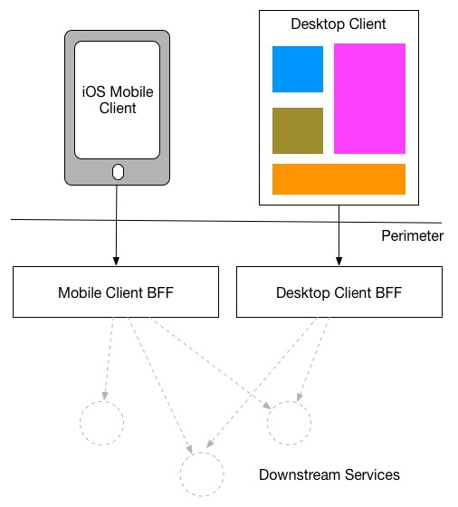

<!--- cSpell:ignore templatized ICPA openshiftconsole Theia userid toolset crwexposeservice gradlew bluemix ocinstall Mico crwopenlink crwopenapp swaggerui gitpat gituser  buildconfig yourproject wireframe devenvsetup viewapp crwopenlink  atemplatized rtifactoryurlsetup Kata Koda configmap Katacoda checksetup cndp katacoda checksetup Linespace igccli regcred REPLACEME Tavis pipelinerun openshiftcluster invokecloudshell cloudnative sampleapp bwoolf hotspots multicloud pipelinerun Sricharan taskrun Vadapalli Rossel REPLACEME cloudnativesampleapp artifactoryuntar untar Hotspot devtoolsservices Piyum Zonooz Farr Kamal Arora Laszewski  Roadmap roadmap Istio Packt buildpacks automatable ksonnet jsonnet targetport podsiks SIGTERM SIGKILL minikube apiserver multitenant kubelet multizone Burstable checksetup handson  stockbffnode codepatterns devenvsetup newwindow preconfigured cloudantcredentials apikey Indexyaml classname  errorcondition tektonpipeline gradlew gitsecret viewapp cloudantgitpodscreen crwopenlink cdply crwopenapp desktoplaptop -->
**Develop and deploy the BFF component of the inventory application**

The Inventory BFF's role in the architecture is to act as an orchestrator between the core business services and the specific digital channel it is focused on supporting. This class article will give you more detail about the [Backend For Frontend architectural pattern](https://samnewman.io/patterns/architectural/bff/) and the benefits.

|  |
|:--:|
| *Backend For Frontend pattern Overview - [source](https://samnewman.io/patterns/architectural/bff/)* |

The Inventory solution will use [GraphQL](https://graphql.org/) for its BFF layer, which enables the API to be dynamically controlled from the client using API queries. Follow the steps below to get started.

## Setup

### Create your OpenShift project and register the pipeline

- Create a new repository from the [Typescript GraphQL template](https://github.com/IBM/template-graphql-typescript/generate).

    !!! warning
        If you are developing on a shared education cluster, place the repository in the **Git Organization** listed in your notification email and remember to add your initials as a suffix to the app name.
        - In order to prevent naming collisions, name the repository `inv-bff-{your initials}` replacing `{your initials}` with your actual initials.

- Deploy this application with Tekton pipelines :

=== "Using OpenShift web terminal"
    - In the OpenShift web console, head up to **Topology** menu on the left on the **Developer** perspective and click **Create a new project**.

    - Give a name to your project, call it `dev-{your initials}`, the other fields are optional.

    - Initialize a web terminal using the `>_` button on the top bar next to your name on the cluster. You should have a terminal with all the necessary development tools.

=== "Using your local terminal"
    !!! note
        You should have the `oc` and `igc` command line tools installed. If not, refer to the [developers tools setup page](/getting-started/devenvsetup/#tools-installation-on-desktoplaptop).
    
    - In the OpenShift web console, click on email address top right, click on **Copy login command** and get the OpenShift login command, which includes a token.
        
    - Click on **Display Token**, copy the Login with the token. oc login command will log you in. Run the login command in your terminal:
    
      ```bash
      $ oc login --token=qvARHflZDlOYfjJZRJUEs53Yfy4F8aa6_L3ezoagQFM --server=https://c103-e.us-south.containers.cloud.ibm.com:30979
      Logged into "https://c103-e.us-south.containers.cloud.ibm.com:30979" as "IAM#email@company" using the token provided.
    
      You have access to 71 projects, the list has been suppressed. You can list all projects with 'oc projects'
      ```

- Run the following command to setup your project:

  ```
  oc sync dev-{your initials} 
  ```

- [Register the pipeline](/developer-intermediate/deploy-app#5-register-the-application-in-a-openshift-pipeline), give git credentials if prompted, and `main` as the git branch to use. When prompted for the pipeline, select `ibm-nodejs`. 

  ```
  oc pipeline --tekton https://github.com/cnw-team-{team}/inv-bff-{your initials}
  ```

- [Open the pipeline](/developer-intermediate/deploy-app/#5-register-the-application-in-a-openshift-pipeline) to see it running

- When the pipeline is completed, run `oc endpoints -n dev-{your initials}`. You should see an entry for the app we just pushed. Select the entry and hit `Enter` to launch the browser.

### Choose your development environment

=== "Gitpod"
    - Head over to [gitpod.io](https://gitpod.io), login with your github account by clicking **Continue with GitHub**.
      
    - Grant access to gitpod to your GitHub organization by going to account settings on the top right corner, navigate to **Integrations**, go to GitHub and click **Manage on GitHub**.
      
    - On GitHub, search the organization you have used to create the repository and click **grant** to allow gitpod to access repositories in that organization.
      
    - Back to [gitpod.io](https://gitpod.io/workspaces), navigate to workspaces and click **New Workspace** to create a new workspace, give it your newly created repository URL.

    - If it is your first gitpod workspace, it will ask you for your preferred editor, pick the in browser Visual Studio Code, and the workspace will be created automatically for you.
    
    You are now ready to modify the application!

=== "Locally"
    Clone the project and open it using your favorite text editor or IDE (Visual Studio Code, Atom...).

    ```sh

    git clone https://github.com/cnw-team-{team}/inv-bff-{your initials}.git
    cd inv-bff-{your initials}
    code .
    ```
## Create the REST interface

The controller provides the REST interface for our BFF. The template uses the `typescript-rest`
package to simplify the tasks required to create a controller.

Since we will be developing this microservice following the [Test Driven Development](https://en.wikipedia.org/wiki/Test-driven_development) approach, we are first going to create the test for our `stock-items` controller.

- Start the tests by running the following command in a new terminal that you will keep running while running the lab:
    ```bash
    npm run tdd
    ```

- Create the controller test:
    ```typescript title="test/controllers/stock-items.controller.spec.ts"
    import {Application} from 'express';
    import request from 'supertest';

    import {buildApiServer} from '../helper';

    describe('stock-item.controller', () => {

      let app: Application;
      beforeEach(async () => {
        const apiServer = buildApiServer();

        app = await apiServer.getApp();
      });

      test('canary verifies test infrastructure', () => {
        expect(true).toEqual(true);
      });

      describe('given GET /stock-items', () => {
        describe('when service is successful', () => {
          test('then return 200 status', async () => {
            return request(app).get('/stock-items').expect(200);
          });

          test('then should return an empty array', async () => {
            return request(app).get('/stock-items').expect([]);
          });
        });
      });
    });
    ```

- Notice that tests are now failing for the nex tests.

- Create the controller component:
    ```typescript title="src/controllers/stock-items.controller.ts"
    import {GET, Path} from 'typescript-rest';

    @Path('stock-items')
    export class StockItemsController {

      @GET
      async listStockItems(): Promise<any[]> {
        return [];
      }
    }
    ```

- Add the controller to the controllers `index.ts`. (Using `index.ts` is a good way to manage which components are exposed
by a component and provide a good way to load the modules that will be injected into other components):
    ```typescript title="src/controllers/index.ts"
    export * from './hello-world.controller';
    export * from './health.controller';
    export * from './stock-items.controller';
    ```

- Start the service to see it running:
    ```bash
    npm start
    ```

- Access the running service. This service runs on port `3000`:

=== "Gitpod"
    - Once you run the application, Gitpod gives the option to make the port **Public**, in the bottom-right corner.Once you make the port Public, it gives you the option to **Open Preview** or **Open Browser**.

=== "Desktop/Laptop" 
    - Open a browser to `http://localhost:3000/api-docs` to see the swagger page

    - Expand our service from the list, click `Try it out`, then click `Execute`

- Push the changes we've made to the repository:
    ```bash
    git add .
    git commit -m "Adds stock items controller"
    git push
    ```

- On the openshift console, open the [pipeline to see it running](../deploy-app/#6-view-your-application-pipeline).

## Update the controller to call a service

The pattern recommended for the REST controllers is to let it focus on translating REST protocols
into javascript and to put the business logic in a separate service component.

The pattern recommended for the REST controllers is to let it focus on translating REST protocols
into javascript and to put the business logic in a separate service component.

- Add a StockItem model that contains the values needed for the UI:
    ```typescript title="src/models/stock-item.model.ts"
    export class StockItemModel {
      id: string;
      name: string;
      stock: number;
      unitPrice: number;
      manufacturer: string;
      picture: string;
    }
    ```

- Register the model with the `index.ts` file in the models directory. Append this to end of the file:
    ```typescript title="src/models/index.ts"
    ...
    export * from './stock-item.model';
    ```

- Define an abstract class to provide the interface for our API:
    ```typescript title="src/services/stock-items.api.ts"
    import { StockItemModel } from '../models';

    export abstract class StockItemsApi {
        abstract listStockItems(): Promise<StockItemModel[]>;
    }
    ```

    !!! note
        **Why an abstract class and not an interface?**
        TypeScript introduces both abstract classes and interfaces. When TypeScript gets transpiled into
        JavaScript, abstract classes are generated as classes but interfaces disappear since there isn't an equivalent type
        in JavaScript. As a result, they cannot be used as a binding type for the `typescript-ioc` framework. Fortunately,
        abstract classes can be used and they have the quirky behavior in TypeScript allowing them to either be `extended`
        like a class or `implemented` like an interface.

- Add the abstract class to the `index.ts` file in the services directory. Add it to the end of other export statements, do not overwrite the file:
    ```typescript title="src/services/index.ts"
    ...
    export * from './stock-items.api';
    ...
    ```

- Lets create an implementation that will provide mock data for now. Add a `stock-items-mock.service` to services:
    ```typescript title="src/services/stock-items-mock.service.ts"
    import { StockItemsApi } from './stock-items.api';
    import { StockItemModel } from '../models';


    export class StockItemsMockService implements StockItemsApi {
      async listStockItems(): Promise<StockItemModel[]> {
        return [
          {
            id: "1",
            name: "Self-sealing stem bolt",
            stock: 10,
            unitPrice: 10.5,
            picture: "https://via.placeholder.com/32.png",
            manufacturer: "Bajor Galactic"
          },
          {
            id: "2",
            name: "Heisenberg compensator",
            stock: 20,
            unitPrice: 20.0,
            picture: "https://via.placeholder.com/32.png",
            manufacturer: "Federation Imports"
          },
          {
            id: "3",
            name: "Tooth sharpener",
            stock: 30,
            unitPrice: 5.25,
            picture: "https://via.placeholder.com/32.png",
            manufacturer: "Farenginar Exploits"
          }
        ];
      }
    }
    ```

- Add the mock service to the `index.ts` file in the services directory:
    ```typescript title="src/services/index.ts"
    ...
    export * from './stock-items-mock.service';
    ...
    ```

- Update the controller test to inject the service into the controller and to return the value from the service:
    ```typescript title="test/controllers/stock-items.controller.spec.ts"
    import { Application } from 'express';
    import request from 'supertest';
    import { Container } from 'typescript-ioc';

    import { buildApiServer } from '../helper';
    import Mock = jest.Mock;
    import { StockItemsMockService } from '../../src/services';

    describe('stock-item.controller', () => {

        let app: Application;
        let service_listStockItems: Mock;

        beforeEach(async () => {
            service_listStockItems = jest.fn();
            Container.bind(StockItemsMockService).factory(
                () => ({
                    listStockItems: service_listStockItems
                }),
            );

            const apiServer = buildApiServer();

            app = await apiServer.getApp();
        });


        test('canary verifies test infrastructure', () => {
            expect(true).toEqual(true);
        });

        describe('given GET /stock-items', () => {
            describe('when service is successful', () => {
                const expectedResult = [{ value: 'val' }];
                beforeEach(() => {
                    service_listStockItems.mockResolvedValue(expectedResult);
                });

                test('then return 200 status', async () => {
                    return request(app).get('/stock-items').expect(200);
                });

                test('then should return value from service', async () => {
                    return request(app).get('/stock-items').expect(expectedResult);
                });
            });

            describe('when service fails', () => {
                beforeEach(() => {
                    service_listStockItems.mockRejectedValue(new Error('service failed'));
                });

                test('then return 502 error', async () => {
                    return request(app).get('/stock-items').expect(502);
                });
            });
        });
    });
    ```

- Update the controller to inject the service and use it:
    ```typescript title="src/controllers/stock-items.controller.ts"
    import { Inject } from 'typescript-ioc';
    import { GET, Path } from 'typescript-rest';
    import { HttpError } from 'typescript-rest/dist/server/model/errors';

    import { StockItemModel } from '../models';
    import { StockItemsMockService } from '../services';

    class BadGateway extends HttpError {
      constructor(message?: string) {
        super("BadGateway", message);
        this.statusCode = 502;
      }
    }

    @Path('stock-items')
    export class StockItemsController {
      @Inject
      service: StockItemsMockService;

      @GET
      async listStockItems(): Promise<StockItemModel[]> {
        try {
          return await this.service.listStockItems();
        } catch (err) {
          throw new BadGateway('There was an error');
        }
      }
    }
    ```

- Start the service
    ```bash
    npm start
    ```

- Access the running service. This service runs on port `3000`:

=== "Gitpod"
    - Once you run the application, Gitpod gives the option to make the port **Public**, in the bottom-right corner.Once you make the port Public, it gives you the option to **Open Preview** or **Open Browser**.

=== "Desktop/Laptop" 
    - Open a browser to `http://localhost:3000/api-docs` to see the swagger page

    - Expand our service from the list, click `Try it out`, then click `Execute`

- Push the changes we've made to the repository:
    ```bash
    git add .
    git commit -m "Adds a mock service implementation"
    git push
    ```

- On the openshift console, open the [pipeline to see it running](/developer-intermediate/deploy-app/#6-view-your-application-pipeline).

## Add a GraphQL implementation of Stock Items

The GraphQL template supports both REST and GraphQL APIs for accessing backend services. We have created
a REST controller to expose the results from the service and now we will do the same
for GraphQL.

- Create a `stock-items` GraphQL schema in the `schemas` directory:
    ```typescript title="src/schemas/stock-item.schema.ts"
    import { Field, Float, Int, ObjectType } from 'type-graphql';
    import { StockItemModel } from '../models';

    @ObjectType()
    export class StockItem implements StockItemModel {
        @Field()
        id: string;
        @Field()
        manufacturer: string;
        @Field()
        name: string;
        @Field({ nullable: true })
        picture: string;
        @Field(type => Int)
        stock: number;
        @Field(type => Float)
        unitPrice: number;
    }
    ```

- Add the stock-items schema to the `index.ts` in the schemas directory:
    ```typescript title="src/schemas/index.ts"
    ...
    export * from './stock-item.schema'
    ```

- Add a `stock-item` GraphQL resolver in the `resolvers` directory:
    ```typescript title="src/resolvers/stock-item.resolver.ts"
    import { Query, Resolver } from 'type-graphql';
    import { Inject } from 'typescript-ioc';

    import { resolverManager } from './_resolver-manager';
    import { StockItem } from '../schemas';
    import { StockItemModel } from '../models';
    import { StockItemsMockService } from '../services';

    @Resolver(of => StockItem)
    export class StockItemResolver {
        @Inject
        service: StockItemsMockService;

        @Query(returns => [StockItem])
        async stockItems(): Promise<StockItemModel[]> {
            return this.service.listStockItems();
        }
    }

    resolverManager.registerResolver(StockItemResolver);
    ```

    !!! note
        The template includes a `resolverManager` component that simplifies the steps to
        make the resolver available. All that is required to use the resolver is to register it, preferably
        at the bottom of the module where it is defined.

- Add the stock-items resolver to `index.ts` in the resolvers directory:
    ```typescript title="src/resolvers/index.ts"
    ...
    export * from './stock-item.resolver';
    ```

- Start the service:
    ```bash
    npm start
    ```
- Verify that the that the resolver is available using the Graph QL browser provided by the template:

=== "Gitpod"
    - Once you run the application, Gitpod gives the option to make the port **Public**, in the bottom-right corner.Once you make the port Public, it gives you the option to **Open Preview** or **Open Browser**.

=== "Desktop/Laptop" 
    - In your Browser, open GraphQL playground: `http://localhost:3000/graphql`
    - Run the query `query { stockItems { name } }`

- Push the changes we've made to the repository:
    ```bash
    git add .
    git commit -m "Adds a graphql interface"
    git push
    ```

- On the openshift console, open the [pipeline to see it running](/developer-intermediate/deploy-app/#6-view-your-application-pipeline).

## Create a service implementation that calls the microservice

- Add a `stock-item-service.config` file in the `src/config` directory:
    ```typescript title="src/config/stock-item-service.config.ts"
    export class StockItemServiceConfig {
      baseUrl: string;
    }
    ```

- Add a `stock-item-service.config.provider` file in the `src/config` directory:
    ```typescript title="src/config/stock-item-service.config.provider.ts"
    import {ObjectFactory} from 'typescript-ioc';

    const baseUrl: string = process.env.SERVICE_URL || 'localhost:9080';

    export const stockItemConfigFactory: ObjectFactory = () => ({
      baseUrl,
    });
    ```

The config class separates how the config is loaded from how it is used. In this case the config is simply retrieved from an environment variable but in more complex cases the value(s) can be retrieved from external data sources.

- Add the `stock-item-service.config` to an `index.ts` file of the `config` directory:
    ```typescript title="src/config/index.ts"
    import { StockItemServiceConfig } from './stock-item-service.config';
    import { stockItemConfigFactory } from './stock-item-service.config.provider';
    import { Container } from 'typescript-ioc';

    export * from './stock-item-service.config';

    Container.bind(StockItemServiceConfig).factory(stockItemConfigFactory);
    ```

- Create a `stock-items` service in the services directory that uses the config:
    ```typescript title="src/services/stock-items.service.ts"
    import { Inject } from 'typescript-ioc';
    import { get, Response } from 'superagent';

    import { StockItemsApi } from './stock-items.api';
    import { StockItemModel } from '../models';
    import { StockItemServiceConfig } from '../config';
    import { LoggerApi } from '../logger';

    class StockItem {
        'id'?: string;
        'manufacturer'?: string;
        'picture'?: string;
        'name'?: string;
        'price'?: number;
        'stock'?: number;
    }

    export class StockItemsService implements StockItemsApi {
        @Inject
        _logger: LoggerApi;
        @Inject
        config: StockItemServiceConfig;

        get logger(): LoggerApi {
            return this._logger.child('StockItemsService');
        }

        async listStockItems(): Promise<StockItemModel[]> {
            return new Promise((resolve, reject) => {
                get(`${this.config.baseUrl}/stock-items`)
                    .set('Accept', 'application/json')
                    .then(res => {
                        resolve(this.mapStockItems(res.body));
                    })
                    .catch(err => {
                        reject(err);
                    });
            });
        }

        mapStockItems(data: StockItem[]): StockItemModel[] {
            return data.map(this.mapStockItem);
        }

        mapStockItem(item: StockItem): StockItemModel {
            return {
                id: item.id,
                name: item.name,
                stock: item.stock,
                unitPrice: item.price,
                picture: item.picture ?? 'https://via.placeholder.com/32.png',
                manufacturer: item.manufacturer,
            };
        }
    }
    ```

- Add `stock-item.service` to `index.ts` in the `services` directory:
    ```typescript title="src/services/index.ts"
    ...
    export * from './stock-items.service';
    ```

- Replace `StockItemsMockService` with `StockItemsService` in the following files:
  - `src/resolvers/stock-item.resolver.ts`
  - `src/controllers/stock-items.controller.ts`
  - `test/controllers/stock-items.controller.spec.ts`

- Modify `connectsTo` property to the values.yaml file of the Helm chart. The value of the property should match the Kubernetes service of the microservice. (For template projects, the service name is the same as the name of the application which is that same as the name of the repository.)
    ```yaml title="chart/base/values.yaml"
    ...

    connectsTo: inv-svc-{your initials}

    ...
    ```

    !!! info
        The `values.yaml` file of the Helm chart defines the variables that can be provided to the
        template as input. Now that we've added a new variable, we will need to update the appropriate template file to use our new variable.

- Add a new environment variable named `SERVICE_URL` to the list of existing environment variables in deployment.yaml. (`SERVICE_URL` is the name we gave the environment variable in our `stock-item-service.config` class as the first step in this section.) The value of this environment variable should come from the `connectsTo` value we defined. You can add
`| quote` to wrap the value in quotes in case the value is not formatted correctly:
    ```yaml title="chart/base/templates/deployment.yaml"
      ...
      env:
        - name: INGRESS_HOST
          value: ""
        - name: PROTOCOLS
          value: ""
        - name: LOG_LEVEL
          value: {{ .Values.logLevel | quote }}
        - name: SERVICE_URL
          value: {{ printf "%s:80" .Values.connectsTo | quote }}
      ...
    ```

    !!! info
        `deployment.yaml` is a templatized Kubernetes yaml file that describes the deployment of our component.
        The deployment will create one or more pods based on the pod template defined in the deployment.
        Each pod that starts will have the environment variables that we have defined in the `env` section available for the container image to reference.

- Commit and push the changes to git:
    ```bash
    git add .
    git commit -m "Adds service implementation"
    git push
    ```

- On the openshift console, open the [pipeline to see it running](/developer-intermediate/deploy-app/#6-view-your-application-pipeline).
