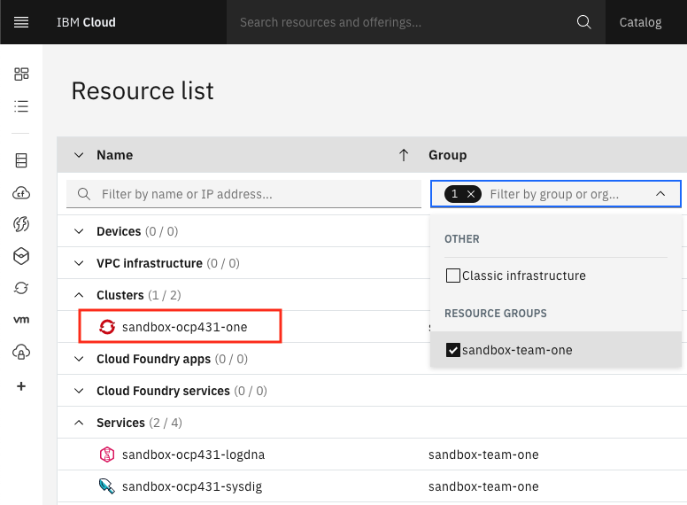
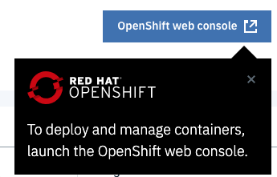
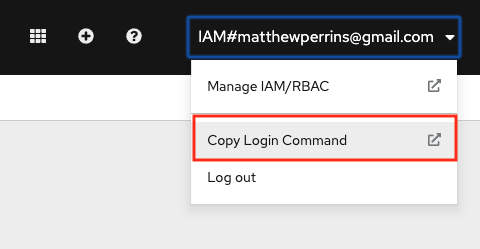
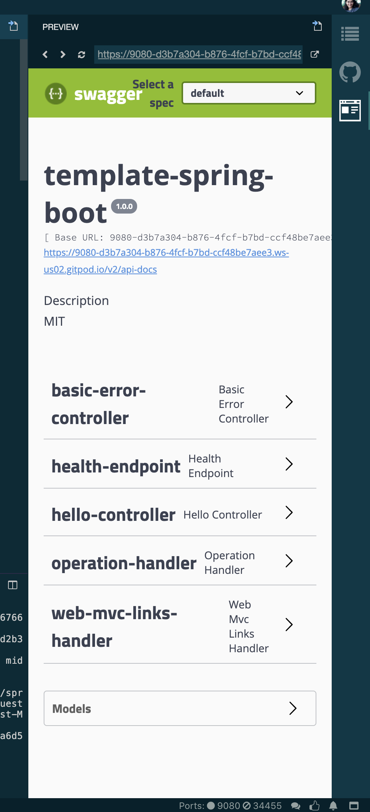
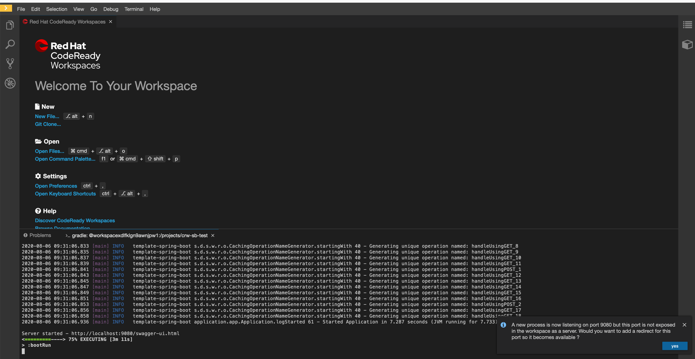
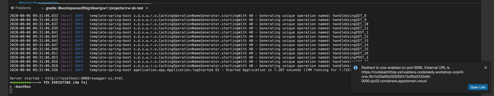
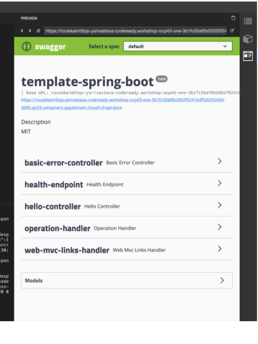
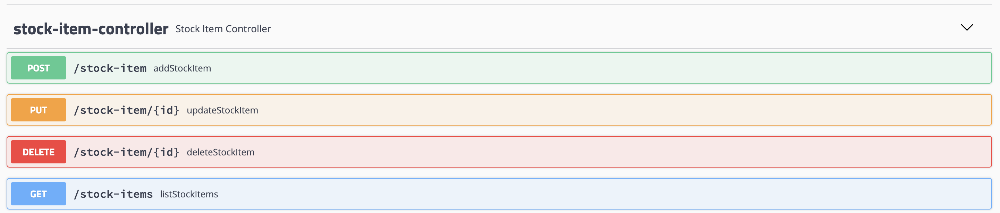

**Develop and deploy the backend component of the inventory application**

<!--- cSpell:ignore ICPA openshiftconsole Theia userid toolset crwexposeservice gradlew bluemix ocinstall Mico crwopenlink crwopenapp swaggerui gitpat gituser  buildconfig yourproject wireframe devenvsetup viewapp crwopenlink  atemplatized rtifactoryurlsetup Kata Koda configmap Katacoda checksetup cndp katacoda checksetup Linespace igccli regcred REPLACEME Tavis pipelinerun openshiftcluster invokecloudshell cloudnative sampleapp bwoolf hotspots multicloud pipelinerun Sricharan taskrun Vadapalli Rossel REPLACEME cloudnativesampleapp artifactoryuntar untar Hotspot devtoolsservices Piyum Zonooz Farr Kamal Arora Laszewski  Roadmap roadmap Istio Packt buildpacks automatable ksonnet jsonnet targetport podsiks SIGTERM SIGKILL minikube apiserver multitenant kubelet multizone Burstable checksetup handson  stockbffnode codepatterns devenvsetup newwindow preconfigured cloudantcredentials apikey Indexyaml classname  errorcondition tektonpipeline gradlew gitsecret viewapp cloudantgitpodscreen crwopenlink cdply crwopenapp -->

## Setup

### Setup your cloud shell

- Open the IBM Cloud console (cloud.ibm.com) in your browser and log in if needed.

- Invoke Cloud Shell by clicking on the button at the top, right-hand corner of the browser window.

  

We have provided a simplified installer that will install tools and configure the shell environment. The installer will first check if the required tool is available in the path. If not, the missing tool(s) will be installed into the `bin/` folder of the current user's home directory and the `PATH` variable will be updated in the `.bashrc` or `.zshrc` file to include that directory.

The following tools are included in the shell installer:  

- IBM Cloud cli (ibmcloud)
- ArgoCD cli (argocd)
- Tekton cli (tkn)
- IBM Cloud fast switching (icc)
- kube-ps1 prompt
- OpenShift cli (oc)
- Kubernetes cli (kubectl)
- JSON cli (jq)
- IBM Garage Cloud CLI (igc)  

---

1. Set up the shell environment by running:
  ```shell
  curl -sL shell.cloudnativetoolkit.dev | sh -
  ```
  - **Note**: If successful, you should see something like the following:
   ```shell
   Downloading scripts: https://github.com/cloud-native-toolkit/cloud-shell-commands/releases/download/0.6.1/assets.tar.gz
   ** Installing argocd cli
   ** Installing tkn cli
   ** Installing kube-ps1
   ** Installing icc
   ** Installing Cloud-Native Toolkit cli
   ```
2. The installer updates PATH in the `.zshrc` or `.bashrc` file. You will need to source the file to apply the update to the current shell environment:
  ```shell
  if [[ "${SHELL}" =~ zsh ]]; then
    source ~/.zshrc
  else
    source ~/.bashrc
  fi
  ```
3. You can check the shell was installed correctly by checking the `oc` version:
   ```shell
   oc sync --version
   ```

    - Log in to OpenShift Cluster from the cloud console.Go to Resource List and click on the cluster:
      

    - Access the OpenShift console from within that console by clicking on the button.
      

    - In OpenShift Console, click on email address top right, Click on Copy Login Command and get the OpenShift login command, which includes a token.

      

    - click on Display Token, copy the Login with the token. oc login command will log you in. Run the login command in the cloud shell terminal:

      ```bash
      $ oc login --token=qvARHflZDlOYfjJZRJUEs53Yfy4F8aa6_L3ezoagQFM --server=https://c103-e.us-south.containers.cloud.ibm.com:30979
      Logged into "https://c103-e.us-south.containers.cloud.ibm.com:30979" as "IAM#email@company" using the token provided.

      You have access to 71 projects, the list has been suppressed. You can list all projects with 'oc projects'

      Using project "dev-ab".
      ```

Create the initial project and register it with a pipeline for automated builds.

- Create a new repository from the [Spring Boot Microservice](https://github.com/IBM/template-java-spring/generate) template. Make the cloned repository public.

  You can also access this template on the Code Patterns page in the [Developer Dashboard](/developer-intermediate/deploy-app/#3.-open-the-developer-dashboard).

!!! warning
    If you are developing on a shared education cluster, place the repository in the **Git Organization** listed in your notification email and remember to add your initials as a suffix to the app name.

  In order to prevent naming collisions, name the repository `inventory-management-svc-{your initials}`, replacing
  `{your initials}` with your actual initials.

- Clone the new repository to your machine

  ```
  git clone https://github.com/ibm-workshop-team-one/inventory-svc-{your initials}.git
  ```

- Go into the repository directory cloned and execute the following

  ```
  oc sync dev-{your initials} 
  ```

- Register the pipeline [register the pipeline](/developer-intermediate/deploy-app#register-the-app-in-a-devops-pipeline)

  ```
  oc pipeline --tekton
  ```

  replacing `{your initials}` with your actual initials

- Give git credentials if prompted, and master as the git branch to use. When prompted for the pipeline, select `ibm-java-gradle`

  ```bash
  $ oc pipeline --tekton
  Creating pipeline on openshift cluster in dev-ar namespace
  Retrieving git parameters
    Project git repo: https://github.com/aminerachyd/inventory-management-svc-ar.git
  ? Provide the git username: aminerachyd
  ? Provide the git password or personal access token: [hidden]
    Branch: main
  Retrieving available template pipelines from tools
  Pipeline templates filtered based on detected runtime: openjdk/gradle
  ? Select the Pipeline to use in the PipelineRun: ibm-java-gradle
  ? scan-image: Enable the pipeline to scan the image for vulnerabilities? Yes
  ? health-endpoint: Endpoint to check health after deployment, liberty uses / not /health? /health
  ? lint-dockerfile: Enable the pipeline to lint the Dockerfile for best practices? Yes
  Copying tasks from tools....
  Copied Pipeline from tools/ibm-java-gradle to dev-ar/inventory-management-svc-ar
  Creating TriggerTemplate for pipeline: inventory-management-svc-ar
  Creating TriggerBinding for pipeline: inventory-management-svc-ar
  Creating/updating TriggerEventListener for pipeline: tekton
    Waiting for event listener rollout: dev-ar/el-tekton
    Creating/updating Route for pipeline: tekton
    Creating PipelineRun for pipeline: inventory-management-svc-ar
    Creating Github webhook for repo: https://github.com/aminerachyd/inventory-management-svc-ar.git
    Warning: Webhook already exists for this trigger in this repository.

    Pipeline run started: inventory-management-svc-ar-181f77c24a4
  ```

- [Open the pipeline](/developer-intermediate/deploy-app#view-your-application-pipeline) to see it running

- When the pipeline is completed, run `oc endpoints -n dev-{your initials}`. You should see an entry
  for the app we just pushed. Select the entry and hit `Enter` to launch the browser. If you are
  developing on code ready workspaces/cloud shell, copy the url and paste it in a new browser window.

- Run the service locally

  ```
  ./gradlew bootRun
  ```

  When the execution output says `Server started`, the app is running.

- Access the running service. This service runs on port 9080.

=== "Cloud Shell" 
    - To view the running app click on the **Eye Icon** on the top right and select the port `9080` this will open a browser tab and display the running app on that port.

      
=== "Gitpod" 
    - Once you run the application,gitpod gives the option to make the port "Public".Once you make the port Public, it gives you the option to "Open Preview" or "Open Browser".
    
      
    
    - Selecting "Open Preview" opens a window inside gitpod workspace tab.
    
      
    
    - Selecting "Open Browser" opens a new browser tab for accessing the URL.

=== "Code Ready Workspaces" 
    - Click on yes
      
    
    - Click on open link
      
    
    - To view this application in new tab click top right corner arrow icon
      

=== "Desktop/Laptop" 
    - Open a browser to [`http://localhost:9080/swagger-ui.html`](http://localhost:9080/swagger-ui.html){:target='blank'}
---

This will display the Swagger UI page that provides a user interface to exercise the APIs.

## Create initial components

Spring Boot uses annotations to configure the various components that will be injected into and
used by the applications. A class with the `@SpringBootApplication` annotation is the starting
point for the rest of the application components to be loaded. Additionally, a `@ComponentScan`
annotation can be added to tell the Spring infrastructure which packages should be scanned
for components.

We will start by creating the initial application component.

- Create a class named `Application` in the `com.ibm.inventory_management.app` package.

- Add the `@SpringBootApplication` and `@ComponentScan` annotation to the class. The `@ComponentScan`
  annotation should include `com.ibm.inventory_management.*`, `com.ibm.cloud_native_toolkit.*`, and `com.ibm.health`
  packages.

  ```java title="src/main/java/com/ibm/inventory_management/app/Application.java"
  package com.ibm.inventory_management.app;

  import org.springframework.beans.factory.annotation.Autowired;
  import org.springframework.boot.CommandLineRunner;
  import org.springframework.boot.SpringApplication;
  import org.springframework.boot.autoconfigure.SpringBootApplication;
  import org.springframework.boot.builder.SpringApplicationBuilder;
  import org.springframework.boot.web.servlet.support.SpringBootServletInitializer;
  import org.springframework.context.ApplicationContext;
  import org.springframework.context.annotation.Bean;
  import org.springframework.context.annotation.ComponentScan;
  import org.springframework.core.env.Environment;

  import springfox.documentation.swagger2.annotations.EnableSwagger2

  @SpringBootApplication
  @EnableSwagger2
  @ComponentScan({"com.ibm.inventory_management.*", "com.ibm.cloud_native_toolkit.*", "com.ibm.health"})
  public class Application extends SpringBootServletInitializer {
      @Autowired
      Environment environment;

      public static void main(String[] args) {
          SpringApplication.run(com.ibm.inventory_management.app.Application.class, args);
      }

      @Bean
      public CommandLineRunner commandLineRunner(ApplicationContext ctx) {
          return args -> {
              String port = environment.getProperty("local.server.port");

              System.out.println();
              System.out.println("Server started - http://localhost:" + port + "/swagger-ui.html");
          };
      }

      @Override
      protected SpringApplicationBuilder configure(SpringApplicationBuilder application) {
          return application.sources(Application.class);
      }
  }
  ```

- Delete `application.app`

  ```
   git rm -r src/main/java/application/
  ```

- Run the service locally. The swagger page should no longer contain the `/hello`
  API endpoint.

- Commit and push the changes to Git.

  ```bash
  git add .
  git commit -m "Adds Application and Removes default Application class"
  git push
  ```

### Add StockItem controller

In Spring Boot, the `@RestController` annotation tells the framework that the class provides a
REST interface. Additional annotations like `@GetMapping` are used to provide the specific configuration
for the REST service.

- Start the tests in tdd mode with `npm run tdd` (or `./gradlew test --continuous`)

- Add a StockItemControllerTest.java in `com.ibm.inventory_management.controllers` under the `test` folder

  ```java title="src/test/java/com/ibm/inventory_management/controllers/StockItemControllerTest.java"
  package com.ibm.inventory_management.controllers;

  import org.junit.jupiter.api.DisplayName;

  @DisplayName("StockItemController")
  public class StockItemControllerTest {
  }
  ```

- Add the MockMvc infrastructure and create the `StockItemController`

  ```java title="src/test/java/com/ibm/inventory_management/controllers/StockItemControllerTest.java"
  package com.ibm.inventory_management.controllers;

  import static org.mockito.Mockito.spy;

  import org.junit.jupiter.api.BeforeEach;
  import org.junit.jupiter.api.DisplayName;
  import org.springframework.test.web.servlet.MockMvc;
  import org.springframework.test.web.servlet.setup.MockMvcBuilders;

  @DisplayName("StockItemController")
  public class StockItemControllerTest {
  StockItemController controller;

  MockMvc mockMvc;

  @BeforeEach
  public void setup() {
      controller = spy(new StockItemController());

      mockMvc = MockMvcBuilders.standaloneSetup(controller).build();
    }
  }
  ```


  ```java title="src/main/java/com/ibm/inventory_management/controllers/StockItemController.java"
   package com.ibm.inventory_management.controllers;

   public class StockItemController {
   }
  ```

- Add the tests for the controller behavior and make the corresponding changes to make the tests pass

  ```java title="src/test/java/com/ibm/inventory_management/controllers/StockItemControllerTest.java"
  package com.ibm.inventory_management.controllers;

  import static org.mockito.Mockito.spy;
  import static org.springframework.test.web.servlet.request.MockMvcRequestBuilders.get;
  import static org.springframework.test.web.servlet.result.MockMvcResultMatchers.content;
  import static org.springframework.test.web.servlet.result.MockMvcResultMatchers.status;

  import org.junit.jupiter.api.BeforeEach;
  import org.junit.jupiter.api.DisplayName;
  import org.junit.jupiter.api.Nested;
  import org.junit.jupiter.api.Test;
  import org.springframework.test.web.servlet.MockMvc;
  import org.springframework.test.web.servlet.setup.MockMvcBuilders;

  @DisplayName("StockItemController")
  public class StockItemControllerTest {
    StockItemController controller;

    MockMvc mockMvc;

    @BeforeEach
    public void setup() {
        controller = spy(new StockItemController());

        mockMvc = MockMvcBuilders.standaloneSetup(controller).build();
    }

    @Nested
    @DisplayName("Given [GET] /stock-items")
    public class GivenGetStockItems {

        @Test
        @DisplayName("When called then it should return a 200 status")
        public void when_called_should_return_200_status() throws Exception {

            mockMvc.perform(get("/stock-items"))
                    .andExpect(status().isOk());
        }

        @Test
        @DisplayName("When called then it should return an empty array")
        public void when_called_then_return_an_empty_array() throws Exception {

            mockMvc.perform(get("/stock-items").accept("application/json"))
                    .andExpect(content().json("[]"));
        }
    }
  }
  ```

  ```java title="src/main/java/com/ibm/inventory_management/controllers/StockItemController.java"
  package com.ibm.inventory_management.controllers;

  import java.util.ArrayList;
  import java.util.List;

  import org.springframework.web.bind.annotation.GetMapping;
  import org.springframework.web.bind.annotation.RestController;

  @RestController
    public class StockItemController {

    @GetMapping(path = "/stock-items", produces = "application/json")
    public List listStockItems() {
     return new ArrayList();
    }
  }
  ```

- Start the local server

  ```bash
  ./gradlew bootRun
  ```

=== "Cloud Shell"
    - To view the running app click on the **Eye Icon** on the top right and select the port `9080` this will open a browser tab and display the running app on that port.

      
=== "Gitpod"
    - Once you run the application,gitpod gives the option to make the port "Public".Once you make the port Public, it gives you the option to "Open Preview" or "Open Browser".
    
      
    - Selecting "Open Preview" opens a window inside gitpod workspace tab.
    
      
    - Selecting "Open Browser" opens a new browser tab for accessing the URL.
=== "Code Ready Workspaces"
    - Click on yes
      
    
    - Click on open link
      
    
    - To view this application in new tab click top right corner arrow icon
      
=== "Desktop/Laptop"
    - When the server starts, open a browser to `http://localhost:9080/swagger-ui.html` to view the swagger documentation. You should see the stock item entry in the list
---
- Commit and push the changes to Git.

  ```bash
  git add .
  git commit -m "Adds StockItemController"
  git push
  ```

### Add a service for providing results

An established pattern for REST services in Spring Boot is to keep the REST controller logic simple
and focused on translating from REST protocols to Javascript. The business logic for the components
should be placed in a component that is given a `@Service` annotation.

- Update the controller test to include returning data from the service

  ```java title="src/test/java/com/ibm/inventory_management/controllers/StockItemControllerTest.java"
  package com.ibm.inventory_management.controllers;

  import static org.mockito.Mockito.mock;
  import static org.mockito.Mockito.spy;
  import static org.mockito.Mockito.when;
  import static org.springframework.test.web.servlet.request.MockMvcRequestBuilders.get;
  import static org.springframework.test.web.servlet.result.MockMvcResultMatchers.content;
  import static org.springframework.test.web.servlet.result.MockMvcResultMatchers.status;

  import java.util.Arrays;
  import java.util.List;

  import org.junit.jupiter.api.BeforeEach;
  import org.junit.jupiter.api.DisplayName;
  import org.junit.jupiter.api.Nested;
  import org.junit.jupiter.api.Test;
  import org.springframework.test.web.servlet.MockMvc;
  import org.springframework.test.web.servlet.setup.MockMvcBuilders;

  import com.ibm.inventory_management.models.StockItem;
  import com.ibm.inventory_management.services.StockItemApi;

  @DisplayName("StockItemController")
  public class StockItemControllerTest {
   StockItemController controller;
   StockItemApi service;

   MockMvc mockMvc;

   @BeforeEach
   public void setup() {
       service = mock(StockItemApi.class);

       controller = spy(new StockItemController(service));

       mockMvc = MockMvcBuilders.standaloneSetup(controller).build();
   }

   @Nested
   @DisplayName("Given [GET] /stock-items")
   public class GivenGetStockItems {

       @Test
       @DisplayName("When called then it should return a 200 status")
       public void when_called_should_return_200_status() throws Exception {

           mockMvc.perform(get("/stock-items"))
                   .andExpect(status().isOk());
       }

       @Test
       @DisplayName("When called then it should return an empty array")
       public void when_called_then_return_an_empty_array() throws Exception {

           mockMvc.perform(get("/stock-items").accept("application/json"))
                   .andExpect(content().json("[]"));
       }

       @Test
       @DisplayName("When called then it should return the results of the StockItemService")
       public void when_called_then_return_the_results_of_the_stockitemservice() throws Exception {

           final List<StockItem> expectedResult = Arrays.asList(new StockItem());
           when(service.listStockItems()).thenReturn(expectedResult);

           mockMvc.perform(get("/stock-items").accept("application/json"))
                   .andExpect(content().json("[{}]"));
       }
     }
   }
  ```

  ```java title="src/main/java/com/ibm/inventory_management/models/StockItem.java"
  package com.ibm.inventory_management.models;

  import java.io.Serializable;

  public class StockItem implements Serializable {
    private String name;

    public String getName() {
       return name;
    }
    public void setName(String name) {
       this.name = name;
    }
    public StockItem withName(String name) {
       this.setName(name);
       return this;
    }
  }
  ```

  ```java title="src/main/java/com/ibm/inventory_management/services/StockItemApi.java"
  package com.ibm.inventory_management.services;

  import java.util.List;

  import com.ibm.inventory_management.models.StockItem;

  public interface StockItemApi {
       List<StockItem> listStockItems();
  }
  ```

  ```java title="src/main/java/com/ibm/inventory_management/controllers/StockItemController.java"
  package com.ibm.inventory_management.controllers;

  import java.util.List;

  import org.springframework.web.bind.annotation.GetMapping;
  import org.springframework.web.bind.annotation.RestController;

  import com.ibm.inventory_management.models.StockItem;
  import com.ibm.inventory_management.services.StockItemApi;

  @RestController
  public class StockItemController {

    private final StockItemApi service;

    public StockItemController(StockItemApi service) {
      this.service = service;
    }

      @GetMapping(path = "/stock-items", produces = "application/json")
    public List<StockItem> listStockItems() {
      return this.service.listStockItems();
    }
  }
  ```

- At this points the tests should pass even though we haven't provided an implementation of the service yet since we are
  creating a mocking the service in the unit test

- Update the `StockItem` model to include the remaining fields

  ```java title="src/main/java/com/ibm/inventory_management/models/StockItem.java"
  package com.ibm.inventory_management.models;

  import java.io.Serializable;

  public class StockItem implements Serializable {
    private String name;
    private String id = null;
    private int stock = 0;
    private double price = 0.0;
    private String manufacturer = "";

    public StockItem() {
       super();
    }
    public StockItem(String id) {
       this.id = id;
    }

    public String getName() {
        return name;
    }
    public void setName(String name) {
        this.name = name;
    }
    public StockItem withName(String name) {
        this.setName(name);
        return this;
    }

    public String getId() {
        return id;
    }

    public void setId(String id) {
        this.id = id;
    }

    public StockItem withId(String id) {
        this.setId(id);
        return this;
    }

    public int getStock() {
        return stock;
    }

    public void setStock(int stock) {
        this.stock = stock;
    }

    public StockItem withStock(int stock) {
        this.setStock(stock);
        return this;
    }

    public double getPrice() {
        return price;
    }

    public void setPrice(double price) {
        this.price = price;
    }

    public StockItem withPrice(double price) {
        this.setPrice(price);
        return this;
    }

    public String getManufacturer() {
        return manufacturer;
    }

    public void setManufacturer(String manufacturer) {
        this.manufacturer = manufacturer;
    }

    public StockItem withManufacturer(String manufacturer) {
        this.setManufacturer(manufacturer);
        return this;
    }
  }
  ```

- Provide an implementation of the service that just returns a couple of hard-coded data values, for now. Services are
  denoted in Spring Boot with the `@Service` annotation

  ```java title="src/main/java/com/ibm/inventory_management/services/StockItemService.java"
  package com.ibm.inventory_management.services;

  import static java.util.Arrays.asList;

  import java.util.List;

  import org.springframework.context.annotation.Primary;
  import org.springframework.stereotype.Service;

  import com.ibm.inventory_management.models.StockItem;

  @Service
  public class StockItemService implements StockItemApi {
    @Override
    public List<StockItem> listStockItems() {
        return asList(
                new StockItem("1")
                        .withName("Item 1")
                        .withStock(100)
                        .withPrice(10.5)
                        .withManufacturer("Sony"),
                new StockItem("2")
                        .withName("Item 2")
                        .withStock(150)
                        .withPrice(100.0)
                        .withManufacturer("Insignia"),
                new StockItem("3")
                        .withName("Item 3")
                        .withStock(10)
                        .withPrice(1000.0)
                        .withManufacturer("Panasonic")
        );
    }
  }
  ```

- Replace the `api()` method in the SwaggerDocket class to restrict the swagger page to only show the `/stock-items` API

  ```java title="src/main/java/com/ibm/cloud_native_toolkit/swagger/SwaggerDocket.java"
  @Bean
  public Docket api() {
    return new Docket(DocumentationType.SWAGGER_2)
            .select()
            .apis(buildApiRequestHandler()::test)
            .paths(PathSelectors.regex(".*stock-item.*"))
            .build()
            .apiInfo(buildApiInfo());
  }
  ```

### Verify the service locally and push the changes

- Start the application

  ```bash
  ./gradlew bootRun
  ```

=== "Cloud Shell"
    - To view the running app click on the **Eye Icon** on the top right and select the port `9080` this will open a browser tab and display the running app on that port.
    
      


=== "Gitpod"

    - Once you run the application,gitpod gives the option to make the port "Public".Once you make the port Public, it gives you the option to "Open Preview" or "Open Browser".
    
      
    
    - Selecting "Open Preview" opens a window inside gitpod workspace tab.
    
      
    
    - Selecting "Open Browser" opens a new browser tab for accessing the URL.

=== "Code Ready Workspaces"

    - Click on yes
      
    
    - Click on open link
      
    
    - To view this application in new tab click top right corner arrow icon
      

=== "Desktop/Laptop"
    - Open a browser to `http://localhost:9080/swagger-ui.html`
---

- Run the service by selecting `Try it out` then `Execute`

- You should see the data we defined in the service in the previous section

- Commit and push the changes to git

  ```bash
     git add .
     git commit -m "Adds StockItem service implementation"
     git push
  ```

- The pipeline should kick off and you will be able to see the running service by running `oc endpoints -n dev-{initials}` and selecting the route of your service

## Complete CRUD operations
### Add POST, PUT and DELETE routes
- Update the `StockItemApi.java` interface to support the other CRUD operations
  ```java title="src/main/java/com/ibm/inventory_management/services/StockItemApi.java"
     package com.ibm.inventory_management.services;

     import java.util.List;

     import com.ibm.inventory_management.models.StockItem;

     public interface StockItemApi {
       List<StockItem> listStockItems();

       void updateStockItem(String id);

       void addStockItem(String id);

       void deleteStockItem(String id);
     }
  ```
- Update the `StockItemService.java` class to implement the methods of the interface
  ```java title="src/main/java/com/ibm/inventory_management/services/StockItemService.java"
  package com.ibm.inventory_management.services;
  
  import static java.util.Arrays.asList;
  
  import java.util.ArrayList;
  import java.util.List;
  import java.util.stream.Collectors;
  
  import org.springframework.stereotype.Service;
  
  import com.ibm.inventory_management.models.StockItem;
  
  @Service
  public class StockItemService implements StockItemApi {
      static int id = 0;
      static List<StockItem> stockItems = new ArrayList<>(asList(
              new StockItem(++id+"")
                      .withName("Item 1")
                      .withStock(100)
                      .withPrice(10.5)
                      .withManufacturer("Sony"),
              new StockItem(++id+"")
                      .withName("Item 2")
                      .withStock(150)
                      .withPrice(100.5)
                      .withManufacturer("Insignia"),
              new StockItem(++id+"")
                      .withName("Item 3")
                      .withStock(10)
                      .withPrice(1000.0)
                      .withManufacturer("Panasonic")
      ));
  
      @Override
      public List<StockItem> listStockItems() {
        return this.stockItems;
      }
  
      @Override
      public void addStockItem(String name, String manufacturer, double price, int stock) {
          this.stockItems.add(new StockItem(++id+"")
                  .withName(name)
                  .withStock(stock)
                  .withPrice(price)
                  .withManufacturer(manufacturer)
          );
      }
  
      @Override
      public void updateStockItem(String id, String name, String manufacturer, double price, int stock) {
         StockItem itemToUpdate = this.stockItems.stream().filter(stockItem -> stockItem.getId().equals(id)).findFirst().orElse(null);
  
         if(itemToUpdate == null) {
             System.out.println("Item not found");
             return;
         }
  
         itemToUpdate.setName(name !=null ? name : itemToUpdate.getName());
         itemToUpdate.setManufacturer(manufacturer != null ? manufacturer : itemToUpdate.getManufacturer());
         itemToUpdate.setPrice(Double.valueOf(price) != null ? price : itemToUpdate.getPrice());
         itemToUpdate.setStock(Integer.valueOf(stock) != null ? stock : itemToUpdate.getStock());
      }
  
      @Override
      public void deleteStockItem(String id) {
          this.stockItems = this.stockItems.stream().filter((stockItem)-> !stockItem.getId().equals(id)).collect(Collectors.toList());
      }
  }
  ```
- Update the `StockItemController.java` class to provide the additional routes
  ```java title="src/main/java/com/ibm/inventory_management/services/StockItemController.java"
  package com.ibm.inventory_management.controllers;
  
  import java.util.List;
  
  import org.springframework.web.bind.annotation.*;
  
  import com.ibm.inventory_management.models.StockItem;
  import com.ibm.inventory_management.services.StockItemApi;
  
  @RestController
  public class StockItemController {
  
    private final StockItemApi service;
  
    public StockItemController(StockItemApi service) {
      this.service = service;
    }
  
    @GetMapping(path = "/stock-items", produces = "application/json")
    public List<StockItem> listStockItems() {
      return this.service.listStockItems();
    }
  
    @PostMapping(path = "/stock-item")
    public void addStockItem(@RequestParam String name, @RequestParam String manufacturer, @RequestParam float price, @RequestParam int stock) {
      this.service.addStockItem(name,manufacturer,price,stock);
    }
  
    @PutMapping(path = "/stock-item/{id}")
    public void updateStockItem(@PathVariable("id") String id, @RequestParam String name, @RequestParam String manufacturer, @RequestParam float price, @RequestParam int stock) {
      this.service.updateStockItem(id,name,manufacturer,price,stock);
    }
  
    @DeleteMapping(path = "/stock-item/{id}")
    public void deleteStockItem(@PathVariable("id") String id){
      this.service.deleteStockItem(id);
    }
  }
  ```
### Verify the changes locally and push the changes

- Start the application

  ```bash
  ./gradlew bootRun
  ```

  You should see new routes on the Swagger UI.
  

- Commit and push the changes to Git to trigger build pipeline on your OpenShift cluster.

  ```bash
  git add .
  git commit -m "Added CRUD operations"
  git push
  ```
