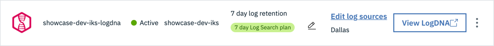
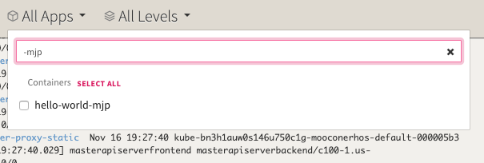
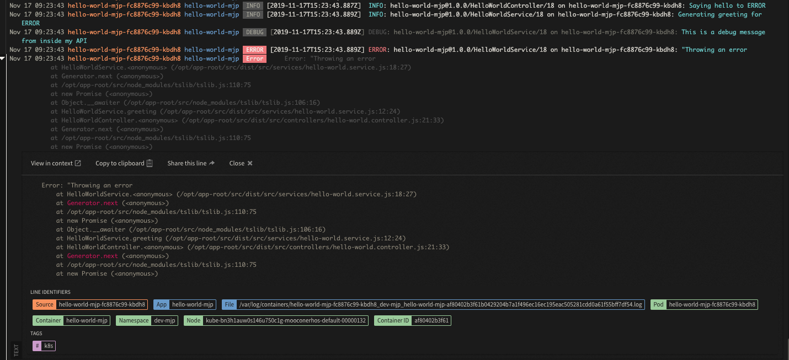

In IBM Garage Method, one of the Operate practices is to [automate application monitoring](https://www.ibm.com/garage/method/practices/manage/practice_automated_monitoring/), including logging. Imagine your application isn't working right in production even though the environment is fine. What information would you want in your logs to help you figure out what's wrong with your application? Build logging messages for that information into your application.

Given that your application is logging, as are lots of other applications and services in your cloud environment, these logs need to be managed and made accessible. LogDNA adds log management capabilities to a Kubernetes cluster and its deployments. The <Globals name="env" /> includes an IBM Log Analysis with LogDNA service instance configured with a LogDNA agent installed in the environment's cluster. Simply by deploying your application into the <Globals name="env" />, LogDNA collects the logs.

- Open the LogDNA web UI by navigating to the OpenShift web console and click on 9 squares icon. It gives a list of the developer tools.
- Select LogDNA and navigate to the UI as shown below

## LogDNA log management

[IBM Log Analysis with LogDNA](https://cloud.ibm.com/docs/services/Log-Analysis-with-LogDNA) explains how to configure and use an instance of the LogDNA service, but the <Globals name="env" /> has already done this for you. You can skip these steps about provisioning an instance, installing an agent, and user access.

### LogDNA dashboard

Open the LogDNA web UI for your environment's cluster
- [IBM Log Analysis with LogDNA: Viewing logs](https://cloud.ibm.com/docs/log-analysis?topic=log-analysis-getting-started#getting-started_step4)
explains how to open the web UI
- In the IBM Cloud dashboard, navigate to **Observability** > **Logging**
- Find the logging instance named after your environment's cluster, such as `showcase-dev-iks-logdna`. To help find it,
you can filter by your resource group.
    
- In the logging instance, press the **View LogDNA** button to open the LogDNA web UI

## Give it a try

Before you begin to look at your application logs, make sure you have [deployed an app](/developer-intermediate/deploy-app) into your development cluster. Each of the template apps has a logging framework included, this _Give it a Try_ will use [template-node-typescript](https://github.com/IBM/template-node-typescript) as an example.

The **LogDNA** service is already created, bound and configured to listen to logs from your development cluster.

- Open the LogDNA instance that is named the same as your development cluster
- Click on **All Apps** and enter the name of your app, or, to narrow the app selection, use the suffix that you used to create it

- Select the app you want to monitor

- You will now see just the logs for your app

- Open up the **LogDNA** console and narrow the logs to just your app

- Open the app into a browser: Run `oc endpoints -n {your namespace}` and select your running app
- Switch to `HTTPS` and test the `/hello/{name}` API and pass in some data. You have introduced a `DEBUG` message and an `ERROR` into this API logic. Click the **Execute** button a few times to simulate some API calls.
- Try the API with your own name, and you will see just the `DEBUG` message appearing
- Try the API with `ERROR` as the name , and this will trigger the error code we put in the API service

- You will see the errors appearing in **LogDNA** triggered by your application

- Try scaling your pods for the app and calling the API again. Watch the logs and see where the API call is being routed and which pod is triggering the error

### Learn more

Learn more about using LogDNA:
<AnchorLinks>
  <AnchorLink to="https://docs.logdna.com/docs/filters">More information on using LogDNA log filtering</AnchorLink>
  <AnchorLink to="https://docs.logdna.com/docs/time">Understand how to jump to a specific timeframe</AnchorLink>
</AnchorLinks>

## Conclusion

It's important to be able to manage the logs of your deployed applications to help identify issues and quickly understand how to resolve them. The Developer Tools configures LogDNA directly to your development cluster to make it easy to get the log data you need as a developer. Just deploy your application into your <Globals name="env" /> and its logs start appearing automatically, open the LogDNA web UI and browse your logs.
