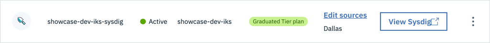
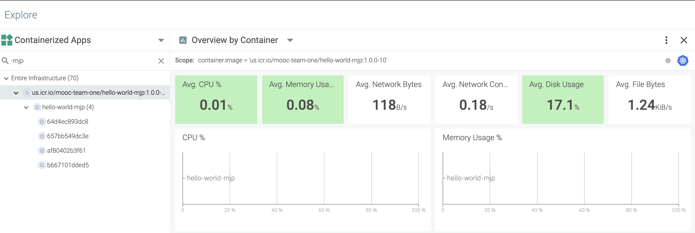

<!--- cSpell:ignore appview ICPA openshiftconsole Theia userid toolset crwexposeservice gradlew bluemix ocinstall Mico crwopenlink crwopenapp swaggerui gitpat gituser  buildconfig yourproject wireframe devenvsetup viewapp crwopenlink  atemplatized rtifactoryurlsetup Kata Koda configmap Katacoda checksetup cndp katacoda checksetup Linespace igccli regcred REPLACEME Tavis pipelinerun openshiftcluster invokecloudshell cloudnative sampleapp bwoolf hotspots multicloud pipelinerun Sricharan taskrun Vadapalli Rossel REPLACEME cloudnativesampleapp artifactoryuntar untar Hotspot devtoolsservices Piyum Zonooz Farr Kamal Arora Laszewski  Roadmap roadmap Istio Packt buildpacks automatable ksonnet jsonnet targetport podsiks SIGTERM SIGKILL minikube apiserver multitenant kubelet multizone Burstable checksetup handson  stockbffnode codepatterns devenvsetup newwindow preconfigured cloudantcredentials apikey Indexyaml classname  errorcondition tektonpipeline gradlew gitsecret viewapp cloudantgitpodscreen crwopenlink cdply crwopenapp -->

!!! Warning
  *Note* Only study this section if you are development on an OpenShift Development environment that is managed on IBM Cloud. If you are on AWS or Azure go to the [OpenShift Monitoring](../ocp-monitoring/) content

In IBM Garage Method, one of the Operate practices is to [automate application monitoring](https://www.ibm.com/garage/method/practices/manage/practice_automated_monitoring/). Sysdig automates application monitoring, enabling an operator to view stats and collect metrics about a Kubernetes cluster and its deployments. 
The <Globals name="env" /> includes an IBM Cloud Monitoring with Sysdig service instance configured with a Sysdig agent installed in the environment's cluster. Simply by deploying your application into the <Globals name="env" />, Sysdig monitors it. 

- Open the Sysdig web UI by navigating to the OpenShift web console and click on 9 squares icon. It gives a list of the developer tools.
- Select SysDig and navigate to SysDig UI.

## Sysdig Monitoring

[IBM Cloud Monitoring with Sysdig](https://cloud.ibm.com/docs/services/Monitoring-with-Sysdig) explains how to configure and use an instance of the Sysdig service, but the <Globals name="env" /> has already done most of this for you. You can skip steps 1-3 about user access, provisioning an instance, and installing an agent.

### Sysdig dashboard

Open the Sysdig web UI for your environment's cluster
- [Step 4: Launch the web UI](https://cloud.ibm.com/docs/monitoring?topic=monitoring-getting-started#getting-started-step5) explains how to open the web UI
    - In the IBM Cloud dashboard, navigate to **Observability** > **Monitoring**
    - Find the monitoring instance named after your environment's cluster, such as `showcase-dev-iks-sysdig`
    
    - In the monitoring instance, press the **View Sysdig** button to open the Sysdig web UI

### Explore your application

By default, the Sysdig dashboard opens the **Explore** page on its **Deployments and Pods** grouping.

- Select your cluster

By default, Sysdig opens its **Overview by Process** dashboard, which has panels showing stats about CPU, memory, and networking.
This is one of Sysdig's **Default Dashboards** (i.e. built-in dashboards).

These are the cumulative totals for all of the pods running in the cluster. Hover over a graph and a key pops up to list
the pods and show each one's color.

- Expand your cluster and namespace, then select your deployment

This shows the stats for just the pods in your deployment.

On the **Dashboard** page, you can create your own custom dashboards.

[Step 5: Monitor your environment](https://cloud.ibm.com/docs/monitoring?topic=monitoring-getting-started#getting-started-step6)
of the Getting started tutorial gives some instructions on monitoring, managing, and what to do next.

## Give it a try

Before you begin to monitor your application instances, make sure that you have [deployed an app](../deploy-app/) into your development cluster. This _Give it a Try_ uses [template-node-typescript](https://github.com/IBM/template-node-typescript) as an example.

The **SysDig** service is already created, bound and configured to listen to monitoring metrics and events for your development cluster. You can see this in the HTTP overview.

- Open the **SysDig** instance that is named the same as your development cluster.
- Go to **Dashboards** > **Default Dashboards** > **Applications** > **HTTP**

The dashboard shows stats for all incoming HTTP requests for all apps in the cluster. Browse through these views to get a feel for what they're showing.

### View your app's metrics

Take a look at the metrics for your app.

- Select the **Explore** page in the left nav menu
- On the Explore page, select the **Containerized Apps** grouping
- Search for your app, e.g. `hello-world-mjp`
- In the list of apps, select yours, e.g. `us.icr.io/mooc-team-one/hello-world-mjp:1.0.0-10`
- With your app selected, select **Hosts & Containers** > **Overview by Container**

    The Overview by Container dashboard shows metrics for the containers in your app. You will now see just the metrics for your app. You can view at different levels--from pod to namespace to node to cluster--giving you a fine grain access to your monitoring requirements.

    

## Conclusion

It's important to be able to monitor your deployed applications.
Here, the <Globals name="env" /> uses Sysdig Monitoring, but you never had to install or run Sysdig.
Just deploy your application into the <Globals name="env" /> and it gets monitored automatically.
After deploying your application, open the Sysdig web UI and browse the status, including the status
of your cluster as a whole and your deployment in particular.

### Learn more

Learn more about using SysDig Monitoring:
