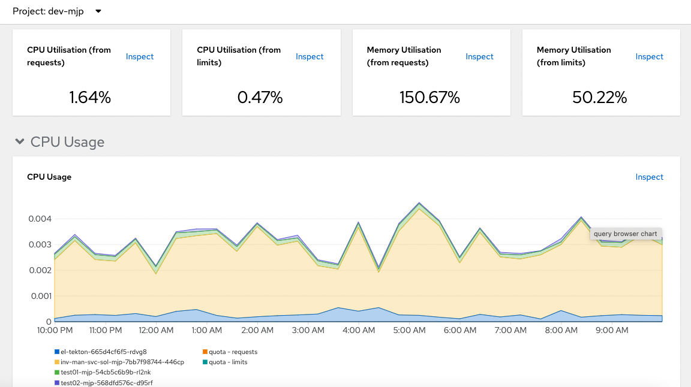
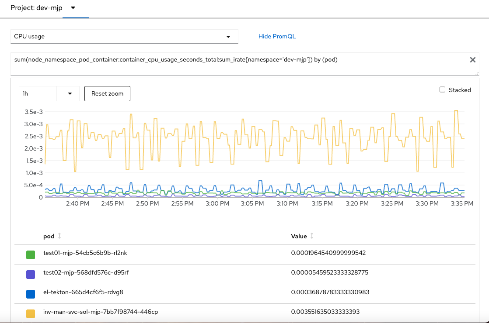

<!--- cSpell:ignore appview ICPA openshiftconsole Theia userid toolset crwexposeservice gradlew bluemix ocinstall Mico crwopenlink crwopenapp swaggerui gitpat gituser  buildconfig yourproject wireframe devenvsetup viewapp crwopenlink  atemplatized rtifactoryurlsetup Kata Koda configmap Katacoda checksetup cndp katacoda checksetup Linespace igccli regcred REPLACEME Tavis pipelinerun openshiftcluster invokecloudshell cloudnative sampleapp bwoolf hotspots multicloud pipelinerun Sricharan taskrun Vadapalli Rossel REPLACEME cloudnativesampleapp artifactoryuntar untar Hotspot devtoolsservices Piyum Zonooz Farr Kamal Arora Laszewski  Roadmap roadmap Istio Packt buildpacks automatable ksonnet jsonnet targetport podsiks SIGTERM SIGKILL minikube apiserver multitenant kubelet multizone Burstable checksetup handson  stockbffnode codepatterns devenvsetup newwindow preconfigured cloudantcredentials apikey Indexyaml classname  errorcondition tektonpipeline gradlew gitsecret viewapp cloudantgitpodscreen crwopenlink cdply crwopenapp -->

In IBM Garage Method, one of the Operate practices is to [automate application monitoring](https://www.ibm.com/garage/method/practices/manage/practice_automated_monitoring/). OpenShift has embedded monitoring built in to help you view your application monitoring events, enabling an operator to view stats and collect metrics about a Kubernetes cluster and its deployments. 

- Open the **Observe**  console view by navigating to the **Developer View** in OpenShift web console and click on **Observe** menu. 

## Observing Apps in OpenShift

In the Observe view you are able to see the following views:
  - Dashboard, giving a summary view of the monitoring events for you namespace
  - Metrics , allows you to dig deeper into the various collected mertics for your namespace
  - Alerts, will allow you to see any generated alerts from your applications
  - Events, will allow you to see common events by kubernetes type

### Observe dashboard

Open the **Observe** Dashboard in the OpenShift console.
  - Make sure you have select the project you are working in `dev-{mjp}`
  - Change the Time Range to _Last 12 Hours_ you should see your microservice metrics being displayed
  - Scroll down the Dashboard and you will see other important information like CPU Quota , Memory Usage and Current Network usage
  - 

### Explore metrics

You can drill into the detail behind the dashboard chats. You can look into the metrics for CPU, Memory and Network for the applications you have deployed in the namespace. 

- Click the drop-down to select CPU
- Click the time drop-down to select 1h mins
- Click Show PromSQL to show the underlying query being used to retrieve the data 

## Conclusion

It's important to be able to monitor your deployed applications.
Here, the OpenShift console includes an *Observe* view that helps you monitor your application metrics.
Just deploy your application into your project namespace/project, and it gets monitored automatically.
After deploying your application, open the *Observe* view from the OpenShift console and browse the status, including the status
of your cluster as a whole and your deployment in particular.

### Learn more

Learn more about using [OpenShift Observe Monitoring](https://docs.openshift.com/container-platform/4.10/monitoring/monitoring-overview.html) click this link
