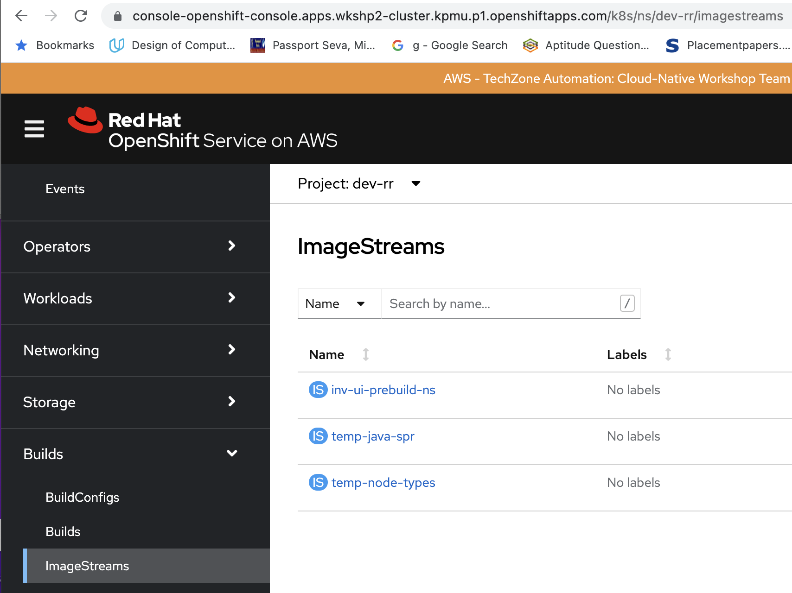

<!--- cSpell:ignore ICPA openshiftconsole vulnerabilty doesnot imageregaccess retreive Theia userid toolset crwexposeservice gradlew bluemix ocinstall Mico crwopenlink crwopenapp swaggerui gitpat gituser  buildconfig yourproject wireframe devenvsetup viewapp crwopenlink  atemplatized rtifactoryurlsetup Kata Koda configmap Katacoda checksetup cndp katacoda checksetup Linespace igccli regcred REPLACEME Tavis pipelinerun openshiftcluster invokecloudshell cloudnative sampleapp bwoolf hotspots multicloud pipelinerun Sricharan taskrun Vadapalli Rossel REPLACEME cloudnativesampleapp artifactoryuntar untar Hotspot devtoolsservices Piyum Zonooz Farr Kamal Arora Laszewski  Roadmap roadmap Istio Packt buildpacks automatable ksonnet jsonnet targetport podsiks SIGTERM SIGKILL minikube apiserver multitenant kubelet multizone Burstable checksetup handson  stockbffnode codepatterns devenvsetup newwindow preconfigured cloudantcredentials apikey Indexyaml classname  errorcondition tektonpipeline gradlew gitsecret viewapp cloudantgitpodscreen crwopenlink cdply crwopenapp -->

In IBM Garage Method, one of the Develop practices is to [automate continuous delivery through a delivery pipeline](https://www.ibm.com/garage/method/practices/deliver/practice_delivery_pipeline/), in part by using an artifact repository for storing output of the build stage. When hosted in IBM Cloud, the <Globals name="env" /> uses the IBM Cloud Container Registry for storing container images.

## Using the OpenShift Container Platform Registry 

Openshift Container Platform Registry is Openshift's built-in internal image registry. It provides an out-of-box solutions for the Openshift cluster users to store the images built as part of their workloads internally. The registry can be scaled up and down easily and doesnot need any specific infrastructure provisioning.It is integrated with the cluster authentication and authorization system.Hence, the access to create and retreive images is controlled by defining different user permissions on the image resources. 

## Accessing the OpenShift Container Platform Registry 

### Web UI
    
You can access the image registry by navigating to **Builds** from the left navigation tab and select **ImageStreams**. It will give you the view of the images of a particular project/namespace stored in registry

## Conclusion

  It is good to have an internal registry with Openshift to store the images of your workloads. But, the internal registry is confined to the given openshift cluster.Hence, it would be recommended to use an enterprise-grade image registry for production applications.
  Openshift provides Quay.io which is hosted as a registry on the cloud. It can be also installed as an operator in the openshift cluster and provides security features like vulnerabilty scanning.

    

