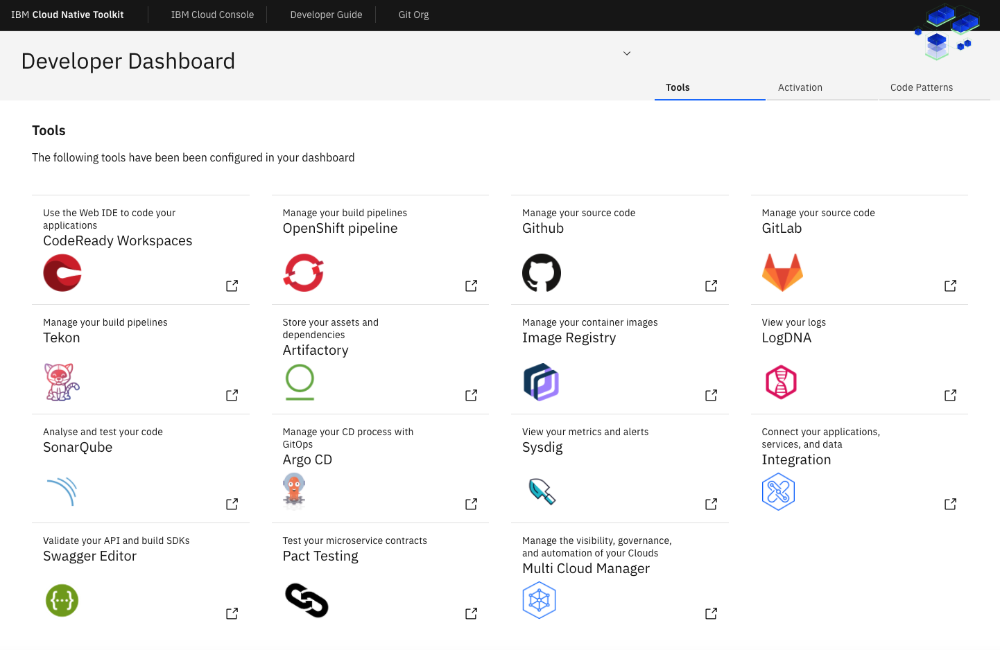

<!--- cSpell:ignore ICPA openshiftconsole Theia userid toolset crwexposeservice gradlew bluemix ocinstall Mico crwopenlink crwopenapp swaggerui gitpat gituser  buildconfig yourproject wireframe devenvsetup viewapp crwopenlink  atemplatized rtifactoryurlsetup Kata Koda configmap Katacoda checksetup cndp katacoda checksetup Linespace igccli regcred REPLACEME Tavis pipelinerun openshiftcluster invokecloudshell cloudnative sampleapp bwoolf hotspots multicloud pipelinerun Sricharan taskrun Vadapalli Rossel REPLACEME cloudnativesampleapp artifactoryuntar untar Hotspot devtoolsservices Piyum Zonooz Farr Kamal Arora Laszewski  Roadmap roadmap Istio Packt buildpacks automatable ksonnet jsonnet targetport podsiks SIGTERM SIGKILL minikube apiserver multitenant kubelet multizone Burstable checksetup handson  stockbffnode codepatterns devenvsetup newwindow preconfigured cloudantcredentials apikey Indexyaml classname  errorcondition tektonpipeline gradlew gitsecret viewapp cloudantgitpodscreen crwopenlink cdply crwopenapp -->

With the release of **<Globals name="ocp" />** it is now even easier for
 developers to integrate the DevSecOps tools into the OpenShift console. The
  common DevSecOps tools are integrated into the OpenShift console. This enables
   easy access to all the common tools a developer needs.

### Tools configured with OpenShift Console

When the <Globals name="shortName" /> was configured for your development
 cluster. The administrator can now configure a set of short cut links to
  common tools you often use as a developer.


### Access the tools URLs

- To list the ingress endpoints for all of the installed tools, use the [Developer Tools CLI](../getting-started/cli) to run the following command:
    ```bash
    igc endpoints -n tools
    ```

- This will return the ingress URLs for all of the tools installed in the Developer Tools cluster. You can then select the URL to open the tools' dashboard directly:
    ```bash
   ? Endpoints in the 'tools' namespace. Select an endpoint to launch the default browser or 'Exit'.

     1) Exit
     2) developer-dashboard - http://dashboard.garage-dev-ocp4-c-518489-0143c5dd31acd8e030a1d6e0ab1380e3-0000.us-east.containers.appdomain.cloud
     3) argocd-server - https://argocd-tools.gsi-learning-ocp4-clu-7ec5d722a0ab3f463fdc90eeb94dbc70-0001.eu-gb.containers.appdomain.cloud
     4) artifactory - https://artifactory-tools.gsi-learning-ocp4-clu-7ec5d722a0ab3f463fdc90eeb94dbc70-0001.eu-gb.containers.appdomain.cloud
     5) dashboard - https://dashboard-tools.gsi-learning-ocp4-clu-7ec5d722a0ab3f463fdc90eeb94dbc70-0001.eu-gb.containers.appdomain.cloud
     6) developer-dashboard - http://dashboard.garage-dev-ocp4-c-518489-0143c5dd31acd8e030a1d6e0ab1380e3-0000.us-east.containers.appdomain.cloud
   (Move up and down to reveal more choices)
     Answer:
    ```

### Credentials

In the future, the Dashboard tools will be linked using a single sign-on (SSO) service.
Meantime, the CLI includes a command to list the tools' credentials.

- To list the credentials for all of the installed tools, use the [Developer Tools CLI](../getting-started/cli) to run the following command:
    ```bash
    igc credentials
    ```
- The command lists the `userid` and `password` for each tool installed. You can use these credentials to log in to each one of the installed tools.
- More of the tools in <Globals name="ocp" /> will be integrated into the
 OpenShift console login process.

### Developer Dashboard

The Developer Dashboard is one of the tools running in your <Globals name="env" />. It is designed to help you navigate to the installed tools while providing a simple way to perform common developer tasks, such as:
- **Dashboard**: Navigate to the tools installed in the cluster.
- **Activation**: Links to educational resources to help you learn cloud-native development and deployment using IBM Cloud Kubernetes Service and Red Hat OpenShift on IBM Cloud.
- **<Globals name="templates" />**: Links to templates that will help accelerate your project.


