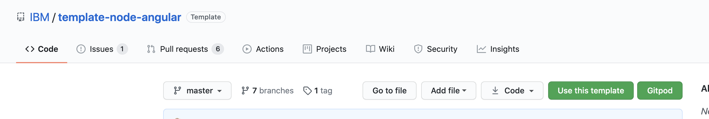
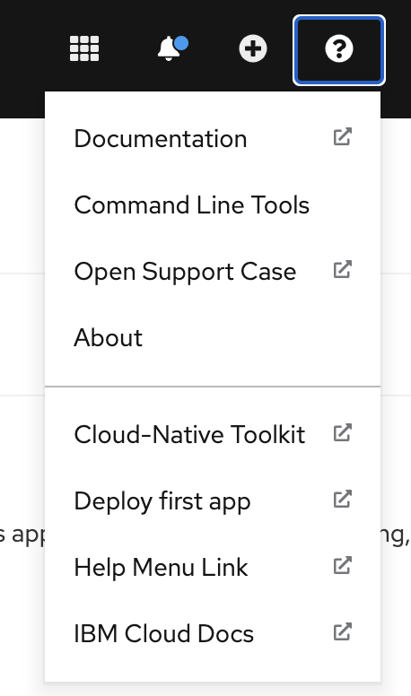
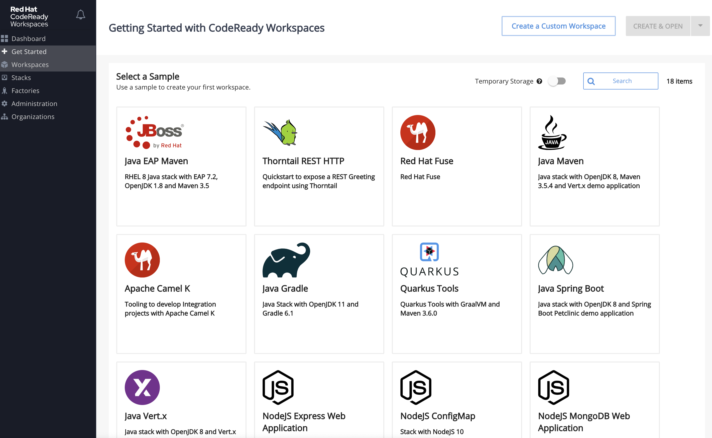
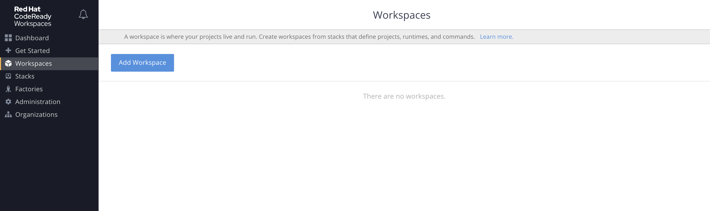
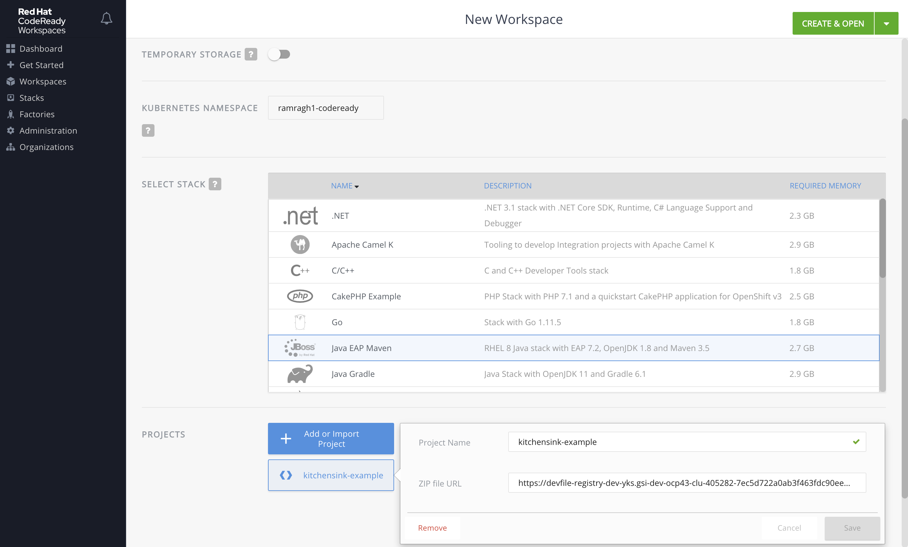
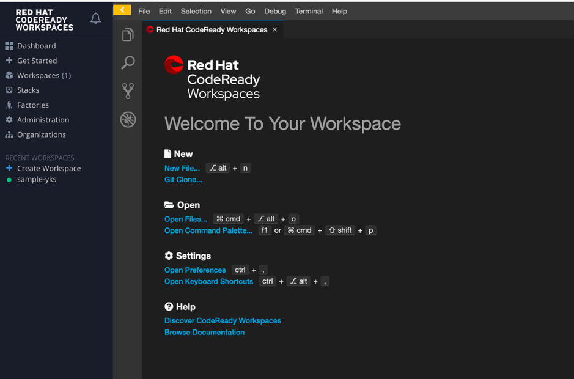
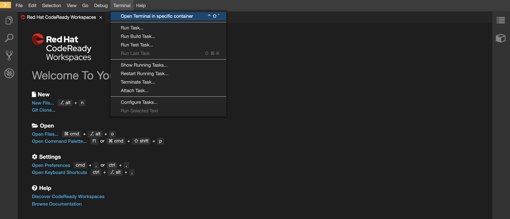

To enable the best working experience through the hands-on exercises, you
 need to select the environment you plan to use for development and the required tools for integration with IBM Cloud.

- If you plan to use your desktop/laptop for hands-on exercises, follow
 the instructions in the Desktop/Laptop tab. You will need a recent macOS or
  Windows 10 operating system for this option.
- If you cannot install tools on your desktop/laptop, follow the Cloud Shell
 instructions.
- If you want to try the full web IDE experience, then follow the Code Ready
 Workspaces setup instructions.

Once you have fulfilled these setup requirements you will be ready to
 start the **Developer Intermediate** agenda.

<Tabs>

<Tab label="Cloud Shell">

## Introduction to Cloud Shell

IBM Cloud Shell is a free service that gives you complete control of your cloud resources, applications, and infrastructure, from any web browser. It's instantly accessible from your free IBM Cloud account--no other installation is needed.

Features of IBM Cloud Shell include:

- Preconfigured environment: IBM Cloud Shell provides a curated, cloud-based workspace with dozens of preinstalled tools and programming languages. It's automatically authenticated with your IBM Cloud account so you can start to develop immediately.

- File upload/download: use this feature to import files to IBM Cloud Shell or pull-down data to your local machine.

- Multiple sessions: use up to five shell sessions at a time to maximize your productivity. Mirror workflows on your local machine, or view logs on one session while editing a file in another.


### Accessing the Cloud Shell

- Open the IBM Cloud console (cloud.ibm.com) in your browser and log in if needed.

- Invoke Cloud Shell by clicking on the button at the top, right-hand corner of the browser window.

   

### Cloud Shell setup
    
We have provided a simplified installer that will install tools and configure the shell environment. The
installer will first check if the required tool is available in the path. If not, the missing tool(s) will be
installed into the `bin/` folder of the current user's home directory and the `PATH` variable will be updated in the
`.bashrc` or `.zshrc` file to include that directory.

The following tools are included in the shell installer:

- IBM Cloud cli (ibmcloud)
- ArgoCD cli (argocd)
- Tekton cli (tkn)
- IBM Cloud fast switching (icc)
- kube-ps1 prompt
- OpenShift cli (oc)
- Kubernetes cli (kubectl)
- JSON cli (jq)
- IBM Garage Cloud CLI (igc)

1. Set up the shell environment by running:
    ```shell
    curl -sL shell.cloudnativetoolkit.dev | sh - && . ~/.bashrc
    ```

2. If successful, you should see something like the following:
    ```shell
    Downloading scripts: https://github.com/ibm-garage-cloud/cloud-shell-commands/releases/download/0.3.5/assets.tar.gz
    ** Installing argocd cli
    ** Installing tkn cli
    ** Installing kube-ps1
    ** Installing icc
    ** Installing Cloud-Native Toolkit cli
    ```

3. You can check the shell was installed correctly by checking the `oc` version:
    ```shell
    oc sync --version
    ```


</Tab>

<Tab label="Gitpod">

## Gitpod

Gitpod provides continuous development environments for common code hosting platforms flows.
It's is based on Theia, an open-source IDE. Its features include:
- Parallel sessions: you can open up to 4 parallel workspaces with 4 different git repositories at a time.
- Share running workspaces: you can share your live running workspaces with others so they can see the same processes that you are looking at. This makes it easier to collaborate, and to help to resolve issues. 
- Snapshots: You can take a snapshot of your workspace. It can be used to share some complicated, difficult-to-reproduce issues with teammates or to save your workspace at a specific point.
- Ports: gives you the option of making the public or private.
- Git integration: allows pull requests and code reviews to be easily managed from the IDE.


### Gitpod Access:

Gitpod is available as an extension in Chrome and Firefox:
- Chrome: https://chrome.google.com/webstore/detail/gitpod-dev-environments-i/dodmmooeoklaejobgleioelladacbeki.

- Firefox: https://addons.mozilla.org/en-US/firefox/addon/gitpod/.

You can also access Gitpod by prefixing your GitHub/GitLab/BitBucket repository URL with "https://gitpod.io/#".

Both options will display a Gitpod button to access the Gitpod workspace of that code repository.


### Gitpod Setup:

Execute the following steps in the same order on the Gitpod terminal:

- Gitpod only allows to the `/workspace` folder. Create a `bin` folder inside `/workspace` with appropriate permissions to install the required tools:
  ```bash
     cd /workspace
     mkdir -m 755 bin
     cd bin
  ```

- Install IBM Cloud:

  ```bash
     wget https://clis.cloud.ibm.com/download/bluemix-cli/1.2.2/linux64/archive
     tar -xvf archive
     cd IBM_Cloud_CLI
     cp ibmcloud ../
     cp ibmcloud-analytics ../
  ```   

- Install `kubectl`, IBM Cloud plugins, and `oc`:

   ```bash
      cd /workspace/bin
      curl -sL https://ibm.biz/idt-installer | bash
   ```

   Navigate to the OpenShift Console page.
  Click on QuestionMark(?) icon and select Command Line Tools.

  

  Go to "Download oc for Linux for x86_64" under oc and copy the download link.
  Download it using wget command.
  Eg:  wget https://downloads-openshift-console.appdev-cloud-native-ocp-2ab66b053c14936810608de9a1deac9c-0000.eu-gb.containers.appdomain.cloud/amd64/linux/oc.tar 
  Untar the oc installer in /workspace/bin folder: 
  
  ```bash
     cd /workspace/bin
     wget <oc_installer_download_link>
     tar -xvf oc.tar
  ```

- Install `igc` by running the following commands on terminal:
  
  ```bash
     git clone https://github.com/ibm-garage-cloud/cloud-shell-commands.git
     export PATH=~/cloud-shell-commands:$PATH
     source ./cloud-shell-commands/install.sh
  ```

- A successful output will look like the following:

    ```bash
       $ git clone https://github.com/ibm-garage-cloud/cloud-shell-commands.git
       Cloning into 'cloud-shell-commands'...
       remote: Enumerating objects: 50, done.
       remote: Counting objects: 100% (50/50), done.
       remote: Compressing objects: 100% (44/44), done.
       remote: Total 50 (delta 23), reused 14 (delta 4), pack-reused 0
          Unpacking objects: 100% (50/50), done.
       Checking connectivity... done.
       $ export PATH=~/cloud-shell-commands:$PATH
       $ source ./cloud-shell-commands/install.sh
       npm WARN deprecated request@2.88.2: request has been deprecated, see https://github.com/request/request/issues/3142
       npm WARN deprecated har-validator@5.1.5: this library is no longer supported
       /home/ramragh1/.npm/bin/igc -> /home/ramragh1/.npm/lib/node_modules/@ibmgaragecloud/cloud-native-toolkit-cli/dist/script.js
       /home/ramragh1/.npm/bin/kubectl-dashboard -> /home/ramragh1/.npm/lib/node_modules/@ibmgaragecloud/cloud-native-toolkit-cli/dist/script-dashboard.js
       /home/ramragh1/.npm/bin/kubectl-console -> /home/ramragh1/.npm/lib/node_modules/@ibmgaragecloud/cloud-native-toolkit-cli/dist/script-console.js
       /home/ramragh1/.npm/bin/kubectl-enable -> /home/ramragh1/.npm/lib/node_modules/@ibmgaragecloud/cloud-native-toolkit-cli/dist/script-enable.js
       /home/ramragh1/.npm/bin/kubectl-git -> /home/ramragh1/.npm/lib/node_modules/@ibmgaragecloud/cloud-native-toolkit-cli/dist/script-git.js
       /home/ramragh1/.npm/bin/kubectl-endpoints -> /home/ramragh1/.npm/lib/node_modules/@ibmgaragecloud/cloud-native-toolkit-cli/dist/script-endpoints.js
       /home/ramragh1/.npm/bin/kubectl-pipeline -> /home/ramragh1/.npm/lib/node_modules/@ibmgaragecloud/cloud-native-toolkit-cli/dist/script-pipeline.js
       /home/ramragh1/.npm/bin/kubectl-git-secret -> /home/ramragh1/.npm/lib/node_modules/@ibmgaragecloud/cloud-native-toolkit-cli/dist/script-git-secret.js
       /home/ramragh1/.npm/bin/kubectl-sync -> /home/ramragh1/.npm/lib/node_modules/@ibmgaragecloud/cloud-native-toolkit-cli/dist/script-namespace.js
       /home/ramragh1/.npm/bin/kubectl-tool-config -> /home/ramragh1/.npm/lib/node_modules/@ibmgaragecloud/cloud-native-toolkit-cli/dist/script-tool-config.js
       /home/ramragh1/.npm/bin/kubectl-igc -> /home/ramragh1/.npm/lib/node_modules/@ibmgaragecloud/cloud-native-toolkit-cli/dist/script.js
       /home/ramragh1/.npm/bin/kubectl-credentials -> /home/ramragh1/.npm/lib/node_modules/@ibmgaragecloud/cloud-native-toolkit-cli/dist/script-credentials.js
       > jsonpath@1.0.2 postinstall /home/ramragh1/.npm/lib/node_modules/@ibmgaragecloud/cloud-native-toolkit-cli/node_modules/jsonpath
       > node lib/aesprim.js > generated/aesprim-browser.js

       npm WARN ws@7.3.1 requires a peer of bufferutil@^4.0.1 but none is installed. You must install peer dependencies yourself.
       npm WARN ws@7.3.1 requires a peer of utf-8-validate@^5.0.2 but none is installed. You must install peer dependencies yourself.

       + @ibmgaragecloud/cloud-native-toolkit-cli@1.0.1
       added 354 packages from 390 contributors in 26.049s
    ```

- Add the `bin` directory to the path and set execution permissions so the commands are available:   
  ```bash 
     echo $PATH
     export PATH=$PATH:$PWD
     cd ../
     chmod -R 755 bin
   ```

</Tab>

<Tab label="Desktop/Laptop">

## Tools installation

The following tools are required:

- [Git Client](https://git-scm.com/): needs to be installed in your development operating system, it comes as standard for Mac OS.

- [IBM Cloud CLI](https://cloud.ibm.com/docs/cli?topic=cloud-cli-getting-started): required for the management of your IBM Cloud Account, and managed IBM Kubernetes and Red Hat OpenShift clusters
    - Aside from installing the [IBM Cloud CLI](https://cloud.ibm.com/docs/cli?topic=cloud-cli-install-ibmcloud-cli), you will need to install the [IBM Cloud CLI and Developer Tools](https://cloud.ibm.com/docs/cli?topic=cloud-cli-getting-started#step1-install-idt) too:
    ```bash
    $ curl -sL https://ibm.biz/idt-installer | bash
    ```
    - Note: if you log in to the web UI using SSO, you'll need to [create an API key](https://cloud.ibm.com/docs/account?topic=account-userapikey&interface=ui#create_user_key) to log in to the CLI. You can also use this API key for installing the Developer Tools environment.

- [OpenShift OC CLI](https://mirror.openshift.com/pub/openshift-v4/clients/oc/): required for Red Hat OpenShift management and development, select 4.3.18 or later version.
    - Place `oc` and `kubectl` in your Terminal `PATH`:

    - #### MacOS/Linux
    - Once downloaded navigate to the `Download` folder:
    ```bash
    $ cd ~/Downloads/openshift-origin-client-tools-v3/
    ```
    - Then copy `oc` and `kubectl` to the system-wide available scripts folder (which is already in your PATH).
    ```bash
    $ cp kubectl /usr/local/bin/kubectl
    $ cp oc /usr/local/bin/oc
    ```

    <InlineNotification >

     Depending on your macOS security settings you may need to allow access to `oc` and `kubectl`, go to `System Preferences`=>`Security & Privacy` and press `Allow Anyway`.
    </InlineNotification>

- [Docker Desktop](https://www.docker.com/products/docker-desktop): required for running common tools and Developer Tools Image.
    - Installed and running on your local machine.

- [Node](https://nodejs.org/en/): required for running the [IBM Garage for Cloud CLI](https://cloudnativetoolkit.dev/reference/cli).
    - Installed on your local machine.
    - Recommended: `v12.x LTS`.

- [IBM Garage for Cloud CLI](https://cloudnativetoolkit.dev/reference/cli): used to help make working with the development tools as easy as possible.
    ```bash 
    $ npm i -g @ibmgaragecloud/cloud-native-toolkit-cli
    ```

- [Tekton CLI](https://github.com/tektoncd/cli): used to help control Tekton
 pipelines from the command line.
    ```
    $ brew tap tektoncd/tools
    $ brew install tektoncd/tools/tektoncd-cli
  ```

- [Visual Studio Code](https://code.visualstudio.com/download): a popular code editor
    - You will need to edit some files, having a good quality editor is a good practice.
    - Enabling [launching VSCode from a terminal](https://code.visualstudio.com/docs/setup/mac#_launching-from-the-command-line).

- [JDK 11](https://www.oracle.com/technetwork/java/javase/downloads/jdk11-downloads-5066655.html) (_optional_): installed on your local machine.
    - Used for SpringBoot content.

</Tab>

<Tab label="Code Ready Workspaces">

## CodeReady Workspace
CodeReady Workspaces (CRW) is a developer workspace server and cloud IDE. Workspaces are defined as the project's code files and all of their required dependencies to edit, build, run, and debug it. Each workspace has its private and full-featured IDE hosted within it. This IDE is accessible through a single-page web application you can run in your web browser.

 Red Hat CodeReady Workspaces provides:
 - Workspaces that include runtimes and browser-based IDEs.
 - RESTful workspace server.
 - Plugins for languages, frameworks, and tools.
 - An SDK for creating plugins and assemblies.

### CRW IDE
CodeReady Workspaces includes a powerful in-browser IDE with support for Microsoft Visual Studio Code extensions. As part of the workshop, we need only a machine capable of running a web browser through which CRW will provide an integrated environment to access the code repository and the build environment required to develop the application, and then test and deploy it on an OpenShift environment.

### Setting up your Workspace on CRW

- Log in to the OpenShift Cluster through the Web console, where the Code Ready Workspace is set up.

- Access the Code Ready Workspace through the URL that has been shared with you.
**Note**: if the code ready workspace is configured through OpenShift oAuth, you can access the above URL once you have logged into the OpenShift Cluster.

- You will need to register the first time you access the Code Ready Workspace. The user name can contain only Latin lowercase characters (a-z), digits, and hyphens in between.
Ensure you provide your user name, email, first name, and last name. If SSO is not configured, you will need to provide the password as well.

- Navigate to the default Code Ready Workspace link  on your browser as shown in the picture below.

  

- You can create the workspace by selecting one of the template stacks. Alternatively, you can navigate to the Workspace and click on the "Add Workspace" button.

  

- Provide the workspace as part of the Name field. In the Projects section click on the "Remove" button to remove the project template thus creating an empty project.

  

- Click on the "Create and Open" button to create and load the workspace. This may take a few minutes as the Container and plug-ins related to the stack has to be created and deployed.

- Once the workspace is loaded, you can see the Visual Studio Code editor:

  

- Go to the "Terminal" menu and select "Open Terminal in specific container".

  

- Select the "Developer Container".

- Install `igc` by running the following commands on the newly opened terminal:
    ```bash
    $ git clone https://github.com/ibm-garage-cloud/cloud-shell-commands.git
    $ export PATH=~/cloud-shell-commands:$PATH
    $ source ./cloud-shell-commands/install.sh
    ```
- Successful installation will look something like this:
    ```bash
    $ git clone https://github.com/ibm-garage-cloud/cloud-shell-commands.git
    Cloning into 'cloud-shell-commands'...
    remote: Enumerating objects: 50, done.
    remote: Counting objects: 100% (50/50), done.
    remote: Compressing objects: 100% (44/44), done.
    remote: Total 50 (delta 23), reused 14 (delta 4), pack-reused 0
        Unpacking objects: 100% (50/50), done.
    Checking connectivity... done.
    $ export PATH=~/cloud-shell-commands:$PATH
    $ source ./cloud-shell-commands/install.sh
    npm WARN deprecated request@2.88.2: request has been deprecated, see https://github.com/request/request/issues/3142
    npm WARN deprecated har-validator@5.1.5: this library is no longer supported
    /home/ramragh1/.npm/bin/igc -> /home/ramragh1/.npm/lib/node_modules/@ibmgaragecloud/cloud-native-toolkit-cli/dist/script.js
    /home/ramragh1/.npm/bin/kubectl-dashboard -> /home/ramragh1/.npm/lib/node_modules/@ibmgaragecloud/cloud-native-toolkit-cli/dist/script-dashboard.js
    /home/ramragh1/.npm/bin/kubectl-console -> /home/ramragh1/.npm/lib/node_modules/@ibmgaragecloud/cloud-native-toolkit-cli/dist/script-console.js
    /home/ramragh1/.npm/bin/kubectl-enable -> /home/ramragh1/.npm/lib/node_modules/@ibmgaragecloud/cloud-native-toolkit-cli/dist/script-enable.js
    /home/ramragh1/.npm/bin/kubectl-git -> /home/ramragh1/.npm/lib/node_modules/@ibmgaragecloud/cloud-native-toolkit-cli/dist/script-git.js
    /home/ramragh1/.npm/bin/kubectl-endpoints -> /home/ramragh1/.npm/lib/node_modules/@ibmgaragecloud/cloud-native-toolkit-cli/dist/script-endpoints.js
    /home/ramragh1/.npm/bin/kubectl-pipeline -> /home/ramragh1/.npm/lib/node_modules/@ibmgaragecloud/cloud-native-toolkit-cli/dist/script-pipeline.js
    /home/ramragh1/.npm/bin/kubectl-git-secret -> /home/ramragh1/.npm/lib/node_modules/@ibmgaragecloud/cloud-native-toolkit-cli/dist/script-git-secret.js
    /home/ramragh1/.npm/bin/kubectl-sync -> /home/ramragh1/.npm/lib/node_modules/@ibmgaragecloud/cloud-native-toolkit-cli/dist/script-namespace.js
    /home/ramragh1/.npm/bin/kubectl-tool-config -> /home/ramragh1/.npm/lib/node_modules/@ibmgaragecloud/cloud-native-toolkit-cli/dist/script-tool-config.js
    /home/ramragh1/.npm/bin/kubectl-igc -> /home/ramragh1/.npm/lib/node_modules/@ibmgaragecloud/cloud-native-toolkit-cli/dist/script.js
    /home/ramragh1/.npm/bin/kubectl-credentials -> /home/ramragh1/.npm/lib/node_modules/@ibmgaragecloud/cloud-native-toolkit-cli/dist/script-credentials.js
    > jsonpath@1.0.2 postinstall /home/ramragh1/.npm/lib/node_modules/@ibmgaragecloud/cloud-native-toolkit-cli/node_modules/jsonpath
    > node lib/aesprim.js > generated/aesprim-browser.js

    npm WARN ws@7.3.1 requires a peer of bufferutil@^4.0.1 but none is installed. You must install peer dependencies yourself.
    npm WARN ws@7.3.1 requires a peer of utf-8-validate@^5.0.2 but none is installed. You must install peer dependencies yourself.

    + @ibmgaragecloud/cloud-native-toolkit-cli@1.0.1
    added 354 packages from 390 contributors in 26.049s

    ```
- You can check the CLI tools package was installed correctly by checking the `oc` version:
    ```
    $ oc sync --version
    1.0.1
    ```

</Tab>

</Tabs>

## Log in to IBM Cloud

- Use the `ibmcloud` command to log in to the cloud account. Replace the user_id, password and team name with the sandbox ones:
    ```bash
    $ ibmcloud login -u <user_id> -p <password> -g <workshop-team> -r us-south
    ```

- Select the account number you have been assigned to:
    ```bash
    $ ibmcloud login -u email@company.com -p XXX -g workshop-team-one -r us-south
    API endpoint: https://cloud.ibm.com
    Authenticating...
    OK

    Select an account:
    1. GSI Labs - IBM
    Enter a number> 1
    Targeted account GSI Labs

    Targeted resource group workshop-team-one

    Targeted region us-south

    API endpoint:      https://cloud.ibm.com
    Region:            us-south
    User:              email@company.com
    Account:           GSI Labs
    Resource group:    workshop-team-one
    CF API endpoint:
    Org:
    Space:

    ```

## Log in to OpenShift Cluster

- Log in to OpenShift Cluster from the cloud console:
    

- Access the OpenShift console by clicking on the button:
    

- Get the OpenShift login command, which includes a token:
    

- Run the login command in the terminal:
    ```bash
    $ oc login --token=qvARHflZDlOYfjJZRJUEs53Yfy4F8aa6_L3ezoagQFM --server=https://c103-e.us-south.containers.cloud.ibm.com:30979
    Logged into "https://c103-e.us-south.containers.cloud.ibm.com:30979" as "IAM#email@company" using the token provided.

    You have access to 71 projects, the list has been suppressed. You can list all projects with 'oc projects'

    Using project "dev-ab".
    ```

### Configure git

- Execute the following commands replacing the email and short name:

  ```
  $ git config --global user.email "<email>"
  $ git config --global user.name "<short_name>"
  ```
