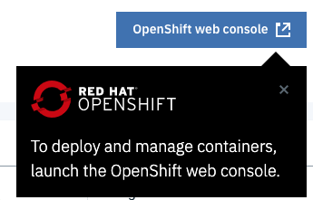
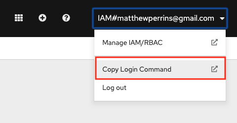

<!--- cSpell:ignore ICPA openshiftconsole Theia userid toolset crwexposeservice gradlew bluemix ocinstall Mico crwopenlink crwopenapp swaggerui gitpat gituser  buildconfig yourproject wireframe devenvsetup viewapp crwopenlink  atemplatized rtifactoryurlsetup Kata Koda configmap Katacoda checksetup cndp katacoda checksetup Linespace igccli regcred REPLACEME Tavis pipelinerun openshiftcluster invokecloudshell cloudnative sampleapp bwoolf hotspots multicloud pipelinerun Sricharan taskrun Vadapalli Rossel REPLACEME cloudnativesampleapp artifactoryuntar untar Hotspot devtoolsservices Piyum Zonooz Farr Kamal Arora Laszewski  Roadmap roadmap Istio Packt buildpacks automatable ksonnet jsonnet targetport podsiks SIGTERM SIGKILL minikube apiserver multitenant kubelet multizone Burstable checksetup handson  stockbffnode codepatterns devenvsetup newwindow preconfigured cloudantcredentials apikey Indexyaml classname  errorcondition tektonpipeline gradlew gitsecret viewapp cloudantgitpodscreen crwopenlink cdply crwopenapp -->

To enable the best working experience through the hands-on exercises, you
 need to select the environment you plan to use for development and the required tools for integration with your OpenShift development environment.

- If you plan to use your desktop/laptop for hands-on exercises, follow
 the instructions in the Desktop/Laptop tab. You will need a recent macOS or
  Windows 10 operating system for this option.
- If you cannot install tools on your desktop/laptop, follow the Web Terminal 
 instructions.

Once you have fulfilled these setup requirements you will be ready to
 start the **Developer Intermediate** agenda.


=== "Web Terminal"

## Open Web Terminal

To be able to run CLI commands to drive common operations on the cluster you will first need to open your web terminal instance.
- Click on the  `>_` icon in the header of the OpenShift Console. You should see a terminal open at the bottom of the console screen.
- Validate that you can run `oc` commands, run the following command
  ```bash
  oc sync --version
  ```
- You should see the version number printed

=== "Desktop/Laptop"

    ## Tools installation on Desktop/Laptop

    The following tools are required:

    - [Git Client](https://git-scm.com/): needs to be installed in your development operating system, it comes as standard for Mac OS.

    - [IBM Cloud CLI](https://cloud.ibm.com/docs/cli?topic=cloud-cli-getting-started): required for the management of your IBM Cloud Account, and managed IBM Kubernetes and Red Hat OpenShift clusters
    - Aside from installing the [IBM Cloud CLI](https://cloud.ibm.com/docs/cli?topic=cloud-cli-install-ibmcloud-cli), you will need to install the [IBM Cloud CLI and Developer Tools](https://cloud.ibm.com/docs/cli?topic=cloud-cli-getting-started#step1-install-idt) too:
    ```bash
    $ curl -sL https://ibm.biz/idt-installer | bash
    ```
    - Note: if you log in to the web UI using SSO, you'll need to [create an API key](https://cloud.ibm.com/docs/account?topic=account-userapikey&interface=ui#create_user_key) to log in to the CLI. You can also use this API key for installing the Developer Tools environment.

    - [OpenShift OC CLI](https://mirror.openshift.com/pub/openshift-v4/clients/oc/): required for Red Hat OpenShift management and development, select 4.3.18 or later version.
    - Place `oc` and `kubectl` in your Terminal `PATH`:

    - #### MacOS/Linux
    - Once downloaded navigate to the `Download` folder:
    ```bash
    $ cd ~/Downloads/openshift-origin-client-tools-v3/
    ```
    - Then copy `oc` and `kubectl` to the system-wide available scripts folder (which is already in your PATH).
    ```bash
    $ cp kubectl /usr/local/bin/kubectl
    $ cp oc /usr/local/bin/oc
    ```
    - [Docker Desktop](https://www.docker.com/products/docker-desktop): required for running common tools and Developer Tools Image.
    - Installed and running on your local machine.

    - [Node](https://nodejs.org/en/): required for running the [IBM Garage for Cloud CLI](https://cloudnativetoolkit.dev/reference/cli).
    - Installed on your local machine.
    - Recommended: `v12.x LTS`.

    - [IBM Garage for Cloud CLI](https://cloudnativetoolkit.dev/reference/cli): used to help make working with the development tools as easy as possible.
    ```bash 
    $ npm i -g @ibmgaragecloud/cloud-native-toolkit-cli
    ```

    - [Tekton CLI](https://github.com/tektoncd/cli): used to help control Tekton pipelines from the command line.
    ```
    $ brew tap tektoncd/tools
    $ brew install tektoncd/tools/tektoncd-cli
    ```

    - [Visual Studio Code](https://code.visualstudio.com/download): a popular code editor
    - You will need to edit some files, having a good quality editor is a good practice.
    - Enabling [launching VSCode from a terminal](https://code.visualstudio.com/docs/setup/mac#_launching-from-the-command-line).

    - [JDK 11](https://www.oracle.com/technetwork/java/javase/downloads/jdk11-downloads-5066655.html) (_optional_): installed on your local machine.
    - Used for SpringBoot content.

## Log in to IBM Cloud

  - Use the `ibmcloud` command to log in to the cloud account. Replace the user_id, password and team name with the sandbox ones:
    ```bash
    $ ibmcloud login -u <user_id> -p <password> -g <workshop-team> -r us-south
    ```

- Select the account number you have been assigned to:
  ```bash
  $ ibmcloud login -u email@company.com -p XXX -g workshop-team-one -r us-south
  API endpoint: https://cloud.ibm.com
  Authenticating...
  OK

  Select an account:
  1. GSI Labs - IBM
  Enter a number> 1
  Targeted account GSI Labs

  Targeted resource group workshop-team-one

  Targeted region us-south

  API endpoint:      https://cloud.ibm.com
  Region:            us-south
  User:              email@company.com
  Account:           GSI Labs
  Resource group:    workshop-team-one
  CF API endpoint:
  Org:
  Space:
  ```
  
## Log in to OpenShift Cluster

- Access the OpenShift console by clicking on the button:

    

- Get the OpenShift login command, which includes a token:

   

- Run the login command in the terminal:
   ```bash
   $ oc login --token=<token> --server=https://c103-e.us-south.containers.cloud.ibm.com:<port>
   Logged into "https://c103-e.us-south.containers.cloud.ibm.com:<port>" as "IAM#email@company" using the token provided.

   You have access to 71 projects, the list has been suppressed. You can list all projects with 'oc projects'

   Using project "dev-ab".
   ```


!!! note

    Depending on your macOS security settings you may need to allow access to `oc` and `kubectl`, go to `System Preferences`=>`Security & Privacy` and press `Allow Anyway`.

## Configure git

- Execute the following commands replacing the email and short name:

  ```
  $ git config --global user.email "<email>"
  $ git config --global user.name "<short_name>"
  ```
