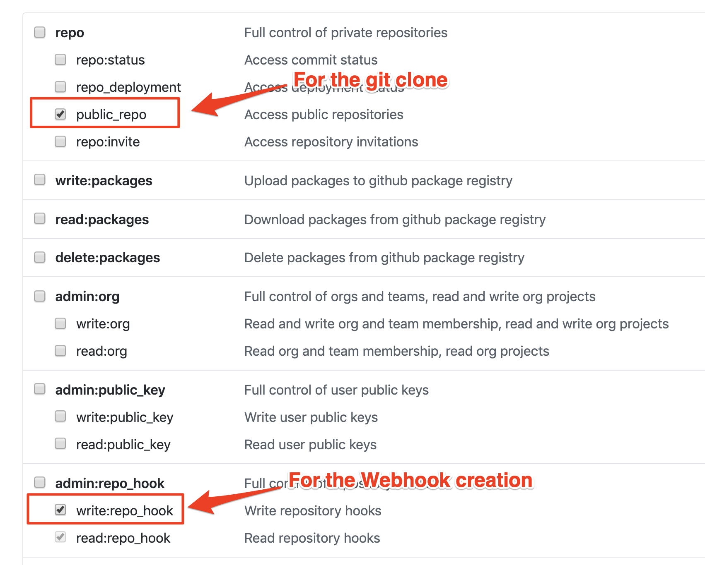

<!--- cSpell:ignore ICPA openshiftconsole Theia userid toolset crwexposeservice gradlew bluemix ocinstall Mico crwopenlink crwopenapp swaggerui gitpat gituser  buildconfig yourproject wireframe devenvsetup viewapp crwopenlink  atemplatized rtifactoryurlsetup Kata Koda configmap Katacoda checksetup cndp katacoda checksetup Linespace igccli regcred REPLACEME Tavis pipelinerun openshiftcluster invokecloudshell cloudnative sampleapp bwoolf hotspots multicloud pipelinerun Sricharan taskrun Vadapalli Rossel REPLACEME cloudnativesampleapp artifactoryuntar untar Hotspot devtoolsservices Piyum Zonooz Farr Kamal Arora Laszewski  Roadmap roadmap Istio Packt buildpacks automatable ksonnet jsonnet targetport podsiks SIGTERM SIGKILL minikube apiserver multitenant kubelet multizone Burstable checksetup handson  stockbffnode codepatterns devenvsetup newwindow preconfigured cloudantcredentials apikey Indexyaml classname  errorcondition tektonpipeline gradlew gitsecret viewapp cloudantgitpodscreen crwopenlink cdply crwopenapp -->

## Create accounts

You will need to set up the following accounts to use the **Cloud Enterprise
 Sandbox environment**

- [GitHub account](http://github.com) (public, not Enterprise): create it if
 you don't have one yet. If you haven't logged in for a while, check that
  you can do so. Make sure to set your enterprise email address as
   the primary address for the account. The **Cloud Enterprise Sandbox** administrators will send an invitation to your enterprise email address.

- [IBM Cloud Account](https://cloud.ibm.com): Create one if needed and make sure you can log in. 

### Configure Github Primary Email address

- Setup your primary email address to match your enterprise one. Follow these [instructions](https://help.github.com/en/github/setting-up-and-managing-your-github-user-account/changing-your-primary-email-address).

### Configure Github Personal Access Token
For your CI pipeline ([Jenkins](/guides/continuous-integration), [Tekton](/guides/continuous-integration-tekton)) to connect to and use your GitHub repo, it will need a [GitHub personal access token](https://help.github.com/en/github/authenticating-to-github/creating-a-personal-access-token-for-the-command-line) with `public_repo` and `write:repo_hook` scopes. The Personal Access Token only needs to be generated once because it is associated with the GitHub account and can be used to access any organizations and repositories that the account can access.

- Navigate to [Developer Settings](https://github.com/settings/tokens) and generate a new token. Name it something like "CI pipeline".
- Select the `public_repo` scope to enable Git clone.
- Select the `write:repo_hook` scope so the pipeline can create a webhook
.
- The GitHub UI will not display this token again, so make sure to save
  it in your password manager or somewhere safe that you can access later on.
  
Once you have created these accounts you can validate you can access your
**Cloud Enterprise Sandbox** cloud-native development environment.
