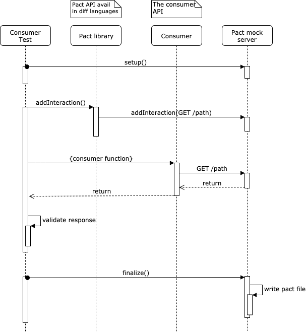
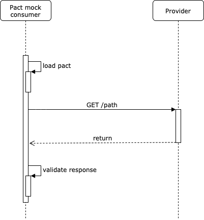
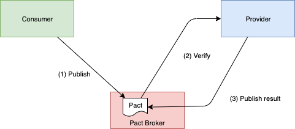

<!--- cSpell:ignore pactbroker ICPA openshiftconsole Theia userid toolset crwexposeservice gradlew bluemix ocinstall Mico crwopenlink crwopenapp swaggerui gitpat gituser  buildconfig yourproject wireframe devenvsetup viewapp crwopenlink  atemplatized rtifactoryurlsetup Kata Koda configmap Katacoda checksetup cndp katacoda checksetup Linespace igccli regcred REPLACEME Tavis pipelinerun openshiftcluster invokecloudshell cloudnative sampleapp bwoolf hotspots multicloud pipelinerun Sricharan taskrun Vadapalli Rossel REPLACEME cloudnativesampleapp artifactoryuntar untar Hotspot devtoolsservices Piyum Zonooz Farr Kamal Arora Laszewski  Roadmap roadmap Istio Packt buildpacks automatable ksonnet jsonnet targetport podsiks SIGTERM SIGKILL minikube apiserver multitenant kubelet multizone Burstable checksetup handson  stockbffnode codepatterns devenvsetup newwindow preconfigured cloudantcredentials apikey Indexyaml classname  errorcondition tektonpipeline gradlew gitsecret viewapp cloudantgitpodscreen crwopenlink cdply crwopenapp -->

In IBM Garage Method, one of the Develop practices is [contract-driven testing](https://www.ibm.com/garage/method/practices/code/contract-driven-testing). [Pact](https://docs.pact.io/) automates contract testing and enables it to be added to a continuous integration pipeline. The <Globals name="env" />'s CI pipeline ([Jenkins](/guides/continuous-integration), [Tekton](/guides/continuous-integration-tekton), etc.) includes a Pact stage. Simply by building your app using the CI pipeline, your code's contract gets tested, just open the Pact UI to browse the results.

## What is contract testing

_Contract testing_ is a testing discipline that ensures two applications (a consumer and
a provider) have a shared understanding of the interactions or the _contract_ between them.

The Pact framework has been selected for the provided tool set. Pact is a 
consumer-driven contract testing framework. More details can be found here -
[Pact overview](https://docs.pact.io/). The framework has been built into the <Globals name="templates" />
and a Pact Broker instance is provisioned in the cluster along with the other tools.

In `consumer-driven contract testing` it is the consumer who defines the `contract` in terms of the 
expected interactions, the data structure, and the expected responses. That `contract` can then be used
on the consumer-side to mock the interactions and validate the consumer behavior. More importantly,
the `contract` can be shared with the provider of the interaction so that the provider's responses
can be validated to ensure the consumer's expectations are met.

In the Pact framework, the contract is called a `pact`. A `pact` consists of one or more
`interactions`. Each `interaction` has the following structure:

```
Given a *state* of {state}

*upon receiving* a {description} request

*with request* parameters
- HTTP method
- path
- headers
- body

*will respond with* values like
- status
- headers
- body
```

where:
- {state} is an optional string that describes the initial state. This value can be used by the
provider during testing to make sure the preconditions are met
- {description} is a unique description of the interaction
- the request parameters can contain any values that describe the interaction
- the response contains the relevant information for the consumer. The response values can be exact values
or using matchers for type, regular expressions, etc

## Consumer

Using the Pact framework libraries in conjunction with the unit testing framework on the consumer, the
`pact` for the interaction between the consumer and provider is generated and validated. As part of the
pact test setup, a Pact server is started and configured with the expected interactions. All of the consumer
service invocations are directed at the Pact server which provides mock responses based on the 
interactions defined by the `pact`. At the end of the test, if all the interactions completed successfully
a file containing the pact definition is generated.

The following diagram gives an overview of the consumer interactions:


An example pact test on a Typescript consumer using the jest testing framework is provided below. It has
been broken into several parts.

### Pact server config

At the beginning of the test file, the pact server is configured and started in the
`beforeAll()` block. The `afterAll()` block finalizes the pacts by writing them out
to a file and stopping the pact server.

```typescript
  const port = 1234;
  const baseUrl = `http://localhost:${port}`;
  let pact: Pact;
  beforeAll(() => {
    pact = new Pact({
      consumer: consumerName,
      provider: providerName,
      logLevel: 'error',
      port,
    });

    return pact.setup();
  });

  afterAll(() => {
    return pact.finalize()
      .catch(err => console.error('Error finalizing pact', err));
  });
```

### Setup the service

Next, an instance of the component that will be tested is loaded and configured with the 
pact server host and port as the base url used for the interactions. In this example,
the consumer is using the `typescript-ioc` library to inject the `baseUrl` config value 
into the service.

```typescript  
  let service: SampleApi;
  beforeAll(() => {
    Container
      .bind(MyServiceConfig)
      .provider({get: () => ({baseUrl})});
    
    service = Container.get(SampleService);
  });
```

### Define and test the interaction

For each interaction with the provider, a test similar to the one provided below is created. In
it, the Pact framework is used to define the interaction. The `addInteraction()` publishes the
interaction to the Pact server so that it can be used to provide a mock response when the
request is made.

The mock response is then used to validate the behavior of the component that is being tested.
The example below is simple and passes the provider response directly through the service api
but in more sophisticated examples the value would be transformed.

```typescript
  describe('given createWidget()', () => {
    context('when called with valid request', () => {
      const widgetRequest = {...};
      const widgetResponse = {...};
      
      beforeEach(() => {
        return pact.addInteraction({
          uponReceiving: 'a valid widget request',
          withRequest: {
            method: 'POST',
            path: '/widgets',
            headers: {
              'Content-Type': 'application/json',
              'Accept': 'application/json',
            },
            body: widgetRequest,
          },
          willRespondWith: {
            status: 200,
            headers: {
              'Content-Type': Matchers.regex({
                generate: 'application/json', matcher: 'application/json.*'
              }),
            },
            body: Matchers.like(widgetResponse),
          },
        });
      });

      test('then return 200 status', async () => {
        expect(await service.createWidget(widgetRequest)).toEqual(widgetResponse);
      });
    });
  });
```

## Provider

The provider uses the Pact framework to verify the running server against the `pact`, either
one started locally as part of the test or another instance running elsewhere. The interactions
in the pact are sent to the provider by a mock consumer in the Pact framework and the results
are verified against the expected results defined by the pact.

As an optional configuration for the verification process, an endpoint can be provided that handles
the state information in the pact in order to ensure the preconditions for the test are met. (E.g.
state="given an empty database"). In order for these tests to be repeatable, it is often advisable
to stand up a clean backend to run the pact tests when the tests start and tear it down when the
tests are completed. For example, if a provider interacts with a Cloudant database point the 
test provider at a new database instance for the tests.

The following diagram shows the interactions for the pact provider:


## Pact Broker

One of the underpinning requirements of the pact verification process is the ability to make the
pact files generated by the consumer available to the provider. When the pact verification is run
in an automated pipeline this is difficult without an intermediary. Within the Pact framework,
the `Pact Broker` provides the facility for consumers and providers to share the pact definitions
with minimal dependencies between the systems.

Additionally, the Pact Broker provides a place to define webhooks to trigger the provider build
process when the pact definition changes and a way record and visualize the results of the
verification process. The high-level interaction is shown below:


## <Globals name="templates" />

The <Globals name="templates" /> have been built with the frameworks necessary to generate and publish pacts for
api consumers and verify against pacts and publish the results for api providers. The pipelines 
will do all the publishing and verification against Pact Broker if an instance of Pact Broker has
been configured within the cluster.

- You can review you pact contracts using the **Pact** Dashboard.app

- Use the [<Globals name="dashboard" />](../../getting-started/dashboard) to open the **Pact** dashboard


