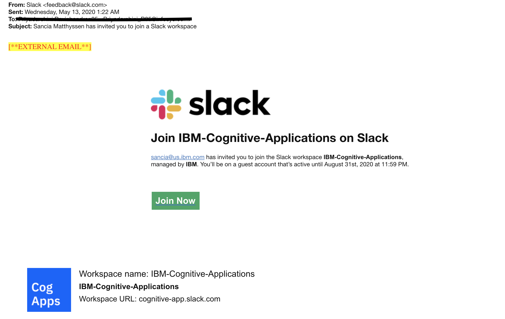

### 1. Not able to access openshift cluster

Openshift URL's might not be accessible from within SI corporate network if it is not whitelisted. Please log out of the corporate VPN and retry.

### 2. Getting access to slack channel and joining it.
- Create a slack account using the enterprise email ID 
- You would get a mail with the subject "XXX has invited you to join a Slack workspace". It would contain a link/button to join the IBM-Cognitive-Applications workspace managed by IBM.

- Once you click on this link, it will redirect to the login page where you need to login with your guest-id.
- Search for your slack channel name (the name would be shared prior) and join it.

**NOTE**: If you did not get the invite, reply back to the invite email and inform us.
