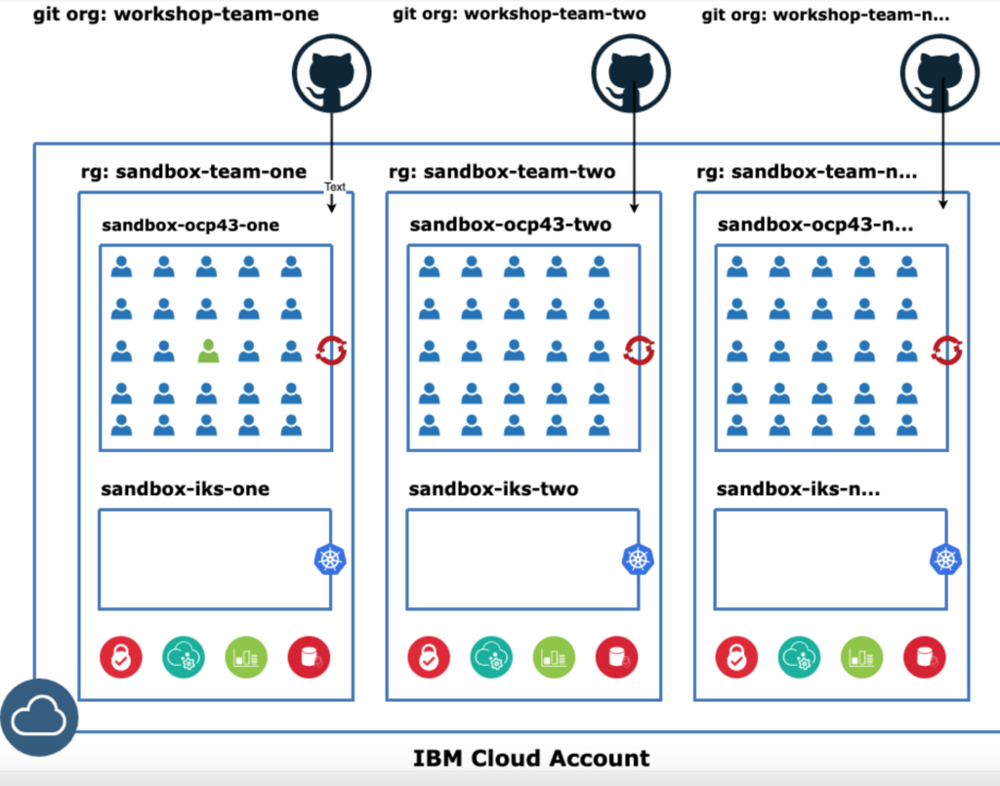

### 1. Finalize the dates for the workshop - Enablement Team & Cloud-Native Squad

### 2.  Instructor Identification: Identify two instructors from the IBM side who will be responsible for running the sessions (one from cloud native squad and another from the SI team)

### 3.  Collect the data required for the sessions from the SI - Enablement team

- Participants should use Enterprise Email Id

- Participant Public Github Id (Participant Enterprise Id should be primary email address setup in the Github account)

- Participant Data Collection Sheet

### 4.  Github setup:

- Create a github organization: SI-Name-sandbox-team-one.

- Add all participants as members of the organization.


### 5. Slack Channel Setup 

Set up a new slack channel and add all participants


### 6. IBM Cloud Setup: 

- Create resource group **sandbox-team-one** under the SI Account to be used for the worksop

- Create access groups **SANDBOX-TEAM-ONE-ADMIN** and **SANDBOX-TEAM-ONE-USER** and make all users part of the SANDBOX-TEAM-ONE-USER group.

- Run these scripts to create access groups from iteration-zero repository
```bash
./acp-admin.sh SANDBOX-TEAM-ONE-ADMIN sandbox-team-one
./acp-user.sh SANDBOX-TEAM-ONE-USER sandbox-team-one us-east
```
- Board all users by adding them to access group SANDBOX-TEAM-ONE-USER 


### 7.  Email the Participants 

Send an email to all participants inviting them to the sandbox journeys.

### 8. Cluster Setup:


For every 50 participants we need one openshift cluster with cloudnative toolkit and Cloud Pak for Apps installed.
Create cluster **sandbox-ocp43-one** under sandbox-team-one resource group



### 9. Cloud Native Toolkit Setup:

Install Cloud Native toolkit onto the OCP Cluster (Follow instructions outlined in https://cloudnativetoolkit.dev/admin/installation-existing)

- [Install Tekton tasks](https://github.com/IBM/ibm-garage-tekton-tasks/tree/master)

- [Artifactory Post Install Setup] (https://cloudnativetoolkit.dev/admin/artifactory-setup)

- [argocd Post Install Setup] (https://cloudnativetoolkit.dev/admin/argocd-setup)

- [Install Codeready workspaces] (https://cloudnativetoolkit.dev/admin/config-install#codeready-workspace-installation)

Customize dashboard to include crw, github links (replace links for your cluster)
```bash
igc tool-config --name sysdig --url https://us-east.monitoring.cloud.ibm.com/api/oauth/openid/IBM/0f42478cb66d4ce0b11c9168b02c5690/e0caebc1-92c0-46a5-b6d0-ef4ba28bd5ed
igc tool-config --name logdna --url https://app.us-east.logging.cloud.ibm.com/ext/ibm-sso/38d0b85d06
igc tool-config --name ir --url https://cloud.ibm.com/kubernetes/registry/main/start
igc tool-config --name github --url https://github.com/ibm-workshop-team-one
igc tool-config --name codeready --url https://codeready-codeready.workshop-ocp43-one-3b1fc50af0b2002f0241bdf5d2432efd-0000.sjc03.containers.appdomain.cloud/dashboard/
```
Customize redhat openshit to include shortcuts to all tools
```bash
oc apply -f tools.yaml
```
Finish the setup of sysdig, so that users do not have do this.


### 10. Smoke test 

Test access control.
Add personal id to SANDBOX-ONE-USER access group. 
Log into IBM Cloud as the personal id and run the following test cases:

- Check only the resources assigned to sandbox: 1 cluster and 2 services under sandbox-team-one resource group should be visible.

- Try creating a service. You should get an access denied error.

- Go to Billing->Usage: You should be able to view, but should not be able to change anything.

- Try creating a resource group/access group. It should get permission errors.

- Go to Classic Infrastructure. Should give access denied error.

- Reboot a worker node. Should not be a allowed operation.

- Check if sysdig instance created by cloud native toolkit is collecting metrics from the resorces, and if it is not, set those up.

- Run pipelines of some starter kits and make sure they work.

- Check links from openshift and dashboard.


### 11. Install CP4A on the openshift cluster

- Run schematics to install CP4A on openshift.
- Add Transformation Advisor[TA] link to the dashboard and openshift shortcut.
```bash
igc tool-config --name ta --url url-for-ta
```
- Add shortcut to ta from openshift.


### 12.  Configure the Secret for Tekton pipeline in CP4Application to connect with IBM Cloud Registry

- Ensure the CloudPaks for Application is installed in the cluster.

- Select the **'tools'** projects and capture the Secrets of ibmcloud-apikey. 


- Navigate to the Tekton pipeline User interface in the CloudPak for application Dashboard.

- Create the secrets for the Kabanero Namespace and the Kabanero-operator Service account to access the IBM Cloud Registry as the Docker image repository.  
  The details are depicted  as below:

    - Provide the name for the secret. Ex: ibmcloud-image-repo

    - Select namespace as **"Kabanero"**

    - Select access to as **"Docker Registry"**

    - Provide the username.It should be the Registry_User captured from the ibmcloud-apikey (from previous step).  Here it should be "iamapikey"

    - Provide the password/token.It should be the APIKEY captured from the ibmcloud-apikey (from previous step).  Here it should be "MW-r5iwMfNszs5S2LDICWgsscE39Wc5zASkS2LXUdlXt"

    - Select the service account as **"Kabanero-operator"**

    - The server URL as two parts:

          - Leave the first part as-is tekton.dev/git-0

          - Second part would be "https://us.icr.io/{namespace from the IBM Cloud Registry}/" Example:https://us.icr.io/gsi-cloudnative-dev-squad/


### 13. Database setup for Application Modernisation - Plants Application Scenario

- Create the Db2 Service from the IBM Cloud Catalogue.For Testing and demo purpose use Lite plan. For the workshop with developers hands-on, set it up with paid plan(Flex Plan).


- Provide the name for the service as "PlantsDB" and create the service.  Please note the service is also provisioned in the same region as the Openshift cluster to avoid latency.

- Once you create the service, Navigate to the **'Service  Credential tab'** in the left Nav and create a new credential for the Db2 service. Capture the details as this would be needed for the application.

- Now Click 'Manage tab' and click **'Open Console'**  button.

- Click on the Run option in the top left nav, which should open the SQL Editor.

- Execute the DDL Scripts to create the Database for the Plants application (Refer PlantsDB-create.sql in the box folder).

- Execute the Insert scripts to populate data for the Plants application (Refer Populate-PlantsDB.sql in the box folder).

- Navigate to the **'connectioninfo'** tab and select the option 'without-sso'. Capture the Connection Details as well which is needed for the application


