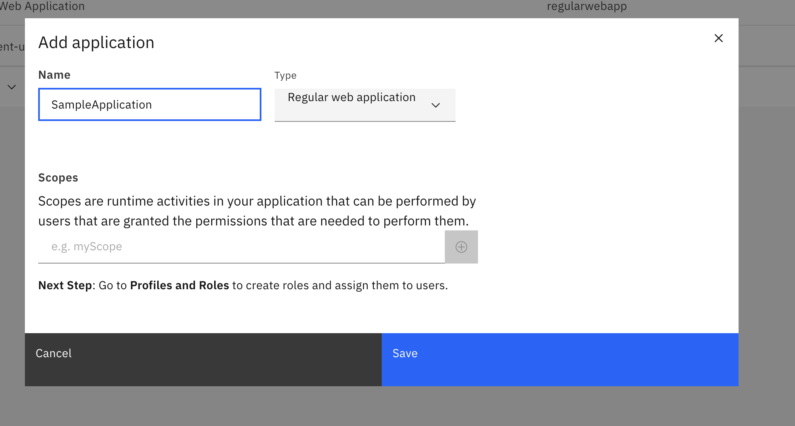
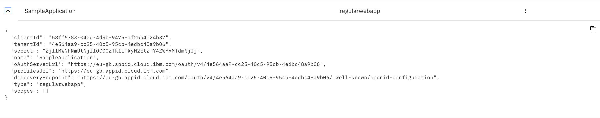
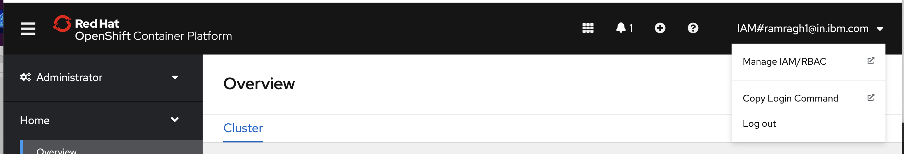
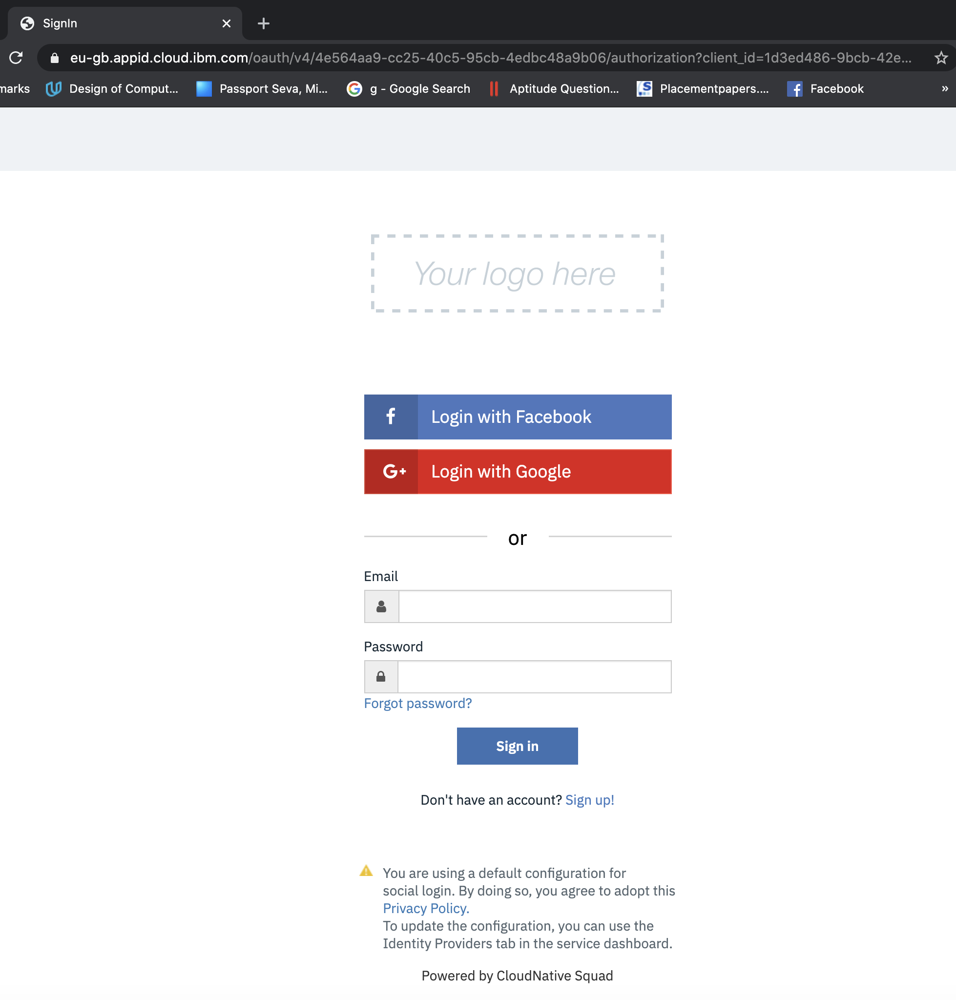

import Globals from 'gatsby-theme-carbon/src/templates/Globals';

<PageDescription>

Securing Inventory App with App ID

</PageDescription>

To secure the application we are using the capabilities available within the IBM Cloud platform to enable integration with AppId.With Openshift 3.11,
a simple annotation was used on the ingress to enable Appid.In Openshift 4.x,Red Hat OpenShift on IBM Cloud annotations (ingress.bluemix.net/[annotation]) 
and NGINX annotations (nginx.ingress.kubernetes.io/[annotation_name]) are not supported for the router or the Ingress resource. With Openshift 4.x,AppId 
integration is enabled with SDKs.

## Prerequisites

The following prerequisites are required for AppId integration:
- An instance of the App ID service:
  In IBM Cloud Dashboard, go to "Services" and select the AppId instance.
  
  

- A set of service credentials:
    - In AppId instance, go to "Application". 
    - Click on "Add application".
    - Enter your application name 
    - Select the type as Regular web application.
    - Click on Save to create the service credentials for your application.
   
    

    - After saving, your application credentials will get created.Click on the down Arrow at 
    the left end of your application name and get the credentials.
    
    
    

- NPM version 4 or higher.
- Node version 6 or higher.


### Enable Appid in the solution

#### Installation
-   By using the command line, change to the directory that contains your Node.js app.
-   Install the AppID service and other dependencies.
    ```bash
    npm install --save ibmcloud-appid
    npm install --save passport
    npm install --save express-session
    ```
-  Obtain your credentials by navigating to the <b>Applications</b> tab of the AppId dashboard as mentioned in [Prerequisites](#prerequisites).

-  Obtain the application as mentioned in [AppId Redirect Url Config](#appid-redirect-url-config).

#### Create binding secret for appid in your namespace
- Login to the IBM Cloud cluster where your workshop-team-one ocp cluster resides.
  ibmcloud login -u [username] -p [password]
- Login to your ocp cluster using the oc cli.

   

    - Click on "Copy Login Command". It will redirect to a new page.
    - Click the display token link. Copy the "Log in with this token" command & login 
      to oc cli.
      Ex- oc login --token=sha256~bfGcq7l6H3JHd9GwbNRaSsJ7cDAiLK5EPF4tbPQ-WfY --server=https://c108-e.eu-gb.containers.cloud.ibm.com:31718

- Navigate to your namespace where you are running the inventory solution pipeline and create the binding secret for He the Appid instance on the cloud account
  ```bash 
     oc project [proj_name]
     ibmcloud oc cluster service bind --cluster workshop-team-one 
     --namespace [YOUR-NAMESPACE] --service workshop-team-one-appid
  ```


#### Update the configuration values in the configuration files
-  Put these credentials in <i>server/config/mappings.json</i> to be referred by application:
   ```bash
    {
    "APPID_CONFIG": ""{\"tenantId\":\"<tenantId_value>\",\"oauthServerUrl\":\"<oauthServer_URL>\",\"clientId\": \"<ClientID_value>\", \"secret\": \"<secret_value>\"}",
    "application_url":"<openshift_appln_route_url>"
    }
    ```

- Add the following parameters in `values.yaml` along with its values:

   ```bash
    appidBinding: "binding-workshop-team-one-appid"
    
    ```
  

#### Adding the dependencies
- Add the following <i>require</i> definitions to your `server/server.js`:

    ```bash
    const express = require('express');
    const session = require('express-session')
    const passport = require('passport');
    const WebAppStrategy = require("ibmcloud-appid").WebAppStrategy;
    const CALLBACK_URL = "/ibm/cloud/appid/callback";
    const appidConfig = require("./config/mappings.json");
    ```

#### Activate the appid integration
- In <i>server.js</i>,set up your express app to use express-session middleware.

    ```bash
    const app = express();
    app.use(session({
            secret: appidConfig.secret,
            resave: true,
            saveUninitialized: true
        }));
    app.use(passport.initialize());
    app.use(passport.session());
    ```

- In the same file,initialize the SDK using the information obtained in the previous steps.
   ```bash
    var appidcfg=JSON.parse(appidConfig.APPID_CONFIG);
    passport.use(new WebAppStrategy({
    tenantId: appidcfg.tenantId,
    clientId: appidConfig.client_id,
    secret: appidConfig.secret,
    oauthServerUrl: appidcfg.oauthServerUrl,
    redirectUri: appidConfig.application_url+CALLBACK_URL
    }));
    ```

-   In the same file,configure passport with serialization and deserialization. This configuration step is required for authenticated session persistence across HTTP requests. For more information, see the [passport docs](http://www.passportjs.org/docs/)
    ```bash
    passport.serializeUser(function(user, cb) {
    cb(null, user);
    });
    passport.deserializeUser(function(obj, cb) {
    cb(null, obj);
    });
    ```

-   Add the following code to your <i>server.js</i> to issue the service redirects.
    ```bash
    app.get(CALLBACK_URL, passport.authenticate(WebAppStrategy.STRATEGY_NAME));
    app.use(passport.authenticate(WebAppStrategy.STRATEGY_NAME ));
    ```    

#### Adding environment variables to `deployment.yaml`
- Open the `deployment.yaml` file and add environment variables that use those values to the top of the existing `env` block:
  ```bash
    - name: APPID_CONFIG
      valueFrom:
         secretKeyRef:
            name: {{ .Values.appidBinding | quote }}
            key: binding
    - name: APP_URI
      valueFrom:
        configMapKeyRef:
          name: appid-ui
          key: route
  ``` 

### AppId redirect url config

- Get the ingress for the UI component by running `igc ingress -n dev-{initials}`.

- Open the IBM Cloud resource list - `https://cloud.ibm.com/resources`

- Open the AppId instance to the `Manage Authentication` -> `Authentication Settings` view

    

- Add the redirect url for the application to the web redirect URLs. The redirect url will have
the following form:

    `{ingress url}/ibm/cloud/appid/callback`
    
    e.g. `https://inventory-manangement-ui-dev.sms-test-oc-cluster.us-east.containers.appdomain.cloud/ibm/cloud/appid/callback`

### Add users to AppId

- Open the AppId instance to `Cloud Directory` -> `Users`

    

- Add yourself as a user with an email address, name, and password#

### Access the UI

- Open a browser to the UI Application URL

- You should be met with the AppId login screen. (This screen can be customized from the AppId service console but for now we are showing the default screen.)

     

- Provide the email address and password you configured in the previous steps. You should be granted access to the UI.

Prebuilt solution for this can be found here: [Inventory Management UI Appid solution template](https://github.com/ibm-gsi-ecosystem/inventory-management-ui-soln-advanced.git)