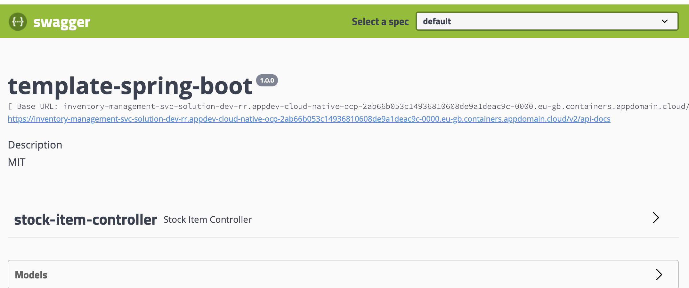
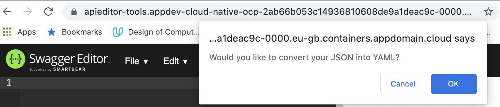
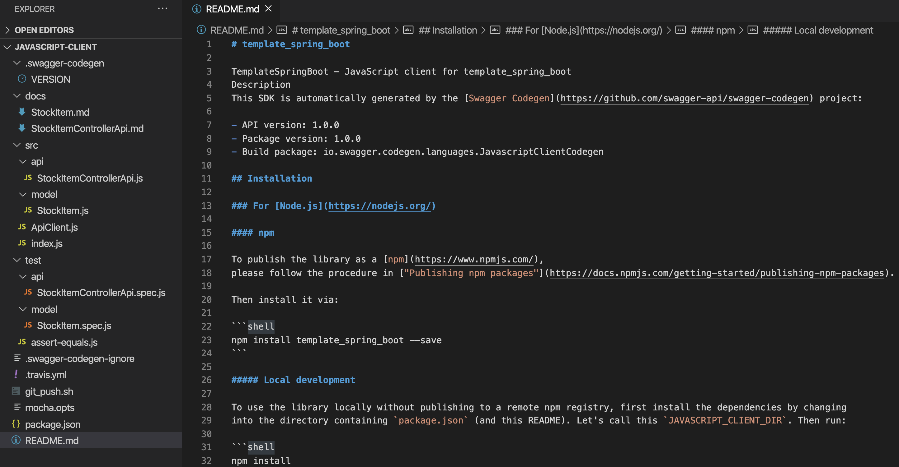
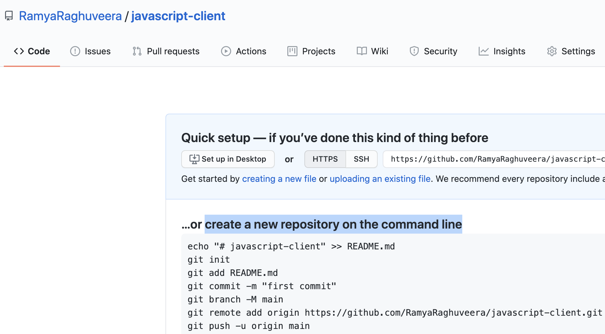

Testing of Web APIs has been always a challenge as it exposes its endpoints rather than showing a UI. Testing Web APIs have a dependency on third-party tools like PostMan.
Swagger resolves this by providing a UI representation of the RESTful APIs without any implementation logic. Swagger generates UI using the OpenAPI specification (swagger.json) 
based on service and code.Swagger.json describes capabilities of service.

### Activities

Open API specification document can be manually written using a tool like Swagger editor or even auto-generated through code.
For,almost all our base code patterns (other than Node-Angular and Node-react ), API specification is auto-generated from code.
Lets take the example of [inventory-management-bff](https://github.com/ibm-gsi-ecosystem/inventory-management-bff-solution) to see how OpenAPI specification document can be auto-generated from code.
Inventory-bff is written in typescript. 
- npm package ["typescript-rest-swagger"](https://www.npmjs.com/package/typescript-rest-swagger) is used to create the OpenAPI specification in this typescript project.
- Usage: swaggerGen -c ./swagger.config.json 
- swagger.config.json file contains all the settings about the swagger generation.
- In inventory-bff-solution, this is run as a post-build script through package.json:
  
  ```bash
     package.json
     "postbuild": "npm run swagger",
     "swagger": "swaggerGen -c ./swagger.config.json"
  ```
  
  ```bash
     swagger.config.json
     {
      "swagger": {
        "basePath": "",
        "outputDirectory": "./dist",
        "entryFile": "./src/controllers/index.ts",
        "produces": [
          "application/json"
        ]
       }
      }
  ```
- postbuild script runs after `npm run build` and creates the swagger.json in the dist folder which is created as result of build.

- /api-docs endpoint of inventory-management-bff uses the swagger.json to create the Swagger documentation of inventory-management-bff solution.It is referenced in `server.ts` file as shown below:
 ```bash 
      server.ts
      const swaggerPath = join(process.cwd(), 'dist/swagger.json');
      if (existsSync(swaggerPath)) {
        Server.swagger(
          apiRouter,
          {
            filePath: swaggerPath,
            schemes: this.swaggerProtocols,
            host: this.swaggerHost,
            endpoint: '/api-docs'
          },
        );
      }
  ```
  
  
### Give it a try

Swagger API editor along with Swagger codegen simplifies your build process by giving you the option of creating server-stubs and client SDKs for any API,defined with the OpenAPI specification.

Swagger API editor is available as part of Cloudnative toolkit.

As a part of this exercise, we will be creating a client SDK for [inventory-management-svc](https://github.com/ibm-gsi-ecosystem/inventory-management-svc-solution) application which will be consumed by another microservice.

- You would have run the [inventory application] as part of [Developer Intermediate journey].
  Login to the openshift cluster on the terminal where you had completed your inventory application and run the following command:

  ```bash
   oc get route -n <your_inventory_appln_namespace>
  ```
where <your_inventory_appln_namespace> is the namespace where you ran your inventory application.
  
  


- Copy the inventory-management-svc-solution application's route URL and paste it in a browser tab.
  UI would look something like this:

   

- Click on the api-docs link which will open a new-tab with the OpenAPI specification json file. Copy the whole json.

- Go to the 9-square square icon on the top of your openshift web console.Select Swagger Editor to open the Swagger Editor application.

- Clear the content on the left side of the Swagger editor and paste the json you had copied from api-docs URL in the previous step.
  While copying, the following pop-up will appear to convert json to YAML.Click on "OK"

  

- Once openAPI specification is successfully pasted, you will be able to see Swagger UI for the API on the right side.
 
  

- You have the option to generate server and client SDKs in around 20 different languages.
  inventory-svc-application is consumed by inventory-bff-application.Hence, we will create a javascript client.

   

- The client sdk will look something like this:
  
  

- As mentioned in the README.md, create a git repo for the javascript client you just created and push the code to the repository.
  Create a new git repo on your github account and follow the instructions under `create a new repository on the command line` section 
  to push the code to the git repo.

  

- Navigate to the inventory-management-bff application on your terminal.Run the following command to install the client as a npm package:

  ```bash
     npm install <javascript_client_gitrepo_url>
  ```
  Ex- npm install https://github.com/RamyaRaghuveera/template_spring_boot

- Go to the the Getting Started section of README.md and execute the JS to call the `/stock_items` API of inventory-management-solution 
  and test it.


