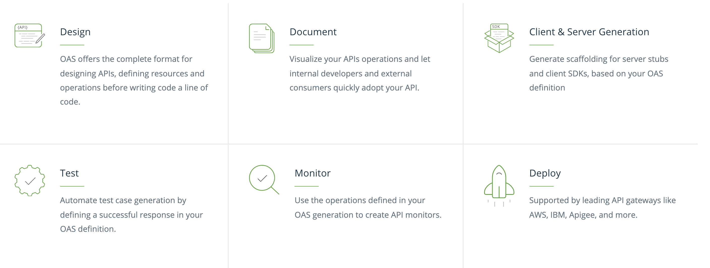
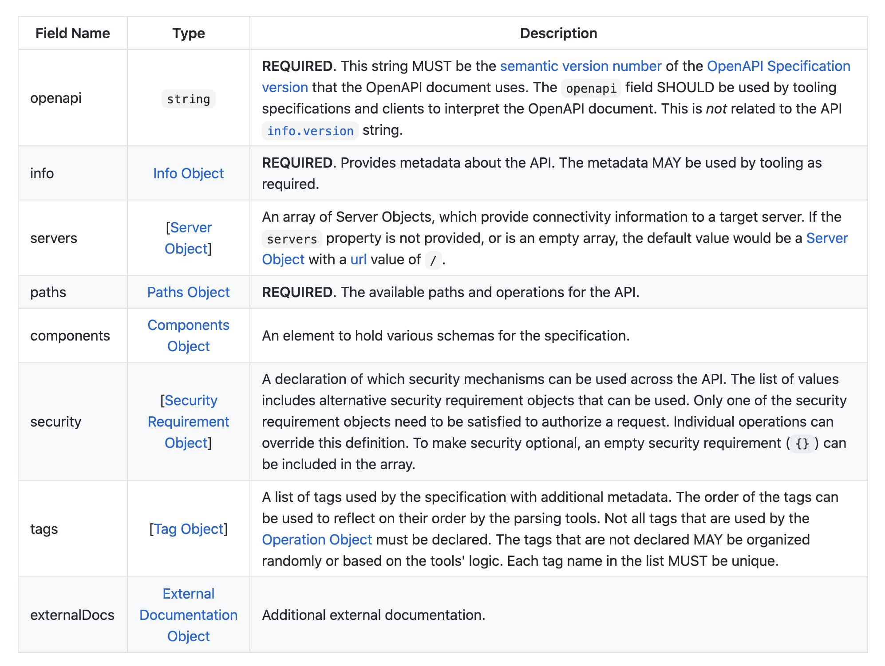
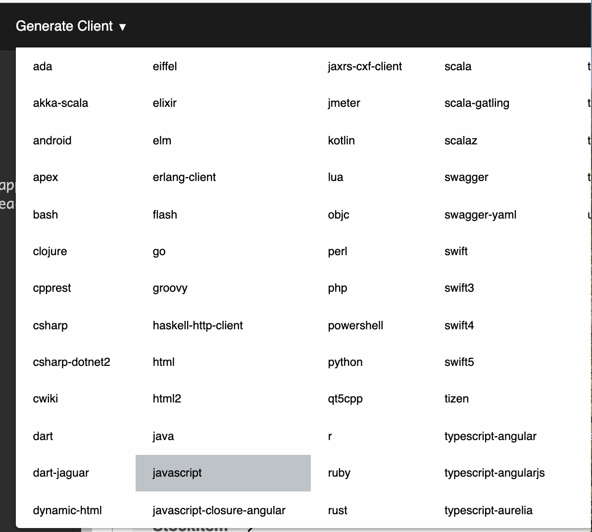

Testing of Web APIs has been always a challenge as it exposes its endpoints rather than showing a UI. Testing Web APIs have a dependency on third-party tools like PostMan.
Swagger resolves this by providing a UI representation of the RESTful APIs without any implementation logic. Swagger generates UI using the OpenAPI specification (swagger.json) 
based on service and code.Swagger.json describes capabilities of service.

  

### What is OpenAPI?  

- The OpenAPI Specification is a community-driven open specification within the OpenAPI Initiative, a Linux Foundation Collaborative Project. 

- The OpenAPI specification, formerly known as Swgger specification is the world’s standard for describing RESTful APIs.The "Open API Initiative" 
is a framework for describing your API using a common language that everyone can understand. 

- Think of it as a blueprint for a house. You can use whatever building materials you like, but you can't step outside the parameters of the blueprint.

- An OpenAPI file allows you to describe your entire API, including:
  - Available endpoints (/users) and operations on each endpoint (GET /users, POST /users)
  - Operation parameters Input and output for each operation
  - Authentication methods
  -	Contact information, license, terms of use and other information.

- The OpenAPI Specification (OAS) defines a standard, programming language-agnostic interface description for HTTP APIs, which allows both humans and computers to 
  discover and understand the capabilities of a service without requiring access to source code, additional documentation, or inspection of network traffic.

- When properly defined via OpenAPI, a consumer can understand and interact with the remote service with a minimal amount of implementation logic.

- Similar to what interface descriptions have done for lower-level programming, the OpenAPI Specification removes guesswork in calling a service.

- Use cases for machine-readable API definition documents include, but are not limited to: 
    - interactive documentation
    - code generation for documentation
    - clients and servers 
    - automation of test cases. 

  

- OpenAPI documents describe an APIs services and are represented in either YAML or JSON formats. 

- These documents may either be produced and served statically or be generated dynamically from an application.

- The OpenAPI Specification does not require rewriting existing APIs. It does not require binding any software to a service — the service being described may not 
  even be owned by the creator of its description.It does, however, require the capabilities of the service be described in the structure of the OpenAPI Specification. 

- Not all services can be described by OpenAPI — this specification is not intended to cover every possible style of HTTP APIs, but does include support for REST APIs.

### What is Swagger?

Swagger is the most widely used tooling ecosystem for developing APIs with the OpenAPI Specification (OAS). Swagger consists of both open source as well as professional tools, catering to almost every need and use case.  
Swagger is in essence an Interface Description Language for describing RESTful APIs expressed using JSON. Swagger is used together with a set of open-source software tools to design, build, document, and use RESTful web services. 
Swagger includes automated documentation, code generation (into many programming languages), and test-case generation. The major Swagger tools include:

- Swagger Editor: It is a browser-based editor where one can write OpenAPI specification. One can write their API documentation in JSON or YAML and have it automatically compared against Open API specification.
                  Any mistakes are flagged and alternatives are suggested. This way, it is made sure that whenever documentation is published,its error free.

- Swagger UI: It renders OpenAPI specs as interactive API documentation. It takes any OpenAPI specification in JSON or YAML format and creates interactive API documentation out of it.

- Swagger Codegen: It can simplify the build process by generating server stubs and client SDKs for any API,defined with the OpenAPI specification. It saves devlopers from tedious plumbing and configuration by generating boilerplate 
                   servercode in over 20 languages. It generates client SDKs in over 40 different languages.

### Open API vs Swagger

- The Swagger specification development started in 2010, by Wordnik. It was later acquired by SmartBear, in 2015. 

- Swagger used to consist of the specification and a large ecosystem of tools to implement the specification. These tools 
include everything from front-end user interfaces, low-level code libraries and commercial API management solutions.

- In that same year, SmartBear created the OpenAPI Initiative (OAI) under the Linux Foundation, and donated the Swagger 
specification to it, in order to advance a common standard across industries. 

- A number of tech companies, including Google, IBM, and Microsoft, along with SmartBear signed on as founding members of the OpenAPI Initiative, and the Swagger
Specification was rebranded as the Open API Specification.

- The easiest way to understand the difference is:
  - OpenAPI = Specification
  -	Swagger = Tools for implementing the specification

- Swagger is the name associated with some of the most well-known, and widely used tools for implementing the OpenAPI specification.Since the Swagger tools were developed by 
  the team involved in the creation of the original Swagger Specification, the tools are often still viewed as being synonymous with the spec. 

- But the Swagger tools are not the only tools that are available for implementing the OpenAPI Specification. There are a wide variety of API design, documentation, testing, 
management, and monitoring solutions that support OpenAPI specification.


### Benefits of OpenAPI

- Generating interactive documentation: API documentation is often overlooked, but it's crucial for developers to understand how to interact with your endpoints, whether they're internal or external code.

-	Human readable and machine readable: This means that not only can this be shared with your team internally, but the same documentation can be used to automate API-dependent processes.The choice of JSON and YAML 
  as the accepted formats is not by accident. Being language-agnostic is an important aspect of the OpenAPI specification widespread use, allowing teams to easily read and share them, while making it easy to create 
  tooling around it for any programming language.

- Creating SDK for multiple languages: A big challenge that API companies face is providing client libraries for multiple languages and frameworks: Node.js, C#, Python, Ruby, Java, etc. 
  OpenAPI tooling such as swagger-codegen helps you do that with little work.
  
- Comprehensible for developers and non-developers: Product managers, partners, and even potential clients can have input into the design of your API, because they can see it clearly mapped out in this friendly UI.
 
-	Ease of use: It is great for testing and debugging API problems.

These benefits not only make developers' lives easier, but they make the API more consumable. Any API that adheres to the Swagger spec is easy to read, easy to iterate, and easy to consume. 


### Basic structure of Open API file

Root-level objects in OpenAPI spec

The OpenAPI 3.0 spec has eight objects at the root level. These eight objects have many nested objects inside them, but at the root level, there are just these parent objects:
- openapi
- info
- servers
- paths
- components
- security
- tags
- externalDocs

  

The official description of the OpenAPI specification is available in a Github repository [here](https://github.com/OAI/OpenAPI-Specification/blob/master/versions/3.0.3.md#oasObject). Some of the OpenAPI elements are paths, parameters, responses, and security. Each of these elements is a JSON object that holds some properties and arrays.

In the OpenAPI specification, your endpoints are paths. If you had an endpoint called “pets”, your OpenAPI specification for this endpoint might look as follows:

  ```bash
        paths:
         /pets:
           get:
             summary: List all pets
             operationId: listPets
             tags:
               - pets
             parameters:
               - name: limit
                 in: query
                 description: How many items to return at one time (max 100)
                 required: false
                 schema:
                   type: integer
                   format: int32
              responses:
                '200':
                  description: An paged array of pets
                  headers:
                    x-next:
                      description: A link to the next page of responses
                      schema:
                        type: string
                  content:
                    application/json:    
                      schema:
                        $ref: "#/components/schemas/Pets"
              default:
                description: unexpected error
                content:
                  application/json:
                    schema:
                      $ref: "#/components/schemas/Error"
  ```

Here’s what these objects mean:

- /pets is the endpoint path.
- get is the HTTP method.
- parameters lists the parameters for the endpoint.
- responses lists the response from the request.
- 200 is the HTTP status code.
- $ref is a reference to another part of your implementation where the response is defined (in components). OpenAPI has a lot of $ref markers like this to keep your code clean and to facilitate re-use.


### Activities

Open API specification document can be manually written using a tool like Swagger editor or even auto-generated through code.
For,almost all our base code patterns (other than Node-Angular and Node-react ), API specification is auto-generated from code.
Lets take the example of [inventory-management-bff](https://github.com/ibm-gsi-ecosystem/inventory-management-bff-solution) to see how OpenAPI specification document can be auto-generated from code.
Inventory-bff is written in typescript. 
- npm package ["typescript-rest-swagger"](https://www.npmjs.com/package/typescript-rest-swagger) is used to create the OpenAPI specification in this typescript project.
- Usage: swaggerGen -c ./swagger.config.json 
- swagger.config.json file contains all the settings about the swagger generation.
- In inventory-bff-solution, this is run as a post-build script through package.json:
  
  ```bash
     package.json
     "postbuild": "npm run swagger",
     "swagger": "swaggerGen -c ./swagger.config.json"
  ```
  
  ```bash
     swagger.config.json
     {
      "swagger": {
        "basePath": "",
        "outputDirectory": "./dist",
        "entryFile": "./src/controllers/index.ts",
        "produces": [
          "application/json"
        ]
       }
      }
  ```
- postbuild script runs after `npm run build` and creates the swagger.json in the dist folder which is created as result of build.

- /api-docs endpoint of inventory-management-bff uses the swagger.json to create the Swagger documentation of inventory-management-bff solution.It is referenced in `server.ts` file as shown below:
 ```bash 
      server.ts
      const swaggerPath = join(process.cwd(), 'dist/swagger.json');
      if (existsSync(swaggerPath)) {
        Server.swagger(
          apiRouter,
          {
            filePath: swaggerPath,
            schemes: this.swaggerProtocols,
            host: this.swaggerHost,
            endpoint: '/api-docs'
          },
        );
      }
  ```
  

### Give it a try

Swagger API editor along with Swagger codegen simplifies your build process by giving you the option of creating server-stubs and client SDKs for any API,defined with the OpenAPI specification.

Swagger API editor is available as part of Cloudnative toolkit.

As a part of this exercise, we will be creating a client SDK for [inventory-management-svc](https://github.com/ibm-gsi-ecosystem/inventory-management-svc-solution) application which will be consumed by another microservice.

- You would have run the [inventory application] as part of [Developer Intermediate journey].
  Login to the openshift cluster on the terminal where you had completed your inventory application and run the following command:

  ```bash
   oc get route -n <your_inventory_appln_namespace>
  ```
where <your_inventory_appln_namespace> is the namespace where you ran your inventory application.
  
  


- Copy the inventory-management-svc-solution application's route URL and paste it in a browser tab.
  UI would look something like this:

   

- Click on the api-docs link which will open a new-tab with the OpenAPI specification json file. Copy the whole json.

- Go to the 9-square square icon on the top of your openshift web console.Select Swagger Editor to open the Swagger Editor application.

- Clear the content on the left side of the Swagger editor and paste the json you had copied from api-docs URL in the previous step.
  While copying, the following pop-up will appear to convert json to YAML.Click on "OK"

  

- Once openAPI specification is successfully pasted, you will be able to see Swagger UI for the API on the right side.
 
  

- You have the option to generate server and client SDKs in around 20 different languages.
  inventory-svc-application is consumed by inventory-bff-application.Hence, we will create a javascript client.

   

- The client sdk will look something like this:
  
  

- As mentioned in the README.md, create a git repo for the javascript client you just created and push the code to the repository.
  Create a new git repo on your github account and follow the instructions under `create a new repository on the command line` section 
  to push the code to the git repo.

  

- Navigate to the inventory-management-bff application on your terminal.Run the following command to install the client as a npm package:

  ```bash
     npm install <javascript_client_gitrepo_url>
  ```
  Ex- npm install https://github.com/RamyaRaghuveera/template_spring_boot

- Go to the the Getting Started section of README.md and execute the JS to call the `/stock_items` API of inventory-management-solution 
  and test it.


References:
- https://www.youtube.com/watch?v=EZg6PkWiSBo
- https://idratherbewriting.com/learnapidoc/
- https://swagger.io/tools/open-source/getting-started/
- https://blog.readme.com/what-is-swagger-and-why-it-matters/
- https://en.wikipedia.org/wiki/OpenAPI_Specification
- swagger.io
- www.openapis.org


