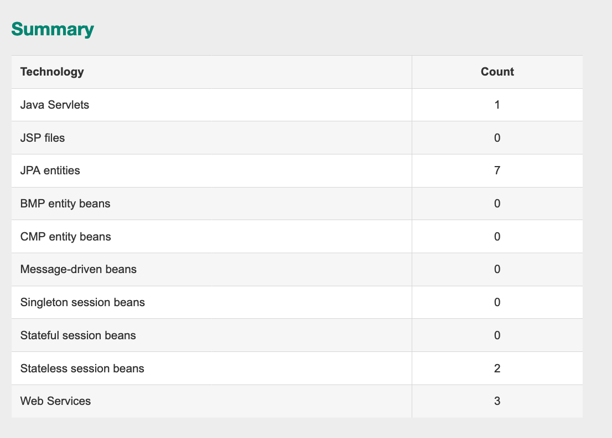
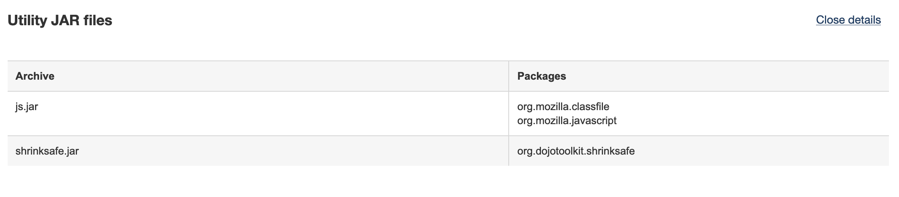
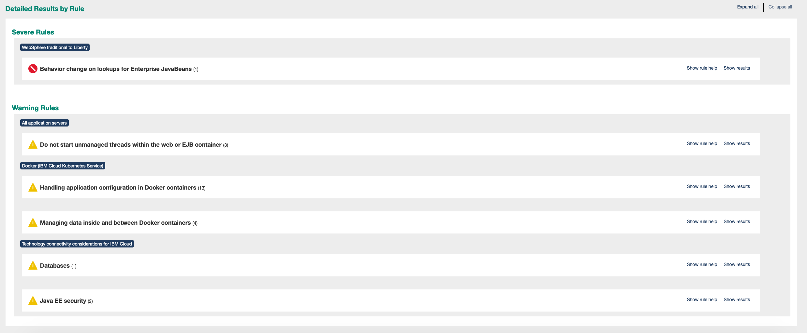

import Globals from 'gatsby-theme-carbon/src/templates/Globals';

<PageDescription>

## **Analyze the scan result of the Exising Application**

</PageDescription>


**Recap : **

As part of the Transformation Advisor : Part I - Scan Existing Application Session, we covered

1. Accessing the Existing Websphere Application, as a data center app, deployed in a local environment.
1. Created a workspace in the Transformation Advisor environment and then downloaded the datacollector based on the local operating and Application runtime environment. In this Websphere Application runtime.
1. Configured the Data collector to the existing application environment and then executed the datacollector to scan the existing application
1. datacollector created the scan results and published it a zip file, which will be used in this session for analyzing the results.


### Analyze the scan results

<Tabs>
<Tab label="Cloud Shell" open="true">

- Download the Scan results, reference application binaries and libaries from the below repository. Ensure you are in the branch 'was'
  'https://github.com/ibm-gsi-ecosystem/appmod-advance-app.git'  - Branch : liberty

-  Repository contains following artifacts. Scan results are included in the repository for convinience. If you are able to execute the previous steps on your Laptop/Desktop, you already have the scan results. Alternatively, you can use the below reports for analyzing
    - scan-results (folder):  contains the "AppSrv01.zip" that will be used to analyze the Application using Transformation Advisor
    - src (folder): It has Server.xml (reference), db2jcc.jar and db2jcc_license_cu.jar.
        a) db2jcc.jar along with Application binaries will be used along with target files generated by Transformation Advisor as part of migration.
        b) db2jcc_license_cu.jar has to be separately uploaded to the repo that is created for migration in the coming below steps. This would be in newly created repo to the folder represented(src/main/liberty/lib/)
        c) server.xml can be used as reference for the deployment of the liberty code, by configuring the Database information

    **Note : **  Inorder to enable the CI pipeline, the below set of files is required during the deployment of the application in the openshift cluster.

    - pom.xml (file): The original pom.xml generated by TA will be replaced by this file. This file has customized to the customerorderservice project and package from the one generated by TA, hence would be replaced.
    - Jenkinsfile (file): Contains the definition to the pipeline using the javalibertyapp image
    - charts (folder): Contains the files related to pipeline deployment configuration


</Tab>
<Tab label="Desktop/Laptop" open="true">

- You now have the Scan Results of the application for analyzing

- The Application Source is distributed across in the below location. You will need this uploading to the transformation advisor
    ```binaries
    cd appmod-advance-app/CustomerOrderServices
    cd appmod-advance-app/CustomerOrderServicesApp 
    cd appmod-advance-app/CustomerOrderServicesProject
    cd appmod-advance-app/CustomerOrderServicesWeb
     ```
- The Application can be build as below:

    ```bash 
    cd CustomerOrderServicesProject 
    mvn install
    ```

- The DB2 libararies are present in the below location. You will upload the "db2jcc.jar" in the Transformation advisor and later push the "db2jcc_license_cu.jar" to your git repository (one you will be creating during this phase for the migration bundle)

    ```binaries
    cd appmod-advance-app/Docker/db2drivers
    ```
- Also, download the application related files from the below repository, which shall be used for the deployment of the application during the course of the Lab exercise. The branch should be 'was'
    
    'https://github.com/ibm-gsi-ecosystem/appmod-advance-app.git'  - Branch : was
    

</Tab>
</Tabs>


In this section, you will upload the results from the data collector to the Transformation Advisor UI and analyze the findings.

- Access the Open Shift Cluster Dashboard to open the Transformation Advisor dashboard which as part of the Cloud-Native Toolkit menu.


- Now that namespace and collection are created, access the Workspace (appmod_{initials}) and the Collection.

- The Data collector / Upload data screen appears as shown

    

- Click `Upload data` and specify the `AppSrv01.zip` file you created from scanning the app

    After a few moments, the UI will display the Results page.

    

#### Review the results

Take a moment to review the results. Transformation Advisor has determined this application is "Moderate" to move to 'Liberty on Open Shift'.

- In the case of the CustomerOrderServicesApp.ear application, IBM Cloud Transformation Advisor has determined that the migration to WebSphere Liberty on  Openshift is of Moderate complexity and that there are Severe Issues that have been detected.

- Click on the the `CustomerOrderServiceApp.ear` and read the Overall Complexity to Create and configure a suitable traditional WebSphere Base on containers result.
    

Scroll down and note the External Dependencies that have been detected to be required by this application. Remember the DB2 database? Transformation Advisor detected that the application uses the database. It is telling you that either you will need to move the database to the public cloud.

- Review the Technology Issues section - It points that there is a severity issue to be fixed with reference to the EJBLookups

- Scroll to the bottom of the page and review the Technology Report, Inventory Report, and Analysis Report

Note that at the top of each report, the command line parameters are shown. This helps to validate that your settings in `customCmd.properties` have been detected.


#### Review each of the reports:

- **Technology Report**
    - Lists the Java EE features used by the application
    - Maps these features to the capabilities of the various WebSphere editions

    This is a useful first step to determining whether this application will run on Liberty.

    

- **Inventory Report**

    - Lists the Java EE components in the application

    This helps give an idea of the size of the monolith and identify the number of EJBs and web services.

    

    - Shows the application structure

    This shows which JARs are included in the application, which helps identify technical debt such as old versions of Struts, Spring, and Hibernate, and whether the application packages IBM or JEE JARs that can cause classloading issues later.

    

    - Lists the Utility JAR files

    This shows which packages are in each JAR, which is especially useful if the client doesn't know which Java packages to scan. If you find this part of the report lists client code in packages that the scanner ignored such as `org` and `net`, you will need to update the `customCmd.properties` file to include these packages and re-run the scan.

    

- **Analysis Report**

    - Lists the issues found during the scan of the application

    Review the Severe and Warning results using the `show rule help` and `show results` links. Note that there are no severe result for this application and every item shown as warning. If there are Resuls related to severe (shown are red indicator), there would need some appropriate action to be performed prior deployment.

    

- Close the open report tabs and return to the Recommendations page

Let's go ahead and now modernize this application to Liberty in the next session.


## Summary

You have now completed the Anlaysis the various reports Technology Report, Inventory Reports, Analysis report from  the scan results of the existing application using Transformation Advisor. Now that we have analysed, we will move the application to liberty and deploy in the openshift cluster provisioned in the IBM Cloud
