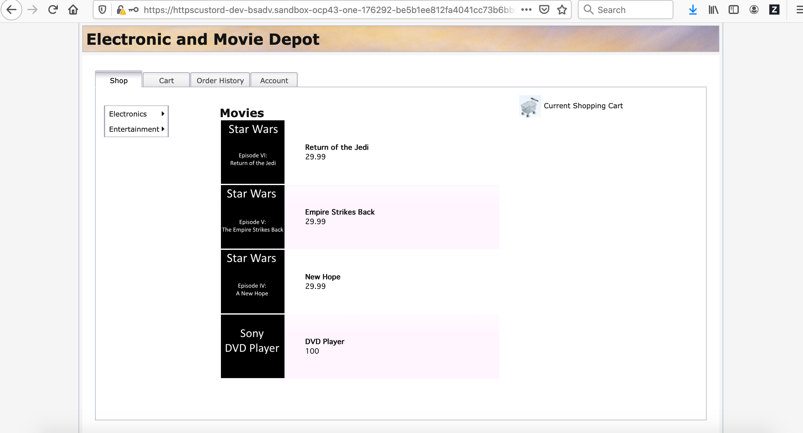

import Globals from 'gatsby-theme-carbon/src/templates/Globals';

<PageDescription>

## **Migrate Application to Liberty Container on IBM Cloud**

</PageDescription>


**Recap : ** 

As part of the Transformation Advisor : Part 2 - Analyse the scan results, we covered

1. Uploading the scanned results to the Transformation Advisor 
1. Transformation Advisor generates the recommendations and reports based on the scanned results
1. Analyzed the Technology report, Inventory report and Analysis report of the existing application to see the fitment for migration.


### Migrate to Liberty

As part of this session, we will start with preparation stage of the existing application to container based stack on IBM Cloud using the Transformation advisor. As in the previous part, navigate to your workspace in the Transformation Advisor that is already created earlier.

Transformation Advisor creates some accelerators to speed up the process of migrating an application. These files are a starting point for most modernization journeys and require modification. In this section, you will modify those files for CustomerOrderServiceApp.

- From the main recommendations page, click the `...` link on the right for the `CustomerOrderServiceApp.ear` and select View migration plan

- You will Navigate to the Migration Bundle Page of the Transformation Advisor


- Select the Build type as Source code

- Ensure "Don't use" is selected for the "Use Accelerator for Teams Collection"

- The migration files section show the bundle that will be generated for the migration:

    - **server.xml** - Transformation Advisor extracts most of the configuration from traditional WebSphere and generates a server.xml for Liberty to use
    - **Dockerfile** - Used to create the Docker image, which includes the application and configuration for Liberty
    - **Operator resources** - Used in Red Hat OpenShift to deploy the application using the [Open Liberty operator](https://operatorhub.io/operator/open-liberty)
    - **pom.xml** - Used for Maven builds, particularly useful if the application does not already employ build scripts

- We will push the Transformation generated files to the git repo. 

- To do previous step, 
    - First we will create a new repository in your public git hub. Let us name the repository as "ta-appmodern-migrate"

    - Copy the https Url of your repository,
    'https://github.com/{username}/ta-appmodern-migrate.git'

   - Use this git repository in your Transformation Migration 
    
   - Once this is done, select the "send to git option" in the "Migration Bundle Page" to push the migration files to your git repository

- we need to add the source code that would need changes to the new base repository generated from Transformation Advisor. so lets clone the git repo to the local system

    ```bash
    git clone 'https://github.com/{user}/ta-appmodern-migrate.git'
    ```
- The source code of the application is available in the below git location in branch liberty. Download the liberty branch from the below repository 
    'https://github.com/ibm-gsi-ecosystem/appmod-advance-app.git'

- Copy the below application source code folders to the folder that is cloned from the 'https://github.com/{user}/ta-appmodern-migrate.git' repo. The application folders that needs to copied are
    1. CustomerOrderServices
    1. CustomerOrderServicesApp
    1. CustomerOrderServicesProject
    1. CustomerOrderServicesWeb

- Make the simple code changes required for the EJB lookups from the "CustomerOrderServicesWeb" which were recommended by IBM Cloud Transformation Advisor. The three Java classes that should be modified to look up Enterprise JavaBeans differently are shown in the detailed analysis view of IBM Cloud Transformation Advisor. The Java files that needs the changes from EJB lookups are as below. They are under the package called "org.pwte.example.resources"
    1. ProductResource.java

        Before
        ```bash
        productSearch = (ProductSearchService) 
        new InitialContext().lookup("ejblocal:org.pwte.example.service.ProductSearchService");
        ```

        After
        ```bash
        productSearch = (ProductSearchService) 
        new InitialContext().lookup("java:app/CustomerOrderServices/ProductSearchServiceImpl!org.pwte.example.service.ProductSearchService");
        ```
    1. CategoryResource.java

        Before
        ```bash
        productSearch = (ProductSearchService) 
		new InitialContext().lookup("ejblocal:org.pwte.example.service.ProductSearchService");
        ```

        After
        ```bash
        productSearch = (ProductSearchService) 
		new InitialContext().lookup("java:app/CustomerOrderServices/ProductSearchServiceImpl!org.pwte.example.service.ProductSearchService");
        ```

    1. CustomerOrderResource.java

        Before
        ```bash
		customerOrderServices = (CustomerOrderServices) 
        ctx.lookup("ejblocal:org.pwte.example.service.CustomerOrderServices");
        ```

        After
        ```bash
        customerOrderServices = (CustomerOrderServices) 
        ctx.lookup("java:app/CustomerOrderServices/CustomerOrderServicesImpl!org.pwte.example.service.CustomerOrderServices");
        ```

- Now that the source code modification is done, let us continue with the other changes related for the migration.  Now Copy `db2jcc_licence_cu.jar` and `db2jcc.jar` to the folder `src/main/liberty/binary/lib`  from you earlier download folder of the binaries. 'https://github.com/ibm-gsi-ecosystem/appmod-advance-app.git'
 
 **Note:** The library folders both in source and target location are same (`src/main/liberty/binary/lib`)

- Also copy the Dockerfile to the root folder of the repo. This has few project specific changes.

Ideally, Transformation Advisor could figure out enough from the original application so that the generated files contain exactly what's needed and we could use these files as-is. Unfortunately, there are some details Transformation Advisor cannot discern, so we'll need to add those into the files manually.

Edit the `server.xml` file using your favorite editor to make the following changes:

**Note:**

The db2 service provisioned in the IBM cloud shall be used as the database. Access the db2 service and navigate to the "Service Credentials Tab" to retrieve the database information listed below:
1. User name
1. password
1. db name
1. db host name
1. db port

- Ensure the below features are mapped in the server.xml

    ```bash 
    <featureManager>
      <feature>appSecurity-2.0</feature>
      <feature>ldapRegistry-3.0</feature>
      <feature>localConnector-1.0</feature>
      <feature>ejbLite-3.2</feature>  
      <feature>jaxrs-2.0</feature>  
      <feature>jdbc-4.1</feature>
      <feature>jpa-2.0</feature>
      <feature>jsp-2.3</feature>
      <feature>servlet-3.1</feature>
      <feature>monitor-1.0</feature>
      <feature>transportsecurity-1.0</feature>
    </featureManager>
    ```

- Ensure the `dataSources` and `jdbcDrivers` are configured.

- As part of the server.xml, there will be one references to jdbcDriver. This reference will map the path of the db2 and db2 licence jar  locations as `${shared.config.dir}/lib/global/db2jcc.jar` and `${shared.config.dir}/lib/global/db2jcc_license_cu.jar`. The jdbcDrive id is mapped to `DB2_Universal_JDBC_Driver_Provider_(XA)` and the javax.sql.DataSource is mapped to  `com.ibm.db2.jcc.DB2XADataSource`.  The jdbcDriver tag snipped should be like as below 

    ```bash 
   <jdbcDriver id="DB2_Universal_JDBC_Driver_Provider_(XA)" javax.sql.DataSource="com.ibm.db2.jcc.DB2XADataSource">
        <library>
            <file name="${shared.config.dir}/lib/global/db2jcc.jar"/>
            <file name="${shared.config.dir}/lib/global/db2jcc_license_cu.jar"/>
        </library>
    </jdbcDriver>
    ```  
- server.xml will have one reference of `datasource` tag. This will have an element named jdbcDriverRefs. change the jdbcDriverRefs as `DB2_Universal_JDBC_Driver_Provider_(XA)`

- In the datasource tag, as part of the `properties.db2.jcc` line, add `user="{to share}" password="{to share}" ` and provide the username and password details

- Also change the databaseName="{to share}", serverName="{to share}" and portNumber="{to share}" 

- After changing the datasource tag with jdbcDriverRefs, username & password, Database details (databaseName, serverName and portNumber), the dataSource snipped should like as below:

    ```bash 
    DATASOURCE FIRST REFERENCE:

    <dataSource containerAuthDataRef="workstationNode01/db2cloud" id="OrderDS" jdbcDriverRef="DB2_Universal_JDBC_Driver_Provider_(XA)" jndiName="jdbc/orderds">
        <properties.db2.jcc  password="????" user="????" databaseName="????"  name="OrderDS" portNumber="????" serverName="????" />
        <connectionManager agedTimeout="0" connectionTimeout="180" maxIdleTime="1800" maxPoolSize="10" minPoolSize="0" reapTime="180"/>
    </dataSource>
    ```
    **Note:*** ???? should be replaced by actual values

-  Ensure the authData is configured as below
    ```bash
     <authData id="workstationNode01/db2cloud" password="????" user="????"/>
    ```
    **Note:*** ???? should be replaced by actual values

- Ensure Keystore and BasicRegistry is configured as below
   ```bash
    <keyStore id="defaultKeyStore" password="whodunit"/>
    <!-- User and group security definitions -->

    <basicRegistry id="basic" realm="customRealm">
   	    <user name="rbarcia" password="bl0wfish"/>
        <group name="SecureShopper">
            <member name="rbarcia"/>
        </group>
    </basicRegistry>
    ```
    **Note:*** The authentication data is static and used by the application

- Validate the application tag to be 
    
    ```bash
    <application id="CustomerOrderServicesApp" location="CustomerOrderServicesApp-0.1.0-SNAPSHOT.ear" name="CustomerOrderServicesApp" type="ear">
        <classloader apiTypeVisibility="spec, ibm-api, third-party" />
    </application>
    ```

- Save your changes

    **Note:** Reference server.xml with the changes is also available in the downloaded reference repo 'https://github.com/ibm-gsi-ecosystem/appmod-advance-app.git’. The location is `src/main/liberty/binary/config`.  The database details marked in ???? has to be replaced by the actual database info.

 

- The modified `server.xml` should look like this:
   ```
   <?xml version="1.0" encoding="UTF-8"?><!--Generated by IBM TransformationAdvisor
    Fri Apr 17 13:12:09 UTC 2020-->
    <server>
    <!--These elements have been identified from this application's configuration.-->
        <featureManager>
            <feature>appSecurity-2.0</feature>
            <feature>ldapRegistry-3.0</feature>
            <feature>localConnector-1.0</feature>
            <feature>ejbLite-3.2</feature>  
            <feature>jaxrs-2.0</feature>  
            <feature>jdbc-4.1</feature>
            <feature>jpa-2.0</feature>
            <feature>jsp-2.3</feature>
            <feature>servlet-3.1</feature>
            <feature>monitor-1.0</feature>
            <feature>transportsecurity-1.0</feature>
        </featureManager>
        <httpEndpoint host="*" httpPort="9080" httpsPort="9443" id="defaultHttpEndpoint"/>
        <authData id="workstationNode01/db2cloud" password="OWJiNDk0YzRkN2Yz" user="bluadmin"/>

        <keyStore id="defaultKeyStore" password="whodunit"/>
        <!-- User and group security definitions -->

        <basicRegistry id="basic" realm="customRealm">
            <user name="rbarcia" password="bl0wfish"/>
            <group name="SecureShopper">
                <member name="rbarcia"/>
            </group>
        </basicRegistry>

        <jdbcDriver id="DB2_Universal_JDBC_Driver_Provider_(XA)" javax.sql.DataSource="com.ibm.db2.jcc.DB2XADataSource">
            <library>
                <file name="${shared.config.dir}/lib/global/db2jcc.jar"/>
                <file name="${shared.config.dir}/lib/global/db2jcc_license_cu.jar"/>
            </library>
        </jdbcDriver>

        <dataSource containerAuthDataRef="workstationNode01/db2cloud" id="OrderDS" jdbcDriverRef="DB2_Universal_JDBC_Driver_Provider_(XA)" jndiName="jdbc/orderds">
            <properties.db2.jcc  password="????" user="????" databaseName="????"  name="OrderDS" portNumber="????" serverName="????" />
            <connectionManager agedTimeout="0" connectionTimeout="180" maxIdleTime="1800" maxPoolSize="10" minPoolSize="0" reapTime="180"/>
        </dataSource>

        <variable name="DERBY_JDBC_DRIVER_PATH" value="${shared.config.dir}/lib/global"/>
        <variable name="DB2UNIVERSAL_JDBC_DRIVER_NATIVEPATH" value="${shared.config.dir}/lib/global"/>
        <applicationManager autoExpand="true"/>
        <!--These elements are from the profile level configuration. Not all of them may be necessary for your application.-->

        <application id="CustomerOrderServicesApp" location="CustomerOrderServicesApp-0.1.0-SNAPSHOT.ear" name="CustomerOrderServicesApp" type="ear">
            <classloader apiTypeVisibility="spec, ibm-api, third-party" />
        </application>
    </server>
    ```
- Push the change to Git (Application Source Change, server.xml and db2 jars)
    ```bash
    git add .
    git commit -m "Changes related to Application Source, DB -server.xml and db2 jars"
    git push
    ```


Now that we've configured Liberty and the application, let's deploy it on the Openshift.


### Run the application on Liberty

<Tabs>

<Tab label="oc pipeline" open="true">


</Tab>
<Tab label="S2I" open="true">  
Now that we are ready for the application deployment on the Openshift cluster, we will here follow the S2I (Source to Image approach) for the build and deployment. Let us use the Cloud Shell for the same.

**Note:**

Ensure you **don't copy** and push to the git, any of the below folders and files that are used by the pipeline from the reference repo ‘https://github.com/ibm-gsi-ecosystem/appmod-advance-app.git’.


1. Copy charts (folder) 
1. Copy assets (folder)
1. Copy Jenkinsfile (file) 
1. Copy pom.xml (file). Use only the default pom generated by the TA 
    

The steps below will help to deploy the application to the cluster using S2I

- Login to your OC cluster using the Copy Login Command from the browser of the openshift console
    ```bash
    oc login {Cluster info}
    oc project dev-{initial} 
    oc project -q  
    ```

- Let us use openshift S2I to build and deploy

    ```bash
    oc new-app 'https://github.com/{repo}/ta-appmodern-migrate.git' --name=customerorderservice
    .....
    .....

    --> Success
        Build scheduled, use 'oc logs -f bc/customerorderservice' to track it progress
        Application is not exposed. You can expose services to the outside world by 
    executing one or more of the commands below:
          'oc expose svc/customerorderservice'
        Run 'oc status' to view your app
    ```

- Check the logs to track the build and deployment. This will take few minutes to deploy
    ```bash
    oc logs -f bc/customerorderservice
    ```

    Once the deployment is completed, create the service for the application

    ```bash
    oc expose svc/customerorderservice
    oc status
    ```

- If you need to redeploy the app after some changes, you can do this by manually triggering the below command
    ```bash
    oc start-build customerorderservice
    ```

- Now you can access the application by getting the hostname for the application by using get routes
    ```bash
    oc get routes | grep customerorderservice
    ```

- Now configure the https route for the Application

    - open the browser and navigate to the OpenShift dashboard console

    - navigate to the 'Routes' in the Networking section of the left nav.

    - click on the create Route button

    - provide name to the route

    - leave the hostname and the  Path as is.

    - select the Service that you have created. Here it should be 'customerorderservice'

    - select the target port as 9443 -> 9443 (TCP)

    - check the 'Secure Route' checkbox 

    - select the 'TLS Termination' as 'Passthrough'

    - click on the 'create' button to create the https route. This will be used for accessing the application using the secured https protocol

- Test the app

    - Open the browser and navigate to the OpenShift dashboard console

    - Navigate to the 'Topology' section in the left nav.

    - Select your project/name-space and then select the Application. 

    - After selection of the application, on the right you will be able to see details of the application in tabs/sections as Overview and Resources

    - As part of the Resource tab, you can get the routes of the application.

    - Click the link of the https route  that you have created in the previous step to access the application
    
    - The route will open a new tab. Add the Path /CustomerOrderServicesWeb at the end, to access the application

    - The application would request for the secured access. Provide User name as 'rbarcia' and password as 'bl0wfish' to access the application

    - You will be able to landup in the home page of the application.

    


</Tab>
</Tabs>

That's it. You now have this application running on Liberty in a Docker container which is sufficient for this exercise.

## Summary

You have now completed a simple Application with minor code changes as part of the Modernization exercises in multiple steps. This exercise demonstrated a simple Application modernization scenario that can be moved to cloud with code changes to the application.
