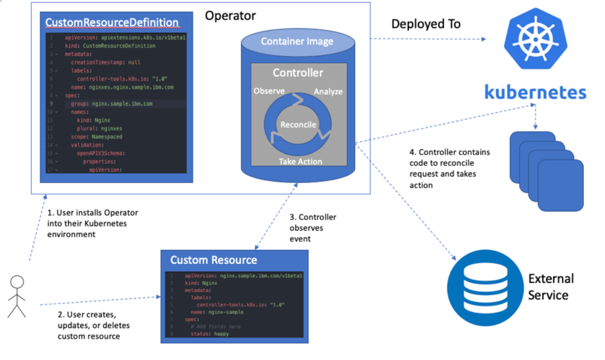
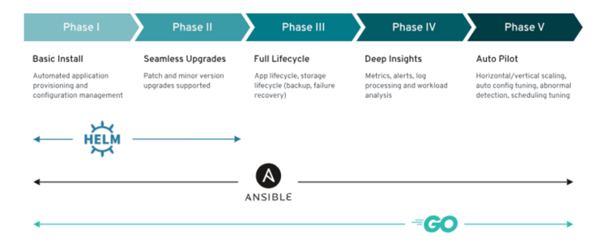
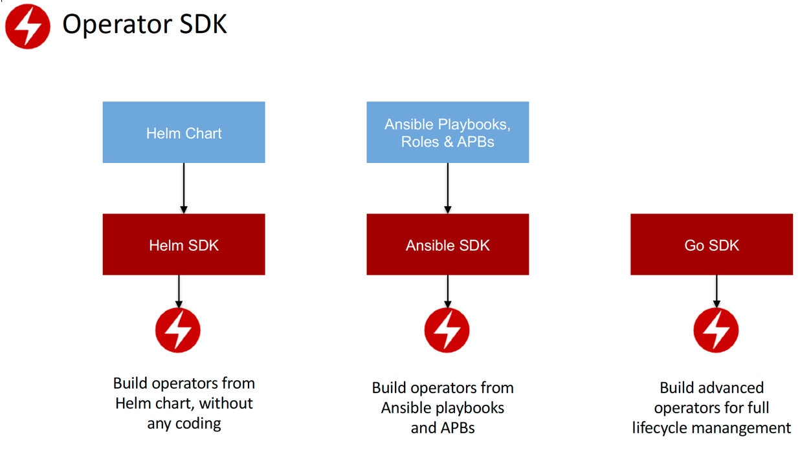

import Globals from 'gatsby-theme-carbon/src/templates/Globals';

## Introduction
  - Operators serve as a packaging mechanism for distributing applications on Kubernetes, and they monitor, maintain, recover, and upgrade the software they deploy.

  - An Operator is a Kubernetes-native set of resources, defined as a controller combined with one or more custom resource definitions. The controller is custom code that is deployed to a Kubernetes cluster and is designed to watch for changes to custom Kubernetes resources and react to them. 
     https://kubernetes.io/docs/concepts/extend-kubernetes/operator/

  - Operators are clients of the Kubernetes API that act as controllers for a Custom Resource.
      To write applications that use the Kubernetes REST API, you can use one of the following supported client libraries:
    - Go,
    - Python,
    - Java,
    - CSharp dotnet,
    - JavaScript,
    - Haskell.

### How Operators Work

Operators work by extending the Kubernetes control plane and API. In its simplest form, an Operator adds an endpoint to the Kubernetes API, called a custom resource (CR), along with a control plane component that monitors and maintains resources of the new type. 

 

###  Operator maturity model

Conceptually, an Operator takes human operational knowledge and encodes it into software that is more easily packaged and shared with consumers. How you approach and build your Operator is up to you. Advanced Operators are designed to handle upgrades seamlessly, react to failures automatically, and not take shortcuts, such as skipping a software backup process to save time.

- There are a number of entry points into developing Operators depending on where you are coming from. Red Hat describes the maturity of each as follows:

### Operator Framework

Operators give you a convenient way to package, deploy, manage and distribute applications for Kubernetes. 

- The method allows you to package configuration so that users can deploy operators from a simple catalog without having to engage administrators. You can distribute operators beyond your organization using OperatorHub.io which is open to all contributions or the Red Hat OpenShift OperatorHub using Red Hat's certification process. 

#### Operator SDK 
  

Allows developers to build, package and test an Operator based on your expertise without requiring all the knowledge of Kubernetes API complexities

#### Operator Lifecycle Manager (OLM)

Helps you to deploy, and update, and generally manage the lifecycle of all of the Operators (and their associated services) running across your clusters

#### Operatorhub.io 

Publishing platform for Kubernetes Operators, allows for easy discovery and install of Operators using a graphical user interface

#### Overview of the OperatorHub

At the OperatorHub.io, you find ready to use operators written by the community.

- The OperatorHub is available via the OpenShift Container Platform web console and is the interface that cluster administrators use to discover and install Operators. 

### Learn more

Learn more about using Operators:
<AnchorLinks>
  <AnchorLink to="https://coreos.com/operators/">Operators</AnchorLink>
  <AnchorLink to="https://github.com/operator-framework">Operator Framework</AnchorLink>
  <AnchorLink to="https://kubernetes.io/docs/concepts/extend-kubernetes/operator/ ">Kubernetes – operator pattern</AnchorLink>
  <AnchorLink to="https://docs.openshift.com/container-platform/4.3/operators/operator_sdk/osdk-getting-started.html">OpenShift 4.3 - Getting started with the Operator SDK </AnchorLink>
  <AnchorLink to="https://blog.openshift.com/operators-on-ocp-4-x/">Operators on Red Hat OpenShift 4.x</AnchorLink>
  <AnchorLink to="https://www.redhat.com/en/resources/oreilly-kubernetes-operators-automation-ebook">O’Reilly: Kubernetes Operators: Automating the Container Orchestration Platform</AnchorLink>
</AnchorLinks>