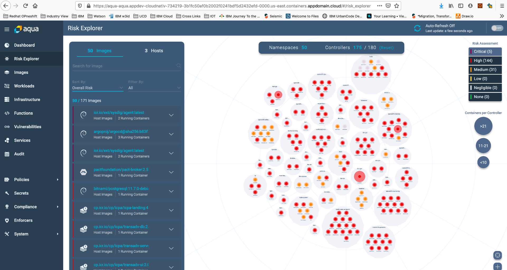
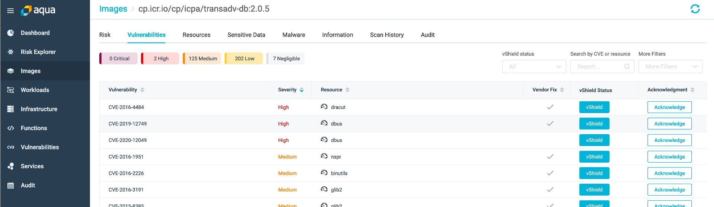

import Globals from 'gatsby-theme-carbon/src/templates/Globals';

<PageDescription>

DevSecOps with Aquasec CSP

</PageDescription>

## Guide

Aqua CSP provides full lifecycle security for your cloud native applications (containers, orchestrators, cloud VMs, and serverless functions) at a very granular level. Aqua includes preventive controls to secure the development pipeline; protects applications in runtime; detects and blocks attacks; and provides visibility and auditing for security risk management and compliance.

Aqua CSP:

   * Integrates with your existing workflows for building, shipping, running, and securing your cloud workloads
   * Works with the leading orchestrators and cloud provider platforms
   * Secures environments consisting of servers running Linux and Windows, as well as CaaS  and FaaS cloud services
   * Provides you with full audit logs of security-related events that have occurred on your hosts or in your containers and serverless functions

## Version
On IBM Managed Openshift 4.3 , the installation of Aqua CSP 4.6 was carried out

## Architecture :
 

## Key Features :
 Aqua integrates within your development workflows (build, ship, and run phases) to provide full lifecycle security for your cloud workloads, running across VMs, container platforms, and serverless functions.

* Container Runtime Protection for protecting containers at runtime against malicious and unauthorized activities
* Image Assurance for assessing container images against vulnerabilities, malware, secrets, and security best practices
* Host Assurance for assessing VMs against vulnerabilities, malware, and security best practices (e.g., CIS benchmarks)
* Host Runtime Protection for protecting your VMs against malicious and unauthorized activities
* Function Assurance and Runtime Protection for serverless functions
* Network Micro-Segmentation using automated discovery and firewall rules for cloud workloads
* Monitor host logins, both successful and failed
* Vulnerability Shield™ (vShield), a virtual patch for vulnerabilities using a runtime policy that prevents vulnerability exploitation

## Installation on IBM Cloud Managed Openshift v4.3 :
On Openshift's OperatorHub leverage the Aquasec Operator to automate the maintenance of mundane operational duties. 
This makes the use of Aqua’s Cloud Native Security Platform (CSP), particularly the deployment and scanning pieces, more seamless.
The Aqua Server components ( Server, DB Gateway ) are deployed as Pods and Services, while the Aqua Enforcer is deployed as a DaemonSet.

## Aqua Dashboard
Displays alerts, containers running, images scanned, Enforcers deployed, and vulnerabilities discovered in images

 

## Risk Explorer
The Risk Explorer presents a dynamic display of the workloads (containers) running in your cloud native environment, and the security risks associated with them. 
It is specifically designed to help you quickly visualize and understand these risks, and take concrete actions to manage them. 
The Risk Explorer calculates and assigns an overall risk assessment to these objects: images, hosts, containers, and controllers. 

 

## Aqua Images
Aqua CSP provides full lifecycle security for your containerized applications, running either on Linux or Windows hosts. 
The overall goal of full container lifecycle security is the deployment of applications that ensure the security of your applications' operations, data, and computing infrastructure.

Aqua Image Assurance covers the first part of the container lifecycle: image development. 
The Image Assurance subsystem detects, assesses, and reports security issues in your images. 
Next, Aqua provides different forms of risk management, based on your preferences:

    Aqua can block the deployment of containers based on images with security issues.
    Alternatively, it can help you mitigate the risk of deploying such containers based on images with known risks.
    Through Risk-based Insights, Aqua can also identify running containers based on images with vulnerabilities and known exploits "in the wild".

     

     

