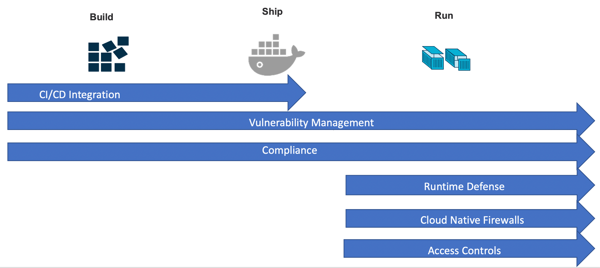

### Container Security 
Container security is the process of implementing security tools and policies that will give you the assurance that everything in your container is running as intended. 
This includes protecting the infrastructure, the software delivery chain, runtime, and everything in between.With this in mind, the process of securing containers is continuous. 
It should be integrated into your development process, automated to remove the number of manual touch points, and extended into the maintenance and operation of the underlying infrastructure. 
This means protecting your build pipeline container images and runtime host, platform, and application layers. 
Implementing security as part of the continuous delivery life cycle means your business will mitigate risk and reduce vulnerabilities across an ever-growing attack surface.

## BUILD
Goal : Shift-left by securing your pipeline, reduce risk

- Image Quality 
  Before using a docker image - it is important to understand Where is it coming from and Who is it coming from 
  Image labels provide metadata for the image you’re building. This help users understand how to use the image easily. 
  The most common label is “maintainer”, which specifies the email address and the name of the person maintaining this image.

- Least Privileged user
  When a Dockerfile doesn’t specify a USER, it defaults to executing the container using the root user. Docker defaults to running containers using the root user.
  When that namespace is then mapped to the root user in the running container, it means that the container potentially has root access on the Docker host. 
  Having an application on the container run with the root user further broadens the attack surface and enables an easy path to privilege escalation 
  if the application itself is vulnerable to exploitation.
  To minimize exposure, opt-in to create a dedicated user and a dedicated group in the Docker image for the application;

- CI tools 
  “Shift Left” security early into the DevOps pipeline, accelerating application delivery and removing obstacles to digital transformation.
  Example : Integrating Security scan into Jenkins / Tekton pipelines as part of Build.

- Scanning Tools 
  Leverage scanning tools to provide comprehensive visibility and threat detection across your organization’s hybrid, multi-cloud infrastructure.
  For securing your host, container, and functions across the application lifecycle.
  Example :  AquaSec CSP , Prisma Cloud Compute Edition (Twistlock) , Trivy

- Secrets Management 
  In many environments there is a need to pass sensitive information like passwords, connection strings, or tokens into a container. 
  Team can adopt a central management and secure distribution of secrets into running containers.
  Example : HashiCorp Vault 

- Signed Images 
  Signing your docker images will add some layer of trust to your images. 
  This can guarantee a consumer of your image that this image is for sure published by you and hasn’t been tampered
  Example : Docker Content Trust , Notary , Redhat Signature

## SHIP
Goal : Only run trusted code, enforce immutability

- Trusted Registries and Repository 
Store images in private Trusted Registry with access controls enabled 
Example: Redhat Quay , IBM Container Registry , AWS ECR , Azure Container Registry ,Google Container Registrty 

- Signature Authenticating and Authorizing

- Image scanning
Regularly scans images from the registry for vulnerabilities, sensitive data, and malware and issues alerts when detecting vulnerabilities

- Integrity Assurance

## RUN
Goal : Protect workloads, focus on whitelisting and automation

- Prevent deployment of images  with known vulnerabilities
Leverage controls  during the  run phase of containers, where applications are scanned for vulnerabilities as they are promoted through the software development life cycle process.
Creating a runtime security policy can help define appropriate response actions during runtime. If suspicious behavior is detected, the security policy will prompt alerts and remedies.
Example :  Policies defined in AquaSec CSP , Policies defined in Prisma Cloud Compute Edition (Twistlock) 

- Validate image signatures
Prevent untrusted images from running anywhere in your cluster.
The first time that you pull a signed image with Docker Content Trust enabled, your Docker client recognizes the signature as trusted. 
The Docker client pulls the most recent signed version of the image that you specify and Unsigned images or untrusted content is not pulled.

- Monitor for new vulnerabilities
Scanning Tools maintain  the latest cyber-intelligence knowledge base and scan images against it.
Example : Aqua’s CyberCenter 

- Resource Management
The ability to run as many containers as needed gives you a lot of flexibility in production. 
However, this also creates major risks in the event containers are compromised. Make sure you monitor container activity and limit use of resources. 
Design errors, software bugs, or malware attacks can lead to a DoS. You can handle the large attack surface by limiting the number of system resources allotted for each container.

- Alerting Monitoring Deployments
Monitoring systems can help you identify attacks, send alerts, and even automatically implement fixes. 
Periodically review log data generated by containers and use it to generate preventive security insights.
Example: Prometheus. 

- Network segmentation
 Automatically detect and map internal and external container, serverless and host network connections and Apply firewall rules for contextual application micro- segmentation
 and also Alert on or block unauthorized network connection attempts

## Tools Explored ;
- IBM Vulnerabilty Advisor
- AquaSecure CSP
- Prisma™ Cloud
- Opensource Trivy

