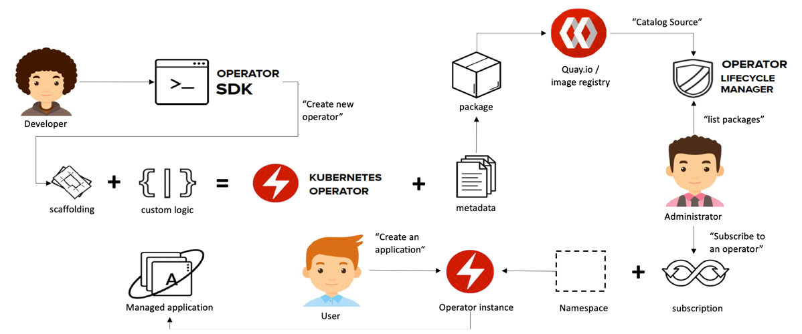
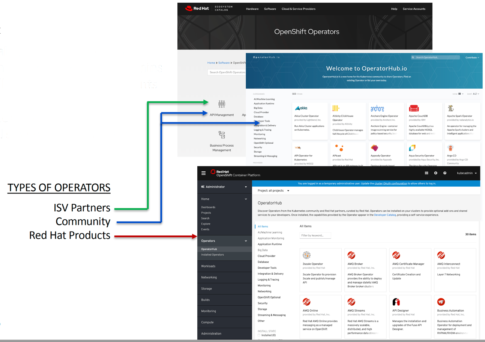
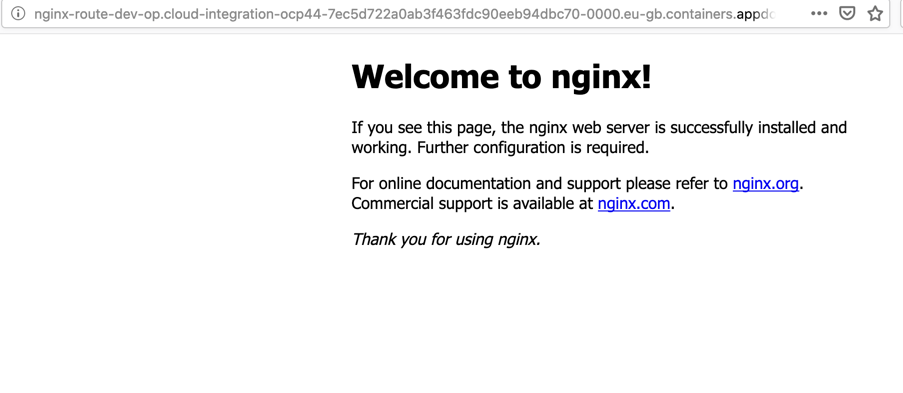

import Globals from 'gatsby-theme-carbon/src/templates/Globals';

## Introduction
  - Operators serve as a packaging mechanism for distributing applications on Kubernetes, and they monitor, maintain, recover, and upgrade the software they deploy.


  - An Operator is a Kubernetes-native set of resources, defined as a controller combined with one or more custom resource definitions. The controller is custom code that is deployed to a Kubernetes cluster and is designed to watch for changes to custom Kubernetes resources and react to them. 
     https://kubernetes.io/docs/concepts/extend-kubernetes/operator/


  - Operators are clients of the Kubernetes API that act as controllers for a Custom Resource.
      To write applications that use the Kubernetes REST API, you can use one of the following supported client libraries:
    - Go,
    - Python,
    - Java,
    - CSharp dotnet,
    - JavaScript,
    - Haskell.

### How Operators Work

Operators work by extending the Kubernetes control plane and API. In its simplest form, an Operator adds an endpoint to the Kubernetes API, called a custom resource (CR), along with a control plane component that monitors and maintains resources of the new type. 

 


###  Operator maturity model

Conceptually, an Operator takes human operational knowledge and encodes it into software that is more easily packaged and shared with consumers. How you approach and build your Operator is up to you. Advanced Operators are designed to handle upgrades seamlessly, react to failures automatically, and not take shortcuts, such as skipping a software backup process to save time.

- There are a number of entry points into developing Operators depending on where you are coming from. Red Hat describes the maturity of each as follows:


### Operator Framework

Operators give you a convenient way to package, deploy, manage and distribute applications for Kubernetes. 

- The method allows you to package configuration so that users can deploy operators from a simple catalog without having to engage administrators. You can distribute operators beyond your organization using OperatorHub.io which is open to all contributions or the Red Hat OpenShift OperatorHub using Red Hat's certification process. 




#### Operator SDK 
  

Allows developers to build, package and test an Operator based on your expertise without requiring all the knowledge of Kubernetes API complexities


#### Operator Lifecycle Manager (OLM)

Helps you to deploy, and update, and generally manage the lifecycle of all of the Operators (and their associated services) running across your clusters

#### Operatorhub.io 

Publishing platform for Kubernetes Operators, allows for easy discovery and install of Operators using a graphical user interface

#### Overview of the OperatorHub

At the OperatorHub.io, you find ready to use operators written by the community.

- The OperatorHub is available via the OpenShift Container Platform web console and is the interface that cluster administrators use to discover and install Operators. 



### Creating Helm-based Operators to install NGINX Webserver on ROKS 4.4 using the Operator SDK 

#### Install the Operator SDK CLI

- Install from Homebrew (macOS)
- Install from GitHub release
- Compile and install from master

Visit here for more details: https://sdk.operatorframework.io/docs/install-operator-sdk/

#### Installing from Homebrew (MacOS)

You can install the SDK CLI using Homebrew. 

#### Prerequisites

  * Homebrew
  * docker v17.03+, podman v1.2.0+, or buildah v1.7+
  * OpenShift CLI (oc) 4.4+ installed
  * Access to a cluster based on Kubernetes v1.12.0+
  * Access to a container registry 

#### Procedure

1. Install the SDK CLI using the brew command:
  ```
    $ brew install operator-sdk 
  ``` 
2. Verify that the CLI tool was installed correctly:
  ```
    $ operator-sdk version
  ```

### Building a Helm-based Operator using the Operator SDK

This procedure walks through an example of building a simple Nginx Operator powered by a Helm chart using tools and libraries provided by the Operator SDK. 


#### 1. Create a new Operator project

To create a new Helm-based, namespace-scoped nginx-operator project, use the following command:

    $ operator-sdk new nginx-operator \
      --api-version=example.com/v1alpha1 \
      --kind=Nginx \
      --type=helm

    $ cd nginx-operator

This creates the nginx-operator project specifically for watching the Nginx resource with APIVersion example.com/v1apha1 and Kind Nginx.

#### 2. Deploy the CRD

Before running the Operator, Kubernetes needs to know about the new custom resource definition (CRD) the operator will be watching. Deploy the following CRD:

    $ oc create -f deploy/crds/example_v1alpha1_nginx_crd.yaml

#### 3. Build and run the Operator.

There are two ways to build and run the Operator:

- As a Pod inside a Kubernetes cluster.
- As a Go/Helm/Ansible program outside the cluster using the operator-sdk up command. 


##### (A) Build the nginx-operator image and push it to a registry:

  ```  
  $ operator-sdk build docker.io/$DOCKER_USERNAME/nginx-operator:v0.0.1
  ```

  ```
  $ docker login docker.io -u $DOCKER_USERNAME -p $DOCKER_PASSWORD
  ```

  ``` 
  $ docker push docker.io/$DOCKER_USERNAME/nginx-operator:v0.0.1
  ```    
      
##### (B) Deployment manifests are generated in the deploy/operator.yaml file. 
  
  The deployment image in this file needs to be modified from the placeholder REPLACE_IMAGE to the previous built image. To do this, run:
      
      $ sed -i 's|REPLACE_IMAGE|docker.io/$DOCKER_USERNAME/nginx-operator:v0.0.1|g' deploy/operator.yaml

Note If you are performing these steps on OSX, use the following sed command instead:

      $ sed -i "" 's|REPLACE_IMAGE|docker.io/$DOCKER_USERNAME/nginx-operator:v0.0.1|g' deploy/operator.yaml

##### (C) Deploy the nginx-operator:

      $ oc create -f deploy/service_account.yaml
      $ oc create -f deploy/role.yaml
      $ oc create -f deploy/role_binding.yaml
      $ oc create -f deploy/operator.yaml

##### (D) Verify that the nginx-operator is up and running:

      $ oc get deployment
  
#### 4. Deploy the Nginx CR.

  Apply the Nginx CR that you modified earlier:

    $ oc apply -f deploy/crds/example.com_v1alpha1_nginx_cr.yaml

  Ensure that the nginx-operator creates the Deployment for the CR:

    $ oc get deployment

  Check the Pods to confirm two replicas were created:

    $ oc get pods

  
#### Note:
The result is actually a failure. Well, that is frustrating - helm install reported that the chart was deployed. From a helm perspective I think this is fair since it did its job and the objects have been created in the environment, however, the pod was unable to come up. 
This was because of the container is attempting to run as root which is naughty. We find this out by inspecting the pod logs.

```
[warn] 1#1: the "user" directive makes sense only if the master process runs with super-user privileges, ignored in /etc/nginx/nginx.conf:2
nginx: [warn] the "user" directive makes sense only if the master process runs with super-user privileges, ignored in /etc/nginx/nginx.conf:2
[emerg] 1#1: mkdir() "/var/cache/nginx/client_temp" failed (13: Permission denied)
nginx: [emerg] mkdir() "/var/cache/nginx/client_temp" failed (13: Permission denied)
```

Let’s add the serviceaccount to the anyuid scc and proceed.

```
 oc get sa
NAME                 SECRETS   AGE
builder              2         134m
default              2         134m
deployer             2         134m
example-nginx        2         72m
memcached-operator   2         106m
nginx-operator       2         73m
```

``` 
bash-5.0$ oc adm policy add-scc-to-user anyuid -z example-nginx

securitycontextconstraints.security.openshift.io/anyuid added to: ["system:serviceaccount:dev-op:example-nginx"]
```

Delete the pod from the OpenShift Console which will recreate the POD

 

#### 5. Update the replicaCount

Change the spec.replicaCount field from 2 to 3, remove the spec.service field, and apply the change:

    $ cat deploy/crds/example.com_v1alpha1_nginx_cr.yaml

    $ oc apply -f deploy/crds/example.com_v1alpha1_nginx_cr.yaml

Confirm that the Operator changes the Deployment size:

    $ oc get deployment

Check that the Service port is set to the default 80:

    $ oc get service

#### 5. Create Route for the service & Access via browser

- Create the Route for the example nginx service


- Access the route url from the browser for verification



This demonstrates how you use operator sdk to develop the helm based operator for the nginx web server which is successfully installed and working

#### 6. Clean up the resources:

    $ oc delete -f deploy/crds/example.com_v1alpha1_nginx_cr.yaml
    $ oc delete -f deploy/operator.yaml
    $ oc delete -f deploy/role_binding.yaml
    $ oc delete -f deploy/role.yaml
    $ oc delete -f deploy/service_account.yaml
    $ oc delete -f deploy/crds/example_v1alpha1_nginx_crd.yaml


## Write your own operator

To write your own operator you can use existing tools:
- KUDO (Kubernetes Universal Declarative Operator),
- kubebuilder,
- Metacontroller using custom WebHooks,
- the Operator Framework.

The Operator SDK provides the following workflow to develop a new Operator:

The following workflow is for a new Go operator:
- Create a new operator project using the SDK Command Line Interface(CLI)
- Define new resource APIs by adding Custom Resource Definitions(CRD)
- Define Controllers to watch and reconcile resources
- Write the reconciling logic for your Controller using the SDK and controller-runtime APIs
- Use the SDK CLI to build and generate the operator deployment manifests


### Learn more

Learn more about using Operators:
<AnchorLinks>
  <AnchorLink to="https://coreos.com/operators/">Operators</AnchorLink>
  <AnchorLink to="https://github.com/operator-framework">Operator Framework</AnchorLink>
  <AnchorLink to="https://kubernetes.io/docs/concepts/extend-kubernetes/operator/ ">Kubernetes – operator pattern</AnchorLink>
  <AnchorLink to="https://docs.openshift.com/container-platform/4.3/operators/operator_sdk/osdk-getting-started.html">OpenShift 4.3 - Getting started with the Operator SDK </AnchorLink>
  <AnchorLink to="https://blog.openshift.com/operators-on-ocp-4-x/">Operators on Red Hat OpenShift 4.x</AnchorLink>
  <AnchorLink to="https://www.redhat.com/en/resources/oreilly-kubernetes-operators-automation-ebook">O’Reilly: Kubernetes Operators: Automating the Container Orchestration Platform</AnchorLink>
</AnchorLinks>