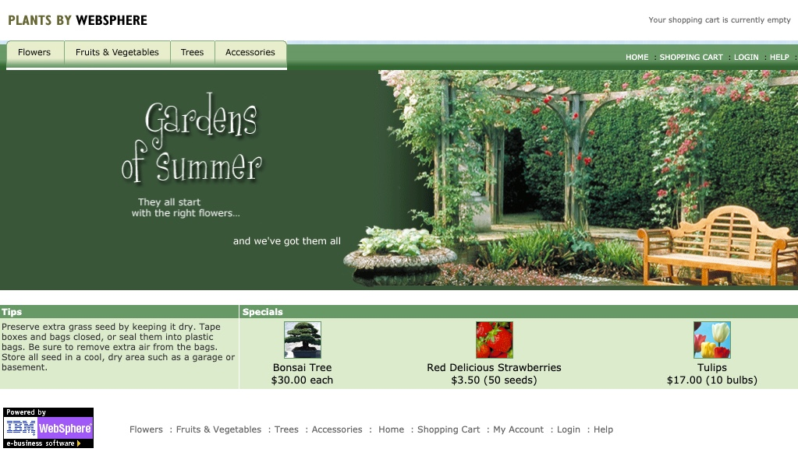

import Globals from 'gatsby-theme-carbon/src/templates/Globals';

<PageDescription>

## **Run Data Collector against the Websphere Application**

</PageDescription>

The exercise is focused on migrating a Java EE app, that requires no code changes, from tradition WebSphere environment to the Openshift Liberty Container on the IBM Cloud.

The exercise is divided into three parts and the Part 1, is focussed on Scanning the existing application and collecting data using data collector of the Transformation Advisor.

This exercise assumes the following:

1. You are using a <Globals name="env" /> that has already been installed.
1. Cloud Pak for Applications has already been installed in the environment.
1. You have Docker Desktop running on your laptop (one of the prerequisites).


## Business need

This WebSphere Application Server customer finds itself in a common situation: They have a bunch of legacy monolithic applications running in WebSphere Application Server Network Deployment (WebSphere ND) on traditional IT. This was state-of-the-art back when the applications were first deployed, but the runtime requires periodic maintenance and constant administration. Now the customer would like to host the application in a cloud environment, but they have no desire to make any code changes to move the apps. While it might be beneficial for the customer to invest money in rethinking and redesigning their entire portfolio of applications to move off of traditional WebSphere, in reality this is overkill for applications that still provide the proper business functionality just fine. For these legacy monoliths, we can reduce the maintenance overhead by moving to WebSphere Liberty and running on Red Hat OpenShift. We can also reduce the administrative overhead by implementing a common CI/CD and SRE practices.

In this exercise, you will learn the skills to be able to demonstrate how *some* applications can be moved to Liberty in a Docker container without the need to make code changes. This approach known as [runtime modernization](https://www.ibm.com/cloud/garage/architectures/runtime-modernization-solution/), which doesn't address the technical debt in the application but does remove the technical debt created by the WebSphere Application Server runtime. This approach can also be used to migrate applications running in other Java EE servers like Oracle WebLogic Server or Apache Tomcat. We will migrate the application using [IBM Cloud Transformation Advisor](https://www.ibm.com/garage/method/practices/learn/ibm-transformation-advisor). This approach is one strategy for the overall modernization of a legacy Java application portfolio and an important skill to have.

### Project hill

Here's the [hill statement](https://www.ibm.com/garage/method/practices/think/practice_hills/) describing the desired outcome of this migration:

- **Who**: Operations teams are tasked with moving existing Java applications from traditional WebSphere ND to "the Cloud" and don't have access to developers for the majority of the legacy Java portfolio.

- **What**: This is an application that users still need. They consider it good enough as-is: While bug fixes and new features might be desirable, the aren't worth the expense. Or step 1 for making the app more maintainable is moving it to the cloud where it'll be easier to improve it using modern development techniques like continuous deployment. The operations team needs to move to "the Cloud" and wants to standardize on Docker containers that they can run anywhere.

- **Wow**: With a few simple steps, you can move an application and the associated configuration to a Liberty runtime in a Docker container without changing code. This is something that can be repeated over and over on many apps in the portfolio in a factory type engagement.

## Architecture

PlantsByWebSphere is a simple legacy monolith that runs in WebSphere Application Server with a backend database (DB2). The diagram below shows a typical customer environment with IBM HTTP Server and WebSphere Application Server Network Deployment (WebSphere ND) running on traditional IT along with the application database.

  

The target for the runtime modernization is shown below with the containerized application running on Liberty on OpenShift Container Platform and the application database remaining on traditional IT.

  

For the purposes of this lab exercise, you will run a simulation of the WebSphere ND environment on your laptop using a Docker container that contains PlantsByWebSphere, WebSphere Application Server, and a data collector. You will then use IBM Cloud Transformation Advisor--part of the Cloud Pak for Applications installed in your team's <Globals name="env" />--to analyze the WebSphere ND environment and create the artifacts you need to run the same PlantsByWebSphere application on Liberty in a Docker container on your laptop.

  

## Technical Requirements

This modernization exercise has the following requirements:
- No code changes -- You don't even have access to source code
- The target is to get the application running on Liberty in a Open Shift Cluster on IBM Cloud 
- The IBM Cloud based DB2 Service is used for Database connectivity

## Guide
Overall the Modernization exercise has the three parts that performs the below steps. However, this part 1 covers the first two aspects until scanning of the app using data collector of Transformation advisor.
- Run a pre-configured instance of traditional WebSphere in a Docker container on your laptop to simulate the existing customer environment
- Use the data collector in Transformation Advisor to scan the WebSphere runtime and the PlantsByWebSphere application
- Load the scan results in to Transformation Advisor running in the IBM Cloud environment's Red Hat OpenShift cluster
- Review the Transformation Advisor analysis
- Use the Open Shift S2I to build a Docker image with Liberty and deploy the application in the IBM Cloud Open Shift Cluster
- Access the newly created application on Container based Light weight Open Liberty 

### Scan the existing application

<Tabs>
<Tab label="Cloud Shell" open="true">

- The first part of the exercise until "Analyze the scan results" will be a demo. 

- The Scan results of the application and the application binaries are upload to the git and the same can be used for analysis the results using Transfromation advisor and later deploy them on the Open Shfit Cluster

</Tab>
<Tab label="Desktop/Laptop" open="true">  

-  Ensure your laptop has necessary previlages and open internet connectivity, to set up the local docker environment inorder to setup the local WAS and DB2 server for deploying the local application.

- You can then proceed on the below steps from scanning the location application using Data Collector tool of Transformation Advisore and further follow the steps to Analyze the Application and later deploy on the Open Shift cluster

</Tab>
</Tabs>

Note: If you do not have Docker running on your laptop/desktop, you will not be able to preform this step. Read through it,
but you will not be able to execute the steps until "Analyze the scan results"

We need to first have the application installed and running so that we can scan it.

#### Setup
In order to simulate a real traditional WebSphere ND customer environment on your laptop, we have provided you with a Dockerfile that creates a Docker image that you can run locally. This image will contain traditional WebSphere, the PlantsByWebSphere application, and the data collector in Transformation Advisor. The end result will be a container running the application which accesses the shared database.

<InlineNotification kind="info">

**Note:** In the real world, you would work with the client's WebSphere administrators to execute the data collector in their environment. For this exercise, we simulate that production environment as a Docker image running on your laptop.

</InlineNotification>


- Clone the repository to your machine

    ```bash
    git clone https://github.com/ibm-cloud-architecture/icp-dev-workshop.git
    cd icp-dev-workshop/lab4/CreatePreConfiguredtWASContainer
    ```

- Review the Dockerfile, see that the Docker image will contain:
    - The DB2 JDBC drivers
    - wsadmin scripts -- Used to configure the WebSphere application server for the PlantsByWebSphere application
    - Compiled application EAR files
    - The data collector in Transformation Advisor -- This was split in to 50mb chunks so it could easily be stored in GIT

- Review the `customCmd.properties` file

    This file is used to ensure that the data collector scans all of the files in the application. By default, the data collector ignores Java classes in the `com.ibm.websphere` packages, as well as packages that are typically used by open-source JARs such as `net` and `org` packages. These packages are ignored because they typically contain code that the client doesn't own, so any issues found by Transformation Advisor would be false positives. This becomes a problem when the client's code is in a package such as `net` or `org` because the scanner will ignore their Java code.

    ```java
    evaluation=--evaluate --excludePackages=com.informix,com.microsoft,com.sybase,com.sun,java,javax,net,org,oracle,sqlj,_ibmjsp --includePackages=com.ibm
    migration_liberty=--analyze --sourceAppServer=was855 --targetAppServer=liberty --targetCloud=dockerIBMCloud --includePackages=com.ibm --excludePackages=com.informix,com.microsoft,com.sybase,com.sun,java,javax,net,org,oracle,sqlj,_ibmjsp
    migration_was=--analyze --sourceAppServer=was855 --targetAppServer=was90 --targetCloud=vmIBMCloud --includePackages=com.ibm --excludePackages=com.informix,com.microsoft,com.sybase,com.sun,java,javax,net,org,oracle,sqlj,_ibmjsp
    #inventory=--inventory --excludeFiles=".*/directory/LargeXMLFileName.xml"
    #featureList=--featureList --excludeFiles=".*/directory/LargeXMLFileName.xml"
    #java_opt=-Xmx2g
    ```
- Review the `wsadmin.py` file.  
   **Note : **  If the WAS Environment is set up using the Lab Procedure, no changes would be required. Incase if you are using your custom WAS and DB2 environment, ensure you have the serverName and port are correctly mapped to the Database.
   
    - Ensure that the `serverName` and `port` for the DataSources match the values of your DB2 database (above).
    


- Build the Docker image

    ```bash
    docker build -t twas-plantsbywebsphere .
    ```

- Review the Docker image for traditional WebSphere Application Server

    ```bash
    $ docker images | grep websphere

    REPOSITORY                      TAG                         IMAGE ID        CREATED          SIZE
    ibmcom/websphere-traditional    profile                     67b52a4c08ad    12 months ago    1.75GB
    ibmcom/websphere-liberty        webProfile7-ubi-min-amd64   34544a83c068     3 weeks ago      446MB
    ```

    (The `websphere-liberty` image is shown here for comparison. You may not see it in your registry (yet).)

    You may be wondering: If traditional WebSphere runs in a Docker container, then why are we moving to Liberty?

    - One reason: **1.75GB**!! (The Liberty image is 446MB, one-quarter the size.)

    - Another reason: Having to hardcode configuration values in configuration files (like in the previous step) because traditional WebSphere can't read [configuration from environment variables](https://12factor.net/config)

- Start an instance of the Docker image

    ```bash
    docker run -d -p 9080:9080 -p 9443:9443 -p 9060:9060 -p 9043:9043 -v "$(pwd)":/data --name twas-plantsbywebsphere twas-plantsbywebsphere:latest
    ```

- Tail the logs for the Docker container and wait for the message shown below:

    ```
    $ docker logs -f twas-plantsbywebsphere
    ...

    *** CERTIFICATES THAT ARE EXPIRED OR BEYOND THE EXPIRATION THRESHOLD AND HAVE BEEN REPLACED ***;

    CWPKI0645I: Personal certificate alias "default" in KeyStore "NodeDefaultKeyStore((cell):DefaultCell01:(node):DefaultNode01)" was REPLACED.
    CWPKI0645I: Personal certificate alias "default" in KeyStore "NodeRSATokenKeyStore((cell):DefaultCell01:(node):DefaultNode01)" was REPLACED.
    ```

    This message is expected because this version of the traditional WebSphere Docker image is over 12 months old and the SSL certificates have expired.

- Restart the container to refresh these SSL certificates

    ```bash
    docker stop twas-plantsbywebsphere
    docker start twas-plantsbywebsphere
    ```

- Tail the logs for the Docker container and wait for the message shown below:

    ```
    $ docker logs -f twas-plantsbywebsphere
    ...

    WSVR0001I: Server server1 open for e-business
    ```

- Log in to the Administrative Console

    https://localhost:9043/ibm/console

    NOTE: The console requires secure HTTP. Chrome and Safari block https://localhost and recently don't allow exceptions. You may need to use Firefox to log in to the console. Firefox blocks, but gives you the option to proceed anyways.

    username: `wsadmin` password: `passw0rd`

- Navigate to `Applications --> Application Types --> WebSphere enterprise applications` and verify that you see `HelloWorld` and `PlantsByWebsphere8`

    

- Navigate to `Resources --> JDBC --> DataSources` and verify that you see `PlantsByWebSphereDataSource` and `PlantsByWebSphereDataSourceNONJTA`. These are the two DataSources that will be detected by the data collector.

    

- Log out of the Administrative Console

- Access PlantsByWebSphere using http://localhost:9080/PlantsByWebSphere

    

#### Download Datacollector From Transformation Advisor
- Access the Transformation Advisor Page to Download the data collector. The TA access link can be referred as part of the Cloud Native Toolkit menu, in the open shift dashboard.


- Click on the "Add a new workspace (+) Button". The Enter the Name for the Workspace (Example: AppMod_{initials})

- Now Create a new Collection and provide a name for the collection and click on 'Save'. (Example: was_ta)

- The Datacollector / Upload data screen appears as shown

    

- Now click on the Data collector Button to navigate to the Data collector User interface

    

- Select the Operating system of the Application WAS Server Environment. Then Click download.

- Copy the installable zip to the Application WAS Server Environment.
    ```bash
    docker cp {downloaded tgz file name}.tgz twas-plantsbywebsphere:/demo
    ```


#### Run the data collector

Now that you have validated that the PlantsByWebSphere application is running in the Docker container, it is time to run the data collector.

- Enter the twas-plantsbywebsphere Docker container

    ```bash
    docker exec -it twas-plantsbywebsphere bash
    ```
- Extract the downloaded tgz file 
    ```bash
    tar xvfz {downloaded tgz file name}.tgz
    ```

- Navigate to the data collector directory

    ```bash
    cd /demo/transformationadvisor-2.0.3
    ```

- Execute the data collector

    ```bash
    ./bin/transformationadvisor -w /opt/IBM/WebSphere/AppServer -p AppSrv01 wsadmin passw0rd
    ```

- When prompted, accept the License agreement

- After a few minutes, you will either see a "Thank you for uploading your data. You can proceed to the application UI for doing further analysis." message or an error related to "unable to upload the data" which will occur if the data collector can't access the Transformation Advisor UI which is running in Red Hat OpenShift.

    

- Verify that the results zip file has been created

    ```bash
    $ ls -la AppSrv01.zip
    -rw-r--r-- 1 was was 340860 Nov 22 15:32 AppSrv01.zip
    ```

- Use CTRL+D to exit from the Docker container

- Copy the `AppSrv01.zip` file from within the Docker container to your local disk

    ```bash
    docker cp twas-plantsbywebsphere:/demo/transformationadvisor-2.0.3/AppSrv01.zip .
    ```

- Stop and remove the Docker container

    ```bash
    docker stop twas-plantsbywebsphere
    docker rm twas-plantsbywebsphere
    ```


## Summary

You have now completed the scanning of the existing Websphere simple Application in your local system and have collected the scan results as Zip file. The results of the scan will be analyzed in Part 2 of the exercise