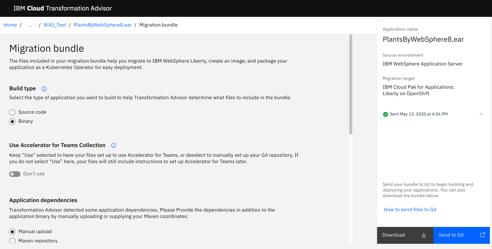
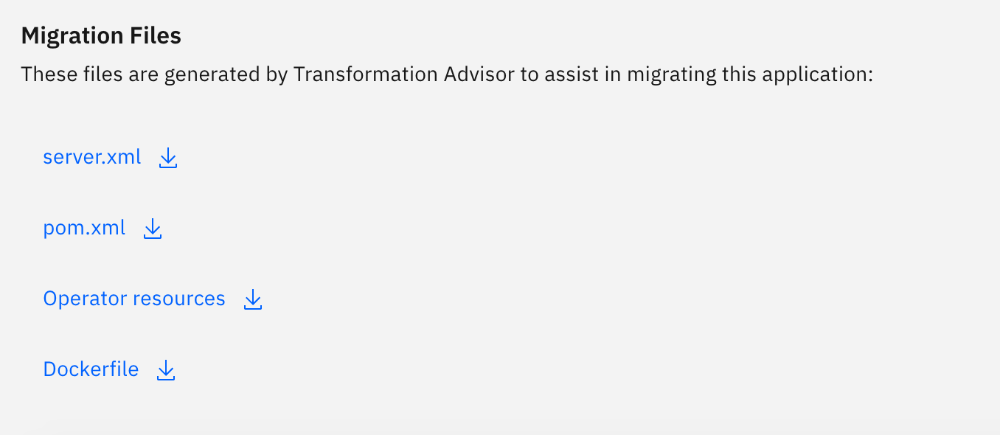
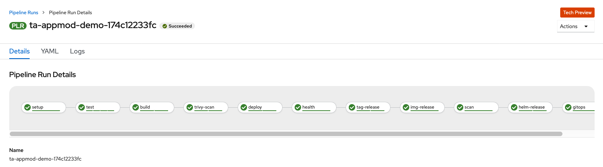
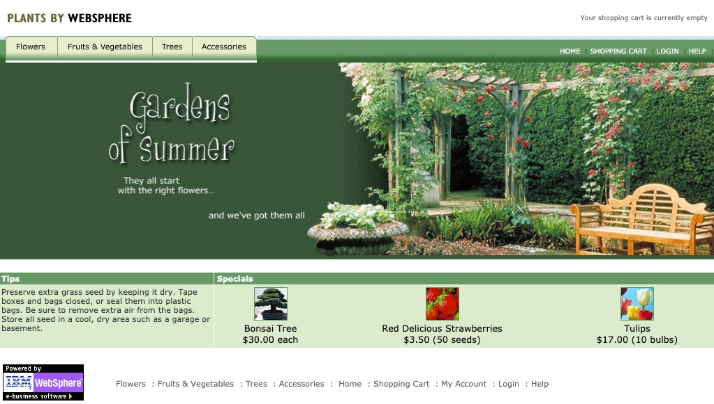

import Globals from 'gatsby-theme-carbon/src/templates/Globals';

<PageDescription>

## **Migrate Application to Liberty Container on IBM Cloud**

</PageDescription>


**Recap : ** 

As part of the Transformation Advisor : Part 2 - Analyse the scan results, we covered

1. Uploading the scanned results to the Transformation Advisor 
1. Transformation Advisor generates the recommendations and reports based on the scanned results
1. Analyzed the Technology report, Inventory report and Analysis report of the existing application to see the fitment for migration.


### Migrate to Liberty

As part of this session, we will start with preparation stage of the existing application to container based stack on IBM Cloud using the Transformation advisor. As in the previous part, navigate to your workspace in the Transformation Advisor that is already created earlier.

Transformation Advisor creates some accelerators to speed up the process of migrating an application. These files are a starting point for most modernization journeys and require modification. In this section, you will modify those files for PlantsByWebSphere.

- From the main recommendations page, click the `...` link on the right for the `PlantsByWebSphere8.ear` and select View migration plan

- You will Navigate to the Migration Bundle Page of the Transformation Advisor



- Select the Build type as binary

- Ensure "Don't use" is selected for the "Use Accelerator for Teams Collection"

- Select Manual upload for "application Dependencies"

    - As per the application dependencies select the application binary and the db2 driver(db2jcc.jar) that we have downloaded earlier

- The migration files section show the below bundle

    

    The migration plan shows the files that Transformation Advisor has generated:
    - **server.xml** - Transformation Advisor extracts most of the configuration from traditional WebSphere and generates a server.xml for Liberty to use
    - **Dockerfile** - Used to create the Docker image, which includes the application and configuration for Liberty
    - **Operator resources** - Used in Red Hat OpenShift to deploy the application using the [Open Liberty operator](https://operatorhub.io/operator/open-liberty)
    - **pom.xml** - Used for Maven builds, particularly useful if the application does not already employ build scripts

- We will push the Transformation generated files along with the Application binary and Db2-jcc.jar file to the git repo. 

- To do previous step, 
    - First we will create a new repository in your public git hub. Let us name the repository as "ta-appmodern-migrate"

    - Copy the Https Url of your repository,
    'https://github.com/{username}/ta-appmodern-migrate.git'

   - Use this git repository in your Transformation Migration 
    
   - Once this is done, select the "send to git option" in the "Migration Bundle Page" to push the migration files to your git repository


- we need to edit the server.xml to change the database properties and the db2jcc_licence_cu.jar. so lets clone the git repo to the local system

    ```bash
    git clone 'https://github.com/{user}/ta-appmodern-migrate.git'
    ```


- Copy `db2jcc_licence_cu.jar` to the folder `src/main/liberty/binary/lib`  from you earlier download folder of the binaries '(https://github.com/ibm-gsi-ecosystem/appmod-plants-app.git)'.

Ideally, Transformation Advisor could figure out enough from the original application so that the generated files contain exactly what's needed and we could use these files as-is. Unfortunately, there are some details Transformation Advisor cannot discern, so we'll need to add those into the files manually.

Edit the `server.xml` file using your favorite editor to make the following changes:


**Note:**

The db2 service provisioned in the IBM cloud shall be used as the database. Access the db2 service and navigate to the "Service Credentials Tab" to retrieve the database information listed below:
1. User name
1. password
1. db name
1. db host name
1. db port


- Change the `jpa-2.1` feature to `jpa-2.0`

- Add health feature, to enable the health check task to be passed in the pipeline
    ```bash
    <feature>mpHealth-1.0</feature> 
    ```
- Uncomment the `dataSources` and `jdbcDrivers`

- As part of the server.xml, there are two references to jdbcDriver. Each reference will map the path of the db2 and db2 licence jar  locations as `${shared.config.dir}/lib/global/db2jcc.jar` and `${shared.config.dir}/lib/global/db2jcc_license_cu.jar`. While one of jdbcDrive id is mapped to `DB2_Universal_JDBC_Driver_Provider` and the second is mapped to `DB2_Universal_JDBC_Driver_Provider_(XA)`.  The jdbcDriver tag snipped should be like as below 

    ```bash 
    <jdbcDriver id="DB2_Universal_JDBC_Driver_Provider" javax.sql.DataSource="com.ibm.db2.jcc.DB2ConnectionPoolDataSource">
        <library>
            <file name="${shared.config.dir}/lib/global/db2jcc.jar"/>
            <file name="${shared.config.dir}/lib/global/db2jcc_license_cu.jar"/>
        </library>
    </jdbcDriver>
    <jdbcDriver id="DB2_Universal_JDBC_Driver_Provider_(XA)" javax.sql.DataSource="com.ibm.db2.jcc.DB2XADataSource">
        <library>
            <file name="${shared.config.dir}/lib/global/db2jcc.jar"/>
            <file name="${shared.config.dir}/lib/global/db2jcc_license_cu.jar"/>
        </library>
    </jdbcDriver>
    ```        


- server.xml will have two reference of `datasource` tag. Each will have an element named jdbcDriverRefs. change the jdbcDriverRefs for first one as 'DB2_Universal_JDBC_Driver_Provider' and for the second one as `DB2_Universal_JDBC_Driver_Provider_(XA)`

- In the `PlantsByWebSphereDataSourceNONJTA` datasource, in the `properties.db2.jcc` line, add `user="{to share}" password="{to share}" transactional="false"`

- In the `PlantsByWebSphereDataSource` datasource, in the `properties.db2.jcc` line, add `user="{to share}" password="{to share}" transactional="true"` (Database user name and password).  

- Also change the databaseName="{to share}", serverName="{to share}" and portNumber="{to share}" 

- After changing the datasource tag with jdbcDriverRefs, username & password, Database details (databaseName, serverName and portNumber), the dataSource snipped should like as below:
    
     ```bash 
    DATASOURCE FIRST REFERENCE:

    <dataSource containerAuthDataRef="DefaultNode01/PlantsAuthAlias" id="PlantsByWebSphereDataSourceNONJTA" jdbcDriverRef="DB2_Universal_JDBC_Driver_Provider" jndiName="jdbc/PlantsByWebSphereDataSourceNONJTA">
        <properties.db2.jcc password="????" user="????" beginTranForResultSetScrollingAPIs="false" beginTranForVendorAPIs="false" connectionSharing="1" databaseName="????" enableClientInformation="false" enableMultithreadedAccessDetection="false" errorDetectionModel="ExceptionMapping" jmsOnePhaseOptimization="false" name="PlantsByWebSphereDataSourceNONJTA" nonTransactionalDataSource="false" portNumber="?????" preTestSQLString="SELECT CURRENT SQLID FROM SYSIBM.SYSDUMMY1" propagateClientIdentityUsingTrustedContext="false" reauthentication="false" retrieveMessagesFromServerOnGetMessage="true" serverName="????" traceLevel="-1" unbindClientRerouteListFromJndi="false" useTransactionRedirect="false" validateNewConnection="false" validateNewConnectionRetryCount="100" validateNewConnectionRetryInterval="3"/>
        <connectionManager agedTimeout="0" connectionTimeout="180" maxIdleTime="1800" maxPoolSize="10" minPoolSize="0" reapTime="180"/>
    </dataSource>

    ```
    **Note:*** ???? should be replaced by actual values
    ```bash 
    DATASOURCE SECOND REFERENCE:

    <dataSource containerAuthDataRef="DefaultNode01/PlantsAuthAlias" id="PlantsByWebSphereDataSource" jdbcDriverRef="DB2_Universal_JDBC_Driver_Provider_(XA)" jndiName="jdbc/PlantsByWebSphereDataSource">
        <properties.db2.jcc password="????" user="????" beginTranForResultSetScrollingAPIs="false" beginTranForVendorAPIs="false" connectionSharing="1" databaseName="????" enableClientInformation="false" enableMultithreadedAccessDetection="false" errorDetectionModel="ExceptionMapping" name="PlantsByWebSphereDataSource" nonTransactionalDataSource="false" portNumber="????" preTestSQLString="SELECT CURRENT SQLID FROM SYSIBM.SYSDUMMY1" propagateClientIdentityUsingTrustedContext="false" reauthentication="false" retrieveMessagesFromServerOnGetMessage="false" serverName="????" traceLevel="-1" unbindClientRerouteListFromJndi="false" useTransactionRedirect="false" validateNewConnection="false" validateNewConnectionRetryCount="100" validateNewConnectionRetryInterval="3"/>
        <connectionManager agedTimeout="0" connectionTimeout="180" maxIdleTime="1800" maxPoolSize="10" minPoolSize="0" reapTime="180"/>
    </dataSource>

    ```

- Validate the application tag to be 
    
    ```bash
    <application id="PlantsByWebSphere8" location="plantsbywebsphere8.ear" name="PlantsByWebSphere8" type="ear"/>
    ```

- Save your changes

- Reference server.xml with the changes is also available in the downloaded reference repo '(https://github.com/ibm-gsi-ecosystem/appmod-plants-app.git)’. The location is liberty/config/server.xml.  The database details marked in ???? has to be replaced by the actual database info.

- The modified `server.xml` should look like this:
   ```
    <?xml version="1.0" encoding="UTF-8"?><!--Generated by IBM TransformationAdvisor
    Thu Nov 21 20:49:39 GMT 2019--><server>
    <!--These elements have been identified from this application's configuration.-->
    <featureManager>
        <feature>beanValidation-1.1</feature>
        <feature>cdi-1.2</feature>
        <feature>ejbLite-3.2</feature>
        <feature>el-3.0</feature>
        <feature>javaMail-1.5</feature>
        <feature>jndi-1.0</feature>
        <feature>jpa-2.0</feature>
        <feature>jsf-2.2</feature>
        <feature>jsp-2.3</feature>
        <feature>servlet-3.1</feature>
        <feature>mpHealth-1.0</feature>
    </featureManager>
    <!-- <variable name="DERBY_JDBC_DRIVER_PATH" value="${WAS_INSTALL_ROOT}/derby/lib"/> -->
    <httpEndpoint host="*" httpPort="9080" httpsPort="9443" id="defaultHttpEndpoint"/>
    <!-- <variable name="DB2UNIVERSAL_JDBC_DRIVER_NATIVEPATH" value=""/> -->
    <variable name="DERBY_JDBC_DRIVER_PATH" value="${shared.config.dir}/lib/global"/>
    <variable name="DB2UNIVERSAL_JDBC_DRIVER_NATIVEPATH" value="${shared.config.dir}/lib/global"/>
    <applicationManager autoExpand="true"/>
    <!--These elements are from the profile level configuration. Not all of them may be necessary for your application.-->
    <dataSource containerAuthDataRef="DefaultNode01/PlantsAuthAlias" id="PlantsByWebSphereDataSourceNONJTA" jdbcDriverRef="DB2_Universal_JDBC_Driver_Provider" jndiName="jdbc/PlantsByWebSphereDataSourceNONJTA">
        <properties.db2.jcc user="db2inst1" password="db2Pa2359w0rd123" transactional="false" beginTranForResultSetScrollingAPIs="false" beginTranForVendorAPIs="false" connectionSharing="1" databaseName="PLANTSDB" enableClientInformation="false" enableMultithreadedAccessDetection="false" errorDetectionModel="ExceptionMapping" jmsOnePhaseOptimization="false" name="PlantsByWebSphereDataSourceNONJTA" nonTransactionalDataSource="false" portNumber="32612" preTestSQLString="SELECT CURRENT SQLID FROM SYSIBM.SYSDUMMY1" propagateClientIdentityUsingTrustedContext="false" reauthentication="false" retrieveMessagesFromServerOnGetMessage="true" serverName="169.62.104.36" traceLevel="-1" unbindClientRerouteListFromJndi="false" useTransactionRedirect="false" validateNewConnection="false" validateNewConnectionRetryCount="100" validateNewConnectionRetryInterval="3"/>
        <connectionManager agedTimeout="0" connectionTimeout="180" maxIdleTime="1800" maxPoolSize="10" minPoolSize="0" reapTime="180"/>
    </dataSource>
    <dataSource containerAuthDataRef="DefaultNode01/PlantsAuthAlias" id="PlantsByWebSphereDataSource" jdbcDriverRef="DB2_Universal_JDBC_Driver_Provider_(XA)" jndiName="jdbc/PlantsByWebSphereDataSource">
        <properties.db2.jcc user="db2inst1" password="db2Pa2359w0rd123" transactional="true" beginTranForResultSetScrollingAPIs="false" beginTranForVendorAPIs="false" connectionSharing="1" databaseName="PLANTSDB" enableClientInformation="false" enableMultithreadedAccessDetection="false" errorDetectionModel="ExceptionMapping" name="PlantsByWebSphereDataSource" nonTransactionalDataSource="false" portNumber="32612" preTestSQLString="SELECT CURRENT SQLID FROM SYSIBM.SYSDUMMY1" propagateClientIdentityUsingTrustedContext="false" reauthentication="false" retrieveMessagesFromServerOnGetMessage="false" serverName="169.62.104.36" traceLevel="-1" unbindClientRerouteListFromJndi="false" useTransactionRedirect="false" validateNewConnection="false" validateNewConnectionRetryCount="100" validateNewConnectionRetryInterval="3"/>
        <connectionManager agedTimeout="0" connectionTimeout="180" maxIdleTime="1800" maxPoolSize="10" minPoolSize="0" reapTime="180"/>
    </dataSource>
    <jdbcDriver id="DB2_Universal_JDBC_Driver_Provider" javax.sql.DataSource="com.ibm.db2.jcc.DB2ConnectionPoolDataSource">
        <library>
            <file name="/config/lib/db2jcc.jar"/>
            <file name="/config/lib/db2jcc_license_cu.jar"/>
        </library>
    </jdbcDriver>
    <jdbcDriver id="DB2_Universal_JDBC_Driver_Provider_(XA)" javax.sql.DataSource="com.ibm.db2.jcc.DB2XADataSource">
        <library>
            <file name="/config/lib/db2jcc.jar"/>
            <file name="/config/lib/db2jcc_license_cu.jar"/>
        </library>
    </jdbcDriver>
    <authData id="DefaultNode01/PlantsAuthAlias" password="???" user="db2inst1"/>
    <application id="PlantsByWebSphere8" location="plantsbywebsphere8.ear" name="PlantsByWebSphere8" type="ear"/>
    </server>
    ```

- Push the change to Git (server.xml and db2jcc_license_cu.jar)
    ```bash
    git add .
    git commit -m "Changes related to DB -server.xml and db2jcc_license_cu.jar"
    git push
    ```


Now that we've configured Liberty and the application, let's deploy it on the Openshift.


### Run the application on Liberty

<Tabs>

<Tab label="oc pipeline" open="true">

As we plan to use the Tekton pipeline to deploy the application to the Openshift environment, we need additional files to be copied. 

- Copy charts (folder) to your base directory from the earlier downloaded/clone repository '(https://github.com/ibm-gsi-ecosystem/appmod-plants-app.git)'. This Contains the files related to pipeline deployment configuration.

- Copy assets (folder) to your base directory from the earlier downloaded/clone repository '(https://github.com/ibm-gsi-ecosystem/appmod-plants-app.git)'. This Contains the Binaries of both the application and Db2 related, in a structured manner, that shall be used by the pom.xml during the maven build as part of the test stage in the pipeline.

- Copy Jenkinsfile (file) to your base directory from the earlier downloaded/clone repository '(https://github.com/ibm-gsi-ecosystem/appmod-plants-app.git)'. This Contains the definition to the pipeline using the javalibertyapp image

- Copy pom.xml (file) to your base directory from the earlier downloaded/clone repository '(https://github.com/ibm-gsi-ecosystem/appmod-plants-app.git)'. The original pom.xml generated by TA will be replaced by this pom.file. This file uses the websphere liberty container as runtime environment, since this application would need JPA2.0 supported environment for database access.

- TA generated pom will look like as below

   ```bash
    <!-- Generated by IBM TransformationAdvisor -->
    <!-- Wed May 13 10:33:04 UTC 2020 -->
    <project xmlns="http://maven.apache.org/POM/4.0.0" xmlns:xsi="http://www.w3.org/2001/XMLSchema-instance"
         xsi:schemaLocation="http://maven.apache.org/POM/4.0.0 http://maven.apache.org/xsd/maven-4.0.0.xsd">
        <modelVersion>4.0.0</modelVersion>

        <groupId>com.ibm.ta</groupId>
        <artifactId>plantsbywebsphere8</artifactId>
        <version>1.0.0</version>
        <packaging>war</packaging>

        <name>plantsbywebsphere8</name>
        <dependencies>
            <dependency>
                <groupId>junit</groupId>
                <artifactId>junit</artifactId>
                <version>4.8.2</version>
                <scope>test</scope>
            </dependency>
        </dependencies>

  
    </project>
   ```

- Replaced pom for the pipeline to use websphere liberty is as below

    ```bash
    <project xmlns="http://maven.apache.org/POM/4.0.0" xmlns:xsi="http://www.w3.org/2001/XMLSchema-instance"
         xsi:schemaLocation="http://maven.apache.org/POM/4.0.0 http://maven.apache.org/xsd/maven-4.0.0.xsd">
        <modelVersion>4.0.0</modelVersion>

        <parent>
            <groupId>net.wasdev.wlp.maven.parent</groupId>
            <artifactId>liberty-maven-app-parent</artifactId>
            <version>RELEASE</version>
        </parent>

        <groupId>com.ibm.ta</groupId>
        <artifactId>tamigration</artifactId>
        <version>1.0</version>
        <packaging>war</packaging>
        <properties>
            <file.repo.name>assets</file.repo.name>
        </properties>

        <repositories>
            <!--local migration assets repo-->
            <repository>
                <id>project.local</id>
                <name>project</name>
                <url>file:${project.basedir}/${file.repo.name}</url>
            </repository>
        </repositories>
        <dependencies>
        <!-- example of adding a war file dependency -->
            <dependency>
                <groupId>com.ibm.ta</groupId>
                <artifactId>plantsbywebsphere8</artifactId>
                <version>0.1</version>
                <type>ear</type>
            </dependency>
            <dependency>
                <groupId>com.ibm.ta</groupId>
                <artifactId>db2jcclicensecu</artifactId>
                <version>0.1</version>
                <type>jar</type>
            </dependency>
            <dependency>
                <groupId>com.ibm.ta</groupId>
                <artifactId>db2jcc</artifactId>
                <version>0.1</version>
                <type>jar</type>
            </dependency>
        </dependencies>
        <build>
            <finalName>${project.artifactId}</finalName>
            <plugins>
                <plugin>
                    <groupId>org.apache.maven.plugins</groupId>
                    <artifactId>maven-dependency-plugin</artifactId>
                    <version>3.1.2</version>
                    <executions>

                        <execution>
                            <id>copy-application-dependency</id>
                            <phase>generate-sources</phase>
                            <goals>
                                <goal>copy-dependencies</goal>
                            </goals>
                            <configuration>
                            <!-- put war dependency file in target after dependency resolution -->
                                <outputDirectory>${project.build.directory}</outputDirectory>
                                <overWriteReleases>false</overWriteReleases>
                                <overWriteSnapshots>true</overWriteSnapshots>
                                <excludeTransitive>true</excludeTransitive>
                                <includeTypes>ear</includeTypes>
                            </configuration>
                        </execution>

                        <execution>
                            <id>copy-shared-library-artifact-db2jcclicensecu</id>
                            <phase>package</phase>
                            <goals>
                                <goal>copy-dependencies</goal>
                            </goals>
                            <configuration>
                            <!--   <outputDirectory>${project.build.directory}/liberty/wlp/usr/servers/defaultServer/lib/global</outputDirectory> -->
                                <outputDirectory>${project.build.directory}/liberty/wlp/usr/shared/config/lib/global</outputDirectory> 
                                <includeGroupIds>com.ibm.ta</includeGroupIds>
                                <includeArtifactIds>db2jcclicensecu</includeArtifactIds>
                                <includeTypes>jar</includeTypes>
                            </configuration>
                        </execution>

                        <execution>
                            <id>copy-shared-library-artifact-db2jcc</id>
                            <phase>package</phase>
                            <goals>
                                <goal>copy-dependencies</goal>
                            </goals>
                            <configuration>
                            <!--<outputDirectory>${project.build.directory}/liberty/wlp/usr/servers/defaultServer/lib/global</outputDirectory>-->
                                <outputDirectory>${project.build.directory}/liberty/wlp/usr/shared/config/lib/global</outputDirectory>
                                <includeGroupIds>com.ibm.ta</includeGroupIds>
                                <includeArtifactIds>db2jcc</includeArtifactIds>
                                <includeTypes>jar</includeTypes>
                            </configuration>
                        </execution>

                    </executions>
                </plugin>

                <plugin>
                    <groupId>org.apache.maven.plugins</groupId>
                    <artifactId>maven-war-plugin</artifactId>
                    <version>3.2.2</version>
                    <configuration>
                        <failOnMissingWebXml>false</failOnMissingWebXml>
                        <packagingExcludes>pom.xml</packagingExcludes>
                        <skip>true</skip>
                    </configuration>
                </plugin>

                <plugin>
                    <groupId>net.wasdev.wlp.maven.plugins</groupId>
                    <artifactId>liberty-maven-plugin</artifactId>
                    <configuration>
                        <!-- adding for was liberty -start-->
                        <assemblyArtifact>
                            <groupId>com.ibm.websphere.appserver.runtime</groupId>
                            <artifactId>wlp-javaee7</artifactId>
                            <version>RELEASE</version>
                            <type>zip</type>
                        </assemblyArtifact>
                        <stripVersion>true</stripVersion>
                        <serverStartTimeout>120</serverStartTimeout>
                        <configFile>src/main/liberty/config/server.xml</configFile>
                        <bootstrapProperties>
                            <default.http.port>${http.port}</default.http.port>
                            <default.https.port>${https.port}</default.https.port>
                            <app.context.root>${app.name}</app.context.root>
                        </bootstrapProperties>
                    </configuration>

                    <executions>
                        <execution>
                            <id>package-server</id>
                            <configuration>
                            <outputDirectory>target/wlp-package</outputDirectory>
                            </configuration>
                        </execution>
                    </executions>
                
                </plugin>
            </plugins>
        </build>
  
    </project>
    ```

- Push the change to Git (file related to pipeline)
    ```bash
    git add .
    git commit -m "Changes related to Enablement of the pipeline deployment"
    git push
    ```

Now that we are ready for the application deployment on the Openshift cluster, we will here follow the pipeline approach for the build and deployment. Let us use the Cloud Shell for the same

- Login to your OC cluster using the Copy Login Command from the browser of the openshift console
    ```bash
    $ oc login {Cluster info}
    $ oc project dev-{initial} 
    $ oc project -q  
    
    ```

- Let us use igc pipeline to build and deploy. From the repository directory let us execute the oc sync command to configure your project environment in the openshift cluster

    ```bash
    $ oc sycn {your project} --dev

    Setting up namespace {your project} and serviceAccount default

    ```
- Let us trigger the pipeline using the oc pipeline command from the same repo directory.  

    - This would request you request for pipeline to select with options 
        - Jenkins
        - Tekton
    - Select the Tekton option
   
    - As the next step, to configure git repo for the pipeline, it would ask for the git 
        - username  (if not configured already for this project)
        - Token/password (if not configured already for this project)
        - branch (Press enter if branch is (master)) otherwise provide the branch details

    - Next it would request for the "Select the Pipeline to use in the PipelineRun"
        - Select the option : ibm-java-maven

    - Next it would request for "Would you like to enable the pipeline to scan the image for vulnerabilities"
        - Select Yes (if you want to include the image scan) /  No (if you don't want to include the image scan)
        - In this case, we will go with the scan option as 'No'

-  The output of the exection of oc pipeline as below
    ```bash
    $ oc pipeline

    ? Select the type of pipeline that should be run? Tekton
    Creating pipeline on openshift cluster in {your project} namespace
    Getting git parameters
    Git credentials have already been stored for user: {user name}
    Project git repo: {your git repor}
    ? Provide the git branch that should be used: master
    Creating service account: pipeline
    Creating Git PipelineResource
    Creating Image PipelineResource
    ? Select the Pipeline to use in the PipelineRun: ibm-java-maven
    ? Would you like to enable the pipeline to scan the image for vulnerabilities? No
    Copying tasks from tools
    Copied Pipeline from tools/ibm-java-maven to {Openshift Project Name /Application Name}
    Creating TriggerTemplate for pipeline: {Application Name}
    Creating TriggerBinding for pipeline: {Application Name}
    Creating TriggerEventListener for pipeline: {Application Name}
    Creating Route for pipeline: {Application Name}
    Creating PipelineRun for pipeline: {Application Name}
    Creating webhook for repo: {github repo}

    ```

- This will create the project pipeline in {your project} and the pipeline will start executing. You can see the pipeline execution as part of the openshift dash board. 

    - Navigate to the Developer Console -> Navigate to the 'Pipelines' in the left Nav -> Select your project space from the drop down option -> select your application link -> Select the 'Pipeline Runs' and again the application link.



- Once the pipeline is executed successfully, the application can be tested. To get the routes of the application first navigate to the 

    - Topology on the left nav -> Then click on your application. On the right side you should see the overview and resources -> navigate to the resources tab, you would be able to see the routes link. Using the routes link, test the application access
    
- Test the app

    - Open the browser and navigate to the OpenShift dashboard console

    - Navigate to the 'Topology' section in the left nav.

    - Select your project/name-space and then select the Application. 

    - After selection of the application, on the right you will be able to see details of the application in tabs/sections as Overview and Resources

    - As part of the Resource tab, you can get the routes of the application that shows two routes links.

    - Click the link of the route with Path /PlantsByWebSphere

    - You will be able to landup in the home page of the application

    


</Tab>
<Tab label="S2I" open="true">  
Now that we are ready for the application deployment on the Openshift cluster, we will here follow the S2I (Source to Image approach) for the build and deployment. Let us use the Cloud Shell for the same.

**Note:**

Ensure you **don't copy** and push to the git, any of the below folders and files that are used by the pipeline from the reference repo ‘(https://github.com/ibm-gsi-ecosystem/appmod-plants-app.git)’.

1. Copy charts (folder) 
1. Copy assets (folder)
1. Copy Jenkinsfile (file) 
1. Copy pom.xml (file). Use only the default pom generated by the TA 


The steps below will help to deploy the application to the cluster using S2I

- Login to your OC cluster using the Copy Login Command from the browser of the openshift console
    ```bash
    oc login {Cluster info}
    oc project dev-{initial} 
    oc project -q  
    ```

- Let us use openshift S2I to build and deploy

    ```bash
    oc new-app 'https://github.com/{repo}/ta-appmodern-migrate.git' --name=plantsbyliberty
    .....
    .....

    --> Success
        Build scheduled, use 'oc logs -f bc/plantsbyliberty' to track it progress
        Application is not exposed. You can expose services to the outside world by 
    executing one or more of the commands below:
          'oc expose svc/plantsbyliberty'
        Run 'oc status' to view your app
    ```


- Check the logs to track the build and deployment. This will take few minutes to deploy
    ```bash
    oc logs -f bc/plantsbyliberty
    ```

    Once the deployment is completed, create the service for the application

    ```bash
    oc expose svc/plantsbyliberty
    oc status
    ```

- If you need to redeploy the app after some changes, you can do this by manually triggering the below command
    ```bash
    oc start-build plantsbyliberty
    ```


- Now you can access the application by getting the hostname for the application by using get routes
    ```bash
    oc get routes | grep plantsbyliberty
    ```

- Test the app

    - Open the browser and navigate to the OpenShift dashboard console

    - Navigate to the 'Topology' section in the left nav.

    - Select your project/name-space and then select the Application. 

    - After selection of the application, on the right you will be able to see details of the application in tabs/sections as Overview and Resources

    - As part of the Resource tab, you can get the routes of the application.

    - Click the link of the route  that you retrieved using "oc get routes | grep plantsbyliberty" 
    
    - The route will open a new tab. Add the Path /PlantsByWebSphere at the end, to access the application

    - You will be able to landup in the home page of the application

    

</Tab>
</Tabs>


That's it. You now have this application running on Liberty in a Docker container which is sufficient for this exercise.

## Summary

You have now completed a simple Application Modernization exercises in multiple steps. This exercise demonstrated a simple runtime modernization scenario that can be moved to cloud without any code change to the application.
