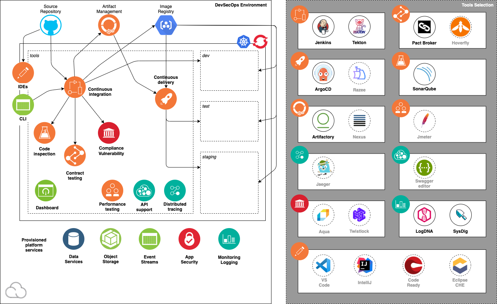

import Globals from 'gatsby-theme-carbon/src/templates/Globals';

<PageDescription>

An Overview of what DevSecOps is, and how it can help you
 speed up Cloud-Native solution delivery

</PageDescription>

One of the patterns emerging with development teams is the ability to use [CNCF Tools](https://landscape.cncf.io/) as part of a more open multicloud CI/CD strategy. This approach is aligning around the Kubernetes platform. The IBM Cloud supports both upstream Kubernetes for advanced cutting edge workloads and Red Hat OpenShift, the proven mutlicloud distribution of Kubernetes that can install on IBM Cloud, Azure, AWS, VMWare and on Premise and many more places. This approach removes cloud vendor lock in around CI/CD tools and enables development teams to be more flexible with the target cloud they focus on deploying and developing in.

There are two patterns from this approach:

- There are a core set of Development Tools that are installed inside the Kubernetes environment with the use of Operators the management and support of these tools can be controlled with centralized operations teams
- Integration of centralized operations tools like Source Code Management, Artifact Management, Image Management, Logging and Monitoring

This model enables agile Cloud-Native development teams to execute quickly while also conforming to the enterprise standards required for CI/CD. This pattern also enable the reduction of costs of managing expensive centralized multi-tenant CI services and enables development teams to use a percentage of their development cluster to support CI activities. This approach with Tekton enables the centralized operations teams to impose specific pipeline tasks that need to be supported by development teams without the complex

### Overview

This short video introduces the Cloud-Native concepts of CI/CD DevOps with <Globals name="ocp" />:
<iframe width="80%" height="500" src="https://www.youtube.com/embed/GOPWObjFTsI" frameborder="0" allow="accelerometer; autoplay; encrypted-media; gyroscope; picture-in-picture" allowfullscreen></iframe>

Each Cluster can have a selection of CNCF DevSecOps tools installed using IasC (Infrastructure As Code) using Terraform. The cluster then turns from a production state cluster into a cluster that is used for multi tenant development teams.

The following describes the requirements:

- **Installation**: Install the CNCF Tools using Terraform this create a new <Globals name="env" />
- **Cluster**: A <Globals name="kube" /> or <Globals name="ocp" /> cluster that both hosts the tools and itself is a deployment target for application builds
- **Software Delivery Lifecycle**: Deployment target environments that support the application development lifecycle: *dev*, *test*, and *staging*
- **Backend services**: Cloud services commonly required by cloud-native applications for monitoring, security, and persistence
- **CI/CD**: A prebuilt, ready-to-run continuous delivery pipeline incorporating best-of-breed open source software tools supporting `Jenkins`, `Tekton` for CI and `ArgoCD` for CD
- **<Globals name="templates" />**: Prebuilt code templates for common application components and tasks incorporating best practices that developers can add to their codebase as needed
- **Dashboard**: Integration of the tools into the OpenShift dashboard, and a centralized developer dashboard to help developers use the environment's capabilities

A core set of tools are sourced from the [IBM Cloud Catalog](https://cloud.ibm.com/catalog?search=label%3Ahelm#software) that can be found in the <Globals name="ic" />. This approach helps assemble these reliable open source development tools into an end-to-end developer experience that is fully integrated with <Globals name="ic" />'s managed container orchestration services.

The tools can also be sourced from the [Operator Hub](https://operatorhub.io/) and the [Red Hat Marketplace](https://marketplace.redhat.com/en-us). The Operations team that owns the IasC can decide the best approach to install the tools either using **Helm3** or **Operators**.

Typically a **Cloud System Admin** installs and sets up a new <Globals name="env" />, providing a place for the developers to start developing the [minimum viable product (MVP)](https://www.ibm.com/garage/method/practices/think/inception/practice_minimum_viable_product). The objective is to reduce the time required for a team to configure and prepare their development environment. The key benefit is to make the end-to-end [CI/CD development lifecycle](https://www.ibm.com/garage/method/practices/deliver/practice_continuous_delivery/) consistent across each platform and make the out-of-the-box developer experience as simple as possible.

The installation is performed using [Terraform](https://cloud.ibm.com/docs/terraform), driven by scripts with a [modular configuration](https://github.com/ibm-garage-cloud/garage-terraform-modules) so unneeded tools can be easily disabled or new tools added. The combination of tools selected are proven in the industry to deliver real value for modern cloud-native development.

### Environment components

After installation, the <Globals name="env" /> consists of a set of CNCF tools installed into your nominated kubernetes cluster.

This diagram illustrates the <Globals name="env" />:

The diagram shows the components in the environment: the cluster, the deployment target environments, the cloud services, and the tools.

#### Development cluster

The heart of the <Globals key="env" /> is a cluster:

- An [<Globals key="iks" />](https://www.ibm.com/cloud/container-service)
or [<Globals key="roks" />](https://www.ibm.com/cloud/openshift) 3-node cluster
- Cluster namespace that encapsulates the tooling installed in the cluster: *tools*
- Cluster namespaces for deployment target environments: *dev*, *test*, and *staging*

The following IBM Cloud services are created and bound to the cluster:

| Capability                | Service        |Description |
| -----------------------   |:-------------- |------------|
| Logging                   | [LogDNA Logging](https://cloud.ibm.com/docs/log-analysis?topic=log-analysis-getting-started)  | Manage app logging LogDNA  |
| Monitoring                | [SysDig Monitoring](https://cloud.ibm.com/docs/monitoring?topic=monitoring-getting-started) | Manage monitoring of apps with SysDig |
| AppID                     | [AppID Application Authentication](https://cloud.ibm.com/docs/services/appid?topic=appid-service-access-management) | Secure your apps, APIs and Kubernetes Ingress end points |
| Cloudant                  | [Cloudant NoSQL Database](https://www.ibm.com/cloud/cloudant) | NoSQL Database commonly used for data persistence |
| Cloud Object Storage      | [Cloud Object Storage Storage](https://cloud.ibm.com/docs/cloud-object-storage?topic=cloud-object-storage-getting-started-cloud-object-storage) | Storage service commonly used for binary content |
| PostreSQL                 | [PostgreSQL](https://www.ibm.com/cloud/learn/postgresql) (used by SonarQube) | SQL Database used for structure data persistence |

#### Continuous delivery tools

The following best-of-breed open source software tools are installed in the cluster's *tools* namespace:

| Capability                  | Tool                                         | Bitnami   |Description |
| --------------------------- |:--------------                               | -------   |------------|
| Continuous Integration      | [Jenkins CI](https://jenkins.io/)            |  Yes      | Jenkins is a common tool for Continuous Integration   |
| Continuous Integration      | [Tekton CI](https://tekton.dev/)             |           | Tekton is an emerging tool for Continuous Integration with Kubernetes and OpenShift  |
| Code Analysis               | [SonarQube](https://www.sonarqube.org/)      |  Yes      | SonarQube can scan code and display the results in a dashboard |
| Artifact and Helm Storage   | [Artifactory](https://jfrog.com/open-source/)|  Yes      | Artifactory is an artifact storage and Helm chart repository  |
| Continuous Deployment       | [ArgoCD](https://argoproj.github.io/argo-cd/)|           | ArgoCD support Continuous Delivery with GitOps |
| Contract API Testing        | [Pact](https://docs.pact.io/)                |           | Pact enables API contract testing |
| Code Ready Workspace        | [Eclipse CHE](https://developers.redhat.com/products/codeready-workspaces/overview)  |           | IDE for editing and managing code in a web browser |

If you want to find out more about IBM assets that help you get these common tools installed
