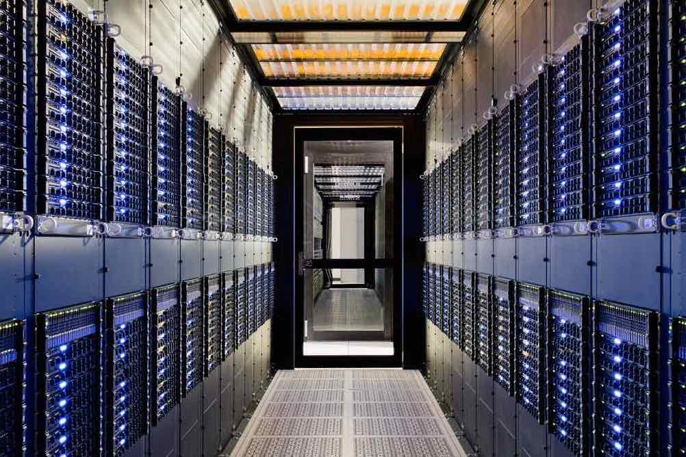

<PageDescription>

Learning tasks for developers to understand the concepts, technologies and methodologies for cloud native development

</PageDescription>

Before you jump straight into Cloud native development using this crafted enablement journey, it's important you understand the related basic concepts, technologies used and methodologies applied for cloud native development

Developer Foundation is broken into three areas: 
<Row>

<Column colLg={4} colMd={4} noGutterMdLeft>
<ArticleCard
    color="dark"
    title="Concepts"
    subTitle="Principles of cloud, cloud native development & deployment"
    href="developer-foundation#concepts"
    >

</ArticleCard>
</Column>

<Column colLg={4} colMd={4} noGutterMdLeft>
<ArticleCard
    color="dark"
    title="Technology"
    subTitle="Basics of Containers, Kubernetes/Openshift"
    href="developer-foundation#technologies"
    >

</ArticleCard>
</Column>

<Column colLg={4} colMd={4} noGutterMdLeft>
<ArticleCard
    color="dark"
    title="Methodology"
    subTitle="IBM Garage Method"
    href="developer-foundation#method"
    >

</ArticleCard>
</Column>

</Row>

<InlineNotification>
Developer Foundation uses Katacode service extensively for hands on labs. Katacoda is an interactive learning and training platform for software developers. Each student is given access to a new environment without the need to install all the required component by themselves.
</InlineNotification>

## Concepts
### Topics Covered

| Topics                          | Description         | Link        |
| --------------------------------| ------------------  |:----------- |
| What is Cloud Native? | Cloud Native Overview | [Cloud Native](/concepts/cloud-native-overview/) |
| Cloud Native App. Dev  | Basics of Cloud Native App. Development | [Cloud Native App. Dev](/concepts/cloud-native-app-dev/) |
| Continuous Integration | CI Overview | [CI](/concepts/continuous-integration/) |
| Continuous Delivery | CD Overview | [CD](/concepts/continuous-delivery/) |

## Technologies
### Topics Covered

| Topics                          | Description         | Link        |
| --------------------------------| ------------------  |:----------- |
| Core Concepts | Covers Kubernetes Objects and Namespaces. | [Core Concepts](/kubernetes/core-concepts/) |
| Configuration | Coveres ConfigMaps, Resource Quotas, Secrets, and Service Accounts. | [Configuration](/kubernetes/configuration/) |
| Multi-Container Pods | Use Cases for multi container pods. | [Multi-Container Pods](/kubernetes/multi-container-pods/) |
| Observability | Covers probes and logging for containers. | [Observability](/kubernetes/observability/) |
| Pod Design | Covers Labels, Selectors, Deployments, and Jobs.| [Pod Design](/kubernetes/pod-design/) |
| Services & Networking | Covers Services and Ingresses.  | [Services and Networking](/kubernetes/services-networking/) |
| State Persistence| Covering Volumes and Persistence Volumes. | [State Persistence](/kubernetes/state-persistence/) |
| Troubleshooting| Ways to troubleshoot your kubernetes. | [Troubleshooting](/kubernetes/troubleshooting/) |

### Activities

| Topics                            | Description         | Link        |
| --------------------------------| ------------------  |:----------- |
| Pod Creation | Covers the topics in the [Core Concepts](/kubernetes/core-concepts/) page. | [Pod Creation](/kubernetes/activities/labs/lab1) |
| Pod Configuration | Covers the topics in the [Configuration](/kubernetes/configuration/) page. | [Pod Configuration](/kubernetes/activities/labs/lab2) |
| Multiple Containers | Covers the topics in the [Multi-Container Pods](/kubernetes/multi-container-pods/) page.| [Multiple Containers](/kubernetes/activities/labs/lab3) |
| Probes | Covers the topics in the [Observability](/kubernetes/observability/) page. | [Probes](/kubernetes/activities/labs/lab4) |
| Rolling Updates Lab | Covers the topics in the [Pod Design](/kubernetes/pod-design/) page.  | [Rolling Updates](/kubernetes/activities/labs/lab6) |
| Cron Jobs Lab | Covers the topics in the [Pod Design Jobs](/kubernetes/pod-design#jobs-and-cronjobs) section. | [Crons Jobs](/kubernetes/activities/labs/lab7) |
| Creating Services | Covers the topics in the [Services](/kubernetes/services-networking/) page. | [Setting up Services](/kubernetes/activities/labs/lab8) |
| Setting up Persistent Volumes | Covers the topics in the [State Persistence](/kubernetes/state-persistence/) page. | [Setting up Persistent Volumes](/kubernetes/activities/labs/lab10) |
| Debugging | Covers the topics in the [ Troubleshooting](/kubernetes/troubleshooting/) page.  | [Debugging](/kubernetes/activities/labs/lab5) |

## Resources

- Presentation: [Kubernetes Basics](/slides/03-Kubernetes-Basics.pdf)

## Method
### Topics Covered

| Topics                          | Description         | Link        |
| --------------------------------| ------------------  |:----------- |
| IBM Garage Method | Garage Method  Overview | [Garage Method](/activation/garage-development/) |
