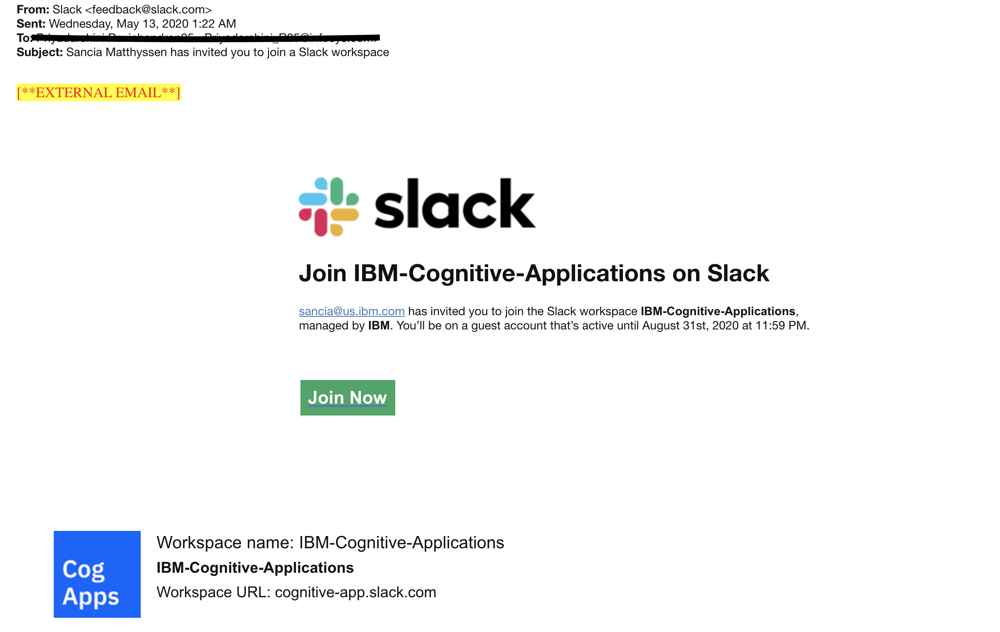

### 1. Not able to access openshift cluster

Openshift URL's might not be accessible from within SI corporate network if it is not whitelisted. Please log out of the corporate VPN and retry.

### 2. How to get access to the slack channel and join the channel?
- If you donot have a slack account with ID you have shared with us, create a slack account.

- You will get a invite email fro us asking to join our Slack workspace.

- Click on the "Join Now" button.

- It takes you to the login page with cognitive-apps.slack.com.

- It asks to login using ibm-id or guest-id.

- You enter your ID in guest-id for signing in.

- Let us know in case you donot recieve the invite mail.
