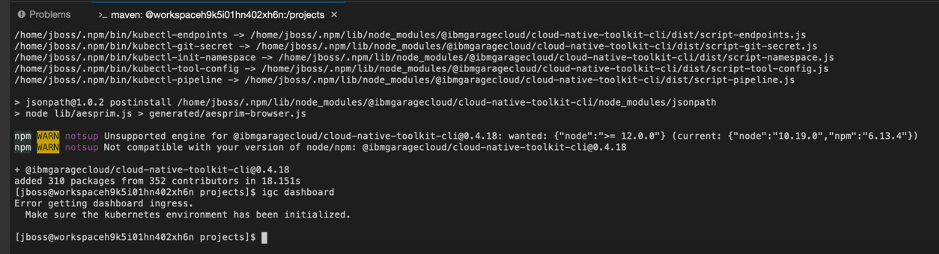
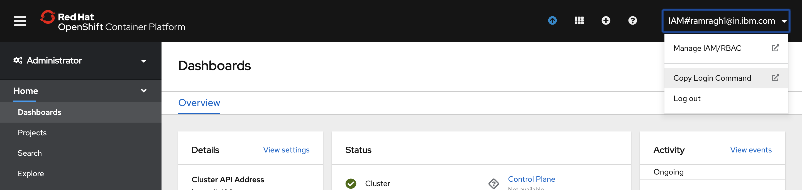

<PageDescription>

Following steps need to be done by all participants of the workshop <Globals name="env" />

</PageDescription>

This workshop agenda assumes that you have some basic knowledge of Kubernetes, Docker
, and modern software delivery techniques including CI/CD. To learn more
 about these topics, consult the educational materials listed in the Activation section 
 [Cloud Native Deployment](/activation/cloudnative-deployment).

## Create accounts

- [GitHub account](http://github.com) (public, not enterprise): Create one if you do not have one aleady. If you have not logged in for a while, make sure your login is working.

- [IBM Cloud Account](https://cloud.ibm.com): Create one if needed, make sure you can log in. Use the enterprise email id as the login.

### Configure Github Personal Access Token
For your CI pipeline ([Jenkins](/guides/continuous-integration), [Tekton](/guides/continuous-integration-tekton), etc.) to connect to and use your GitHub repo, it will need a [GitHub personal access token](https://help.github.com/en/github/authenticating-to-github/creating-a-personal-access-token-for-the-command-line) with `public_repo` and `write:repo_hook` scopes. The Personal Access Token only needs to be generated once because it is associated with the GitHub organization and can be used to access any of the organization's repos.

  - Navigate to [Developer Settings](https://github.com/settings/tokens) and generate a new token; name it something like "CI pipeline"
  - Select `public_repo` scope to enable git clone
  - Select `write:repo_hook` scope so the pipeline can create a web hook
  
  - The GitHub UI will never again let you see this token, so be sure to save the token in your password manager or somewhere safe that you can access later on

### Setting up your Workspace on CRW

1. Login to the Openshift Cluster through the Web console, where the Code ready workspace is setup.

2. Access the Code Ready Workspace through the appropriate Code ready workspace URL that would have been shared.
**Note**:If the code ready workspace is configured through openshiftoAuth, You can access the above URL, once you have logged into the Openshift Cluster

3. If you are accessing it for the first time you need register as the registration page will be shown.  Ensure your user name should have strictly follow .(character allowed are 0-9, a-zand hypen in between), 
even if default values are displaced.Ensure you provide details regarding username, Email, First name and Last name (If SSO is not configured, you need to provide the password as well.
From the second time,you will be directly taken to workspace User Interface in step 4

4. Navigate to  the default Code Ready Workspace link  on your browser as shown in below picture.
  

5. You can create the workspace by selecting one of the template stacks as shown in Step 4. Alternatively, navigate to the Workspace and click on the "Add Workspace" button.
  

6. Provide the workspace as part of the Name field.Click on "Remove" button in the Projects section to remove the project template. 
Basically, we are going to create an empty project.
  

7. Click on "Create and Open" button to create and load the workspace. Workspace will start loading. This may take a few minutes as the Container and plug-ins related to the stack has to be created and deployed.

8. Once the workspace is  created and loaded, you can see a vscode editor.
  

9. Go to "Terminal" menu and select "Open Terminal in specific container".
  

10. Select the "Developer Container".

11. Install igc by running the following commands on the just  newly opened terminal:
    
    ```bash
    git clone https://github.com/ibm-garage-cloud/cloud-shell-commands.git
    export PATH=~/cloud-shell-commands:$PATH
    source ./cloud-shell-commands/install-igc
    ```
    

12. Login to cluster through "Copy Login Command" option in your Openshift web console.
   

13. Clicking on the option will take you to a new page. Click "Display Token" on that page 
and you will get the required token for login.
   

   

14. Paste the copied text in your terminal.
   

15. Run "igc dashboard" and copy the dashboard url.
  

16. Pasting and hitting the above copied in your browser renders the following screen:
   


